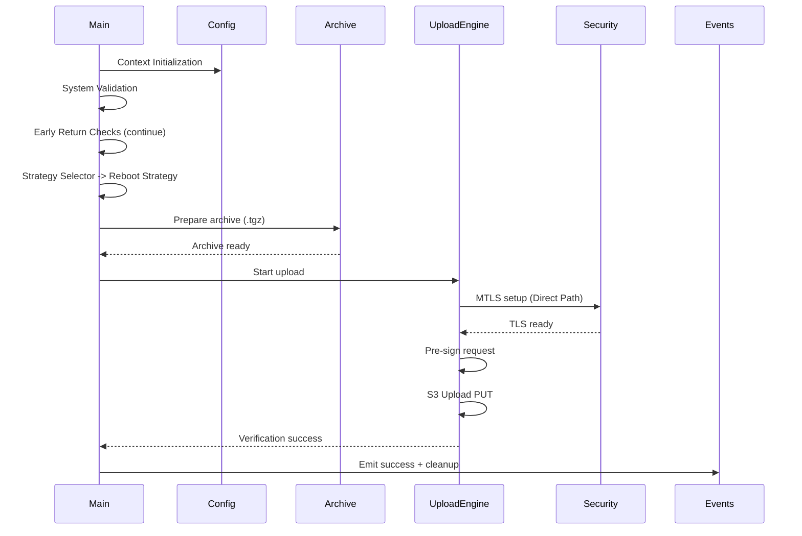
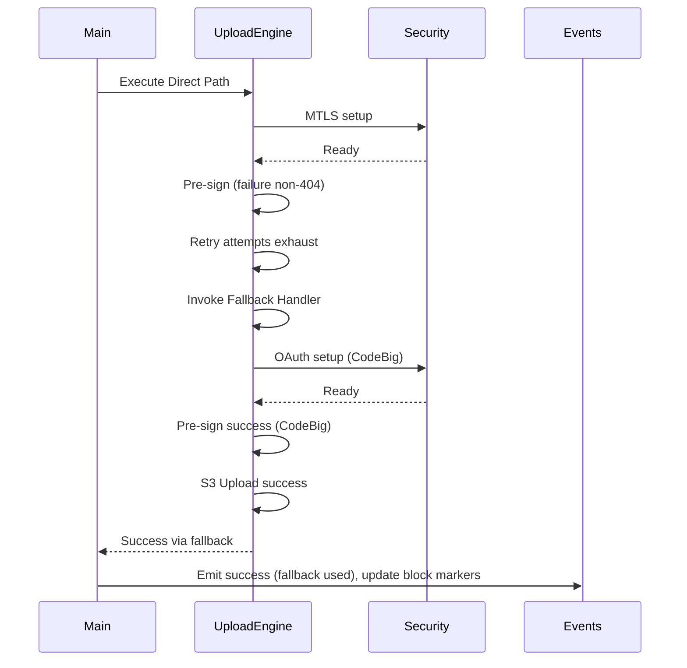
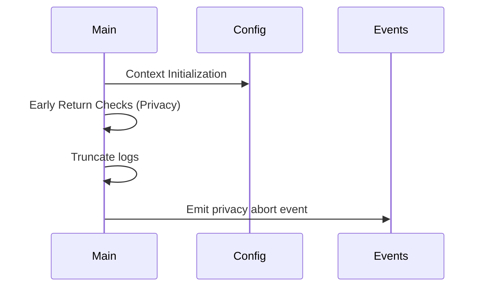
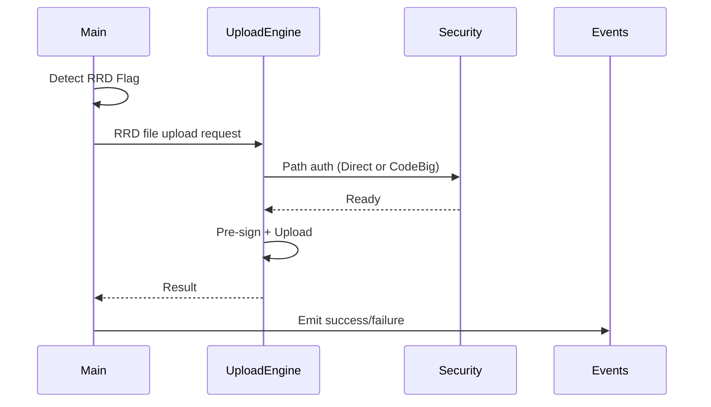

# Sequence Diagrams & Text – Strict Diagram Alignment

## 1. Normal Path (Reboot Strategy)

### Text Alternative
1. Initialize context.
2. Validate system.
3. Determine Reboot Strategy.
4. Build archive.
5. Execute upload (Direct path with mTLS).
6. Verify success.
7. Cleanup and emit success event.

## 2. Fallback Scenario

### Text Alternative
Direct path fails, fallback to CodeBig OAuth succeeds, success emitted, direct block marker may be set.

## 3. Privacy Abort

### Text Alternative
Privacy mode triggers early exit; no archive or upload.

## 4. RRD Strategy

### Text Alternative
RRD bypasses archive packaging, performs single file upload with same verification path.
