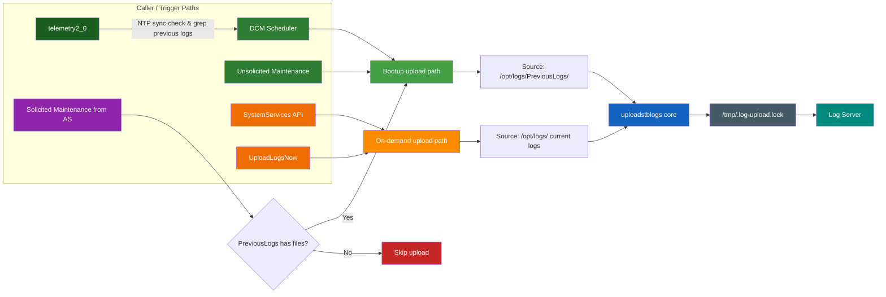
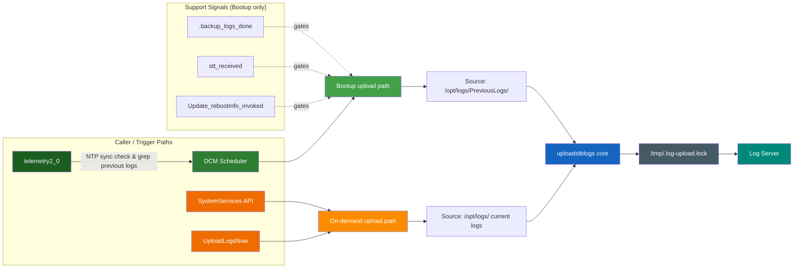
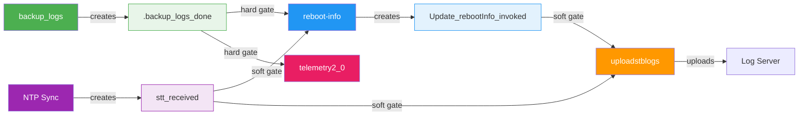
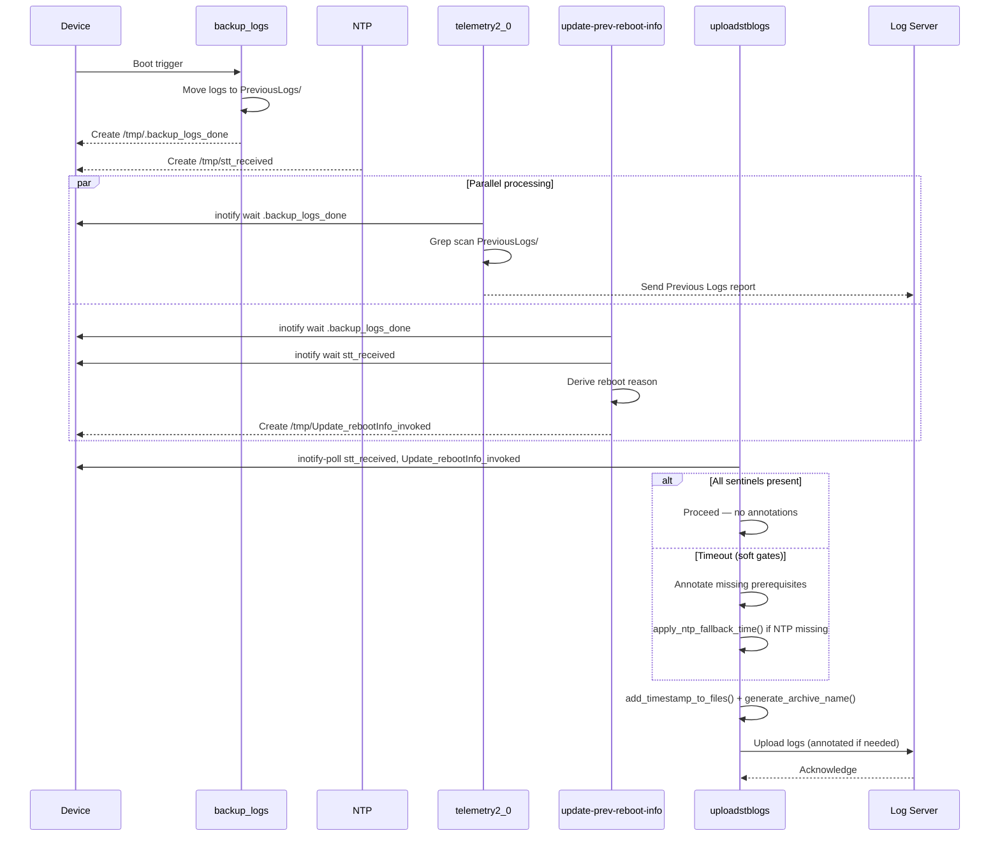
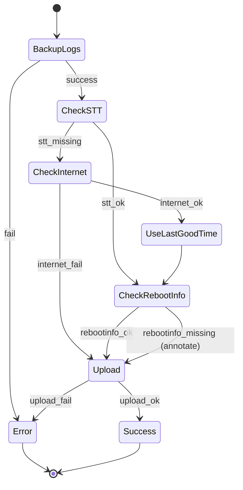
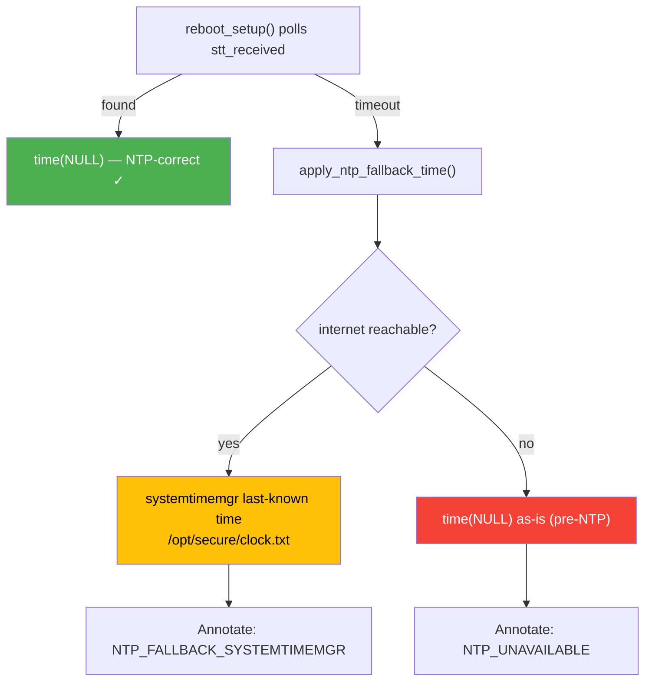
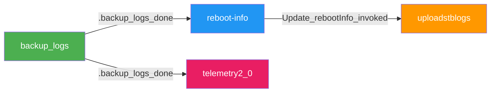

 
# Logupload Synchronization

### Boot-Time Coordination for `dcm-agent`
`backup_logs` · `reboot-info` · `telemetry2_0` · `uploadstblogs`

---

# The Problem

**Four** independent subsystems read `/opt/logs/PreviousLogs/` after reboot — with **no coordination**:

- **backup_logs** — moves logs to PreviousLogs/ directory
- **update-prev-reboot-info** — derives and persists reboot reason
- **uploadstblogs** — archives and uploads logs to a server
- **telemetry2_0** — grep-scans PreviousLogs/ for telemetry markers (one-shot)

### What goes wrong?

- Logs read before backup completion
- Reboot reasons derived from incomplete logs
- Uploads with incorrect timestamps or missing data
- **Telemetry markers permanently lost** — one-shot report, never retried
- **`sleep(330)` is a blind wait** — wastes up to 330 seconds on fast devices, too short on slow ones

---

# Known Issues — Evidence from RDK Stack

These defects trace directly to the boot-time race conditions described above:

| Defect | Platform | Symptom | Root Cause |
|--------|----------|---------|------------|
| **XIONE-18338** | Alpaca IT / RDK 8.4 | `UploadOnReboot` flag set to `false` even when XConf offers `true` | Upload suppressed due to race between DCM config delivery and reboot upload trigger |
| **DELIA-70285** | LLAMA Gen1/Gen2, CELLO | After CDL-initiated or maintenance reboot, device records wrong reboot reason — `SOFTWARE_MASTER_RESET` | `update-prev-reboot-info` reads `PreviousLogs/` before `backup_logs` completes; derives stale reboot reason |
| **XIONE-18607** | XIONE ALPACA IT | Log upload file name wrong for days | `uploadstblogs` archives before NTP sync — timestamp in filename reflects pre-NTP epoch |

&nbsp;

> All three defects share a single root cause: **no ordering guarantee** between boot-time subsystems.
> The sentinel-file chain proposed here closes all three gaps simultaneously.

---

# Current Architecture



---

# Proposed Architecture



---
layout: two-cols
---

# Current State

- Four subsystems launch independently at boot
- No ordering guarantees — relies on `sleep(330)` blind wait
- Race conditions between log backup, reboot-info, upload, and telemetry
- Timestamps may be inaccurate (no NTP sync)
- Telemetry scans PreviousLogs/ before files are moved
- MaintenanceManager redundantly schedules log upload

::right::

# Target State

- **Sentinel-file chain** enforces strict ordering
- **inotify-based** wait (zero CPU, sub-ms latency)
- **Poll-based** — inotify wait for prerequisite sentinels
- **Soft gates** — NTP/reboot-reason timeouts annotate but never block upload
- **Hard gate** — only `backup_logs` failure aborts
- MaintenanceManager log upload task **removed**

---

# Sentinel File Protocol



All sentinels reside in `/tmp/` — volatile, auto-cleared on reboot, no stale-sentinel risk.

---

# Sentinel Registry

| File | Written by | Consumed by | Type |
|------|-----------|------------|------|
| `/tmp/.backup_logs_done` | `backup_logs` | `update-prev-reboot-info`, `telemetry2_0`, `uploadstblogs` | **Hard gate** |
| `/tmp/stt_received` | time-sync service | `uploadstblogs` | Soft gate (NTP) |
| `/tmp/Update_rebootInfo_invoked` | `update-prev-reboot-info` | `uploadstblogs` | Soft gate |


---

# Execution Flow — Poll-Based Synchronization

- **Device Reboots**
  - `backup_logs` starts → moves logs to `/opt/logs/PreviousLogs/`
    - If fails → `.backup_logs_done` NOT written → **all downstream aborts** (hard gate)
  - On success → creates `/tmp/.backup_logs_done` (atomic `open()` + `close()`)
  - `update-prev-reboot-info` inotify-waits for `.backup_logs_done` + `stt_received`
    - Derives reboot reason → creates `/tmp/Update_rebootInfo_invoked`
  - `telemetry2_0` inotify-waits for `.backup_logs_done`
    - Grep-scans `PreviousLogs/` for telemetry markers
  - `uploadstblogs` **polls soft gates**:
    - inotify-polls both soft gates (120s timeout):
       - `/tmp/stt_received` — NTP fallback via `systemtimemgr` if missing
       - `/tmp/Update_rebootInfo_invoked` — annotate if missing
  - **Always proceeds to archive + upload** if backup succeeded, annotating any missing metadata

---

# Execution Sequence



---

# State Machine — Failure Scenarios



    Upload --> [*]
```

---

# IPC Mechanism — inotify with stat() Fallback

| Mechanism | CPU during wait | Latency | POSIX portable | Crash-safe | Boot-safe |
|-----------|:-:|:-:|:-:|:-:|:-:|
| **`inotify` + sentinel files** | **Zero** | **<1 ms** | ❌ (Linux) | ✅ | ✅ |
| `stat()` poll (fallback) | Low (1 Hz) | ~1 s | ✅ | ✅ | ✅ |
| Named semaphore | Zero | <1 ms | ✅ | ❌ | ✅ |
| RBUS events | Zero | <1 ms | ❌ | ⚠️ | ❌ early boot |
| IARM Bus events | Zero | <1 ms | ❌ | ❌ lost-event | ⚠️ order-dep |

**Decision**: `inotify` + `select()` for the wait, sentinel files in `/tmp/` for state. `stat()` fallback via `#ifdef HAVE_INOTIFY`. All current targets are embedded Linux.

---

# NTP Timestamp Correctness & Fallback



`backup_logs` runs independently and pre-NTP — its `time()` calls are irrelevant. Only archive names and timestamp prefixes from `add_timestamp_to_files()` require NTP accuracy.

---

# Key Components

| Component | Language | Role |
|-----------|----------|------|
| **backup_logs** | C | Move logs to `/opt/logs/PreviousLogs/`; write hard-gate sentinel |
| **Reboot Manager** | C | Derive and persist reboot reason; write soft-gate sentinel |
| **uploadstblogs** | C | Poll prerequisites, archive & upload logs to server |
| **telemetry2_0** | C | Grep-scan PreviousLogs/ for markers (gates on `.backup_logs_done`) |
| **Sentinel Files** | `/tmp/` | Inter-process synchronization (volatile, auto-cleared) |
| **systemtimemgr** | C | Provides last-known-good time (`/opt/secure/clock.txt`) if NTP unavailable |

---

# MaintenanceManager — LogUpload Task Removed

MaintenanceManager triggered log upload via two paths — **both redundant**:

| Path | Behaviour | Why redundant |
|------|-----------|---------------|
| **Unsolicited maintenance** | Triggers bootup log upload during maintenance window | DCM already triggers via `telemetry2_0` → dcm-agent RBUS event path |
| **Solicited maintenance** | Attempts bootup log upload on explicit request | Always skips — `/opt/logs/PreviousLogs` already empty |

### What changes

- `MAINT_DCM_LOGUPLOAD` task removed from MaintenanceManager task table
- `MAINT_LOGUPLOAD_COMPLETE` / `MAINT_LOGUPLOAD_ERROR` IARM events removed from `uploadstblogs`
- IARM dependency in `uploadstblogs` removed if no other IARM usages remain
- `dcm-agent` becomes **single owner** of log upload scheduling

---

# Error Handling — Hard vs Soft Gates

### Hard gate: `backup_logs` failure = **abort upload**

- `.backup_logs_done` NOT written → all downstream services time out
- `uploadstblogs` detects both soft-gate sentinels absent → treats as hard abort
- **Only case where upload is cancelled entirely**

### Soft gates: annotate and proceed

| Component | Polls for | Timeout | Action on timeout |
|-----------|-----------|:-------:|-------------------|
| `update-prev-reboot-info` | `.backup_logs_done` | 60s | Exit `ERROR_GENERAL` |
| `telemetry2_0` | `.backup_logs_done` | 60s | Skip PreviousLogs report |
| `uploadstblogs` | `stt_received` + `Update_rebootInfo_invoked` | 120s | **Annotate** missing prerequisites and **always proceed** |

### Upload Annotation Bitmask

| Bit | Constant | Meaning |
|:---:|----------|---------|
| 0 | `ANNOTATION_REBOOT_REASON_UNAVAILABLE` | Reboot reason absent after 120s |
| 1 | `ANNOTATION_NTP_UNAVAILABLE` | NTP absent and internet unreachable |

---

# Failure Scenario Summary

| # | Scenario | Upload outcome |
|:-:|----------|----------------|
| S1 | `backup_logs` fails | **Aborted** — EXIT_FAILURE |
| S2 | Backup OK, reboot reason absent | Proceeds + `REBOOT_REASON_UNAVAILABLE` |
| S3 | Backup OK, NTP + RI absent | Proceeds + `NTP_FALLBACK` or `NTP_UNAVAILABLE` + `REBOOT_REASON_UNAVAILABLE` |

> **Invariant**: Upload always occurs if `backup_logs` succeeded. Missing metadata is annotated, never silently discarded.

---

# Cross-Repo Release Constraint

Three repositories must be released **simultaneously** (REQ-SYNC-010):

| Repo | Change |
|------|--------|
| **dcm-agent** | `backup_logs` writes `.backup_logs_done`; `uploadstblogs` polls `stt_received` + `Update_rebootInfo_invoked` |
| **reboot-manager** | `update-prev-reboot-info` polls `.backup_logs_done` |
| **telemetry** | `telemetry2_0` polls `.backup_logs_done` before grep-scanning PreviousLogs/ |

### Partial deployment risks

- **reboot-manager not updated** → `Update_rebootInfo_invoked` not written in time → upload proceeds with annotation
- **telemetry not updated** → telemetry may scan PreviousLogs/ before backup completes (existing race — not blocking upload)

No backward compatibility window — all three repos must deploy together.

---

# Implementation Task Groups

| Group | Scope | Key Tasks |
|:-----:|-------|-----------|
| **A** | Sentinel infrastructure | Define `BACKUP_LOGS_DONE_FLAG`, `PATH_FLAG_BACKUP_LOGS_DONE` constants |
| **B** | backup_logs sentinel write | Write `.backup_logs_done` on success (atomic `O_CREAT`) |
| **C** | reboot-manager poll | `poll_for_sentinel()` helper + gate `find_previous_reboot_log()` |
| **D** | uploadstblogs poll | Replace `sleep(330)` with dual-sentinel inotify-poll; remove MM IARM events |
| **E** | Documentation | Cross-repo `DEPENDENCIES.md` in all three repos |
| **F** | Tests | Unit tests + L2 integration (sentinel chain end-to-end) |
| **G** | Telemetry repo | Poll `.backup_logs_done` before grep-scanning PreviousLogs/ |

---

# Risks & Notes

- If both STT and internet are missing, upload proceeds but is annotated (`NTP_UNAVAILABLE`)
- Partial repo deployment degrades gracefully via annotations (soft gates) rather than blocking
- `inotify` is Linux-only — `#ifdef HAVE_INOTIFY` guard with `stat()` fallback preserves portability
- Cross-repo sentinel paths are **interface contracts** — any change requires coordinated simultaneous release
- Telemetry gates on `.backup_logs_done` independently — no completion sentinel needed by uploadstblogs
- Distributed state machine: Each module owns its state, but uploadstblogs orchestrates the checks.
- Timeouts must be coordinated to avoid indefinite waits.
- All fallback uploads must clearly annotate what metadata was missing or defaulted.

---

# Log Upload: State Machine & Fallbacks

> **Fallback Method:** Log upload must always happen except when log backup fails. All missing/failed steps are annotated in the upload for diagnostics.

- DCM Agent synchronizes backup, STT, reboot reason, telemetry, and upload.
- Each module owns its state; DCM Agent coordinates as needed.
- State machine ensures robust fallback and retry logic.

👉 **[Logupload State Machine & Fallbacks](./logupload-state-machine.md)**

Refer to the linked file for the scenario breakdowns and state diagram.

---

# Design Principles

- **No dynamic memory allocation** — memory pools where needed
- **Platform-neutral** — portable across embedded targets
- **Thread-safe** — safe concurrent access
- **Fixed-point arithmetic** — no floating-point dependency
- **Secure coding** — input validation, no buffer overflows
- **Modular** — each subsystem independently testable

---

# Cross-Repo Interface Contract

The signal file `/tmp/.backup_logs_done` is a **3-repo interface**:

| Repo | Role | Action |
|------|------|--------|
| **dcm-agent** | Writer | `backup_logs` creates `.backup_logs_done` on success |
| **reboot-manager** | Consumer | Polls `.backup_logs_done` before reading PreviousLogs/ |
| **telemetry** | Consumer | Polls `.backup_logs_done` before grep-scanning PreviousLogs/ |

- All path changes must be **coordinated across all three repos**
- Signal files reside in `/tmp/` — volatile, cleared on every reboot
- **Atomic 3-repo release** required — no backward compatibility window

---
layout: center
---

# The Telemetry Gap

**Discovery**: `telemetry2_0` reads PreviousLogs/ at boot — **needs `.backup_logs_done` gate**



- `PERSIST_LOG_MON_REF` enabled on **all builds** — telemetry always scans PreviousLogs/
- PreviousLogs grep report is **fire-and-forget** — never retried
- **Fix (Group G)**: Telemetry polls `.backup_logs_done` before grep scan (TASK-G1)

---
layout: center
---

# Summary

Signal-file chain eliminates race conditions at boot

**backup_logs → { telemetry2_0, reboot-info } → uploadstblogs**

3 signal files: `.backup_logs_done` · `stt_received` · `Update_rebootInfo_invoked`

3-repo atomic release: dcm-agent · reboot-manager · telemetry

18 tasks across 7 groups — clean skip on any timeout

---
layout: center
---


## Summary Table

| Step           | Hard Dependency | Fallback Action                | Upload Allowed? |
|----------------|----------------|--------------------------------|-----------------|
| BackupLogs     | Yes            | None (abort if missing)        | No              |
| STT            | No             | Check internet, use last good time | Yes         |
| RebootInfo     | No             | Wait, annotate if missing, proceed  | Yes         |

---

## Risks & Notes

- If both STT and internet are missing, upload proceeds but is heavily annotated as incomplete.
- Distributed state machine: Each module owns its state, but uploadstblogs orchestrates the checks.
- Timeouts must be coordinated to avoid indefinite waits.
- All fallback uploads must clearly annotate what metadata was missing or defaulted.

---

# Thank You

[dcm-agent Repository](https://github.com/rdkcentral/dcm-agent)
---
