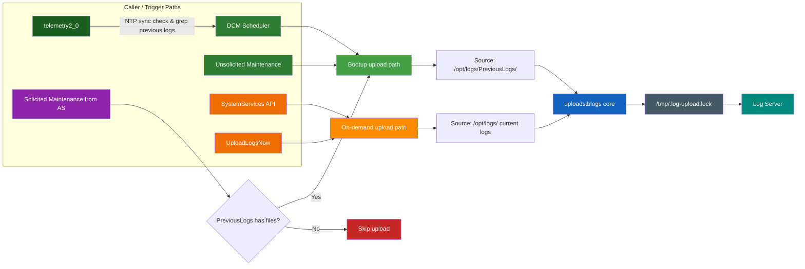
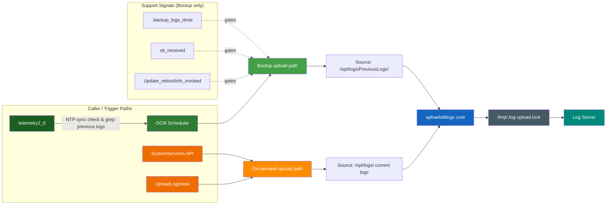
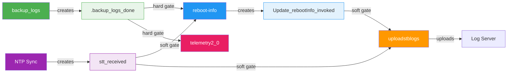
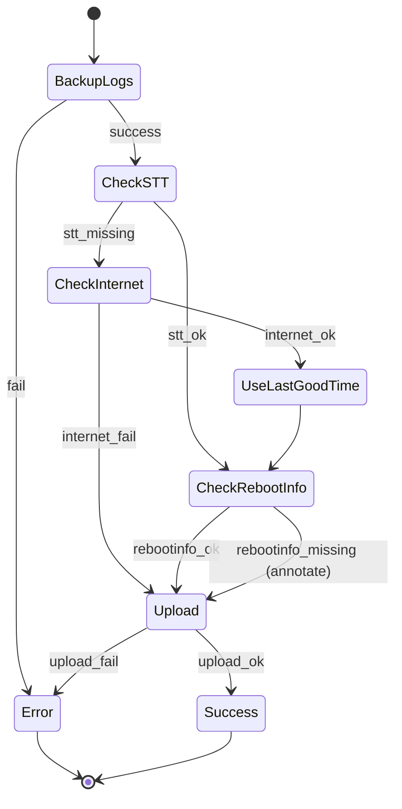

# Logupload Synchronization

### Boot-Time Coordination for `dcm-agent`
`backup_logs` · `reboot-info` · `telemetry2_0` · `uploadstblogs`

---
background: linear-gradient(135deg, #1a0000, #3d0c02, #5c1a0a)
---

# The Problem

**Four** independent subsystems read `/opt/logs/PreviousLogs/` after reboot — with **no coordination**:

- **backup_logs** — moves logs to PreviousLogs/ directory
- **update-prev-reboot-info** — derives and persists reboot reason
- **uploadstblogs** — archives and uploads logs to a server
- **telemetry2_0** — grep-scans PreviousLogs/ for telemetry markers (one-shot)

### What goes wrong?

- Logs read before backup completion
- Reboot reasons derived from incomplete logs
- Uploads with incorrect timestamps or missing data
- **Telemetry markers permanently lost** — one-shot report, never retried
- **`sleep(330)` is a blind wait** — wastes up to 330 seconds on fast devices, too short on slow ones

---
background: linear-gradient(135deg, #1b0a2e, #2d1b4e, #1a0a3e)
---

# Known Issues — Evidence from RDK Stack

These defects trace directly to the boot-time race conditions described above:

| Defect | Platform | Symptom | Root Cause |
|--------|----------|---------|------------|
| **XIONE-18338** | Alpaca IT / RDK 8.4 | `UploadOnReboot` flag set to `false` even when XConf offers `true` | Upload suppressed due to race between DCM config delivery and reboot upload trigger |
| **DELIA-70285** | LLAMA Gen1/Gen2, CELLO | After CDL-initiated or maintenance reboot, device records wrong reboot reason — `SOFTWARE_MASTER_RESET` | `update-prev-reboot-info` reads `PreviousLogs/` before `backup_logs` completes; derives stale reboot reason |
| **XIONE-18607** | XIONE ALPACA IT | Log upload file name wrong for days | `uploadstblogs` archives before NTP sync — timestamp in filename reflects pre-NTP epoch |

&nbsp;

> All three defects share a single root cause: **no ordering guarantee** between boot-time subsystems.
> The sentinel-file chain proposed here closes all three gaps simultaneously.

---
background: linear-gradient(135deg, #0d1b2a, #1b2838, #253747)
---

# Current Architecture

---
background: linear-gradient(135deg, #002a1a, #0a3d2e, #1a4d3e)
---

# Proposed Architecture

---
layout: two-cols
background: linear-gradient(135deg, #1a1a2e, #16213e, #0f3460)
---

# Current State

- Four subsystems launch independently at boot
- No ordering guarantees — relies on `sleep(330)` blind wait
- Race conditions between log backup, reboot-info, upload, and telemetry
- Timestamps may be inaccurate (no NTP sync)
- Telemetry scans PreviousLogs/ before files are moved
- MaintenanceManager redundantly schedules log upload

::right::

# Target State

- **Sentinel-file chain** enforces strict ordering
- **inotify-based** wait (zero CPU, sub-ms latency)
- **Poll-based** — inotify wait for prerequisite sentinels
- **Soft gates** — NTP/reboot-reason timeouts annotate but never block upload
- **Hard gate** — only `backup_logs` failure aborts
- MaintenanceManager log upload task **removed**

---
background: linear-gradient(135deg, #1b3a1b, #2e5a2e, #1a4a2a)
---

# Sentinel File Protocol

All sentinels reside in `/tmp/` — volatile, auto-cleared on reboot, no stale-sentinel risk.

---
background: linear-gradient(135deg, #1a2a1a, #1e3a1e, #2a4a2a)
---

# Sentinel Registry

| File | Written by | Consumed by | Type |
|------|-----------|------------|------|
| `/tmp/.backup_logs_done` | `backup_logs` | `update-prev-reboot-info`, `telemetry2_0`, `uploadstblogs` | **Hard gate** |
| `/tmp/stt_received` | time-sync service | `uploadstblogs` | Soft gate (NTP) |
| `/tmp/Update_rebootInfo_invoked` | `update-prev-reboot-info` | `uploadstblogs` | Soft gate |

---
background: linear-gradient(135deg, #0d2137, #162d50, #1e3a5f)
---

# Execution Flow — Poll-Based Synchronization

- **Device Reboots**
  - `backup_logs` starts → moves logs to `/opt/logs/PreviousLogs/`
    - If fails → `.backup_logs_done` NOT written → **all downstream aborts** (hard gate)
  - On success → creates `/tmp/.backup_logs_done` (atomic `open()` + `close()`)
  - `update-prev-reboot-info` inotify-waits for `.backup_logs_done` + `stt_received`
    - Derives reboot reason → creates `/tmp/Update_rebootInfo_invoked`
  - `telemetry2_0` inotify-waits for `.backup_logs_done`
    - Grep-scans `PreviousLogs/` for telemetry markers
  - `uploadstblogs` **polls soft gates**:
    - inotify-polls both soft gates (120s timeout):
       - `/tmp/stt_received` — NTP fallback via `systemtimemgr` if missing
       - `/tmp/Update_rebootInfo_invoked` — annotate if missing
  - **Always proceeds to archive + upload** if backup succeeded, annotating any missing metadata

---
background: linear-gradient(135deg, #2a1a0a, #3d2b1a, #4a3520)
---

# State Machine — Failure Scenarios

---
background: linear-gradient(135deg, #1a1a2e, #2d2d44, #16213e)
---

# Key Components

| Component | Language | Role |
|-----------|----------|------|
| **backup_logs** | C | Move logs to `/opt/logs/PreviousLogs/`; write hard-gate sentinel |
| **Reboot Manager** | C | Derive and persist reboot reason; write soft-gate sentinel |
| **uploadstblogs** | C | Poll prerequisites, archive & upload logs to server |
| **telemetry2_0** | C | Grep-scan PreviousLogs/ for markers (gates on `.backup_logs_done`) |
| **Sentinel Files** | `/tmp/` | Inter-process synchronization (volatile, auto-cleared) |
| **systemtimemgr** | C | Provides last-known-good time (`/opt/secure/clock.txt`) if NTP unavailable |

---
background: linear-gradient(135deg, #0f2027, #203a43, #2c5364)
---

# Summary

Signal-file chain eliminates race conditions at boot

**backup_logs → { telemetry2_0, reboot-info } → uploadstblogs**

### Key changes

- **`sleep(330)` removed** — replaced with inotify-based sentinel polling (zero CPU, sub-ms response)
- **MaintenanceManager log upload trigger removed** — dcm-agent is now single owner of upload scheduling
- **3 signal files** coordinate boot sequence: `.backup_logs_done` · `stt_received` · `Update_rebootInfo_invoked`
- **Soft-gate semantics** — upload always proceeds if backup succeeded; missing metadata is annotated, never blocks

---
background: linear-gradient(135deg, #0f2027, #203a43, #2c5364)
---

## Summary Table

| Step           | Hard Dependency | Fallback Action                | Upload Allowed? |
|----------------|----------------|--------------------------------|-----------------|
| BackupLogs     | Yes            | None (abort if missing)        | No              |
| STT            | No             | Check internet, use last good time | Yes         |
| RebootInfo     | No             | Wait, annotate if missing, proceed  | Yes         |

---
background: linear-gradient(135deg, #1a237e, #283593, #1a2070)
---

# Open Question: Is bak1/bak2 Backup Rotation Still Needed?

Previously, log upload took **~7 minutes** due to the blind `sleep(330)`. If a reboot occurred during this window, logs still pending upload would be rotated into backup directories (`bak1`, `bak2`, etc.) to prevent data loss.

With the sentinel-based change, log upload completes in **~40 seconds**. The probability of a reboot occurring within this narrow window is significantly lower.

### Question

> Is the `bak1`/`bak2` rotation mechanism still necessary, or can it be simplified/removed?

# Thank You

[dcm-agent Repository](https://github.com/rdkcentral/dcm-agent)
---
