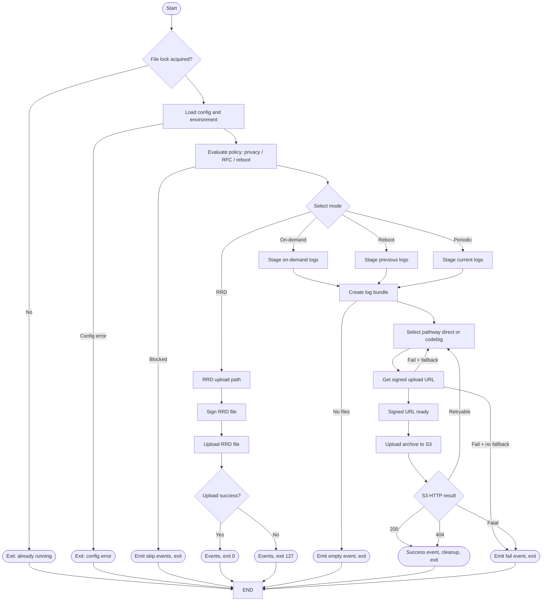

# High Level Design: Log Upload Service (C Migration of `uploadSTBLogs.sh`)

## 1. Architecture Overview
The C implementation will replace a monolithic shell script with a modular service/library consisting of:
- Core Orchestrator (state machine driving mode selection & sequencing)
- Configuration & Policy Layer
- Filesystem & Bundling Module
- Network Pathway Abstraction (Direct mTLS / Codebig OAuth / Future)
- Retry & Block Window Manager
- Telemetry & Event Dispatch Layer
- Privacy & RFC Policy Gate
- Logging & Error Classification
- Maintenance Mode Handler

The service can be:
- Invoked as a one-shot executable (retains shell semantics)
- Or embedded as a callable library (future extensibility)



## 2. Component Breakdown

| Component | Responsibility | Key Interfaces |
|-----------|----------------|----------------|
| Orchestrator (`lu_core`) | Parse inputs, coordinate full lifecycle | `lu_run()` |
| Config Loader (`lu_config`) | Consolidate CLI args, TR-181, environment, runtime files | `lu_load_config()` |
| Policy Engine (`lu_policy`) | Evaluate privacy, reboot reason, RFC toggles | `lu_policy_eval()` |
| Bundle Manager (`lu_bundle`) | Timestamp normalization, selective copy, compression, cleanup | `lu_make_bundle()`, `lu_cleanup_bundle()` |
| Pathway Selector (`lu_pathway`) | Decide direct vs codebig; manage fallback | `lu_select_pathway()` |
| Block Manager (`lu_block`) | Enforce cooldown timers; create/remove marker files | `lu_block_check()`, `lu_block_set()` |
| Network Client (`lu_net`) | HTTPS signing request, S3 upload, mTLS integration | `lu_net_get_signed_url()`, `lu_net_put_object()` |
| Security / TLS Layer (`lu_tls`) | Encapsulation for mTLS, OCSP, MD5 generation | `lu_tls_prepare()`, `lu_md5_base64()` |
| Telemetry (`lu_telemetry`) | Emit counters & structured events | `lu_telemetry_count()`, `lu_telemetry_value()` |
| Event Dispatch (`lu_events`) | IARM or platform abstraction | `lu_event_emit()` |
| Logging (`lu_log`) | Structured log API with severity and domains | `LU_LOG(domain, level, fmt, ...)` |
| Reboot Context (`lu_reboot`) | Uptime & reboot reason evaluation | `lu_reboot_info()` |
| RRD Handler (`lu_rrd`) | Specialized remote debugger path | `lu_rrd_upload()` |
| Packet Capture Pruner (`lu_pcap`) | Retain last PCAP only | `lu_pcap_prune()` |

## 3. Data Flow (Narrative)
1. Start → Acquire exclusive lock (flock) → Load config (CLI + files + TR-181) → Evaluate policies (privacy, reboot conditions).
2. Determine operational mode (RRD, on-demand, reboot-phase, periodic).
3. If mode requires upload:
   - Prepare staging directory (copy selective logs, rename prefix).
   - Build bundle (tar/gzip streaming).
   - (If encryption RFC active) compute base64 MD5.
4. Acquire signing URL (direct mTLS or codebig OAuth) — pathway chosen by block state + config.
5. Perform signed URL HTTP upload to S3 (direct or via proxy fallback).
6. Interpret HTTP/TLS outcome → update block timers, telemetry, and events.
7. Cleanup staging, temp files, rotate PCAPs, finalize events.
8. Exit with mapped code.

## 4. State Machine (Abstract)
States:
- INIT
- LOAD_CONFIG
- POLICY_CHECK
- MODE_SELECT
- PREPARE_BUNDLE
- PATHWAY_SELECT
- SIGN_REQUEST
- UPLOAD_EXEC
- FALLBACK_EVAL
- COMPLETE_SUCCESS / COMPLETE_FAIL / SKIPPED

Transitions:
- Failure at SIGN_REQUEST or UPLOAD_EXEC may transition to PATHWAY_SELECT (fallback) depending on remaining attempts and block policy.
- Privacy or disabled upload → SKIPPED.

## 5. Key Algorithms

### 5.1 Pathway Selection & Fallback
Inputs: last failure timestamps, max attempts, RFC allow-codebig flag, device type.
Algorithm:
- If direct not blocked → attempt direct.
- On network-level no-response (HTTP 000 or curl timeout) → consider codebig if allowed & not blocked.
- If codebig returns success, optionally set direct-block (24h).
- If codebig fails repeatedly, set codebig-block (30m) and revert to direct for next invocation.

### 5.2 Block Window Evaluation
- Read file mtime of marker.
- Compare current time vs threshold (24h direct, 30m codebig).
- Remove expired marker.

### 5.3 Bundle Construction
- Enumerate log directory (excluding patterns).
- Optionally timestamp-prefix rename (for legacy normalization).
- Tar/gzip streaming: incremental writes to file descriptor to avoid large memory footprint.

### 5.4 MD5 (Optional)
- Stream file through OpenSSL `EVP_DigestUpdate()` to compute MD5 → base64 encode.
- Avoid reading whole file at once.

### 5.5 Retry Scheduling
- Direct: up to N attempts (cfg or 3) with sleep (60s) between.
- Codebig: limited attempts (1 configurable).
- Fallback triggered only on connection-level failures or HTTP 000; not on 4xx (except 404 halts immediate).

### 5.6 Telemetry Classification
Map curl exit codes & HTTP codes into buckets; emit counters only on state transitions to reduce noise.

## 6. Data Structures (Simplified View)
```
typedef enum {
  LU_MODE_REBOOT,
  LU_MODE_PERIODIC,
  LU_MODE_ON_DEMAND,
  LU_MODE_RRD,
  LU_MODE_SKIP
} lu_mode_t;

typedef enum {
  LU_PATH_DIRECT,
  LU_PATH_CODEBIG
} lu_pathway_t;

typedef struct {
  char mac[32];
  char device_type[32];
  char log_root[PATH_MAX];
  char previous_logs[PATH_MAX];
  char reboot_info_file[PATH_MAX];
  char signed_url_endpoint[512];
  char upload_http_link[512];
  bool upload_enabled;
  bool upload_on_reboot;
  bool encryption_enabled;
  bool ocsp_enabled;
  bool privacy_block;
  bool maintenance_mode;
  int  trigger_type;
  int  flag;
  int  dcm_flag;
  int  rrd_flag;
  char rrd_log_file[PATH_MAX];
} lu_config_t;

typedef struct {
  lu_mode_t mode;
  lu_pathway_t pathway;
  int direct_block_remaining_sec;
  int codebig_block_remaining_sec;
  int attempts_done;
  bool used_fallback;
  int last_http_code;
  int last_curl_code;
  bool success;
} lu_state_t;

typedef struct {
  char bundle_path[PATH_MAX];
  char bundle_name[128];
  char md5_b64[64];
  off_t size_bytes;
} lu_bundle_t;
```

## 7. Interfaces & Integration
| External | Adapter |
|----------|---------|
| TR-181 API | `lu_tr181_get(param, buf, len)` |
| Telemetry (t2 functions) | `lu_telemetry_*` wrappers |
| IARM events | `lu_event_emit(channel, code)` |
| OAuth Signing (`GetServiceUrl`) | Exec wrapper returning string |
| mTLS Curl wrapper (`exec_curl_mtls`) | Abstracted: `lu_net_curl_mtls(request, response)` |

## 8. Security Considerations
- Redact signatures before logging request URLs.
- Memory scrub MD5 buffers after use if sensitive.
- Validate all path inputs to prevent traversal.
- Restrict bundle creation to whitelisted directories.

## 9. Error Handling Strategy
| Layer | Strategy |
|-------|----------|
| Config | Missing mandatory path → skip upload gracefully |
| Bundle | On tar failure → abort mode; log & telemetry error |
| Network | Categorize (cert, timeout, HTTP); update block states |
| Policy | Privacy block returns LU_MODE_SKIP early |
| Fallback | Single fallback cycle (no infinite loop) |

## 10. Logging Strategy
- Severity levels: INFO, WARN, ERROR, DEBUG, TRACE
- Domains: CORE, POLICY, NET, TLS, BUNDLE, PRIVACY
- Format: `[ts][domain][level][pathway][mode] message`
- Optional JSON mode (future enhancement).

## 11. Performance Considerations
- Use readdir() streaming; avoid spawning external `ls`.
- Tar builder: direct write with minimal buffering (e.g., 32KB chunk).
- Single pass MD5 (if enabled) integrated into upload (optional optimization: compute while archiving).
- Backoff sleeps only when necessary; ability to compile with reduced delays for test harness.

## 12. Extensibility Hooks
- Add new pathway (e.g., QUIC) by extending `lu_pathway_t` and pathway strategy table.
- Policy plugin interface enabling external dynamic decision injection.

## 13. Deployment Model
- Single binary invoked by existing cron / maintenance orchestrator.
- Return codes preserved for backward compatibility (RRD path still returns 127 on fail).
- Configuration via CLI flags + environment; TR-181 abstracted.

## 14. High-Level Flowchart (See flowcharts file for detailed Mermaid)
Referenced diagrams depict:
1. Master control flow (mode selection)
2. Pathway selection & fallback
3. Upload signing & S3 PUT
4. RRD special-case bypassing full bundle

## 15. Assumptions
- TR-181 and telemetry APIs remain available (or stubbed).
- File system layout consistent with script.
- Codebig tools present when pathway is allowed; absence gracefully disables.

## 16. Open Points (To Resolve in LLD)
- Exact mapping of maintenance event codes to enumerations.
- Whether to integrate zlib vs spawning `tar` (preferred: internal minimal tar writer + zlib).
- Synchronous vs optional asynchronous upload (initial: synchronous).

## 17. Success Criteria
- Behavioral parity across all conditional branches.
- Reduced process spawning count.
- ≤ 10MB peak RSS during full bundle creation for typical log sets.
