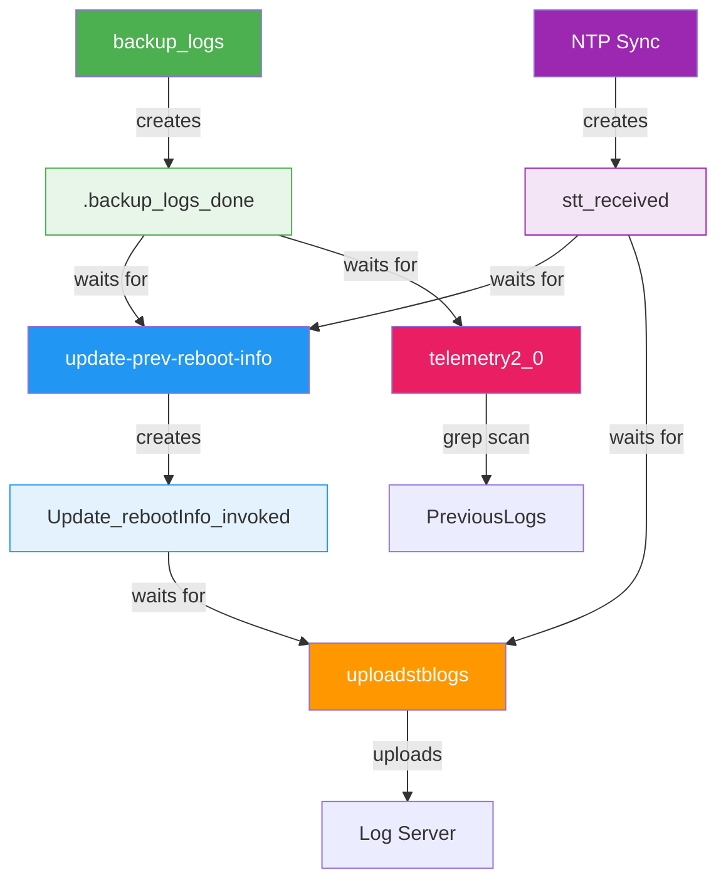
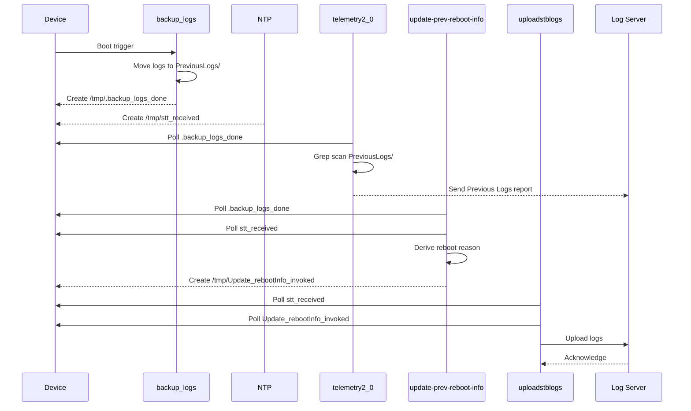
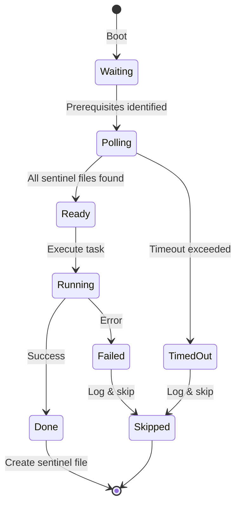
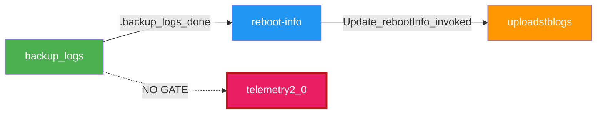

# Logupload Synchronization

Reboot Sequence Sync for dcm-agent

---

# The Problem

**Four** independent subsystems read `/opt/logs/PreviousLogs/` after reboot — with **no coordination**:

- **backup_logs** — moves logs to PreviousLogs/ directory
- **update-prev-reboot-info** — derives and persists reboot reason
- **uploadstblogs** — archives and uploads logs to a server
- **telemetry2_0** — grep-scans PreviousLogs/ for telemetry markers (one-shot)

### What goes wrong?

- Logs read before backup completion
- Reboot reasons derived from incomplete logs
- Uploads with incorrect timestamps or missing data
- **Telemetry markers permanently lost** — one-shot report, never retried

---
layout: two-cols
---

# Current State

- Four subsystems launch independently at boot
- No ordering guarantees
- Race conditions between log backup, reboot-info, upload, and telemetry
- Timestamps may be inaccurate (no NTP sync)
- Telemetry scans PreviousLogs/ before files are moved

::right::

# Target State

- **Sentinel file chain** enforces strict order
- Each subsystem waits for prerequisites
- NTP synchronization required before upload
- Telemetry polls `.backup_logs_done` before grep scan
- Clean skip on timeout / failure

---

# Sentinel File Protocol

Sentinel files act as **completion signals** between stages.

---

# Execution Flow

1. **Device Reboots**
2. `backup_logs` starts → moves logs to `/opt/logs/PreviousLogs/`
3. On success → creates `/tmp/.backup_logs_done`
4. `update-prev-reboot-info` polls for:
   - `/tmp/.backup_logs_done`
   - `/tmp/stt_received` (NTP sync)
5. Derives reboot reason → creates `/tmp/Update_rebootInfo_invoked`
6. `uploadstblogs` polls for:
   - `/tmp/stt_received`
   - `/tmp/Update_rebootInfo_invoked`
7. Proceeds with log upload

---

# Execution Sequence

---

# Key Components

| Component | Language | Role |
|-----------|----------|------|
| **backup_logs** | C (migrated from shell) | Move logs to backup directory |
| **Reboot Manager** | C | Derive and persist reboot reason |
| **uploadstblogs** | C | Archive & upload logs to server |
| **telemetry2_0** | C | Grep-scan PreviousLogs/ for markers |
| **Sentinel Files** | Filesystem | Inter-process synchronization |

---

# Error Handling

- Each subsystem polls with a **configurable timeout**
- If a sentinel file is not created in time:
  - Dependent subsystem logs an error
  - **Skips its operation cleanly**
- No cascading failures — each stage fails independently
- All failures are logged for diagnostics

| Component | Timeout | Action on timeout |
|-----------|---------|-------------------|
| update-prev-reboot-info | 60s | Exit `ERROR_GENERAL` |
| telemetry2_0 | 60s | Skip PreviousLogs report, use current logs |
| uploadstblogs | 120s | Skip reboot log upload entirely |

---

# Subsystem State Machine

Each subsystem follows this state machine independently.

---

# backup_logs Migration

Migrated from **shell script → C** for:

- Better performance on resource-constrained devices
- Modular architecture:
  - `config_manager` — configuration handling
  - `backup_engine` — core log backup logic
  - `special_files` — special file handling
  - `sys_integration` — system integration layer
- Comprehensive unit tests with Google Test

---

# Design Principles

- **No dynamic memory allocation** — memory pools where needed
- **Platform-neutral** — portable across embedded targets
- **Thread-safe** — safe concurrent access
- **Fixed-point arithmetic** — no floating-point dependency
- **Secure coding** — input validation, no buffer overflows
- **Modular** — each subsystem independently testable

---

# Cross-Repo Interface Contract

The sentinel `/tmp/.backup_logs_done` is a **3-repo interface**:

| Repo | Role | Action |
|------|------|--------|
| **dcm-agent** | Writer | `backup_logs` creates sentinel on success |
| **reboot-manager** | Consumer | Polls before reading PreviousLogs/ |
| **telemetry** | Consumer | Polls before grep-scanning PreviousLogs/ |

- All path changes must be **coordinated across all three repos**
- Sentinel resides in `/tmp/` — volatile, cleared on every reboot
- Telemetry fix tracked as a **separate change** in the telemetry repo
- The write side is already planned (TASK-B1 in reboot-sequence-sync)

---
layout: center
---

# The Telemetry Gap

**Discovery**: `telemetry2_0` reads PreviousLogs/ at boot — **outside the sentinel chain**

- `PERSIST_LOG_MON_REF` enabled on **all builds**
- PreviousLogs grep report is **fire-and-forget** — never retried
- If it reads incomplete data, telemetry markers are **permanently lost**
- Fix: poll `.backup_logs_done` in telemetry repo before PreviousLogs scan

---
layout: center
---

# Summary

Sentinel file chain eliminates race conditions at boot

**backup_logs → { telemetry, reboot-info } → uploadstblogs**

3-repo coordination: dcm-agent, reboot-manager, telemetry

Reliable, ordered, and fault-tolerant log processing

---
layout: center
---

# Thank You

[dcm-agent Repository](https://github.com/rdkcentral/dcm-agent)
