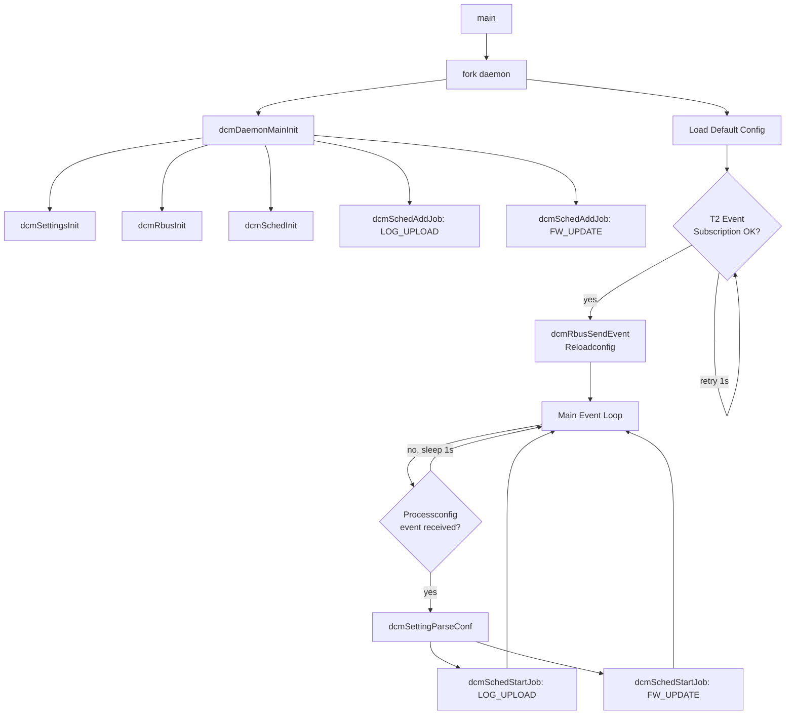
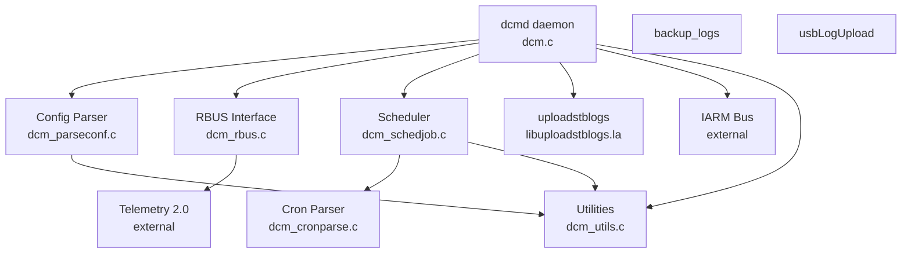
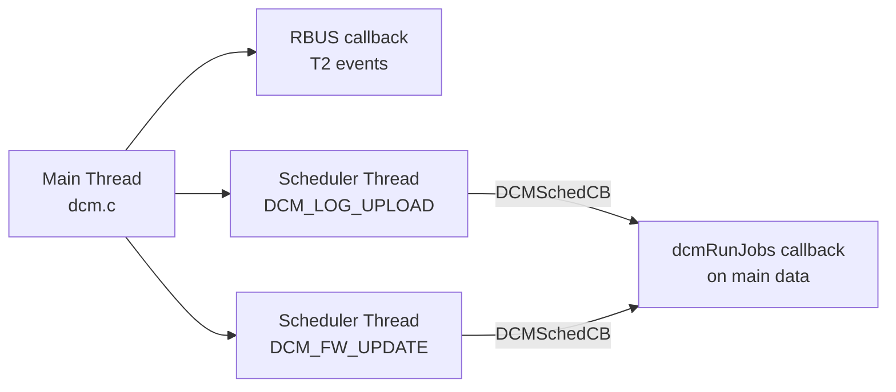
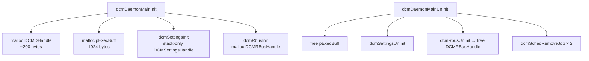

# DCM Agent

The **DCM (Device Configuration Manager) Agent** is a lightweight C daemon for RDK-based embedded devices. It receives device configuration payloads from the Telemetry 2.0 (T2) subsystem via RBUS, parses DCM settings, and schedules periodic jobs such as log uploads and firmware update checks. The project also bundles sub-modules for STB log upload, log backup, and USB log transfer, all originally implemented as shell scripts and now ported to C for performance and portability.

## Table of Contents

- [Architecture](#architecture)
- [Modules](#modules)
  - [dcm — Core Daemon](#dcm--core-daemon)
  - [dcm\_parseconf — Configuration Parser](#dcm_parseconf--configuration-parser)
  - [dcm\_rbus — RBUS Integration](#dcm_rbus--rbus-integration)
  - [dcm\_schedjob — Cron Scheduler](#dcm_schedjob--cron-scheduler)
  - [dcm\_cronparse — Cron Expression Parser](#dcm_cronparse--cron-expression-parser)
  - [dcm\_utils — Utilities](#dcm_utils--utilities)
  - [uploadstblogs — STB Log Upload Library](#uploadstblogs--stb-log-upload-library)
  - [backup\_logs — Log Backup](#backup_logs--log-backup)
  - [usbLogUpload — USB Log Upload](#usblogupload--usb-log-upload)
- [Threading Model](#threading-model)
- [Memory Management](#memory-management)
- [Build Instructions](#build-instructions)
- [Unit Testing](#unit-testing)
- [Error Handling](#error-handling)
- [Configuration Files](#configuration-files)
- [Platform Notes](#platform-notes)
- [See Also](#see-also)

---

## Architecture

The DCM Agent runs as a forked background daemon (`dcmd`). On startup it:

1. Checks for duplicate instances via a PID file.
2. Initialises the configuration parser, RBUS connection, and cron scheduler.
3. Loads default boot configuration.
4. Waits until T2 event subscription is confirmed.
5. Sends a reload-config event to T2 and enters the main event loop.
6. On receiving a `Device.DCM.Processconfig` event, parses the DCM settings file and starts/restarts the scheduled jobs.



### Component Diagram



---

## Modules

### dcm — Core Daemon

| File | Role |
|------|------|
| `dcm.c` | Daemon entry point, init/uninit, main event loop |
| `dcm.h` | `DCMDHandle` struct, public init/uninit declarations |

**Key struct:**

```c
typedef struct _dcmdHandle {
    BOOL  isDebugEnabled;
    BOOL  isDCMRunning;
    VOID *pRbusHandle;       /* DCMRBusHandle */
    VOID *pDcmSetHandle;     /* DCMSettingsHandle */
    VOID *pLogSchedHandle;   /* DCMScheduler for log upload */
    VOID *pDifdSchedHandle;  /* DCMScheduler for FW update */
    INT8 *pExecBuff;         /* 1 KB command buffer */
    INT8  logCron[16];       /* Cron pattern for log upload */
    INT8  difdCron[16];      /* Cron pattern for FW update */
} DCMDHandle;
```

**Lifecycle:**

```c
INT32 dcmDaemonMainInit(DCMDHandle *pdcmHandle);
VOID  dcmDaemonMainUnInit(DCMDHandle *pdcmHandle);
```

`dcmDaemonMainUnInit()` releases all sub-module resources in reverse order of acquisition.

**Scheduled job names:**

| Constant | Value | Purpose |
|----------|-------|---------|
| `DCM_LOGUPLOAD_SCHED` | `"DCM_LOG_UPLOAD"` | Periodic STB log upload |
| `DCM_DIFD_SCHED` | `"DCM_FW_UPDATE"` | Firmware update check |

---

### dcm\_parseconf — Configuration Parser

| File | Role |
|------|------|
| `dcm_parseconf.c` | Parses DCM JSON/key-value config files |
| `dcm_parseconf.h` | `DCMSettingsHandle`, public API |

Reads the DCM response file (typically `/tmp/DCMSettings.conf` or `/opt/.DCMSettings.conf`) and extracts the following settings:

| JSON URN | Field | Description |
|----------|-------|-------------|
| `urn:settings:LogUploadSettings:UploadRepository:uploadProtocol` | Upload protocol | `HTTP` or `HTTPS` |
| `urn:settings:LogUploadSettings:UploadRepository:URL` | Upload URL | Remote endpoint |
| `urn:settings:LogUploadSettings:UploadOnReboot` | Reboot flag | Upload on reboot |
| `urn:settings:LogUploadSettings:UploadSchedule:cron` | Log cron | Cron schedule string |
| `urn:settings:CheckSchedule:cron` | FW update cron | Cron schedule string |
| `urn:settings:TimeZoneMode` | Timezone | Device timezone |

**Public API:**

```c
INT32  dcmSettingsInit(VOID **ppdcmSetHandle);
VOID   dcmSettingsUnInit(VOID *pdcmSetHandle);
INT32  dcmSettingParseConf(VOID *pdcmSetHandle, INT8 *pConffile,
                           INT8 *pLogCron, INT8 *pDifdCron);
INT8*  dcmSettingsGetUploadProtocol(VOID *pdcmSetHandle);
INT8*  dcmSettingsGetUploadURL(VOID *pdcmSetHandle);
INT8*  dcmSettingsGetRDKPath(VOID *pdcmSetHandle);
INT32  dcmSettingsGetMMFlag();         /* Maintenance Manager check */
INT32  dcmSettingDefaultBoot();        /* Load config at boot */
```

**Key internal buffers** (all statically sized, no dynamic allocation):

| Field | Size | Purpose |
|-------|------|---------|
| `cJsonStr` | 2048 B | Raw JSON payload |
| `cUploadURL` | 128 B | Upload endpoint |
| `cUploadPrtl` | 8 B | Protocol string |
| `cTimeZone` | 16 B | Timezone |
| `cRdkPath` | 80 B | RDK library path |
| `ctBuff` | 1024 B | Temporary command buffer |

---

### dcm\_rbus — RBUS Integration

| File | Role |
|------|------|
| `dcm_rbus.c` | RBUS open/close, event subscription, event publishing |
| `dcm_rbus.h` | `DCMRBusHandle`, event name constants, public API |

Handles all communication with the RDK RBUS message bus and acts as the bridge between DCM and Telemetry 2.0.

**RBUS events:**

| Constant | Value | Direction |
|----------|-------|-----------|
| `DCM_RBUS_SETCONF_EVENT` | `Device.DCM.Setconfig` | T2 → DCM |
| `DCM_RBUS_PROCCONF_EVENT` | `Device.DCM.Processconfig` | T2 → DCM |
| `DCM_RBUS_RELOAD_EVENT` | `Device.X_RDKCENTREL-COM.Reloadconfig` | DCM → T2 |

**RBUS data model parameters:**

| Parameter | Purpose |
|-----------|---------|
| `Device.DeviceInfo.X_RDKCENTRAL-COM_RFC.Feature.Telemetry.Version` | T2 version query |
| `Device.DeviceInfo.X_RDKCENTRAL-COM_RFC.Feature.Telemetry.ConfigURL` | Config fetch URL |

**Public API:**

```c
INT32  dcmRbusInit(VOID **ppDCMRbusHandle);
INT32  dcmRbusSubscribeEvents(VOID *pDCMRbusHandle);
VOID   dcmRbusUnInit(VOID *pDCMRbusHandle);
INT32  dcmRbusSendEvent(VOID *pDCMRbusHandle);
INT32  dcmRbusSchedJobStatus(VOID *pDCMRbusHandle);   /* Poll: config ready? */
VOID   dcmRbusSchedResetStatus(VOID *pDCMRbusHandle); /* Reset after processing */
INT8   dcmRbusGetEventSubStatus(VOID *pDCMRbusHandle);
INT8*  dcmRbusGetConfPath(VOID *pDCMRbusHandle);
INT32  dcmRbusGetT2Version(VOID *pDCMRbusHandle, VOID *value);
```

---

### dcm\_schedjob — Cron Scheduler

| File | Role |
|------|------|
| `dcm_schedjob.c` | Per-job scheduler threads driven by cron expressions |
| `dcm_schedjob.h` | `DCMScheduler` struct, callback typedef, public API |

One `DCMScheduler` instance is created per job. A dedicated POSIX thread (`dcmSchedulerThread`) sleeps until the next cron fire-time using `pthread_cond_timedwait`, then invokes the registered callback.

**Scheduler struct:**

```c
typedef struct _dcmScheduler {
    INT8           *name;
    BOOL            terminated;
    BOOL            startSched;
    dcmCronExpr     parseData;    /* Pre-parsed cron expression */
    pthread_t       tId;
    pthread_mutex_t tMutex;
    pthread_cond_t  tCond;
    DCMSchedCB      pDcmCB;       /* Job callback */
    VOID           *pUserData;    /* Caller context passed to callback */
} DCMScheduler;
```

**Callback signature:**

```c
typedef VOID (*DCMSchedCB)(const INT8* profileName, VOID *pUsrData);
```

**Public API:**

```c
INT32  dcmSchedInit();
VOID   dcmSchedUnInit();
VOID*  dcmSchedAddJob(INT8 *pJobName, DCMSchedCB pDcmCB, VOID *pUsrData);
VOID   dcmSchedRemoveJob(VOID *pHandle);
INT32  dcmSchedStartJob(VOID *pHandle, INT8 *pCronPattern);
INT32  dcmSchedStopJob(VOID *pHandle);
```

**Thread safety:** Each `DCMScheduler` has its own mutex and condition variable. The terminated flag is checked atomically under the lock to ensure clean shutdown.

---

### dcm\_cronparse — Cron Expression Parser

| File | Role |
|------|------|
| `dcm_cronparse.c` | Tokenises and validates 6-field cron expressions |
| `dcm_cronparse.h` | `dcmCronExpr` bitfield struct, public API |

Supports standard 6-field cron syntax (seconds, minutes, hours, day-of-month, month, day-of-week). Results are stored as compact bitmask arrays with zero dynamic allocation.

**Parsed struct:**

```c
typedef struct {
    UINT8 seconds[8];       /* 60-bit bitmask */
    UINT8 minutes[8];       /* 60-bit bitmask */
    UINT8 hours[3];         /* 24-bit bitmask */
    UINT8 days_of_week[1];  /*  7-bit bitmask */
    UINT8 days_of_month[4]; /* 31-bit bitmask */
    UINT8 months[2];        /* 12-bit bitmask */
} dcmCronExpr;
```

**Public API:**

```c
INT32   dcmCronParseExp(const INT8* expression, dcmCronExpr* target);
time_t  dcmCronParseGetNext(dcmCronExpr* expr, time_t date);
```

`dcmCronParseGetNext()` returns the next `time_t` after `date` at which the expression fires; the scheduler uses this to compute `pthread_cond_timedwait` timeouts.

---

### dcm\_utils — Utilities

| File | Role |
|------|------|
| `dcm_utils.c` | File checks, PID management, system command execution, logging init |
| `dcm_utils.h` | Logging macros, path constants, error codes |

**Logging macros** (resolve to `RDK_LOG` when `RDK_LOGGER_ENABLED`, otherwise `fprintf(stderr,...)`):

| Macro | Level |
|-------|-------|
| `DCMError(...)` | Error |
| `DCMWarn(...)` | Warning |
| `DCMInfo(...)` | Info |
| `DCMDebug(...)` | Debug |

**Path constants:**

| Constant | Value |
|----------|-------|
| `DCM_LIB_PATH` | `/lib/rdk` |
| `DCM_PID_FILE` | `/tmp/.dcm-daemon.pid` |
| `DEVICE_PROP_FILE` | `/etc/device.properties` |
| `DCM_TMP_CONF` | `/tmp/DCMSettings.conf` |
| `DCM_OPT_CONF` | `/opt/.DCMSettings.conf` |

**Error codes:**

| Code | Value | Meaning |
|------|-------|---------|
| `DCM_SUCCESS` | `0` | Operation successful |
| `DCM_FAILURE` | `-1` | General failure |
| `DCM_IARM_COMPLETE` | `0` | IARM event sent OK |
| `DCM_IARM_ERROR` | `1` | IARM event failed |

---

### uploadstblogs — STB Log Upload Library

| Directory | Role |
|-----------|------|
| `uploadstblogs/src/` | Compiled into `libuploadstblogs.la` |
| `uploadstblogs/include/` | Public headers |

Provides a single re-entrant C API replacing the `uploadSTBLogs.sh` script family. The daemon links the library and calls `uploadstblogs_run()` on each log upload trigger.

**Entry point:**

```c
UploadSTBLogsParams params = {
    .flag             = 0,
    .dcm_flag         = 1,
    .upload_on_reboot = false,
    .upload_protocol  = "HTTP",
    .upload_http_link = "https://example.com/upload",
    .trigger_type     = TRIGGER_SCHEDULED,
    .rrd_flag         = false,
    .rrd_file         = NULL
};
int result = uploadstblogs_run(&params);
```

Sub-components within `uploadstblogs/`:

| Module | Header | Responsibility |
|--------|--------|---------------|
| upload\_engine | `upload_engine.h` | Orchestrates end-to-end upload flow |
| archive\_manager | `archive_manager.h` | Tar/compress log files |
| context\_manager | `context_manager.h` | Runtime state and path resolution |
| event\_manager | `event_manager.h` | RBUS event integration |
| file\_operations | `file_operations.h` | File I/O helpers |
| md5\_utils | `md5_utils.h` | MD5 checksum for upload verification |
| retry\_logic | `retry_logic.h` | Configurable retry with backoff |
| strategy\_selector | `strategy_selector.h` | HTTP / HTTPS / TFTP upload strategy |
| validation | `validation.h` | Parameter and path validation |
| verification | `verification.h` | Post-upload result verification |

---

### backup\_logs — Log Backup

| Directory | Role |
|-----------|------|
| `backup_logs/src/` | Persistent log backup utility |
| `backup_logs/include/` | Public headers |

Replaces script-based log backup. Copies or archives critical log files to a backup location. Designed to preserve logs across reboots on constrained storage.

**Entry point:**

```c
backup_config_t config;
/* populate config... */
int ret = backup_logs_init(&config);
if (ret == BACKUP_SUCCESS) {
    backup_logs_execute(&config);
    backup_logs_cleanup(&config);
}
```

**Key modules:**

| Module | Header | Responsibility |
|--------|--------|---------------|
| backup\_engine | `backup_engine.h` | Core backup orchestration |
| config\_manager | `config_manager.h` | `special_files.conf` parsing |
| special\_files | `special_files.h` | File list management |
| sys\_integration | `sys_integration.h` | Storage and filesystem checks |

Configuration file `special_files.conf` lists files to include in each backup run.

---

### usbLogUpload — USB Log Upload

| Directory | Role |
|-----------|------|
| `usbLogUpload/src/` | Log transfer to attached USB storage |
| `usbLogUpload/include/` | Public headers |

Replaces `usbLogUpload.sh`. Validates USB mount, discovers log files, compresses them, and copies to the USB device with a standard naming convention.

**Key modules:**

| Module | Responsibility |
|--------|---------------|
| usb\_log\_main | Entry point and workflow orchestration |
| usb\_log\_validation | Device and mount-point validation |
| usb\_log\_file\_manager | Log discovery and directory operations |
| usb\_log\_archive | Compression and archive naming |
| usb\_log\_utils | Common helpers and configuration |

---

## Threading Model



| Thread | Created by | Purpose | Synchronisation |
|--------|-----------|---------|-----------------|
| Main daemon | OS / `fork()` | Init, event loop, config parsing | – |
| RBUS callback | RBUS library | Receives T2 events | `DCMRBusHandle.schedJob` flag (int) |
| Scheduler (per job) | `dcmSchedAddJob()` | Fires job callback at cron time | `pthread_mutex_t` + `pthread_cond_t` per `DCMScheduler` |

**Lock ordering** — to avoid deadlocks if multiple scheduler jobs are ever accessed concurrently, always acquire job locks in creation order (log upload before FW update).

**Signal handling** — `SIGINT`, `SIGTERM`, `SIGKILL`, and `SIGABRT` all route to `sig_handler()`, which calls `dcmDaemonMainUnInit()` and exits cleanly.

---

## Memory Management

The daemon uses a minimal-allocation strategy suited to constrained devices:



**Ownership rules:**

| Resource | Owner | Freed by |
|----------|-------|---------|
| `DCMDHandle` | `main()` | `main()` via `free()` |
| `pExecBuff` | `DCMDHandle` | `dcmDaemonMainUnInit()` |
| `DCMSettingsHandle` | `dcmSettingsInit()` | `dcmSettingsUnInit()` |
| `DCMRBusHandle` | `dcmRbusInit()` | `dcmRbusUnInit()` |
| `DCMScheduler` | `dcmSchedAddJob()` | `dcmSchedRemoveJob()` |

**Static buffers** — `DCMSettingsHandle` uses only fixed-size fields; no dynamic allocation inside the parser.

**Typical footprint:** < 8 KB total heap for the core daemon (excluding uploadstblogs and RBUS library allocations).

---

## Build Instructions

### Prerequisites

| Tool | Version |
|------|---------|
| GCC | 7+ (ARMv7 cross-compiler supported) |
| Autotools | autoconf 2.69+, automake 1.15+ |
| libtool | 2.4+ |
| librbus | Platform-provided |
| libcjson | 1.7+ |
| librdkloggers | Optional (RDK logger) |
| libIBus / libmaintenanceMgr | Optional (Maintenance Manager) |

### Build Steps

```bash
# Generate build system
autoreconf -i

# Configure (native)
./configure

# Configure (cross-compile for RDK target)
./configure --host=arm-linux-gnueabihf \
            --with-sysroot=/path/to/sysroot

# Build
make

# Install
make install
```

### Conditional Compile Flags

| Flag | Effect |
|------|--------|
| `-DRDK_LOGGER_ENABLED` | Use RDK logger instead of stderr |
| `-DHAS_MAINTENANCE_MANAGER` | Enable Maintenance Manager integration via IARM |
| `-DGTEST_ENABLE` | Stub out RBUS/IARM for unit testing |
| `-DDCM_DEF_LOG_URL=<url>` | Override default fallback upload URL |
| `-DDCM_LOG_TFTP=<name>` | Override TFTP log upload identifier |

---

## Unit Testing

Unit tests use **Google Test** and **Google Mock** and reside in:

| Directory | Covers |
|-----------|--------|
| `unittest/` | `dcm`, `dcm_parseconf`, `dcm_rbus`, `dcm_schedjob`, `dcm_cronparse`, `dcm_utils` |
| `uploadstblogs/unittest/` | All `uploadstblogs` sub-modules |
| `backup_logs/unittest/` | All `backup_logs` sub-modules |
| `unittest/mocks/` | `mockrbus.cpp/.h` — RBUS mock |

### Running Unit Tests

Tests are executed in a Docker container using the standard RDK CI image:

```bash
# Pull the CI container
docker pull ghcr.io/rdkcentral/docker-rdk-ci:latest

# Run tests inside container
docker run --rm -v "$(pwd):/workspace" \
  ghcr.io/rdkcentral/docker-rdk-ci:latest \
  bash /workspace/unit_test.sh
```

### Coverage Target

Aim for **≥ 80%** line coverage. Each test file exercises:
- Normal operation paths
- NULL / invalid parameter paths
- Boundary values for cron expressions and buffer sizes
- Error injection for RBUS and file I/O failures

---

## Error Handling

All functions return `DCM_SUCCESS` (`0`) on success or `DCM_FAILURE` (`-1`) on error, consistent with the `dcm_types.h` convention. Pointer-returning functions return `NULL` on failure.

**Logging convention:**

```c
if (ret != DCM_SUCCESS) {
    DCMError("Descriptive message with context: %d\n", ret);
    goto cleanup;  /* single exit point pattern */
}
```

**Signal-driven shutdown** — the daemon sends an IARM `DCM_IARM_ERROR` maintenance event before exiting on fatal signals, allowing the platform maintenance manager to take corrective action.

---

## Configuration Files

| File | Location | Purpose |
|------|----------|---------|
| `DCMSettings.conf` | `/tmp/` or `/opt/` | DCM payload from T2 (JSON + key-value) |
| `device.properties` | `/etc/device.properties` | Device model, MAC, and RDK path |
| `telemetry2_0.properties` | `/etc/telemetry2_0.properties` | T2 feature flags |
| `include.properties` | `/etc/include.properties` | Additional properties include |
| `rdk_maintenance.conf` | `/opt/rdk_maintenance.conf` | Maintenance Manager schedule |
| `special_files.conf` | `/etc/backup_logs/` | List of files to back up |
| `debug.ini` | `/etc/debug.ini` | RDK logger level configuration |
| `.dcm-daemon.pid` | `/tmp/` | Running daemon PID |

---

## Platform Notes

### Linux / RDK Embedded

- Requires POSIX pthreads.
- RBUS IPC (`librbus`) must be available at runtime.
- Optional IARM bus integration for Maintenance Manager notifications.
- RDK logger (`librdkloggers`) replaces `fprintf(stderr)` when available.

### Resource Constraints

| Resource | Typical Budget |
|----------|---------------|
| Heap (core daemon) | < 8 KB |
| Heap (uploadstblogs in progress) | < 64 KB (transient) |
| Stack per scheduler thread | Default (8 KB minimum) |
| Binary size (`dcmd`) | < 256 KB stripped |

### Cross-Compilation

The build system fully supports cross-compilation via `--host=` and `--with-sysroot=`. All library paths use `PKG_CONFIG_SYSROOT_DIR` to locate target headers.

---

## See Also

- [CHANGELOG.md](CHANGELOG.md) — Release history
- [uploadstblogs/docs/](uploadstblogs/docs/) — STB log upload HLD/LLD
- [backup\_logs/docs/](backup_logs/docs/) — Log backup HLD/LLD/requirements
- [usbLogUpload/README.md](usbLogUpload/README.md) — USB log upload module overview
- [CONTRIBUTING.md](CONTRIBUTING.md) — Contribution guidelines
- [dcmd.service](dcmd.service) — systemd service unit
