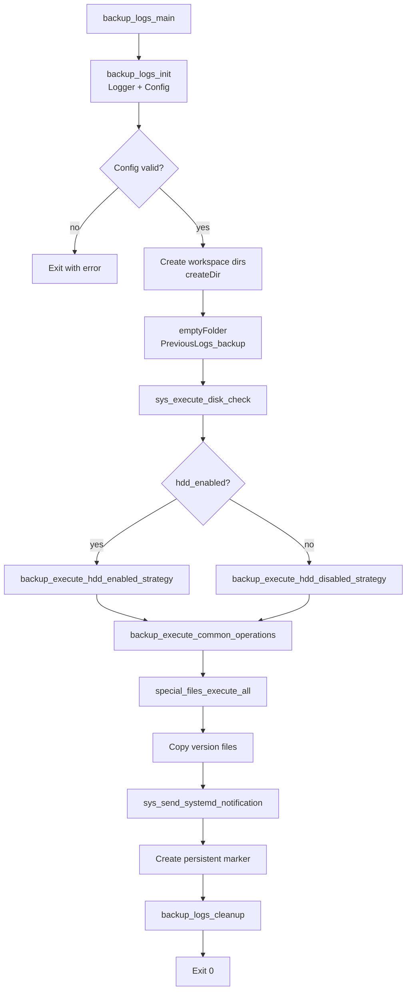
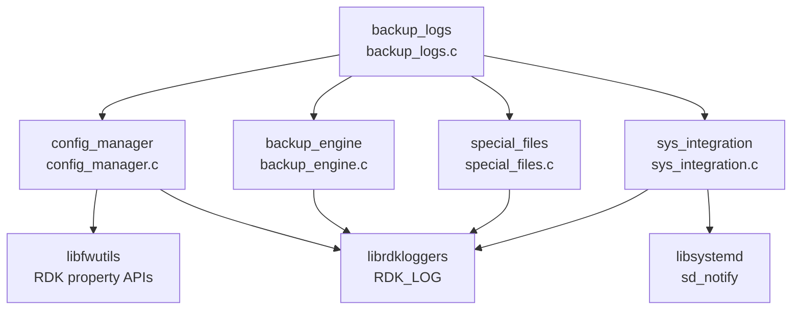
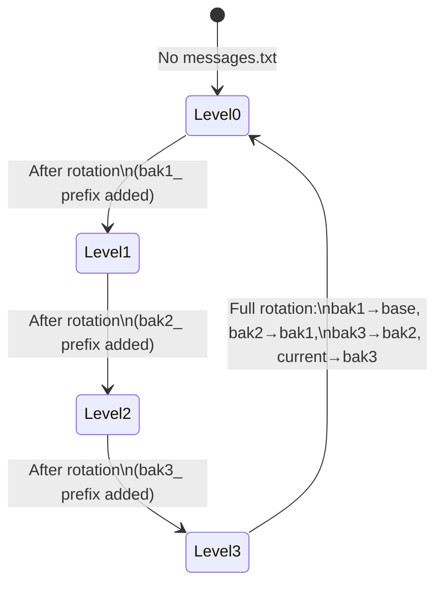
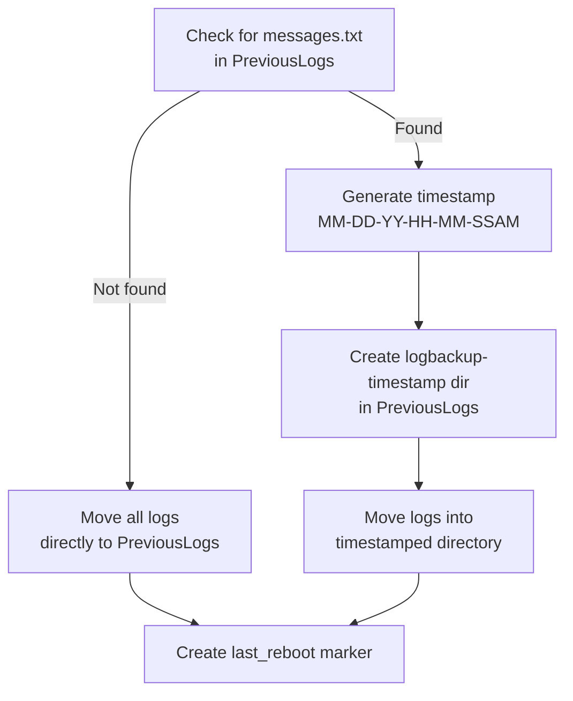
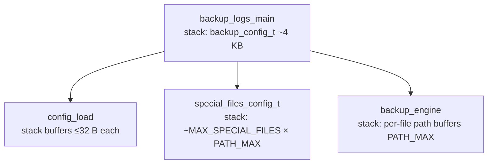

# backup\_logs Module

## Overview

`backup_logs` is a standalone C utility that migrates the functionality of `backup_logs.sh` to a compiled binary for RDK-based embedded devices. It preserves device log files across reboots by rotating them into a structured backup hierarchy (`PreviousLogs`/`PreviousLogs_backup`), supporting both HDD-enabled (timestamped directories) and HDD-disabled (4-level prefixed rotation) device configurations. The module also handles version file capture, special file processing, disk threshold checks, and systemd integration.

## Table of Contents

- [Architecture](#architecture)
- [Modules](#modules)
  - [backup\_logs — Entry Point](#backup_logs--entry-point)
  - [config\_manager — Configuration](#config_manager--configuration)
  - [backup\_engine — Core Backup Logic](#backup_engine--core-backup-logic)
  - [special\_files — Special File Processing](#special_files--special-file-processing)
  - [sys\_integration — Systemd Integration](#sys_integration--systemd-integration)
- [Data Structures and Types](#data-structures-and-types)
- [Backup Strategies](#backup-strategies)
  - [HDD-Disabled: 4-Level Rotation](#hdd-disabled-4-level-rotation)
  - [HDD-Enabled: Timestamped Directories](#hdd-enabled-timestamped-directories)
- [API Reference](#api-reference)
- [Special Files Configuration](#special-files-configuration)
- [Error Handling](#error-handling)
- [Memory Management](#memory-management)
- [Build Instructions](#build-instructions)
- [Unit Testing](#unit-testing)
- [Configuration Files and Paths](#configuration-files-and-paths)
- [Platform Notes](#platform-notes)
- [See Also](#see-also)

---

## Architecture

The module is a single executable (`backup_logs`) built from five C source files. It follows a strictly sequential, single-threaded execution model with no dynamic memory allocation beyond what is provided by the RDK utility layer.

### Execution Flow



### Component Diagram



---

## Modules

### backup\_logs — Entry Point

| File | Role |
|------|------|
| `src/backup_logs.c` | Main entry point, top-level lifecycle orchestration |
| `include/backup_logs.h` | Public API: `backup_logs_main()`, `backup_logs_init()`, `backup_logs_execute()`, `backup_logs_cleanup()` |

Performs initialization of the RDK logger (with optional extended file-output configuration), loads configuration, drives the backup strategies in sequence, and ensures resources are released on all exit paths.

**Top-level API:**

```c
int backup_logs_main(int argc, char *argv[]);
int backup_logs_init(backup_config_t *config);
int backup_logs_execute(const backup_config_t *config);
int backup_logs_cleanup(backup_config_t *config);
```

**Logger initialization** (two modes, selected at compile-time):

| Mode | Flag | Output | Notes |
|------|------|--------|-------|
| Extended | `-DRDK_LOGGER_EXT` | `/tmp/backup_logs.log` (50 KB, 5 rotations) | Timestamped, preferred on production |
| Standard | `-DRDK_LOGGER_ENABLED` | Controlled by `/etc/debug.ini` | Fallback |
| None | Neither flag | `stdout`/`stderr` | Development/CI only |

---

### config\_manager — Configuration

| File | Role |
|------|------|
| `src/config_manager.c` | Reads RDK property system, constructs and validates all paths |
| `include/config_manager.h` | `config_load()`, `special_files_config_load()`, `special_files_execute_operations()` |

Uses the `libfwutils` APIs `getIncludePropertyData()` and `getDevicePropertyData()` to resolve the following properties:

| Property | Source | Default |
|----------|--------|---------|
| `LOG_PATH` | `include.properties` | `/opt/logs` |
| `HDD_ENABLED` | `device.properties` | `false` |
| `APP_PERSISTENT_PATH` | `device.properties` | `/opt` |

Derived paths are assembled in-struct (no heap allocation):

```
log_path            → LOG_PATH (e.g. /opt/logs)
prev_log_path       → LOG_PATH/PreviousLogs
prev_log_backup_path→ LOG_PATH/PreviousLogs_backup
persistent_path     → APP_PERSISTENT_PATH
```

All `snprintf()` return values are checked and an error is returned if truncation would occur.

**Public API:**

```c
int config_load(backup_config_t* config);
int special_files_config_load(special_files_config_t* config,
                              const char* config_file);
int special_files_config_validate(const special_files_config_t* config);
void special_files_config_free(special_files_config_t* config);
int special_files_execute_operations(const special_files_config_t* config,
                                    const backup_config_t* backup_config);
int config_parse_environment(backup_config_t* config);
```

---

### backup\_engine — Core Backup Logic

| File | Role |
|------|------|
| `src/backup_engine.c` | Implements both backup strategies, file move/copy helpers |
| `include/backup_engine.h` | Strategy and helper function declarations |

The engine selects the appropriate strategy from `hdd_enabled` in `backup_config_t` and delegates through two well-defined strategy functions. File discovery uses `opendir`/`readdir` with `fnmatch`-style pattern matching against `*.txt*`, `*.log*`, and `bootlog`.

**Public API:**

```c
int backup_execute_hdd_enabled_strategy(const backup_config_t* config);
int backup_execute_hdd_disabled_strategy(const backup_config_t* config);
int backup_execute_common_operations(const backup_config_t* config);
int backup_and_recover_logs(const char* source, const char* dest,
                            backup_operation_type_t op,
                            const char* s_ext, const char* d_ext);
int move_log_files_by_pattern(const char* source_dir, const char* dest_dir);
```

---

### special\_files — Special File Processing

| File | Role |
|------|------|
| `src/special_files.c` | Parses `/etc/special_files.properties`, executes move/copy per entry |
| `include/special_files.h` | Init, load, validate, execute declarations |

The configuration file format is one source path per line. Comments (`#`) and blank lines are skipped. The operation type is determined automatically from the source path prefix: files under `/tmp/` are **moved**; all others are **copied** to `LOG_PATH`.

**Public API:**

```c
int  special_files_init(void);
void special_files_cleanup(void);
int  special_files_load_config(special_files_config_t* config,
                               const char* config_file);
int  special_files_validate_entry(const special_file_entry_t* entry);
int  special_files_execute_entry(const special_file_entry_t* entry,
                                const backup_config_t* backup_config);
int  special_files_execute_all(const special_files_config_t* config,
                               const backup_config_t* backup_config);
```

---

### sys\_integration — Systemd Integration

| File | Role |
|------|------|
| `src/sys_integration.c` | Sends `sd_notify` messages for service readiness and status |
| `include/sys_integration.h` | `sys_send_systemd_notification()` |

Wraps `libsystemd` to send `READY=1` and `STATUS=Logs Backup Done..!` at completion. Runs gracefully in non-systemd environments (notification errors are logged but do not fail the backup).

```c
int sys_send_systemd_notification(const char* message);
```

---

## Data Structures and Types

All types are defined in `include/backup_types.h`.

### `backup_config_t`

Central configuration structure passed through the entire call chain.

```c
typedef struct {
    char log_path[PATH_MAX];            /* Primary log directory */
    char prev_log_path[PATH_MAX];       /* LOG_PATH/PreviousLogs */
    char prev_log_backup_path[PATH_MAX];/* LOG_PATH/PreviousLogs_backup */
    char persistent_path[PATH_MAX];     /* APP_PERSISTENT_PATH */
    bool hdd_enabled;                   /* Device has HDD */
} backup_config_t;
```

### `backup_result_t` — Return Codes

| Code | Value | Meaning |
|------|-------|---------|
| `BACKUP_SUCCESS` | `0` | Operation completed successfully |
| `BACKUP_ERROR_CONFIG` | `-1` | Invalid or missing configuration (e.g. path truncation) |
| `BACKUP_ERROR_FILESYSTEM` | `-2` | Directory or file operation failure |
| `BACKUP_ERROR_PERMISSIONS` | `-3` | Insufficient filesystem permissions |
| `BACKUP_ERROR_MEMORY` | `-4` | Memory allocation failure |
| `BACKUP_ERROR_INVALID_PARAM` | `-5` | NULL or invalid function argument |
| `BACKUP_ERROR_NOT_FOUND` | `-6` | Required file or directory absent |
| `BACKUP_ERROR_DISK_FULL` | `-7` | Insufficient disk space |
| `BACKUP_ERROR_SYSTEM` | `-8` | External script or system call failure |

### `backup_operation_type_t`

```c
typedef enum {
    BACKUP_OP_MOVE,
    BACKUP_OP_COPY,
    BACKUP_OP_DELETE
} backup_operation_type_t;
```

### `special_file_entry_t` / `special_files_config_t`

```c
typedef enum {
    SPECIAL_FILE_COPY = 0,
    SPECIAL_FILE_MOVE = 1
} special_file_operation_t;

typedef struct {
    char source_path[PATH_MAX];
    char destination_path[PATH_MAX];
    special_file_operation_t operation;
    char conditional_check[MAX_CONDITIONAL_LEN]; /* unused, reserved */
} special_file_entry_t;

typedef struct {
    special_file_entry_t entries[MAX_SPECIAL_FILES]; /* MAX_SPECIAL_FILES = 32 */
    size_t count;
    bool config_loaded;
} special_files_config_t;
```

### `backup_flags_t`

```c
typedef struct {
    bool debug_enabled;
    bool force_rotation;
    bool skip_disk_check;
    bool cleanup_enabled;
} backup_flags_t;
```

---

## Backup Strategies

### HDD-Disabled: 4-Level Rotation

Used on devices without persistent disk (`hdd_enabled = false`). The current backup level is detected by probing for `messages.txt`, `bak1_messages.txt`, `bak2_messages.txt`, and `bak3_messages.txt` in `PreviousLogs`.



**Rotation cascade at Level 3:**

| Step | Action |
|------|--------|
| 1 | `bak1_*` → rename without prefix (becomes base) |
| 2 | `bak2_*` → rename with `bak1_` prefix |
| 3 | `bak3_*` → rename with `bak2_` prefix |
| 4 | Current logs → `PreviousLogs/bak3_<filename>` |

File patterns matched: `*.txt*`, `*.log*`, `*.bin*`, `bootlog`

### HDD-Enabled: Timestamped Directories

Used on devices with persistent storage (`hdd_enabled = true`).



File patterns matched: `*.txt*`, `*.log*`, `bootlog` (no `.bin*` files)

### Common Operations (both strategies)

After the device-specific strategy completes, `backup_execute_common_operations()` runs:

1. Loads and processes `/etc/special_files.properties`
2. Copies version files: `/version.txt`, `/etc/skyversion.txt`, `/etc/rippleversion.txt`
3. Removes old `last_reboot` markers
4. Creates new `last_reboot` marker at `persistent_path/logFileBackup`
5. Sends systemd `READY=1` + status notification

---

## API Reference

### `backup_logs_init()`

Initialises the RDK logger and loads configuration from the RDK property system.

**Signature:**
```c
int backup_logs_init(backup_config_t *config);
```

**Parameters:**
- `config` — Pre-allocated `backup_config_t`; populated on return (must be non-NULL)

**Returns:** `BACKUP_SUCCESS`, `BACKUP_ERROR_INVALID_PARAM`, or `BACKUP_ERROR_CONFIG`

**Thread Safety:** Not thread-safe. Call once from the main thread.

**Example:**
```c
backup_config_t config;
memset(&config, 0, sizeof(config));
int ret = backup_logs_init(&config);
if (ret != BACKUP_SUCCESS) {
    /* logger has already been called with the reason */
    return ret;
}
```

---

### `backup_logs_execute()`

Runs the complete backup workflow: workspace setup, strategy selection, common operations.

**Signature:**
```c
int backup_logs_execute(const backup_config_t *config);
```

**Parameters:**
- `config` — Populated configuration (from `backup_logs_init()`)

**Returns:** `BACKUP_SUCCESS` or error code from the first failing step

**Notes:**
- A failure in disk threshold check is logged but does not abort execution.
- Special file failures are non-fatal; execution continues with remaining entries.

---

### `backup_logs_cleanup()`

Releases any resources acquired during execution and resets configuration.

**Signature:**
```c
int backup_logs_cleanup(backup_config_t *config);
```

---

### `config_load()`

Resolves all configuration from the RDK property system and constructs derived paths.

**Signature:**
```c
int config_load(backup_config_t* config);
```

**Returns:** `BACKUP_SUCCESS`, `BACKUP_ERROR_INVALID_PARAM`, or `BACKUP_ERROR_CONFIG` (path truncation)

---

### `backup_execute_hdd_enabled_strategy()`

Implements the timestamped-directory backup for HDD-capable devices.

**Signature:**
```c
int backup_execute_hdd_enabled_strategy(const backup_config_t* config);
```

---

### `backup_execute_hdd_disabled_strategy()`

Implements the 4-level prefixed rotation for non-HDD devices.

**Signature:**
```c
int backup_execute_hdd_disabled_strategy(const backup_config_t* config);
```

---

### `move_log_files_by_pattern()`

Moves all files matching `*.txt*`, `*.log*`, or `bootlog` from source to destination directory.

**Signature:**
```c
int move_log_files_by_pattern(const char* source_dir, const char* dest_dir);
```

**Returns:** `BACKUP_SUCCESS` or `BACKUP_ERROR_FILESYSTEM` if source cannot be opened

**Notes:**
- Each `snprintf()` building the full path is bounds-checked; oversized names are skipped with a log warning.
- Uses `filePresentCheck()` to verify each candidate is a regular file.

---

### `special_files_execute_all()`

Processes all entries in the special files configuration, executing move or copy per entry.

**Signature:**
```c
int special_files_execute_all(const special_files_config_t* config,
                              const backup_config_t* backup_config);
```

**Returns:** `BACKUP_SUCCESS`; individual entry failures are logged and skipped (non-fatal).

---

### `sys_send_systemd_notification()`

Sends a notification string to the systemd service manager.

**Signature:**
```c
int sys_send_systemd_notification(const char* message);
```

**Typical calls:**
```c
sys_send_systemd_notification("READY=1");
sys_send_systemd_notification("STATUS=Logs Backup Done..!");
```

---

## Special Files Configuration

`/etc/special_files.properties` lists additional files to capture during the common operations phase. The format is one absolute source path per line.

```properties
# Special Files Configuration for backup_logs
# Lines starting with # are comments; blank lines are ignored.
#
# Operation is determined automatically:
#   /tmp/* → moved  (frees space)
#   other  → copied (preserves original)
# Destination is always LOG_PATH/<basename>

/tmp/disk_cleanup.log
/tmp/mount_log.txt
/tmp/mount-ta_log.txt
/etc/skyversion.txt
/etc/rippleversion.txt
/version.txt
```

**Processing rules:**

| Source prefix | Operation | Destination |
|---------------|-----------|-------------|
| `/tmp/` | `move` (frees flash) | `LOG_PATH/<basename>` |
| Other | `copy` (preserves src) | `LOG_PATH/<basename>` |

The maximum configurable entries is `MAX_SPECIAL_FILES` (32). Missing source files generate a warning log entry but do not abort the backup.

---

## Error Handling

All functions return `BACKUP_SUCCESS` (`0`) on success or a negative `backup_result_t` value on failure. The convention in every module is:

```c
if (!config) {
    RDK_LOG(RDK_LOG_ERROR, LOG_BACKUP_LOGS,
            "<function>: NULL config parameter\n");
    return BACKUP_ERROR_INVALID_PARAM;
}
```

**Non-fatal vs fatal failures:**

| Condition | Behaviour |
|-----------|-----------|
| Disk threshold check script absent | Logged, execution continues |
| Special file entry missing | Logged as warning, next entry processed |
| Version file missing | Logged as warning, execution continues |
| systemd notification failure | Logged, execution continues |
| Config load failure | Fatal: `backup_logs_main()` returns error |
| Directory creation failure | Fatal: execution aborted |

**Logging levels used:**

| Macro | When |
|-------|------|
| `RDK_LOG(RDK_LOG_ERROR, ...)` | Fatal conditions, invalid parameters |
| `RDK_LOG(RDK_LOG_WARN, ...)` | Non-fatal issues, missing optional files |
| `RDK_LOG(RDK_LOG_INFO, ...)` | Progress milestones, loaded values |
| `RDK_LOG(RDK_LOG_DEBUG, ...)` | Entry/exit of functions, intermediate values |

All messages use component name `LOG_BACKUP_LOGS` (`"LOG.RDK.BACKUPLOGS"`).

---

## Memory Management

`backup_logs` uses exclusively static-size buffers; there is no heap allocation in the application code itself.



**Allocation summary:**

| Variable | Location | Size | Lifetime |
|----------|----------|------|---------|
| `backup_config_t` | Stack (`main`) | ≤ 4 × `PATH_MAX` + `bool` | Duration of `main()` |
| `special_files_config_t` | Stack (caller) | 32 × `sizeof(special_file_entry_t)` ≈ ~256 KB max | Duration of caller scope |
| Per-file path buffers in `move_log_files_by_pattern` | Stack | 2 × `PATH_MAX` | Single iteration |
| Temporary property read buffers in `config_load` | Stack | 32 B each | Duration of `config_load()` |

**Peak heap use:** Near zero (only what `librdkloggers`, `libfwutils`, and the C runtime allocate internally).

**Ownership rules:**

- `backup_config_t` is owned by `main()` and passed by pointer throughout; no module frees it.
- `special_files_config_t` is owned by the caller of `special_files_load_config()`; call `special_files_config_free()` when done, even if populated only partially.
- All string fields inside config structures are fixed-length arrays — no pointer ownership to manage.

---

## Build Instructions

### Prerequisites

| Dependency | Package | Notes |
|------------|---------|-------|
| GCC / cross-compiler | Build environment | `std=c99`, `-Wall -Wextra` |
| Autotools | autoconf 2.69+, automake 1.15+ | |
| `librdkloggers` | RDK sysroot | Optional; enables RDK_LOG |
| `libfwutils` | RDK sysroot | Required for property APIs |
| `libsystemd` | sysroot or host | For `sd_notify` |
| `libsecure_wrapper` | RDK sysroot | Safe string/IO operations |
| `libm` | Standard libc | Math functions |

### Build Steps

```bash
# From the repo root
autoreconf -i

# Native build
./configure
make

# Cross-compile (ARM RDK target)
./configure --host=arm-linux-gnueabihf \
            PKG_CONFIG_SYSROOT_DIR=/path/to/sysroot
make

# Install
make install
```

### Compile-time Flags

| Flag | Effect |
|------|--------|
| `-DRDK_LOGGER_EXT` | Enable extended RDK logger with file output to `/tmp/backup_logs.log` |
| `-DRDK_LOGGER_ENABLED` | Enable standard RDK logger (controlled by `/etc/debug.ini`) |

Both flags are set in `backup_logs/Makefile.am`:
```makefile
backup_logs_CPPFLAGS = -I... -DRDK_LOGGER_EXT
backup_logs_LDADD    = -lm -lrdkloggers -lfwutils -lsystemd -lsecure_wrapper
```

---

## Unit Testing

Unit tests use **Google Test** and **Google Mock** and reside in `backup_logs/unittest/`.

| Test File | Module Covered |
|-----------|---------------|
| `backup_engine_gtest.cpp` | `backup_engine.c` — strategies, file pattern helpers |
| `backup_logs_gtest.cpp` | `backup_logs.c` — init/execute/cleanup lifecycle |
| `config_manager_gtest.cpp` | `config_manager.c` — property loading, path derivation |
| `special_files_gtest.cpp` | `special_files.c` — config parsing, entry execution |
| `sys_integration_gtest.cpp` | `sys_integration.c` — systemd notification paths |

RBUS, RDK property, and file-system calls are stubbed using **mock control variables** (global struct pattern) so tests run without a live RDK environment.

### Running Tests

```bash
# In the Docker CI container
docker run --rm \
  -v "$(pwd):/workspace" \
  ghcr.io/rdkcentral/docker-rdk-ci:latest \
  bash /workspace/unit_test.sh
```

### Coverage Target

≥ 80% line coverage. Tests cover:

- Normal paths for both HDD strategies
- All 4 rotation levels in the HDD-disabled strategy
- NULL and invalid parameter guards on every public function
- `snprintf` truncation paths in config loading
- Missing source files in special file processing
- Systemd notification success and failure paths

---

## Configuration Files and Paths

| File | Default Path | Purpose |
|------|-------------|---------|
| Include properties | `/etc/include.properties` | Source of `LOG_PATH` |
| Device properties | `/etc/device.properties` | Source of `HDD_ENABLED`, `APP_PERSISTENT_PATH` |
| Special files list | `/etc/special_files.properties` | Additional files to capture |
| Disk check script | `/lib/rdk/disk_threshold_check.sh` | Optional pre-backup disk threshold check |
| Debug configuration | `/etc/debug.ini` | RDK logger level settings |
| Logger output | `/tmp/backup_logs.log` | Extended logger file output (when `-DRDK_LOGGER_EXT`) |
| Persistent marker | `$APP_PERSISTENT_PATH/logFileBackup` | Signals backup completion across reboots |

**Runtime directory layout after a successful backup:**

```
$LOG_PATH/
├── PreviousLogs/
│   ├── messages.txt          (HDD-disabled: base level)
│   ├── bak1_messages.txt     (HDD-disabled: level 1)
│   ├── bak2_messages.txt     (HDD-disabled: level 2)
│   ├── bak3_messages.txt     (HDD-disabled: level 3)
│   ├── logbackup-04-03-26-… (HDD-enabled: timestamped dir)
│   └── last_reboot           (marker file)
├── PreviousLogs_backup/      (cleaned before use)
├── skyversion.txt
├── rippleversion.txt
└── version.txt
```

---

## Platform Notes

### Supported Architectures

ARMv7, MIPS, x86 (cross-compilation via `--host=`).

### Filesystem Compatibility

Designed for ext4, JFFS2, and UBIFS. All directory operations use `createDir()` from `libfwutils`, which handles filesystem-specific permission and inode constraints.

### Resource Constraints

| Resource | Limit |
|----------|-------|
| Peak memory (application) | ≤ 512 KB |
| Startup time | ≤ 2 s on target hardware |
| File operation window | ≤ 30 s for typical log volumes |
| CPU % during backup | ≤ 10% |
| `MAX_SPECIAL_FILES` | 32 entries |

### Security Considerations

- All paths are constructed with `snprintf()` and bounds-checked; truncation returns an error rather than a silently-clipped path.
- Source file paths in `special_files.properties` are processed without shell expansion, preventing command injection.
- `secure_wrapper` (`libsecure_wrapper`) is linked to harden string and I/O operations.
- Symlink safety: `filePresentCheck()` uses `stat()` (follows symlinks by design, consistent with the original shell script behaviour); callers validate the resolved path remains under expected directories.

---

## See Also

- [backup\_logs\_requirements.md](backup_logs_requirements.md) — Functional and non-functional requirements
- [backup\_logs\_migration\_HLD.md](backup_logs_migration_HLD.md) — High-level design
- [backup\_logs\_LLD.md](backup_logs_LLD.md) — Low-level design with detailed algorithms
- [diagrams/backup\_logs\_flowcharts.md](diagrams/backup_logs_flowcharts.md) — Text-based process flowcharts
- [../../README.md](../../README.md) — DCM Agent top-level overview
- [../../special\_files.conf](../../special_files.conf) — Example special files configuration installed to `/etc/backup_logs/`
