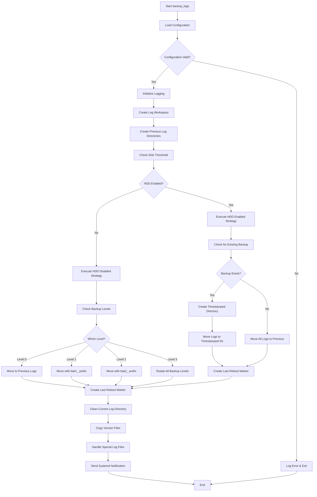
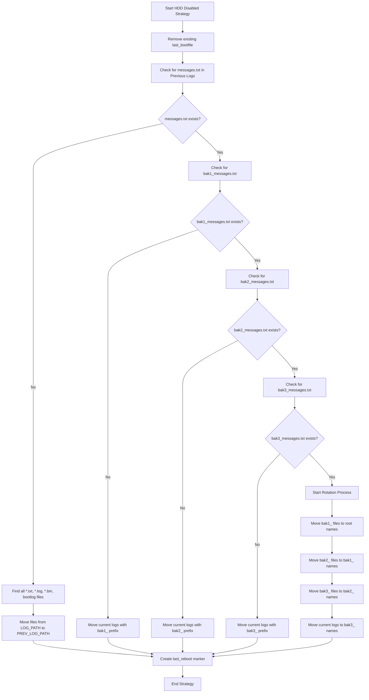
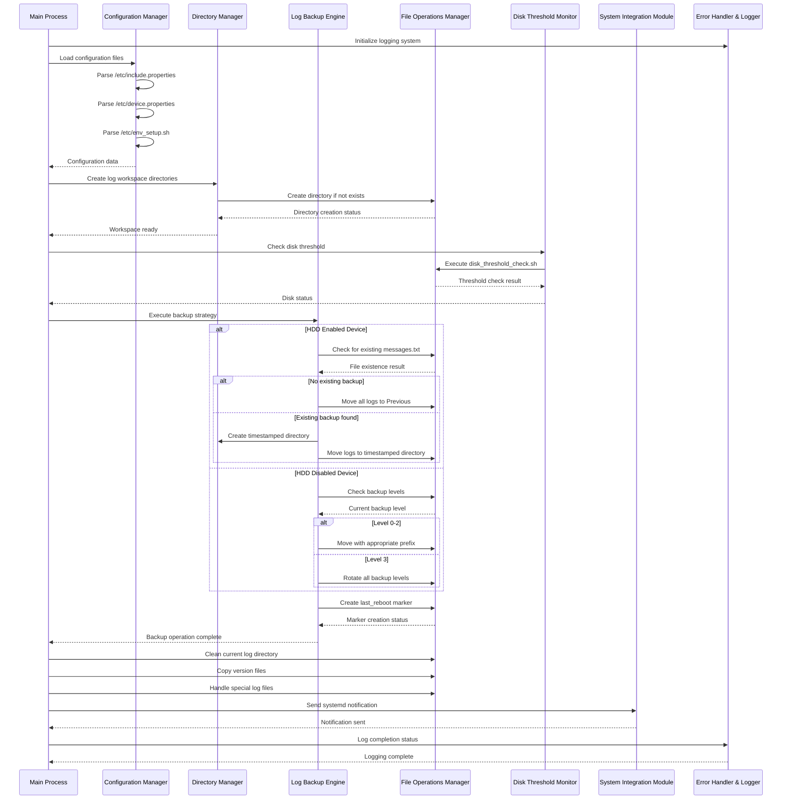
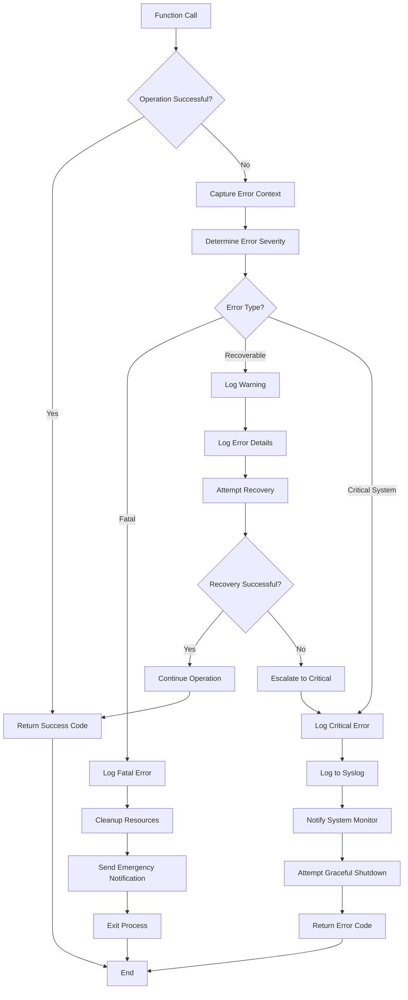

# Backup Logs Migration - Flowcharts and Diagrams

## Text-Based Flowchart Alternatives

### 1. Main Backup Process Flow (Text Alternative)

```
START backup_logs
  |
  v
Initialize RDK Logger (Extended Config)
  |
  v
Logger Init Success? --> NO --> Fallback to Console Logging
  |                                 |
  v YES                             v
Load Configuration from RDK APIs
  |
  v  
getIncludePropertyData("LOG_PATH")
  |
  v
getDevicePropertyData("HDD_ENABLED")
  |
  v
Configuration Valid? --> NO --> Log Error & Exit --> END
  |
  v YES
Create Log Workspace (createDir)
  |
  v
Create Previous Log Directories (createDir)
  |
  v
Clean Backup Directory (emptyFolder)
  |
  v
Create Persistent Marker File
  |
  v
Check Disk Threshold (/lib/rdk/disk_threshold_check.sh)
  |
  v
Remove Existing last_reboot Markers
  |
  v
HDD Enabled?
  |
  +-- YES --> Execute HDD Enabled Strategy
  |             |
  |             v
  |           Check for Existing messages.txt
  |             |
  |             v
  |           messages.txt Exists?
  |             |
  |             +-- NO --> Move All Logs to Previous --> Create Last Reboot Marker
  |             |    
  |             +-- YES --> Create Timestamped Directory
  |                           |
  |                           v
  |                        Move Logs to Timestamped Dir
  |                           |
  |                           v
  |                        Create Last Reboot Marker
  |
  +-- NO --> Execute HDD Disabled Strategy
              |
              v
            Check Backup Levels
              |
              v
            Which Level?
              |
              +-- Level 0 --> Move to Previous Logs --> Create Last Reboot Marker
              |
              +-- Level 1 --> Move with bak1_ prefix --> Create Last Reboot Marker  
              |
              +-- Level 2 --> Move with bak2_ prefix --> Create Last Reboot Marker
              |
              +-- Level 3 --> Rotate All Backup Levels --> Create Last Reboot Marker

All paths converge to:
  |
  v
Execute Common Operations
  |
  v
Load Special Files Config (/etc/special_files.properties)
  |
  v
Process Special Files (one filename per line)
  |
  v
Copy Version Files (skyversion.txt, rippleversion.txt, version.txt)
  |
  v
Send Systemd Notification  
  |
  v
Cleanup Resources
  |
  v
END
```

### 2. HDD Disabled Strategy Detail (Text Alternative)

```
START HDD Disabled Strategy
  |
  v
Remove existing last_bootfile
  |
  v  
Check for messages.txt in Previous Logs
  |
  v
messages.txt exists?
  |
  +-- NO --> Find all *.txt, *.log, *.bin, bootlog files
  |            |
  |            v
  |          Move files from LOG_PATH to PREV_LOG_PATH
  |            |
  |            v
  |          Create last_reboot marker --> END STRATEGY
  |
  +-- YES --> Check for bak1_messages.txt
               |
               v
             bak1_messages.txt exists?
               |
               +-- NO --> Move current logs with bak1_ prefix --> Create last_reboot marker --> END STRATEGY
               |
               +-- YES --> Check for bak2_messages.txt
                            |
                            v
                          bak2_messages.txt exists?
                            |
                            +-- NO --> Move current logs with bak2_ prefix --> Create last_reboot marker --> END STRATEGY
                            |
                            +-- YES --> Check for bak3_messages.txt
                                         |
                                         v
                                       bak3_messages.txt exists?
                                         |
                                         +-- NO --> Move current logs with bak3_ prefix --> Create last_reboot marker --> END STRATEGY
                                         |
                                         +-- YES --> Start Rotation Process
                                                      |
                                                      v
                                                    Move bak1_ files to root names
                                                      |
                                                      v
                                                    Move bak2_ files to bak1_ names
                                                      |
                                                      v
                                                    Move bak3_ files to bak2_ names
                                                      |
                                                      v
                                                    Move current logs to bak3_ names
                                                      |
                                                      v
                                                    Create last_reboot marker --> END STRATEGY
```

### 3. Component Interaction Sequence (Text Alternative)

```
Main Process -> Logger: Initialize logging system
Main Process -> Config Manager: Load configuration files
Config Manager -> Config Manager: Parse /etc/include.properties  
Config Manager -> Config Manager: Parse /etc/device.properties
Config Manager -> Config Manager: Parse /etc/env_setup.sh
Config Manager --> Main Process: Configuration data

Main Process -> Directory Manager: Create log workspace directories
Directory Manager -> File Operations: Create directory if not exists
File Operations --> Directory Manager: Directory creation status
Directory Manager --> Main Process: Workspace ready

Main Process -> Disk Monitor: Check disk threshold
Disk Monitor -> File Operations: Execute disk_threshold_check.sh
File Operations --> Disk Monitor: Threshold check result  
Disk Monitor --> Main Process: Disk status

Main Process -> Backup Engine: Execute backup strategy

IF HDD Enabled Device:
  Backup Engine -> File Operations: Check for existing messages.txt
  File Operations --> Backup Engine: File existence result
  
  IF No existing backup:
    Backup Engine -> File Operations: Move all logs to Previous
  ELSE IF Existing backup found:
    Backup Engine -> Directory Manager: Create timestamped directory
    Backup Engine -> File Operations: Move logs to timestamped directory

ELSE IF HDD Disabled Device:
  Backup Engine -> File Operations: Check backup levels
  File Operations --> Backup Engine: Current backup level
  
  IF Level 0-2:
    Backup Engine -> File Operations: Move with appropriate prefix
  ELSE IF Level 3:
    Backup Engine -> File Operations: Rotate all backup levels

Backup Engine -> File Operations: Create last_reboot marker
File Operations --> Backup Engine: Marker creation status
Backup Engine --> Main Process: Backup operation complete

Main Process -> File Operations: Clean current log directory
Main Process -> File Operations: Copy version files  
Main Process -> File Operations: Handle special log files

Main Process -> System Integration: Send systemd notification
System Integration --> Main Process: Notification sent

Main Process -> Logger: Log completion status
Logger --> Main Process: Logging complete
```

### 4. Special Files Processing Flow (Actual Implementation)

```
START Special Files Processing
  |
  v
Load /etc/special_files.properties
  |
  v
File Exists?
  |  
  +-- NO --> Log Warning --> END (Non-fatal)
  |
  +-- YES --> Read File Line by Line
                |
                v
              For Each Line:
                |
                v
              Skip Comments (#) and Empty Lines
                |
                v
              Extract Source Path (entire line)
                |
                v
              Extract Destination Filename from Source Path
                |
                v
              Determine Operation Based on Source Path:
                |
                +-- /tmp/* --> Move Operation (copyFiles + remove)
                |
                +-- Other --> Copy Operation (copyFiles only)
                |
                v
              Check Source File Exists?
                |
                +-- NO --> Log Warning --> Continue Next File
                |
                +-- YES --> Build Destination Path (LOG_PATH + filename)
                              |
                              v
                            Execute Operation
                              |
                              v
                            Log Operation Result
                              |
                              v
                            Continue Next File
                |
                v
              Process Complete
                |
                v
              END Special Files Processing
```

```
Function Call
  |
  v
Operation Successful?
  |
  +-- YES --> Return Success Code --> End
  |
  +-- NO --> Capture Error Context
              |
              v
            Determine Error Severity
              |
              v
            Error Type?
              |
              +-- Fatal --> Log Fatal Error
              |              |
              |              v
              |            Cleanup Resources
              |              |
              |              v
              |            Send Emergency Notification
              |              |
              |              v
              |            Exit Process --> End
              |
              +-- Recoverable --> Log Warning
              |                    |
              |                    v
              |                  Log Error Details
              |                    |
              |                    v
              |                  Attempt Recovery
              |                    |
              |                    v
              |                  Recovery Successful?
              |                    |
              |                    +-- YES --> Continue Operation --> Return Success Code --> End
              |                    |
              |                    +-- NO --> Escalate to Critical
              |                               |
              |                               v
              |                             Log Critical Error (see below)
              |
              +-- Critical System --> Log Critical Error
                                       |
                                       v
                                     Log to Syslog
                                       |
                                       v
                                     Notify System Monitor
                                       |
                                       v
                                     Attempt Graceful Shutdown
                                       |
                                       v
                                     Return Error Code --> End
```

## Mermaid Diagram Sources

### Main Backup Process Flow (Mermaid)


### HDD Disabled Strategy Detail (Mermaid)


### Component Interaction Sequence (Mermaid)


### Error Handling and Recovery Flow (Mermaid)

