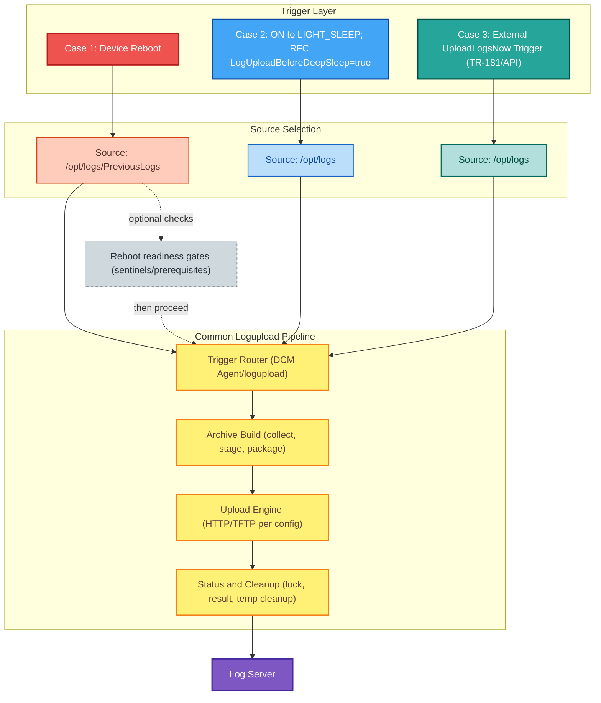

# Log Upload Behavior in the RDKE Stack

> **Explore mode document** — Researched from codebase and GitHub (rdkcentral/dcm-agent,
> rdkcentral/rdkservices, rdkcentral/reboot-manager, rdkcentral/telemetry, rdkcentral/iarmmgrs).
> Date: 2026-05-20.

---

## Purpose

This folder documents the full behavioral picture of log upload across the RDKE device stack: who
triggers it, what it does, what events it emits, which other components depend on its
outputs, and how boot-time ordering is (or isn't) enforced.

---

## RDK-C (Camera) Additions

On RDK-C camera platforms (sysvinit; e.g. XHC1), the DCM Agent runs as the native `dcmd`
daemon with an RDK-C-specific behavior layered onto the pipeline below:

- **Scheduled log collection** (`DCM_SCHEDULED_LOG_COLLECT`) — RDK-C cameras have no external
  batcher / Maintenance Manager, so with `DCM_SCHEDULED_LOG_COLLECT=true` in
  `/etc/device.properties` the DCM strategy's `dcm_setup` stages the current `/opt/logs` tree
  into `DCM_LOG_PATH` (via `copy_files_to_dcm_path`) before the scheduled upload, so the daily
  archive carries current logs. Default **off** on STB/broadband (sources below supply the logs
  externally).

---
## RDKE Log Upload Support


---

## High-Level Ecosystem Map

```
┌──────────────────────────────────────────────────────────────────────────────┐
│                        LOG UPLOAD ECOSYSTEM — RDKE                           │
│                                                                              │
│  TRIGGER SOURCES                CORE ENGINE          DOWNSTREAM              │
│  ─────────────────              ───────────          ──────────              │
│                                                                              │
│  dcm-agent daemon               ┌─────────────┐     IARM bus events         │
│  (XConf schedule) ──────────── ►│             │──►  MAINT_LOGUPLOAD_*        │
│                                 │ uploadstblogs│                             │
│  MaintenanceManager             │ (dcm-agent) │──►  T2 telemetry markers    │
│  (Thunder plugin) ──────────── ►│             │     SYST_INFO_lu_success    │
│                                 │  lib + bin  │                             │
│  SystemServices                 │ "logupload" │──►  Cloud endpoint          │
│  UploadLogsNow ─────────────── ►│             │     (HTTPS/mTLS)            │
│                                 └─────────────┘                             │
│  SystemServices                       ▲               Status files          │
│  LogUploadBeforeDeepSleep ──────────┘│     /tmp/logUploadStatus.txt         │
│                                      │               /tmp/.log-upload.lock  │
│  Post-reboot sequence:               │                                      │
│  backup_logs                         │                                      │
│    └─► reboot-manager/helper ────────┘                                      │
│    └─► telemetry2_0 ─────────────────┘                                      │
│                                                                              │
│  CONFIGURATION SOURCES                                                       │
│  XConf → DCM settings file    RFC/TR-181 parameters    /etc/device.properties│
│                                                                              │
└──────────────────────────────────────────────────────────────────────────────┘
```

---

## Document Index

| File | What It Covers |
|------|----------------|
| [callers-and-triggers.md](callers-and-triggers.md) | Every code path that initiates a log upload — who calls what, with what parameters |
| [consumers-and-events.md](consumers-and-events.md) | IARM/RBUS events emitted by log upload and which components listen |
| [boot-sequence.md](boot-sequence.md) | Boot-time ordering of backup_logs → reboot-manager → telemetry2_0 → uploadstblogs |
| [repository-map.md](repository-map.md) | All repos involved, their roles, key files, and interface contracts |

---

## Core Engine: `uploadstblogs`

`uploadstblogs` is simultaneously:
- a shared library (`libuploadstblogs.la`) callable from C code
- a standalone binary (`logupload`) callable from scripts or systemd

**Entry points:**

```c
// Preferred API for C callers (dcm-agent daemon)
int uploadstblogs_run(const UploadSTBLogsParams* params);

// Legacy argc/argv entry (compatible with shell script calling conventions)
int uploadstblogs_execute(int argc, char** argv);
```

**Trigger types recognised at runtime:**

| Value | String arg | Set by |
|-------|-----------|--------|
| `TRIGGER_SCHEDULED` | `"cron"` | DCM scheduler callback |
| `TRIGGER_ONDEMAND` | `"ondemand"` | UploadLogsNow, on-demand paths |
| `TRIGGER_MANUAL` | `"manual"` | Manual invocation |
| `TRIGGER_REBOOT` | `"reboot"` | Post-reboot boot sequence |
| `TRIGGER_MEMCAPTURE` | `"MEMCAPTURE"` | Memory capture event |

---

## Key Signal Files (Runtime Coordination)

These temporary files are the inter-process signaling mechanism between boot-time
components. All are in `/tmp/`.

| File | Written by | Read by | Meaning |
|------|-----------|---------|---------|
| `/tmp/.backup_logs_done` | `backup_logs` | `reboot-manager/reboot-helper`, `telemetry2_0`, `uploadstblogs` | Previous logs are safely archived |
| `/tmp/Update_rebootInfo_invoked` | `reboot-manager/reboot-reason-fetcher` | `uploadstblogs` | Reboot reason metadata is ready |
| `/tmp/.telemetry_prevlogs_done` | `telemetry2_0` | `uploadstblogs` | Telemetry has scanned PreviousLogs |
| `stt_received` (RBUS or file) | Network/STT service | `reboot-manager/reboot-helper`, `uploadstblogs` | STT (Set Top Type) identity received |
| `/tmp/.log-upload.lock` | `uploadstblogs` (flock) | `uploadstblogs` | Single-instance guard |
| `/tmp/logUploadStatus.txt` | `uploadstblogs` (UploadLogsNow path) | UI/apps querying status | Human-readable status string |

---

## Quick Reference: Trigger Paths

```
XConf schedule
    └─► dcm-agent scheduler fires DCM_LOGUPLOAD_SCHED
            └─► uploadstblogs_run() [TRIGGER_SCHEDULED]

Maintenance window
    └─► MaintenanceManager (Thunder) runs task_execution_thread
            └─► system("/lib/rdk/Start_uploadSTBLogs.sh")  [TRIGGER_SCHEDULED]

On-demand (app/UI)
    └─► org.rdk.SystemServices.uploadLogs (Thunder JSON-RPC)
            └─► logUploadAsync() → fork+execve uploadSTBLogs.sh  [DCM_FLAG=1]
                  or
            └─► uploadstblogs uploadlogsnow  [TRIGGER_ONDEMAND]

Deep sleep pre-upload
    └─► SystemServices LogUploadBeforeDeepSleep()
            └─► RFC flag check → system(uploadSTBLogs.sh) [TRIGGER_ONDEMAND]

Post-reboot upload
    └─► boot: backup_logs → writes /tmp/.backup_logs_done
            └─► reboot-manager/reboot-helper → polls .backup_logs_done + stt_received
                    └─► writes /tmp/Update_rebootInfo_invoked
                └─► telemetry2_0 → polls .backup_logs_done → scans PreviousLogs
                        └─► writes /tmp/.telemetry_prevlogs_done
            └─► uploadstblogs reboot_setup()
                    └─► polls all 3 files (120s timeout, CLOCK_MONOTONIC)
                            └─► executes upload [TRIGGER_REBOOT]
```
