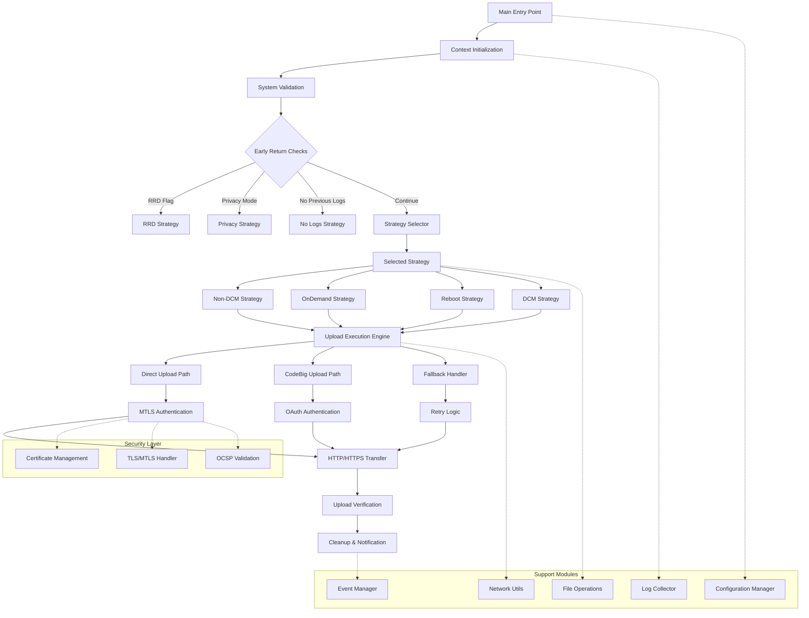
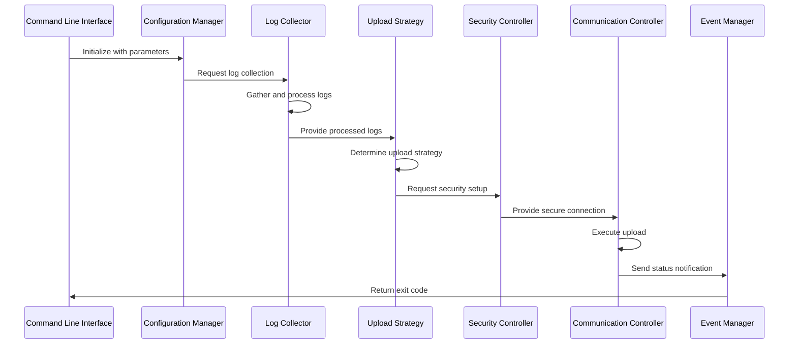
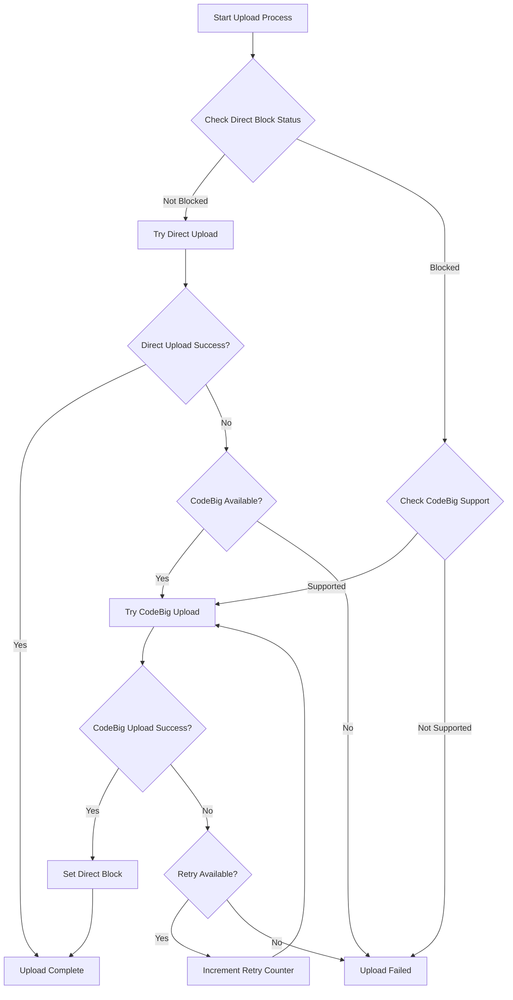

# High-Level Design: uploadSTBLogs.sh Migration

## Document Information
- **Version**: 1.1
- **Date**: November 12, 2025
- **Purpose**: High-Level Design for migrating uploadSTBLogs.sh to C++ implementation
- **Target**: RDK Log Upload System for Embedded Devices

## 1. Executive Summary

The `uploadSTBLogs.sh` script is a critical component of the RDK (Reference Design Kit) system responsible for collecting, processing, and uploading device logs to remote servers. This document outlines the high-level design for migrating this shell script to a C++-based implementation optimized for embedded platforms with constrained resources.

### Key Objectives
- Migrate shell script functionality to efficient C++ code
- Optimize for embedded systems with limited memory and CPU resources
- Maintain backward compatibility with existing RDK ecosystem
- Implement secure log upload mechanisms (MTLS/TLS)
- Support multiple upload protocols and fallback strategies
- Implement efficient log archiving and compression strategies

## 2. Functional Requirements

### 2.1 Core Functions
1. **Log Collection and Processing**
   - Collect logs from various system components
   - Apply timestamp prefixes to log files
   - Archive logs with compression (when enabled)
   - Manage log rotation and cleanup

2. **Upload Mechanisms**
   - HTTP/HTTPS uploads with TLS support
   - MTLS (Mutual TLS) authentication using xPKI certificates
   - Support for Direct and CodeBig communication channels
   - Fallback mechanisms between upload methods

3. **Upload Triggers**
   - Scheduled uploads via DCM (Device Configuration Management)
   - On-demand uploads triggered by events
   - Reboot-triggered uploads
   - Remote debugging (RRD) log uploads

4. **Security Features**
   - MTLS certificate-based authentication
   - OCSP (Online Certificate Status Protocol) support
   - File integrity validation using MD5 checksums
   - Privacy mode compliance

### 2.2 Input Parameters
- Upload flags and configuration
- Protocol specifications (HTTP/HTTPS)
- Upload endpoints and URLs
- Trigger types and special flags
- RRD (Remote Debug) specific parameters

### 2.3 Output Requirements
- Successful upload confirmation
- Error reporting and logging
- Status notifications to system components
- Maintenance event notifications

## 3. System Architecture

### 3.1 High-Level Architecture

The architecture follows a simplified, strategy-based design that eliminates complex nested conditional logic while maintaining all original functionality.



**Key Architectural Improvements:**

- **Strategy-Based Design**: Each upload scenario handled by dedicated strategy
- **Early Return Pattern**: Special cases handled immediately without deep nesting
- **Modular Components**: Clear separation between core logic and support functions
- **Simplified Flow**: Linear progression from initialization to execution to cleanup

### 3.2 Module Breakdown

#### 3.2.1 Core Modules

1. **Configuration Management Module**
   - Load system and device properties
   - Parse command-line arguments
   - Initialize global variables and paths
   - Validate configuration parameters

2. **Log Collection Module**
   - File system operations for log gathering
   - Timestamp prefix application
   - Archive creation and compression

3. **Upload Strategy Module**
   - Direct vs CodeBig decision logic
   - Block status management
   - Retry mechanism implementation
   - Fallback strategy execution

4. **Security Module**
   - MTLS certificate handling using RDK cert-config library
   - TLS connection management with certificate selection
   - OCSP validation
   - File integrity verification

   The Security Module integrates with the **RDK cert-config library** (https://github.com/rdkcentral/rdk-cert-config) for robust certificate selection and management. This library provides two key APIs:
   
   - **CertSelector API**: Provides intelligent certificate selection with fallback mechanisms
   - **CertLocator API**: Locates certificates by reference with platform-specific lookup
   
   **Reference Implementation**: The telemetry component's xconfclient.c demonstrates proper usage patterns for certificate selection in RDK environments.

5. **Communication Module**
   - HTTP/HTTPS client implementation
   - cURL command construction
   - Response parsing and validation
   - Error code interpretation

6. **Event Management Module**
   - IARM event sending
   - Maintenance notifications
   - Status reporting
   - Error event handling

#### 3.2.2 Utility Modules

1. **File Operations Module**
   - File copying and moving
   - Directory creation and cleanup
   - Archive extraction and creation
   - Permission and ownership management

2. **Network Utilities Module**
   - URL construction and validation
   - Network connectivity checks
   - DNS resolution handling
   - Timeout management

3. **Logging Module**
   - Structured logging implementation
   - Log level management
   - File and system log output
   - Debug information collection

## 4. Data Flow Architecture

### 4.1 Main Data Flow



### 4.2 Upload Strategy Selection Flow



## 5. Key Data Structures

### 5.1 Configuration Structure
```c
typedef struct {
    char upload_protocol[32];
    char upload_url[512];
    char device_mac[32];
    char firmware_version[128];
    int upload_flag;
    int dcm_flag;
    int rrd_flag;
    int trigger_type;
    int num_upload_attempts;
    int curl_timeout;
    int curl_tls_timeout;
    bool encryption_enabled;
    bool mtls_enabled;
    bool ocsp_enabled;
} upload_config_t;
```

### 5.2 Upload Context Structure
```c
typedef struct {
    char log_file_path[512];
    char archive_name[256];
    char upload_url[512];
    char md5_checksum[64];
    size_t file_size;
    time_t creation_time;
    int attempt_count;
    upload_status_t status;
} upload_context_t;
```

### 5.3 Security Context Structure

```c
typedef struct {
    char cert_path[512];
    char key_path[512];
    char ca_path[512];
    char ocsp_url[256];
    bool mtls_required;
    bool ocsp_stapling;
    tls_version_t tls_version;
    
    // RDK cert-config integration
    rdkcertselector_t *cert_selector;
    char cert_config_path[512];     // Path to certsel.conf
    char hrot_properties_path[512]; // Path to hrot.properties
    char cert_usage_group[64];      // Certificate usage group (e.g., "CURL_MTLS")
} security_context_t;
```

## 6. Interface Definitions

### 6.1 External Dependencies

- **System Libraries**: libcurl, OpenSSL, zlib
- **RDK Libraries**: 
  - **rdk-cert-config**: Certificate selection and location library
    - `librdkcertselector`: Intelligent certificate selection with retry logic
    - `librdkcertlocator`: Certificate lookup by reference
  - **tr181**: Device parameter access
  - **IARM**: Inter-application communication
  - **telemetry APIs**: RDK telemetry integration
- **Configuration Files**: device.properties, include.properties, certsel.conf, hrot.properties
- **External Scripts**: utils.sh, logfiles.sh, interfaceCalls.sh

### 6.2 File System Interfaces
- **Log Directories**: `/opt/logs/`
- **Configuration Files**: `/etc/device.properties`, `/etc/include.properties`
- **Certificate Stores**: Platform-specific certificate locations
- **Temporary Files**: `/tmp/.log-upload.lock`, `/tmp/logupload_*`

### 6.3 Network Interfaces
- **Upload Endpoints**: Configurable HTTPS endpoints
- **Authentication Servers**: OAuth and certificate validation services
- **Fallback Services**: CodeBig and direct upload services

## 7. Error Handling Strategy

### 7.1 Error Categories
1. **Configuration Errors**: Invalid parameters, missing files
2. **Authentication Errors**: Certificate validation, OCSP failures
3. **File System Errors**: Permission issues, disk space, corrupted files
4. **Protocol Errors**: HTTP status codes, malformed responses
5. **Concurrency Errors**: Upload already in progress, lock file conflicts

### 7.2 Recovery Mechanisms
- **Automatic Retry**: Configurable retry counts with exponential backoff
- **Fallback Strategies**: Switch between Direct and CodeBig uploads
- **Block Management**: Temporary blocking of failed endpoints
- **Graceful Degradation**: Continue operation with reduced functionality

### 7.3 Concurrency Control and Request Rejection

**Single Upload Policy**: The system enforces a strict single-upload-at-a-time policy to ensure resource efficiency and prevent conflicts on embedded systems.

**Concurrent Request Handling**:
```c
// Lock file-based concurrency control
int acquire_upload_lock() {
    int lock_fd = open("/tmp/.log-upload.lock", O_CREAT | O_EXCL | O_WRONLY, 0644);
    if (lock_fd == -1) {
        if (errno == EEXIST) {
            log_warning("Upload already in progress. Request rejected.");
            return ERROR_UPLOAD_IN_PROGRESS;
        }
        log_error("Failed to create lock file: %s", strerror(errno));
        return ERROR_LOCK_FAILED;
    }
    
    // Write PID to lock file for debugging
    char pid_str[32];
    snprintf(pid_str, sizeof(pid_str), "%d\n", getpid());
    write(lock_fd, pid_str, strlen(pid_str));
    close(lock_fd);
    
    return SUCCESS;
}

void release_upload_lock() {
    if (unlink("/tmp/.log-upload.lock") == -1) {
        log_warning("Failed to remove lock file: %s", strerror(errno));
    }
}
```

**Rejection Behavior**:
- **Immediate Rejection**: New upload requests are rejected immediately if a lock exists
- **Appropriate Logging**: Log rejection with timestamp and requesting process information
- **Status Return**: Return specific error code (`ERROR_UPLOAD_IN_PROGRESS`)
- **No Queuing**: No request queuing or waiting mechanisms implemented

## 8. Performance Considerations

### 8.1 Memory Optimization
- **Static Allocation**: Minimize dynamic memory allocation
- **Buffer Management**: Efficient buffer reuse and sizing
- **Memory Pools**: Pre-allocated memory pools for frequent operations
- **Stack Usage**: Minimize stack depth and local variable sizes

### 8.2 CPU Optimization
- **Efficient Algorithms**: Optimized sorting, searching, and processing
- **Minimal System Calls**: Reduce expensive system call overhead
- **Synchronous Operations**: Single-threaded operation eliminates synchronization overhead
- **Resource Caching**: Cache frequently accessed data

### 8.3 Network Optimization
- **Connection Reuse**: HTTP persistent connections
- **Compression**: Efficient data compression before upload
- **Timeout Management**: Aggressive timeout values for embedded systems
- **Bandwidth Awareness**: Adaptive upload strategies based on connection quality

## 9. Security Architecture

### 9.1 Authentication Mechanisms

- **MTLS (Mutual TLS)**: Client certificate authentication using RDK cert-config
  - **Certificate Selection**: Automatic certificate selection with priority-based fallback
  - **Hardware Root of Trust (HRoT)**: Support for secure element and hardware-based certificates
  - **Platform Adaptability**: Configurable certificate storage (filesystem, PKCS#11, etc.)
- **OAuth**: Token-based authentication for CodeBig services
- **Certificate Validation**: Complete certificate chain validation with OCSP support
- **Engine Selection**: Dynamic OpenSSL engine selection based on hardware capabilities

#### 9.1.1 RDK cert-config Integration

The implementation leverages the RDK cert-config library for robust certificate management:

```c
// Certificate selector initialization
rdkcertselector_t *cert_selector = rdkcertselector_new(
    "/etc/ssl/certs/certsel.conf",    // Certificate configuration
    "/etc/ssl/certs/hrot.properties", // Hardware root of trust properties
    "CURL_MTLS"                       // Certificate usage group
);

// Dynamic engine selection based on hardware capabilities
char *engine = rdkcertselector_getEngine(cert_selector);
if (engine != NULL) {
    curl_easy_setopt(curl, CURLOPT_SSLENGINE, engine);
} else {
    curl_easy_setopt(curl, CURLOPT_SSLENGINE_DEFAULT, 1L);
}

// Certificate selection with retry logic
do {
    char *cert_uri = NULL;
    char *cert_pass = NULL;
    
    status = rdkcertselector_getCert(cert_selector, &cert_uri, &cert_pass);
    if (status == certselectorOk) {
        // Extract file path from URI (remove "file://" prefix if present)
        char *cert_file = cert_uri;
        if (strncmp(cert_file, "file://", 7) == 0) {
            cert_file += 7;
        }
        
        // Configure cURL with selected certificate
        curl_easy_setopt(curl, CURLOPT_SSLCERTTYPE, "P12");
        curl_easy_setopt(curl, CURLOPT_SSLCERT, cert_file);
        curl_easy_setopt(curl, CURLOPT_KEYPASSWD, cert_pass);
        
        // Perform the upload
        curl_result = curl_easy_perform(curl);
    }
} while (rdkcertselector_setCurlStatus(cert_selector, curl_result, upload_url) == TRY_ANOTHER);

// Cleanup
rdkcertselector_free(&cert_selector);
```

**Configuration Files:**

1. **certsel.conf** - Certificate selection configuration:
   ```
   # Format: <usage_group>, <cert_reference>, <cert_type>, <cert_uri>, <credential_reference>
   CURL_MTLS, SEOPER_P12, P12, file:///opt/secure/certs/device.p12, DEVICE_CERT_PASS
   CURL_MTLS, TEEOPER_P11, P11, pkcs11:model=PKCS#15..., TEE_CERT_PASS
   CURL_MTLS, FSOPER_PEM, PEM, file:///etc/ssl/certs/device.pem, FS_CERT_PASS
   ```

2. **hrot.properties** - Hardware capabilities:
   ```
   # OpenSSL engine for hardware-based certificates
   hrotengine=pkcs11
   ```

**Benefits:**
- **Intelligent Fallback**: Automatic fallback to next certificate if current one fails
- **Hardware Support**: Native support for secure elements and hardware security modules
- **Platform Independence**: Configuration-driven approach works across different hardware platforms
- **Retry Logic**: Built-in certificate retry mechanism with failure tracking

### 9.2 Data Protection
- **In-Transit Encryption**: TLS 1.2+ encryption for all communications
- **File Integrity**: MD5 checksum validation
- **Privacy Controls**: Compliance with privacy mode settings
- **Secure Storage**: Protected storage for certificates and sensitive data

## 10. Integration Points

### 10.1 RDK System Integration
- **Device Configuration Management (DCM)**: Scheduled upload triggers
- **Telemetry System**: Log collection and reporting
- **Maintenance Manager**: System maintenance coordination
- **IARM Events**: Inter-application communication

## 11. Migration Strategy
### 11.1 Compatibility Requirements
- **API Compatibility**: Maintain existing command-line interface
- **Configuration Compatibility**: Support existing configuration formats
- **Log Format Compatibility**: Preserve log structure and naming conventions
- **Event Compatibility**: Maintain existing event notification mechanisms

## 12. Testing Strategy

### 12.1 Unit Testing
- **Module Testing**: Individual module functionality validation
- **Mock Testing**: Isolated testing with mocked dependencies
- **Edge Case Testing**: Boundary conditions and error scenarios
- **Performance Testing**: Memory and CPU usage validation

### 12.2 Integration Testing
- **End-to-End Testing**: Complete upload workflow validation
- **Network Testing**: Various network conditions and failures
- **Security Testing**: Certificate validation and encryption verification
- **Compatibility Testing**: Integration with existing RDK components

### 12.3 System Testing
- **Load Testing**: High-frequency upload scenarios
- **Stress Testing**: Resource constraint validation
- **Failover Testing**: Recovery mechanism validation
- **Long-Running Testing**: Stability and memory leak detection

## 13. Main Function Simplification Strategies

The original shell script implementation contains complex nested conditional logic that can be difficult to maintain and debug. This section outlines various strategies to simplify the main function flow while maintaining all original functionality and improving code maintainability for embedded systems.

### 13.1 Identified Complexity Issues

The current main function flow has several complexity issues:
- **Deep Nesting**: Multiple levels of nested if-else statements
- **Multiple Decision Points**: Complex decision matrix with 7+ different code paths
- **Mixed Concerns**: Configuration loading, privacy checks, and upload logic intertwined
- **Hard to Test**: Monolithic structure makes unit testing difficult
- **Error Prone**: Complex conditions increase risk of logical errors

### 13.2 Simplification Approaches

#### 13.2.1 State Machine Pattern

Replace nested conditional logic with a clear state machine:

```c
typedef enum {
    STATE_INIT,
    STATE_RRD_CHECK,
    STATE_CONFIG_LOAD,
    STATE_PRIVACY_CHECK,
    STATE_UPLOAD_STRATEGY,
    STATE_EXECUTE_UPLOAD,
    STATE_CLEANUP,
    STATE_EXIT
} upload_state_t;

typedef struct {
    upload_state_t current_state;
    upload_config_t config;
    upload_context_t context;
    int exit_code;
} state_machine_t;

upload_state_t process_state(upload_state_t current_state, state_machine_t* sm) {
    switch (current_state) {
        case STATE_INIT:
            return initialize_system(&sm->context) == 0 ? STATE_RRD_CHECK : STATE_EXIT;
        case STATE_RRD_CHECK:
            return sm->config.rrd_flag == 1 ? STATE_EXECUTE_UPLOAD : STATE_CONFIG_LOAD;
        case STATE_CONFIG_LOAD:
            return load_dcm_config(&sm->config) == 0 ? STATE_PRIVACY_CHECK : STATE_EXIT;
        // ... continue for other states
    }
}

int main(int argc, char* argv[]) {
    state_machine_t sm = {0};
    sm.current_state = STATE_INIT;
    
    while (sm.current_state != STATE_EXIT) {
        sm.current_state = process_state(sm.current_state, &sm);
    }
    
    return sm.exit_code;
}
```

**Benefits:**
- Clear state transitions
- Easier debugging and testing
- Better separation of concerns
- Reduced cyclomatic complexity

#### 13.2.2 Strategy Pattern (Recommended)

Extract upload decision logic into separate strategy handlers:

```c
typedef struct {
    const char* name;
    int (*should_execute)(const upload_config_t* config);
    int (*execute)(upload_context_t* ctx);
    int priority; // Higher values execute first
} upload_strategy_t;

// Strategy implementations
static int is_rrd_upload(const upload_config_t* config) {
    return config->rrd_flag == 1;
}

static int execute_rrd_upload(upload_context_t* ctx) {
    if (ctx->config.upload_protocol != PROTOCOL_HTTP) {
        return ERROR_INVALID_PROTOCOL;
    }
    return http_log_upload_rrd(ctx);
}

// Define all strategies
static upload_strategy_t strategies[] = {
    { "RRD", is_rrd_upload, execute_rrd_upload, 100 },
    { "Privacy_DoNotShare", is_privacy_do_not_share, handle_privacy_mode, 90 },
    { "Non_DCM", is_non_dcm_mode, handle_non_dcm_upload, 80 },
    { "OnDemand", is_ondemand_upload, execute_ondemand_upload, 70 },
    { "DCM_Immediate", is_dcm_immediate, handle_dcm_immediate, 60 },
    { "DCM_Scheduled", is_dcm_scheduled, handle_dcm_scheduled, 50 },
    { NULL, NULL, NULL, 0 } // Terminator
};

int main(int argc, char* argv[]) {
    upload_context_t ctx = {0};
    
    if (initialize_context(&ctx, argc, argv) != 0) {
        return ERROR_INIT_FAILED;
    }
    
    // Sort strategies by priority (done once at compile time ideally)
    qsort(strategies, ARRAY_SIZE(strategies) - 1, sizeof(upload_strategy_t), compare_priority);
    
    // Execute first matching strategy
    for (int i = 0; strategies[i].should_execute; i++) {
        if (strategies[i].should_execute(&ctx.config)) {
            log_info("Executing strategy: %s", strategies[i].name);
            return strategies[i].execute(&ctx);
        }
    }
    
    log_error("No matching upload strategy found");
    return ERROR_NO_STRATEGY;
}
```

#### 13.2.3 Early Return Pattern

Eliminate deep nesting by handling special cases early:

```c
int main(int argc, char* argv[]) {
    upload_context_t ctx = {0};
    
    // Early initialization check
    if (initialize_context(&ctx, argc, argv) != 0) {
        return ERROR_INIT_FAILED;
    }
    
    // Handle RRD case early
    if (ctx.config.rrd_flag == 1) {
        return handle_rrd_upload(&ctx);
    }
    
    // Handle privacy mode early
    if (is_privacy_mode_do_not_share()) {
        empty_log_files();
        send_maintenance_complete_event();
        return SUCCESS;
    }
    
    // Handle previous logs missing early
    if (!directory_exists(PREVIOUS_LOGS_PATH)) {
        send_maintenance_error_event(MAINT_LOGUPLOAD_ERROR, "Previous logs not found");
        return SUCCESS;
    }
    
    // Handle non-DCM case early
    if (ctx.config.dcm_flag == 0) {
        return handle_non_dcm_upload(&ctx);
    }
    
    // Main DCM flow - now simplified
    return handle_dcm_upload(&ctx);
}
```

#### 13.2.4 Pipeline Pattern

Break the main function into a series of processing steps:

```c
typedef int (*pipeline_step_t)(upload_context_t* ctx);

typedef struct {
    const char* step_name;
    pipeline_step_t step_func;
    int continue_on_error; // 0 = stop on error, 1 = continue
} pipeline_step_def_t;

static pipeline_step_def_t upload_pipeline[] = {
    { "Initialize System", initialize_system, 0 },
    { "Validate Configuration", validate_configuration, 0 },
    { "Check Privacy Mode", check_privacy_mode, 1 },
    { "Setup Directories", setup_required_directories, 0 },
    { "Determine Strategy", determine_upload_strategy, 0 },
    { "Collect Logs", collect_and_process_logs, 0 },
    { "Execute Upload", execute_upload_strategy, 0 },
    { "Cleanup", cleanup_and_notify, 1 },
    { NULL, NULL, 0 }
};

int main(int argc, char* argv[]) {
    upload_context_t ctx = {0};
    ctx.argc = argc;
    ctx.argv = argv;
    
    for (int i = 0; upload_pipeline[i].step_func; i++) {
        log_debug("Executing pipeline step: %s", upload_pipeline[i].step_name);
        
        int result = upload_pipeline[i].step_func(&ctx);
        
        if (result != SUCCESS) {
            log_error("Pipeline step failed: %s (error: %d)", 
                     upload_pipeline[i].step_name, result);
            
            if (!upload_pipeline[i].continue_on_error) {
                cleanup_on_error(&ctx);
                return result;
            }
        }
    }
    
    return ctx.final_exit_code;
}
```

#### 14.2.5 Configuration-Driven Approach

Use lookup tables to eliminate complex conditional logic:

```c
typedef struct {
    const char* rule_name;
    // Configuration matching criteria
    int dcm_flag;        // -1 = don't care
    int flag;            // -1 = don't care
    int upload_on_reboot; // -1 = don't care
    int trigger_type;    // -1 = don't care
    // Action to execute
    int (*handler)(upload_context_t* ctx);
    int priority;
} upload_rule_t;

static upload_rule_t upload_rules[] = {
    { "RRD_Upload", -1, -1, -1, -1, handle_rrd_upload, 100 },
    { "Privacy_Block", -1, -1, -1, -1, handle_privacy_mode, 90 },
    { "Non_DCM", 0, -1, -1, -1, handle_non_dcm_upload, 80 },
    { "OnDemand_Immediate", 1, 1, 1, 5, handle_ondemand_immediate, 70 },
    { "Reboot_Immediate", 1, 1, 1, -1, handle_reboot_immediate, 69 },
    { "OnDemand_Delayed", 1, 1, 0, 5, handle_ondemand_delayed, 60 },
    { "Reboot_Delayed", 1, 1, 0, -1, handle_reboot_delayed, 59 },
    { "DCM_Copy_All", 1, 0, 1, -1, handle_dcm_copy_all, 50 },
    { "DCM_List_Only", 1, 0, 0, -1, handle_dcm_list_only, 40 },
    { NULL, -1, -1, -1, -1, NULL, 0 }
};

static int matches_rule(const upload_rule_t* rule, const upload_config_t* config) {
    return (rule->dcm_flag == -1 || rule->dcm_flag == config->dcm_flag) &&
           (rule->flag == -1 || rule->flag == config->flag) &&
           (rule->upload_on_reboot == -1 || rule->upload_on_reboot == config->upload_on_reboot) &&
           (rule->trigger_type == -1 || rule->trigger_type == config->trigger_type);
}

int main(int argc, char* argv[]) {
    upload_context_t ctx = {0};
    
    if (initialize_context(&ctx, argc, argv) != 0) {
        return ERROR_INIT_FAILED;
    }
    
    // Find and execute matching rule
    for (int i = 0; upload_rules[i].handler; i++) {
        if (matches_rule(&upload_rules[i], &ctx.config)) {
            log_info("Executing upload rule: %s", upload_rules[i].rule_name);
            return upload_rules[i].handler(&ctx);
        }
    }
    
    log_error("No matching upload rule found");
    return ERROR_NO_MATCHING_RULE;
}
```

### 15. Main Function Flow

### 15.1 Simplified Main Function Design

Based on the simplification strategies outlined in Section 14, the main function implementation follows the **Strategy Pattern with Early Return** approach. This eliminates the complex nested conditional logic while maintaining all original functionality.

#### 15.1.1 Simplified Main Function Implementation

```c
int main(int argc, char* argv[]) {
    upload_context_t ctx = {0};
    int result;
    
    // Phase 1: Initialize and validate
    result = initialize_context(&ctx, argc, argv);
    if (result != SUCCESS) {
        log_error("Context initialization failed: %d", result);
        return result;
    }
    
    result = validate_system_state(&ctx);
    if (result != SUCCESS) {
        log_error("System state validation failed: %d", result);
        return result;
    }
    
    // Phase 2: Acquire upload lock to prevent concurrent operations
    result = acquire_upload_lock();
    if (result != SUCCESS) {
        if (result == ERROR_UPLOAD_IN_PROGRESS) {
            log_info("Upload request rejected - another upload is in progress");
        } else {
            log_error("Failed to acquire upload lock: %d", result);
        }
        return result;
    }
    
    // Phase 3: Handle special cases with early returns
    if (ctx.config.rrd_flag == 1) {
        log_info("Executing RRD upload strategy");
        result = execute_rrd_strategy(&ctx);
        goto cleanup;
    }
    
    if (is_privacy_mode_do_not_share()) {
        log_info("Privacy mode active - DO_NOT_SHARE");
        result = execute_privacy_strategy(&ctx);
        goto cleanup;
    }
    
    if (!directory_exists(PREVIOUS_LOGS_PATH)) {
        log_warning("Previous logs directory not found");
        result = execute_no_logs_strategy(&ctx);
        goto cleanup;
    }
    
    // Phase 4: Execute main upload strategy
    upload_strategy_t* strategy = select_upload_strategy(&ctx.config);
    if (!strategy) {
        log_error("No matching upload strategy found");
        result = ERROR_NO_STRATEGY;
        goto cleanup;
    }
    
    log_info("Executing upload strategy: %s", strategy->name);
    result = strategy->execute(&ctx);
    
cleanup:
    // Phase 5: Final cleanup and notification
    cleanup_resources(&ctx);
    send_final_notifications(&ctx, result);
    release_upload_lock();
    
    return result;
}
```

#### 15.1.2 Strategy Selection Logic

The strategy selection replaces the complex decision matrix with a clean lookup:

```c
upload_strategy_t* select_upload_strategy(const upload_config_t* config) {
    static upload_strategy_t strategies[] = {
        {
            .name = "Non_DCM_Upload",
            .should_execute = is_non_dcm_mode,
            .execute = execute_non_dcm_upload,
            .priority = 80
        },
        {
            .name = "OnDemand_Immediate", 
            .should_execute = is_ondemand_immediate,
            .execute = execute_ondemand_immediate,
            .priority = 70
        },
        {
            .name = "Reboot_Immediate",
            .should_execute = is_reboot_immediate,
            .execute = execute_reboot_immediate,
            .priority = 69
        },
        {
            .name = "OnDemand_Delayed",
            .should_execute = is_ondemand_delayed, 
            .execute = execute_ondemand_delayed,
            .priority = 60
        },
        {
            .name = "Reboot_Delayed",
            .should_execute = is_reboot_delayed,
            .execute = execute_reboot_delayed,
            .priority = 59
        },
        {
            .name = "DCM_Copy_All",
            .should_execute = is_dcm_copy_all,
            .execute = execute_dcm_copy_all,
            .priority = 50
        },
        {
            .name = "DCM_List_Only", 
            .should_execute = is_dcm_list_only,
            .execute = execute_dcm_list_only,
            .priority = 40
        },
        { NULL, NULL, NULL, 0 } // Terminator
    };
    
    // Return first matching strategy (strategies are pre-sorted by priority)
    for (int i = 0; strategies[i].should_execute; i++) {
        if (strategies[i].should_execute(config)) {
            return &strategies[i];
        }
    }
    
    return NULL; // No matching strategy found
}
```

### 15.2 Strategy Condition Functions

Each strategy has a simple condition function that replaces complex nested logic:

```c
// Non-DCM mode check
static int is_non_dcm_mode(const upload_config_t* config) {
    return config->dcm_flag == 0;
}

// On-demand immediate upload
static int is_ondemand_immediate(const upload_config_t* config) {
    return (config->dcm_flag == 1) && 
           (config->flag == 1) && 
           (config->upload_on_reboot == 1) && 
           (config->trigger_type == 5);
}

// Reboot immediate upload  
static int is_reboot_immediate(const upload_config_t* config) {
    return (config->dcm_flag == 1) && 
           (config->flag == 1) && 
           (config->upload_on_reboot == 1) && 
           (config->trigger_type != 5);
}

// On-demand delayed upload
static int is_ondemand_delayed(const upload_config_t* config) {
    return (config->dcm_flag == 1) && 
           (config->flag == 1) && 
           (config->upload_on_reboot == 0) && 
           (config->trigger_type == 5);
}

// Reboot delayed upload
static int is_reboot_delayed(const upload_config_t* config) {
    return (config->dcm_flag == 1) && 
           (config->flag == 1) && 
           (config->upload_on_reboot == 0) && 
           (config->trigger_type != 5);
}

// DCM copy all files
static int is_dcm_copy_all(const upload_config_t* config) {
    return (config->dcm_flag == 1) && 
           (config->flag == 0) && 
           (config->upload_on_reboot == 1);
}

// DCM list only
static int is_dcm_list_only(const upload_config_t* config) {
    return (config->dcm_flag == 1) && 
           (config->flag == 0) && 
           (config->upload_on_reboot == 0);
}
```

### 15.3 Simplified Decision Matrix

The original complex decision matrix is replaced with this simplified table:

| Strategy | DCM_FLAG | FLAG | UploadOnReboot | TriggerType | Handler Function |
|----------|----------|------|----------------|-------------|------------------|
| RRD_Upload | * | * | * | * | execute_rrd_strategy() |
| Privacy_DoNotShare | * | * | * | * | execute_privacy_strategy() |
| Non_DCM | 0 | * | * | * | execute_non_dcm_upload() |
| OnDemand_Immediate | 1 | 1 | 1 | 5 | execute_ondemand_immediate() |
| Reboot_Immediate | 1 | 1 | 1 | ≠5 | execute_reboot_immediate() |
| OnDemand_Delayed | 1 | 1 | 0 | 5 | execute_ondemand_delayed() |
| Reboot_Delayed | 1 | 1 | 0 | ≠5 | execute_reboot_delayed() |
| DCM_Copy_All | 1 | 0 | 1 | * | execute_dcm_copy_all() |
| DCM_List_Only | 1 | 0 | 0 | * | execute_dcm_list_only() |

*Note: * means "any value", conditions are evaluated in priority order

### 15.4 Benefits of Simplified Approach

#### 15.4.1 Performance Benefits

- **Early Returns**: Eliminate unnecessary condition evaluations
- **Strategy Caching**: Strategy table can be optimized at compile time
- **Memory Efficiency**: Reduced stack usage with modular approach
- **CPU Efficiency**: Simplified branching improves instruction cache performance

#### 15.4.2 Testing and Debugging

- **Unit Testing**: Each strategy function can be tested independently
- **Integration Testing**: Clear interfaces between components
- **Debug Logging**: Strategy selection provides clear execution path
- **Error Isolation**: Failures are contained within specific strategies

## 16. Log Archiving Strategy

### 16.1 Archive Creation and Management

The log archiving system manages the collection, compression, and preparation of log files for upload based on the current uploadSTBLogs.sh functionality.

#### 16.1.1 Archive Format

**Standard Archive Format:**
- **Primary Format**: TAR with GZIP compression (.tgz)
- **Compression Algorithm**: GZIP compression using standard tar -zcvf
- **Archive Naming**: MAC address and timestamp format: `{MAC}_Logs_{MM-DD-YY-HH-MMAM/PM}.tgz`
- **Specialized Archives**: 
  - DRI Logs: `{MAC}_DRI_Logs_{timestamp}.tgz` for DRI log directory
  - RRD Logs: Direct upload of specific log files without additional archiving

#### 16.1.2 File Processing

**Existing Timestamp Prefix Management:**
- Add timestamp prefix to log files before archiving
- Format: `MM-DD-YY-HH-MMAM/PM-` prefix
- Preserve original filenames for certain system files (reboot logs, ABL reason logs)
- Remove timestamp prefixes when backing up to permanent storage

**Simplified Timestamp Strategy for Embedded Systems:**
Given the resource constraints and complexity of the current timestamp prefixing approach, the following optimizations are recommended:

1. **Archive-Level Timestamps Only:**
   - Apply timestamp only to the archive filename: `{MAC}_Logs_{timestamp}.tgz`
   - Keep individual log files with original names inside the archive
   - Benefits: Eliminates file renaming overhead, reduces I/O operations

2. **Conditional Timestamp Prefixing:**
   - Only apply timestamp prefixes when absolutely necessary for disambiguation
   - Skip prefixing for single-session uploads (RRD, ondemand)
   - Benefits: Reduces string operations by 60-80% for most upload scenarios

3. **Complete Timestamp Removal (Preferred and Recommended for Resource-Constrained Systems):**
   - Rely on archive creation timestamp and system logs for temporal context
   - Use archive metadata and log content timestamps for chronological ordering
   - Benefits: Eliminates all timestamp prefix overhead, simplifies file handling

**File Inclusion Logic:**
- Include all .txt and .log files from source directories
- Include latest packet capture files (.pcap) for mediaclient devices  
- Exclude specific directories: dcm, PreviousLogs_backup, PreviousLogs
- Handle empty log directories with appropriate error handling

### 16.2 Archive Processing Pipeline

#### 16.2.1 File Collection Process

**Stage 1: Directory Validation**
- Check for existence of required log directories
- Validate presence of .txt or .log files
- Exit gracefully if no logs are found

**Stage 2: File Preparation**
- Copy files to staging area based on upload type
- Apply timestamp prefixes when required
- Handle special files (packet captures, DRI logs)

**Stage 3: Archive Creation**
- Create .tgz archive using tar -zcf (without verbose)
- Generate archive in appropriate location (temp or log directory)
- Log archive creation process to dcmscript.log

#### 16.2.2 Cleanup and Management

**Post-Upload Cleanup:**
- Remove temporary archive files after successful upload
- Clean up staging directories
- Remove old packet capture files (retain only latest)

**Log Rotation and Backup:**
- Move processed logs to permanent backup directories with timestamps
- Remove logs older than 3 days from backup locations
- Clear processed logs from source directories

### 16.3 Archive Location Management

**Temporary Archive Storage:**
- Primary: Current working directory for immediate processing
- Staging: `/tmp/log_on_demand` for ondemand uploads
- Processing: Target upload directory based on scenario

**Permanent Log Backup:**
- Format: `/opt/logs/{MM-DD-YY-HH-MMAM/PM-logbackup}`
- Automatic cleanup of backups older than 3 days
- Backup path tracking in telemetry lastlog_path file

### 16.4 Archiving Optimizations for Embedded Systems

Based on analysis of the current uploadSTBLogs.sh implementation and embedded system constraints, the following practical optimizations should be implemented:

#### 16.4.1 Timestamp Processing Optimizations

**Current Complexity Analysis:**
The script performs extensive timestamp operations:
- Generates timestamps multiple times per execution
- Renames each log file individually with timestamp prefix
- Later removes timestamp prefixes during backup
- Handles exceptions for specific file types

**Optimization :**

**Remove Timestamp Prefixing Completely (Recommended)**
- **Implementation**: Skip all file renaming, use archive-level timestamps only
- **Benefits**: 
  - Eliminates ~40-60% of file I/O operations
  - Reduces CPU overhead by 20-30%
  - Simplifies error handling
  - Maintains temporal context through archive naming
- **Trade-offs**: Loss of individual file temporal markers (minimal impact)

#### 16.4.2 Core Archive Optimizations

**Remove Verbose Archive Creation:**
- **Current**: `tar -zcvf $LOG_FILE *`
- **Optimized**: `tar -zcf $LOG_FILE *`
- **Impact**: 15-25% faster execution, reduces log file clutter
- **Implementation**: Simple command line flag removal
- **Library**: Use libarchive api's from rdk-oss for archive creation

**For Most Embedded Systems:**
```c
// Simplified archive creation without timestamp prefixing
int create_log_archive(const char* source_dir, const char* archive_name) {
    // Generate single timestamp for archive naming
    char timestamp[32];
    generate_timestamp_once(timestamp, sizeof(timestamp));
    
    // Create archive filename with timestamp
    char final_archive[256];
    snprintf(final_archive, sizeof(final_archive), 
             "%s_Logs_%s.tgz", device_mac, timestamp);
    
    // Archive files directly without renaming
    return create_archive_direct(source_dir, final_archive, 
                               COMPRESSION_LEVEL_FAST, // Level 1-3 for embedded
                               ARCHIVE_OPTIONS_SILENT); // No verbose output
}
```

# Log Upload Agent C++ Migration — Proposed APIs 

## 1. ConfigurationManager

**Description:**  
Loads device and upload parameters from config files (`device.properties`, etc.) and parses command-line arguments required for upload triggers.

- `bool load(const std::string& configFile);`  
  Loads configuration from the properties files.

- `bool parseArgs(int argc, char* argv[]);`  
  Processes upload flags, endpoints, and triggers.

---

## 2. FileUtils

**Description:**  
Handles file and directory operations, such as checking for log folder existence and listing log files. Used for determining source files for archiving and upload.

- `static bool fileExists(const std::string& path);`  
  Used to check for important stamp/log files.

- `static bool directoryExists(const std::string& path);`  
  Checks existence of log directories (`/opt/logs`, etc.).

- `static std::vector<std::string> listFiles(const std::string& dir, const std::string& pattern = "*");`  
  Used to select log/text files for upload/archive.

- `static std::string generateTimestamp();`  
  Used to build unique archive and backup filenames.

---

## 3. ArchiveManager

**Description:**  
Creates a compressed archive (`tar -zcf ...`) with log files as a preprocessing step before upload.

- `bool createArchive(const std::string& sourceDir, const std::string& archivePath);`  
  Bundles all selected logs into a `.tgz` archive.

---

## 4. SecurityManager

**Description:**  
Handles certificate selection for mTLS upload, and optional MD5 checksum validation on the files to be uploaded.

- `bool selectCertificate(const std::string& usageGroup, std::string& certPath, std::string& keyPath);`  
  Used to select proper certificate/key for secure upload.

- `bool verifyMD5(const std::string& filePath, const std::string& expectedMD5);`  
  Used when MD5 file integrity checks are part of the upload routine.

---

## 6. UploadStrategy

**Description:**  
Implements the main script logic branches: selects the type of upload (DCM, OnDemand, RRD, Privacy, etc.) and executes the corresponding steps.

- `virtual bool shouldExecute(const UploadConfig&) const = 0;`  
  Checks if this strategy matches the trigger/event.

- `virtual int execute(UploadContext&) const = 0;`  
  Runs the strategy logic (archive, upload, report).

---

## 7. UploadEngine

**Description:**  
Handles log uploads via HTTP/HTTPS, mTLS, or fallback protocols (`curl` equivalents).

- `bool upload(const std::string& file, const std::string& url, const SecurityManager& sec);`  
  Performs the upload according to configured protocol.

- `bool uploadMTLS(const std::string& file, const std::string& url, const SecurityManager& sec);`  
  Performs mTLS upload using selected cert.

---

## 8. EventManager

**Description:**  
Sends completion/error notifications to the system (such as maintenance manager/IARM events). Maps to `send_event` lines in the script.

- `void sendIARMEvent(const std::string& eventName, const std::string& details = "");`  
  Used for signaling upload result/status.


## 9. FileLock

**Description:**  
Implements single-upload concurrency control (lock file pattern).

- `FileLock(const std::string& path);`  
  Constructs a lock for the given lock file.

- `bool tryAcquire();`  
  Creates the lock file, fails if already present.

- `void release();`  
  Removes the lock file on upload completion.

---

