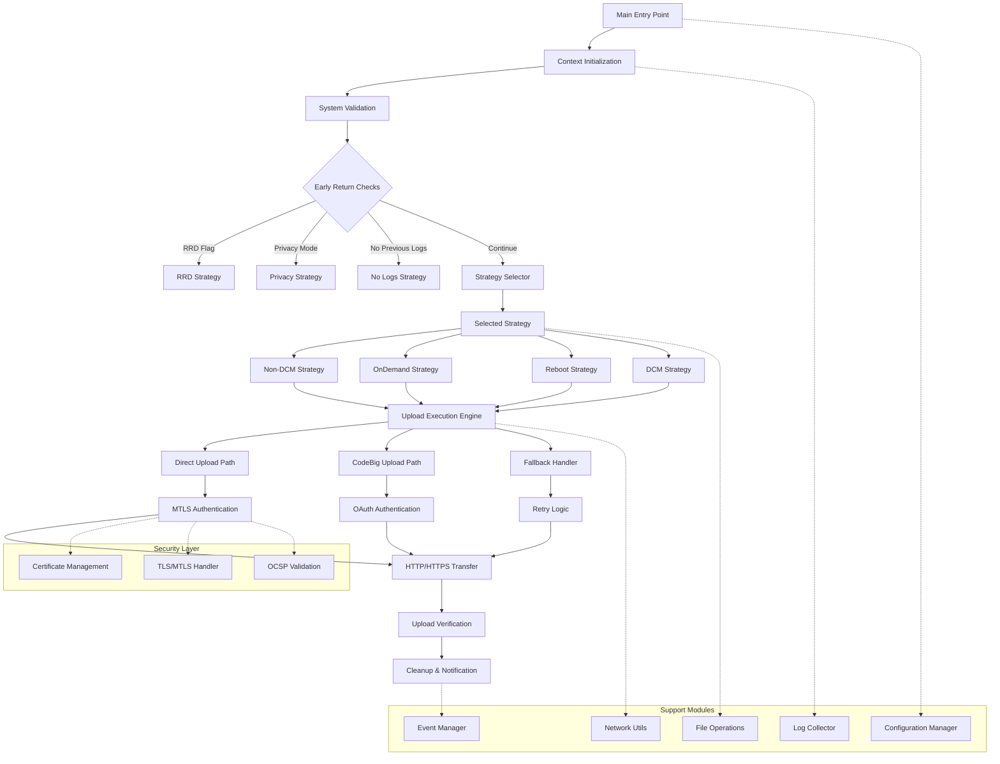
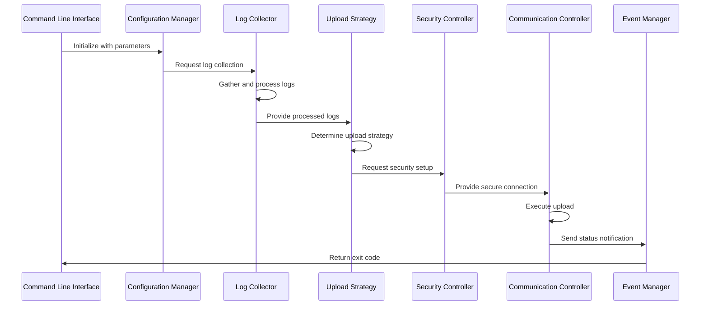
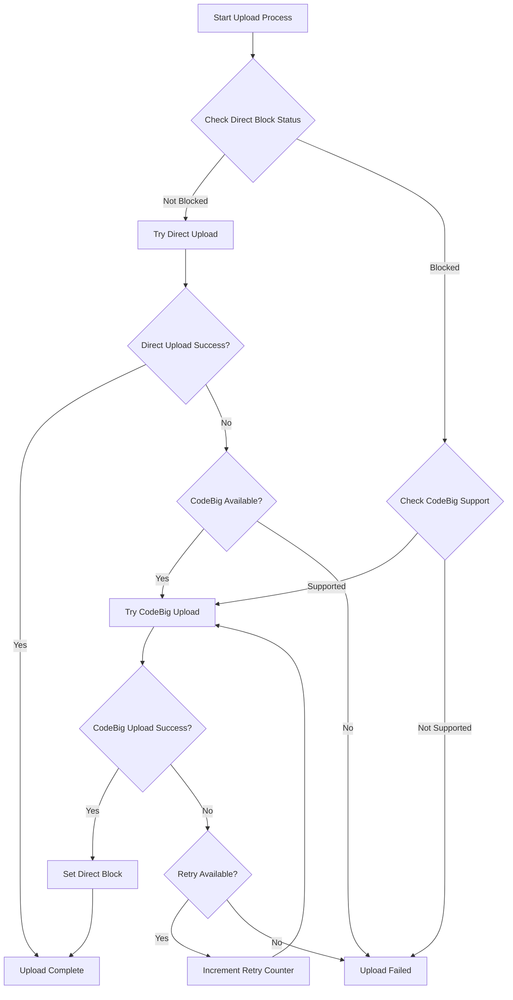

# High-Level Design: uploadSTBLogs.sh Migration

## Document Information
- **Version**: 1.1
- **Date**: November 12, 2025
- **Purpose**: High-Level Design for migrating uploadSTBLogs.sh to C++ implementation
- **Target**: RDK Log Upload System for Embedded Devices

## 1. Executive Summary

The `uploadSTBLogs.sh` script is a critical component of the RDK (Reference Design Kit) system responsible for collecting, processing, and uploading device logs to remote servers. This document outlines the high-level design for migrating this shell script to a C++-based implementation optimized for embedded platforms with constrained resources.

### Key Objectives
- Migrate shell script functionality to efficient C++ code
- Optimize for embedded systems with limited memory and CPU resources
- Maintain backward compatibility with existing RDK ecosystem
- Implement secure log upload mechanisms (MTLS/TLS)
- Support multiple upload protocols and fallback strategies
- Implement efficient log archiving and compression strategies

## 2. Functional Requirements

### 2.1 Core Functions
1. **Log Collection and Processing**
   - Collect logs from various system components
   - Apply timestamp prefixes to log files
   - Archive logs with compression (when enabled)
   - Manage log rotation and cleanup

2. **Upload Mechanisms**
   - HTTP/HTTPS uploads with TLS support
   - MTLS (Mutual TLS) authentication using xPKI certificates
   - Support for Direct and CodeBig communication channels
   - Fallback mechanisms between upload methods

3. **Upload Triggers**
   - Scheduled uploads via DCM (Device Configuration Management)
   - On-demand uploads triggered by events
   - Reboot-triggered uploads
   - Remote debugging (RRD) log uploads

4. **Security Features**
   - MTLS certificate-based authentication
   - OCSP (Online Certificate Status Protocol) support
   - File integrity validation using MD5 checksums
   - Privacy mode compliance

### 2.2 Input Parameters
- Upload flags and configuration
- Protocol specifications (HTTP/HTTPS)
- Upload endpoints and URLs
- Trigger types and special flags
- RRD (Remote Debug) specific parameters

### 2.3 Output Requirements
- Successful upload confirmation
- Error reporting and logging
- Status notifications to system components
- Maintenance event notifications

## 3. System Architecture

### 3.1 High-Level Architecture

The architecture follows a simplified, strategy-based design that eliminates complex nested conditional logic while maintaining all original functionality.



**Key Architectural Improvements:**

- **Strategy-Based Design**: Each upload scenario handled by dedicated strategy
- **Early Return Pattern**: Special cases handled immediately without deep nesting
- **Modular Components**: Clear separation between core logic and support functions
- **Simplified Flow**: Linear progression from initialization to execution to cleanup

### 3.2 Module Breakdown

#### 3.2.1 Core Modules

1. **Configuration Management Module**
   - Load system and device properties
   - Parse command-line arguments
   - Initialize global variables and paths
   - Validate configuration parameters

2. **Log Collection Module**
   - File system operations for log gathering
   - Timestamp prefix application
   - Archive creation and compression

3. **Upload Strategy Module**
   - Direct vs CodeBig decision logic
   - Block status management
   - Retry mechanism implementation
   - Fallback strategy execution

4. **Security Module**
   - MTLS certificate handling using RDK cert-config library
   - TLS connection management with certificate selection
   - OCSP validation
   - File integrity verification

   The Security Module integrates with the **RDK cert-config library** (https://github.com/rdkcentral/rdk-cert-config) for robust certificate selection and management. This library provides two key APIs:
   
   - **CertSelector API**: Provides intelligent certificate selection with fallback mechanisms
   - **CertLocator API**: Locates certificates by reference with platform-specific lookup
   
   **Reference Implementation**: The telemetry component's xconfclient.c demonstrates proper usage patterns for certificate selection in RDK environments.

5. **Communication Module**
   - HTTP/HTTPS client implementation
   - cURL command construction
   - Response parsing and validation
   - Error code interpretation

6. **Event Management Module**
   - IARM event sending
   - Maintenance notifications
   - Status reporting
   - Error event handling

#### 3.2.2 Utility Modules

1. **File Operations Module**
   - File copying and moving
   - Directory creation and cleanup
   - Archive extraction and creation
   - Permission and ownership management

2. **Network Utilities Module**
   - URL construction and validation
   - Network connectivity checks
   - DNS resolution handling
   - Timeout management

3. **Logging Module**
   - Structured logging implementation
   - Log level management
   - File and system log output
   - Debug information collection

## 4. Data Flow Architecture

### 4.1 Main Data Flow



### 4.2 Upload Strategy Selection Flow



## 5. Key Data Structures

### 5.1 Configuration Structure
```c
typedef struct {
    char upload_protocol[32];
    char upload_url[512];
    char device_mac[32];
    char firmware_version[128];
    int upload_flag;
    int dcm_flag;
    int rrd_flag;
    int trigger_type;
    int num_upload_attempts;
    int curl_timeout;
    int curl_tls_timeout;
    bool encryption_enabled;
    bool mtls_enabled;
    bool ocsp_enabled;
} upload_config_t;
```

### 5.2 Upload Context Structure
```c
typedef struct {
    char log_file_path[512];
    char archive_name[256];
    char upload_url[512];
    char md5_checksum[64];
    size_t file_size;
    time_t creation_time;
    int attempt_count;
    upload_status_t status;
} upload_context_t;
```

### 5.3 Security Context Structure

```c
typedef struct {
    char cert_path[512];
    char key_path[512];
    char ca_path[512];
    char ocsp_url[256];
    bool mtls_required;
    bool ocsp_stapling;
    tls_version_t tls_version;
    
    // RDK cert-config integration
    rdkcertselector_t *cert_selector;
    char cert_config_path[512];     // Path to certsel.conf
    char hrot_properties_path[512]; // Path to hrot.properties
    char cert_usage_group[64];      // Certificate usage group (e.g., "CURL_MTLS")
} security_context_t;
```

## 6. Interface Definitions

### 6.1 External Dependencies

- **System Libraries**: libcurl, OpenSSL, zlib
- **RDK Libraries**: 
  - **rdk-cert-config**: Certificate selection and location library
    - `librdkcertselector`: Intelligent certificate selection with retry logic
    - `librdkcertlocator`: Certificate lookup by reference
  - **tr181**: Device parameter access
  - **IARM**: Inter-application communication
  - **telemetry APIs**: RDK telemetry integration
- **Configuration Files**: device.properties, include.properties, certsel.conf, hrot.properties
- **External Scripts**: utils.sh, logfiles.sh, interfaceCalls.sh

### 6.2 File System Interfaces
- **Log Directories**: `/opt/logs/`
- **Configuration Files**: `/etc/device.properties`, `/etc/include.properties`
- **Certificate Stores**: Platform-specific certificate locations
- **Temporary Files**: `/tmp/.log-upload.lock`, `/tmp/logupload_*`

### 6.3 Network Interfaces
- **Upload Endpoints**: Configurable HTTPS endpoints
- **Authentication Servers**: OAuth and certificate validation services
- **Fallback Services**: CodeBig and direct upload services

## 7. Error Handling Strategy

### 7.1 Error Categories
1. **Configuration Errors**: Invalid parameters, missing files
2. **Authentication Errors**: Certificate validation, OCSP failures
3. **File System Errors**: Permission issues, disk space, corrupted files
4. **Protocol Errors**: HTTP status codes, malformed responses
5. **Concurrency Errors**: Upload already in progress, lock file conflicts

### 7.2 Recovery Mechanisms
- **Automatic Retry**: Configurable retry counts with exponential backoff
- **Fallback Strategies**: Switch between Direct and CodeBig uploads
- **Block Management**: Temporary blocking of failed endpoints
- **Graceful Degradation**: Continue operation with reduced functionality

### 7.3 Concurrency Control and Request Rejection

**Single Upload Policy**: The system enforces a strict single-upload-at-a-time policy to ensure resource efficiency and prevent conflicts on embedded systems.

**Concurrent Request Handling**:
```c
// Lock file-based concurrency control
int acquire_upload_lock() {
    int lock_fd = open("/tmp/.log-upload.lock", O_CREAT | O_EXCL | O_WRONLY, 0644);
    if (lock_fd == -1) {
        if (errno == EEXIST) {
            log_warning("Upload already in progress. Request rejected.");
            return ERROR_UPLOAD_IN_PROGRESS;
        }
        log_error("Failed to create lock file: %s", strerror(errno));
        return ERROR_LOCK_FAILED;
    }
    
    // Write PID to lock file for debugging
    char pid_str[32];
    snprintf(pid_str, sizeof(pid_str), "%d\n", getpid());
    write(lock_fd, pid_str, strlen(pid_str));
    close(lock_fd);
    
    return SUCCESS;
}

void release_upload_lock() {
    if (unlink("/tmp/.log-upload.lock") == -1) {
        log_warning("Failed to remove lock file: %s", strerror(errno));
    }
}
```

**Rejection Behavior**:
- **Immediate Rejection**: New upload requests are rejected immediately if a lock exists
- **Appropriate Logging**: Log rejection with timestamp and requesting process information
- **Status Return**: Return specific error code (`ERROR_UPLOAD_IN_PROGRESS`)
- **No Queuing**: No request queuing or waiting mechanisms implemented

## 8. Performance Considerations

### 8.1 Memory Optimization
- **Static Allocation**: Minimize dynamic memory allocation
- **Buffer Management**: Efficient buffer reuse and sizing
- **Memory Pools**: Pre-allocated memory pools for frequent operations
- **Stack Usage**: Minimize stack depth and local variable sizes

### 8.2 CPU Optimization
- **Efficient Algorithms**: Optimized sorting, searching, and processing
- **Minimal System Calls**: Reduce expensive system call overhead
- **Synchronous Operations**: Single-threaded operation eliminates synchronization overhead
- **Resource Caching**: Cache frequently accessed data

### 8.3 Network Optimization
- **Connection Reuse**: HTTP persistent connections
- **Compression**: Efficient data compression before upload
- **Timeout Management**: Aggressive timeout values for embedded systems
- **Bandwidth Awareness**: Adaptive upload strategies based on connection quality

## 9. Security Architecture

### 9.1 Authentication Mechanisms

- **MTLS (Mutual TLS)**: Client certificate authentication using RDK cert-config
  - **Certificate Selection**: Automatic certificate selection with priority-based fallback
  - **Hardware Root of Trust (HRoT)**: Support for secure element and hardware-based certificates
  - **Platform Adaptability**: Configurable certificate storage (filesystem, PKCS#11, etc.)
- **OAuth**: Token-based authentication for CodeBig services
- **Certificate Validation**: Complete certificate chain validation with OCSP support
- **Engine Selection**: Dynamic OpenSSL engine selection based on hardware capabilities

#### 9.1.1 RDK cert-config Integration

The implementation leverages the RDK cert-config library for robust certificate management:

```c
// Certificate selector initialization
rdkcertselector_t *cert_selector = rdkcertselector_new(
    "/etc/ssl/certs/certsel.conf",    // Certificate configuration
    "/etc/ssl/certs/hrot.properties", // Hardware root of trust properties
    "CURL_MTLS"                       // Certificate usage group
);

// Dynamic engine selection based on hardware capabilities
char *engine = rdkcertselector_getEngine(cert_selector);
if (engine != NULL) {
    curl_easy_setopt(curl, CURLOPT_SSLENGINE, engine);
} else {
    curl_easy_setopt(curl, CURLOPT_SSLENGINE_DEFAULT, 1L);
}

// Certificate selection with retry logic
do {
    char *cert_uri = NULL;
    char *cert_pass = NULL;
    
    status = rdkcertselector_getCert(cert_selector, &cert_uri, &cert_pass);
    if (status == certselectorOk) {
        // Extract file path from URI (remove "file://" prefix if present)
        char *cert_file = cert_uri;
        if (strncmp(cert_file, "file://", 7) == 0) {
            cert_file += 7;
        }
        
        // Configure cURL with selected certificate
        curl_easy_setopt(curl, CURLOPT_SSLCERTTYPE, "P12");
        curl_easy_setopt(curl, CURLOPT_SSLCERT, cert_file);
        curl_easy_setopt(curl, CURLOPT_KEYPASSWD, cert_pass);
        
        // Perform the upload
        curl_result = curl_easy_perform(curl);
    }
} while (rdkcertselector_setCurlStatus(cert_selector, curl_result, upload_url) == TRY_ANOTHER);

// Cleanup
rdkcertselector_free(&cert_selector);
```

**Benefits:**
- **Intelligent Fallback**: Automatic fallback to next certificate if current one fails
- **Hardware Support**: Native support for secure elements and hardware security modules
- **Platform Independence**: Configuration-driven approach works across different hardware platforms
- **Retry Logic**: Built-in certificate retry mechanism with failure tracking

### 9.2 Data Protection
- **In-Transit Encryption**: TLS 1.2+ encryption for all communications
- **File Integrity**: MD5 checksum validation
- **Privacy Controls**: Compliance with privacy mode settings
- **Secure Storage**: Protected storage for certificates and sensitive data

## 10. Integration Points

### 10.1 RDK System Integration
- **Device Configuration Management (DCM)**: Scheduled upload triggers
- **Telemetry System**: Log collection and reporting
- **Maintenance Manager**: System maintenance coordination
- **IARM Events**: Inter-application communication
- **Remote Debugger**: Uploading debugging results

## 11. Migration Strategy
### 11.1 Compatibility Requirements
- **API Compatibility**: Maintain existing command-line interface
- **Configuration Compatibility**: Support existing configuration formats
- **Log Format Compatibility**: Preserve log structure and naming conventions
- **Event Compatibility**: Maintain existing event notification mechanisms


### 12. Simplified Decision Matrix

The original complex decision matrix is replaced with this simplified table:

| Strategy | DCM_FLAG | FLAG | UploadOnReboot | TriggerType | Handler Function |
|----------|----------|------|----------------|-------------|------------------|
| RRD_Upload | * | * | * | * | execute_rrd_strategy() |
| Privacy_DoNotShare | * | * | * | * | execute_privacy_strategy() |
| Non_DCM | 0 | * | * | * | execute_non_dcm_upload() |
| OnDemand_Immediate | 1 | 1 | 1 | 5 | execute_ondemand_immediate() |
| Reboot_Immediate | 1 | 1 | 1 | ≠5 | execute_reboot_immediate() |
| OnDemand_Delayed | 1 | 1 | 0 | 5 | execute_ondemand_delayed() |
| Reboot_Delayed | 1 | 1 | 0 | ≠5 | execute_reboot_delayed() |
| DCM_Copy_All | 1 | 0 | 1 | * | execute_dcm_copy_all() |
| DCM_List_Only | 1 | 0 | 0 | * | execute_dcm_list_only() |

*Note: * means "any value", conditions are evaluated in priority order

# Log Upload Agent C++ Migration — Proposed APIs 

## 1. ConfigurationManager

**Description:**  
Loads device and upload parameters from config files (`device.properties`, etc.) and parses command-line arguments required for upload triggers.

- `bool load(const std::string& configFile);`  
  Loads configuration from the properties files.

- `bool parseArgs(int argc, char* argv[]);`  
  Processes upload flags, endpoints, and triggers.

---

## 2. FileUtils

**Description:**  
Handles file and directory operations, such as checking for log folder existence and listing log files. Used for determining source files for archiving and upload.

- `static bool fileExists(const std::string& path);`  
  Used to check for important stamp/log files.

- `static bool directoryExists(const std::string& path);`  
  Checks existence of log directories (`/opt/logs`, etc.).

- `static std::vector<std::string> listFiles(const std::string& dir, const std::string& pattern = "*");`  
  Used to select log/text files for upload/archive.

- `static std::string generateTimestamp();`  
  Used to build unique archive and backup filenames.

---

## 3. ArchiveManager

**Description:**  
Creates a compressed archive (`tar -zcf ...`) with log files as a preprocessing step before upload.

- `bool createArchive(const std::string& sourceDir, const std::string& archivePath);`  
  Bundles all selected logs into a `.tgz` archive.

---

## 4. SecurityManager

**Description:**  
Handles certificate selection for mTLS upload, and optional MD5 checksum validation on the files to be uploaded.

- `bool selectCertificate(const std::string& usageGroup, std::string& certPath, std::string& keyPath);`  
  Used to select proper certificate/key for secure upload.

- `bool verifyMD5(const std::string& filePath, const std::string& expectedMD5);`  
  Used when MD5 file integrity checks are part of the upload routine.

---

## 6. UploadStrategy

**Description:**  
Implements the main script logic branches: selects the type of upload (DCM, OnDemand, RRD, Privacy, etc.) and executes the corresponding steps.

- `virtual bool shouldExecute(const UploadConfig&) const = 0;`  
  Checks if this strategy matches the trigger/event.

- `virtual int execute(UploadContext&) const = 0;`  
  Runs the strategy logic (archive, upload, report).

---

## 7. UploadEngine

**Description:**  
Handles log uploads via HTTP/HTTPS, mTLS, or fallback protocols (`curl` equivalents).

- `bool upload(const std::string& file, const std::string& url, const SecurityManager& sec);`  
  Performs the upload according to configured protocol.

- `bool uploadCodeBig(const std::string& file, const std::string& url, const std::string& oauthToken, const SecurityManager& sec);`
  Performs codebig upload.


---

## 8. EventManager

**Description:**  
Sends completion/error notifications to the system (such as maintenance manager/IARM events). Maps to `send_event` lines in the script.

- `void sendIARMEvent(const std::string& eventName, const std::string& details = "");`  
  Used for signaling upload result/status.


## 9. FileLock

**Description:**  
Implements single-upload concurrency control (lock file pattern).

- `FileLock(const std::string& path);`  
  Constructs a lock for the given lock file.

- `bool tryAcquire();`  
  Creates the lock file, fails if already present.

- `void release();`  
  Removes the lock file on upload completion.

---

