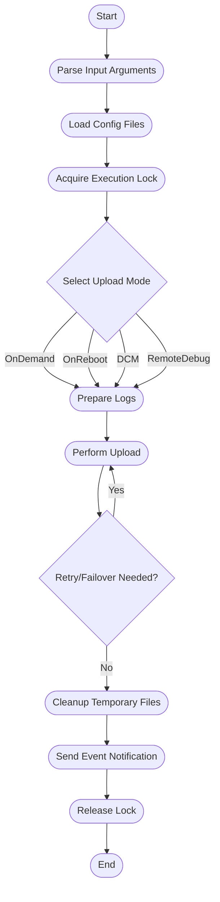
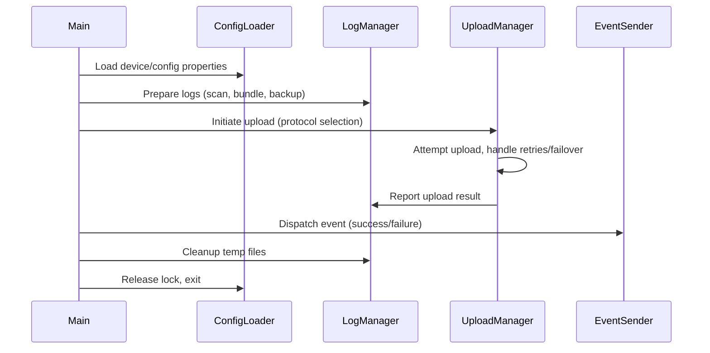

# High Level Design (HLD): Migration of `uploadSTBLogs.sh` to C++

## 1. Architecture Overview

The `uploadSTBLogs.sh` script is responsible for uploading STB (Set-Top Box) logs to a server using different protocols (primarily HTTP/S3) and handling various upload scenarios (on-demand, on-reboot, DCM-triggered, remote debugging). The migration aims to implement this logic in portable, efficient C++ code suitable for embedded platforms.

### Key Architectural Goals:
- Decouple platform-specific functionality via well-defined interfaces.
- Minimize memory and CPU footprint.
- Modularize log handling, upload logic, error handling, and configuration management.

## 2. Module/Component Breakdown

### A. **Configuration Loader**
- Loads device, environment, and feature configurations from files.
- Abstracts properties file parsing and exposes settings as C++ objects.

### B. **Log File Manager**
- Handles log directory scanning, file timestamping, backup, and deletion.
- Manages log bundles (e.g., tar operations) and maintains log retention policies.

### C. **Network/Upload Manager**
- Implements HTTP(S), S3, and (optionally) TFTP upload logic.
- Manages connection retries, failover between direct and codebig protocols.
- Handles TLS/MTLS properties and error logging.

### D. **Event Sender**
- Dispatches system/maintenance events (e.g., via IPC or an event file/socket).
- Encapsulates platform-specific event signaling.

### E. **Locking/Concurrency Control**
- Ensures single instance execution (flock-equivalent).
- Manages resource contention for log upload.

### F. **RFC/Feature Flags Handler**
- Reads and applies runtime-configurable flags (e.g., privacy mode, encryption enable).

### G. **Error/Telemetry Logger**
- Centralizes error, status, and telemetry logging.

### H. **Main Controller**
- Orchestrates overall logic: argument parsing, upload flow selection, error handling, exit codes.

## 3. Data Flow Description

1. **Startup/Initialization**
   - Parse input arguments (upload server, flags, protocol, etc.).
   - Load configuration files and device properties.
   - Acquire single execution lock.

2. **Upload Mode Selection**
   - Based on input flags, select upload scenario:
     - On-demand
     - On-reboot
     - DCM-triggered
     - Remote debugging

3. **Log Preparation**
   - Scan log directories, apply timestamping, backup, and retention.
   - Optionally encrypt or checksum log bundles as per RFC flags.

4. **Upload Execution**
   - Attempt log upload via selected protocol.
   - Handle retries, failover (direct ↔ codebig), error logging.
   - Manage S3/HTTP response codes and proxy fallback.

5. **Post-Upload Cleanup**
   - Remove temporary files, update log directories.
   - Dispatch event notifications for success/failure.

6. **Exit/Unlock**
   - Release lock, exit with appropriate status.

## 4. Key Algorithms & Data Structures

- **Locking:** File-based or OS mutex for process exclusivity.
- **Log Bundling:** Directory traversal, pattern matching, tar/gzip compression.
- **Retry Logic:** Loop with max attempts and timeout controls.
- **File Rotation:** Timestamp-based naming and retention via mtime checks.
- **Configuration Handling:** Key-value store abstraction for property files.
- **Protocol Selection:** Decision tree for HTTP/TFTP/Codebig with fallback.
- **Telemetry/Error Logging:** Buffered writes to log files with timestamp.

## 5. Interfaces & Integration Points

- **Device Properties:** File I/O via `/etc/include.properties`, `/etc/device.properties`.
- **System Calls:** Wrappers for shell utilities (tar, gzip, curl equivalents).
- **Network Stack:** HTTP/S3 upload via C++ HTTP client (e.g., libcurl, custom minimal client).
- **Event System:** IPC or file-based events for maintenance notifications.
- **RFC Reading:** Property query interface for feature flags (e.g., privacy mode, encryption).

---

## 6. Flowchart (Mermaid Syntax)



### Simplified Text-Based Flowchart

```
Start
 └─> Parse Input Arguments
      └─> Load Config Files
           └─> Acquire Execution Lock
                └─> Select Upload Mode
                     └─> Prepare Logs
                          └─> Perform Upload
                               └─> [Retry/Failover if needed]
                                    └─> Cleanup Temp Files
                                         └─> Send Event Notification
                                              └─> Release Lock
                                                   └─> End
```

---

## 7. Sequence Diagram (Mermaid Syntax)



### Simplified Text-Based Sequence Diagram

```
Main:
 |-- Load config via ConfigLoader
 |-- Prepare logs via LogManager
 |-- Start upload via UploadManager
 |     |-- Handle retries/failover
 |-- Dispatch event via EventSender
 |-- Cleanup via LogManager
 |-- Release lock and exit
```

---

## 8. Notes & Annotations

- All external shell commands and file operations must be replaced with C++ equivalents or platform abstractions.
- Networking must be robust against timeouts, TLS errors, and protocol-specific failures.
- All paths, constants, and feature flags must be configurable for portability.
- Thorough error handling and logging are critical for diagnosis on resource-constrained devices.
- Codebig and direct protocol logic should be modular for future extension or platform-specific adaptation.
