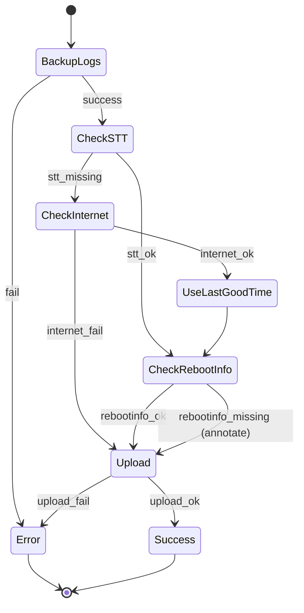

# Log Upload Distributed State Machine & Fallbacks

---

## Key Scenarios

**Scenario 1: Log Backup Fails**

- All subsequent steps fail. Upload is aborted. Error is logged with details.

**Scenario 2: Log Backup Success, Reboot Reason Fails**

- System attempts to invoke reboot reason update before log upload. If still missing after timeout, upload proceeds with annotation.

**Scenario 3: Log Backup Success, NTP Sync Fails, Reboot Reason Fails**

- Log upload checks for internet connection. If NTP is not synced, uses last known good time from [systemtimemgr](https://github.com/rdkcentral/systemtimemgr). Triggers reboot reason update. Upload proceeds with telemetry updated flag if available; all missing metadata is annotated.

## State Machine (No STT Trigger)

---
