# Log Upload Distributed State Machine & Fallbacks

---

## Overview

The log upload reboot sequence involves four cooperating subsystems. The state machine below
models `uploadstblogs` `reboot_setup()` as the orchestrating component. It uses a
**trigger-then-poll** pattern: if a prerequisite sentinel is absent at the start of the poll
window, a trigger file is written to invoke the dependent service before waiting for it to
complete.

### Sentinel Registry

| File | Written by | Consumed by | Type |
|------|-----------|------------|------|
| `/tmp/.backup_logs_done` | `backup_logs` | `update-prev-reboot-info`, `telemetry2_0`, `uploadstblogs` | Hard gate |
| `/tmp/stt_received` | time-sync service | `uploadstblogs` | Soft gate (NTP) |
| `/tmp/Update_rebootInfo_invoked` | `update-prev-reboot-info` | `uploadstblogs` | Soft gate |
| `/tmp/.telemetry_prevlogs_done` | `telemetry2_0` | `uploadstblogs` | Soft gate |
| `/tmp/.trigger_reboot_info_update` | `uploadstblogs` | `update-prev-reboot-info` (retry) | Trigger |
| `/tmp/.trigger_telemetry_prevlogs_scan` | `uploadstblogs` | `telemetry2_0` (retry) | Trigger |

All files reside in `/tmp/` (volatile — auto-cleared on every reboot; no stale-sentinel risk).

---

## Key Scenarios

**Scenario 1: Log Backup Fails**

`backup_logs` exits non-zero → `/tmp/.backup_logs_done` is NOT written → all downstream
services time out waiting for it → `uploadstblogs` sees all three soft-gate sentinels absent
and treats this as a hard abort (the only case where upload is cancelled entirely). Detailed
error is logged; device continues boot normally; the next reboot will retry.

**Scenario 2: Log Backup Success, Reboot Reason Fails**

`backup_logs` succeeds → `uploadstblogs` finds `Update_rebootInfo_invoked` absent at poll
start → writes `/tmp/.trigger_reboot_info_update` to invoke `update-prev-reboot-info` retry →
polls 120 s → if still absent after timeout, upload proceeds with
`ANNOTATION_REBOOT_REASON_UNAVAILABLE` annotation. Upload is never skipped.

**Scenario 3: Log Backup Success, NTP Sync Fails, Reboot Reason Fails**

`backup_logs` succeeds → `stt_received` not present after 120 s → `apply_ntp_fallback_time()`
checks internet: if reachable, queries `systemtimemgr` for last-known good time and annotates
`NTP_FALLBACK_SYSTEMTIMEMGR`; if unreachable, uses `time(NULL)` as-is and annotates
`NTP_UNAVAILABLE`. Reboot reason trigger is written independently. Upload proceeds with
all applicable annotations.

**Scenario 4: Telemetry Update Flag Fails**

`backup_logs` succeeds → `.telemetry_prevlogs_done` absent at poll start → `uploadstblogs`
writes `/tmp/.trigger_telemetry_prevlogs_scan` to invoke `telemetry2_0` retry → polls 120 s →
if still absent, `add_timestamp_to_files()` is safe to call (120 s > telemetry's 60 s
internal timeout; the scan is guaranteed complete or abandoned) → upload proceeds with
`ANNOTATION_TELEMETRY_UNAVAILABLE`.

---

## State Machine

```mermaid
stateDiagram-v2
    [*] --> BackupLogs : Device boot

    BackupLogs --> S1_Abort : SCENARIO 1 — backup_logs fails
    BackupLogs --> WriteBackupDone : backup_logs succeeds

    state S1_Abort {
        [*] --> LogBackupError
        LogBackupError --> [*]
    }
    S1_Abort --> [*] : EXIT_FAILURE — no upload

    WriteBackupDone --> WriteTriggers : create /tmp/.backup_logs_done

    state WriteTriggers {
        [*] --> TriggerRI : write /tmp/.trigger_reboot_info_update if RI absent
        TriggerRI --> TriggerTel : write /tmp/.trigger_telemetry_prevlogs_scan if Tel absent
        TriggerTel --> [*]
    }

    WriteTriggers --> Poll120s : start 120 s monotonic poll

    state Poll120s {
        [*] --> PollLoop
        PollLoop --> AllReady : all 3 sentinels present
        PollLoop --> TimedOut : elapsed >= 120 s
        AllReady --> [*] : bitmask = 0
        TimedOut --> [*] : bitmask has PREREQ_NTP and/or PREREQ_REBOOT and/or PREREQ_TELEMETRY
    }

    Poll120s --> HandleNTP

    state HandleNTP {
        [*] --> NTPPresent : stt_received found
        [*] --> S3_NTPMissing : SCENARIO 3 — NTP timed out
        NTPPresent --> [*] : time(NULL) NTP-accurate
        state S3_NTPMissing {
            [*] --> CheckInternet
            CheckInternet --> ApplySystemTimeMgr : internet reachable
            CheckInternet --> ApplyPreNTP : internet unreachable
            ApplySystemTimeMgr --> [*] : set last-known time, annotate NTP_FALLBACK_SYSTEMTIMEMGR
            ApplyPreNTP --> [*] : time(NULL) as-is, annotate NTP_UNAVAILABLE
        }
        S3_NTPMissing --> [*]
    }

    HandleNTP --> HandleRebootInfo

    state HandleRebootInfo {
        [*] --> RIPresent : Update_rebootInfo_invoked found
        [*] --> S2_RIMissing : SCENARIO 2 — reboot info timed out
        RIPresent --> [*]
        S2_RIMissing --> AnnotateRI : set_upload_annotation(REBOOT_REASON_UNAVAILABLE)
        AnnotateRI --> [*]
    }

    HandleRebootInfo --> HandleTelemetry

    state HandleTelemetry {
        [*] --> TelPresent : .telemetry_prevlogs_done found
        [*] --> S4_TelMissing : SCENARIO 4 — telemetry timed out
        TelPresent --> [*]
        S4_TelMissing --> AnnotateTel : set_upload_annotation(TELEMETRY_UNAVAILABLE)
        AnnotateTel --> [*]
    }

    HandleTelemetry --> UploadPhase : ALWAYS proceeds (soft gates only annotate)

    state UploadPhase {
        [*] --> CreateArchive
        CreateArchive --> UploadPackage : generate_archive_name() + add_timestamp_to_files()
        UploadPackage --> NotifyMM_OK : upload success
        UploadPackage --> NotifyMM_ERR : upload failure
        NotifyMM_OK --> [*] : MAINT_LOGUPLOAD_COMPLETE
        NotifyMM_ERR --> [*] : MAINT_LOGUPLOAD_ERROR
    }

    UploadPhase --> [*]
```

---

## Scenario Outcome Summary

| # | Scenario | Trigger written? | Upload outcome | MM event |
|---|----------|-----------------|----------------|----------|
| S1 | `backup_logs` fails | No | **Aborted** | None (MM timer eventually fires) |
| S2 | Backup OK, reboot reason absent | `TRIGGER_REBOOT_INFO_UPDATE` | Proceeds + `REBOOT_REASON_UNAVAILABLE` | `MAINT_LOGUPLOAD_COMPLETE` |
| S3 | Backup OK, NTP absent, RI absent | `TRIGGER_REBOOT_INFO_UPDATE` | Proceeds + `NTP_FALLBACK` or `NTP_UNAVAILABLE` + `REBOOT_REASON_UNAVAILABLE` | `MAINT_LOGUPLOAD_COMPLETE` |
| S4 | Backup OK, telemetry absent | `TRIGGER_TELEMETRY_SCAN` | Proceeds + `TELEMETRY_UNAVAILABLE` | `MAINT_LOGUPLOAD_COMPLETE` |

**Invariant**: Upload always occurs if `backup_logs` succeeded. Missing metadata is
annotated in the upload payload, never silently discarded.

---

## Maintenance Manager Interaction

`entservices-maintenancemanager` schedules LOGUPLOAD as the third task in its maintenance
cycle. It starts a `TASK_TIMEOUT = 3600 s` watchdog per task. The sentinel poll window of
120 s is well within this budget. The `MAINT_LOGUPLOAD_COMPLETE` or `MAINT_LOGUPLOAD_ERROR`
IARM event from `uploadstblogs` signals the MaintenanceManager to stop the watchdog and
proceed to the next task. Sentinel-chain annotations are embedded in the upload payload and
do not affect MM signalling.
