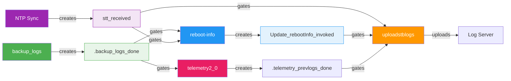
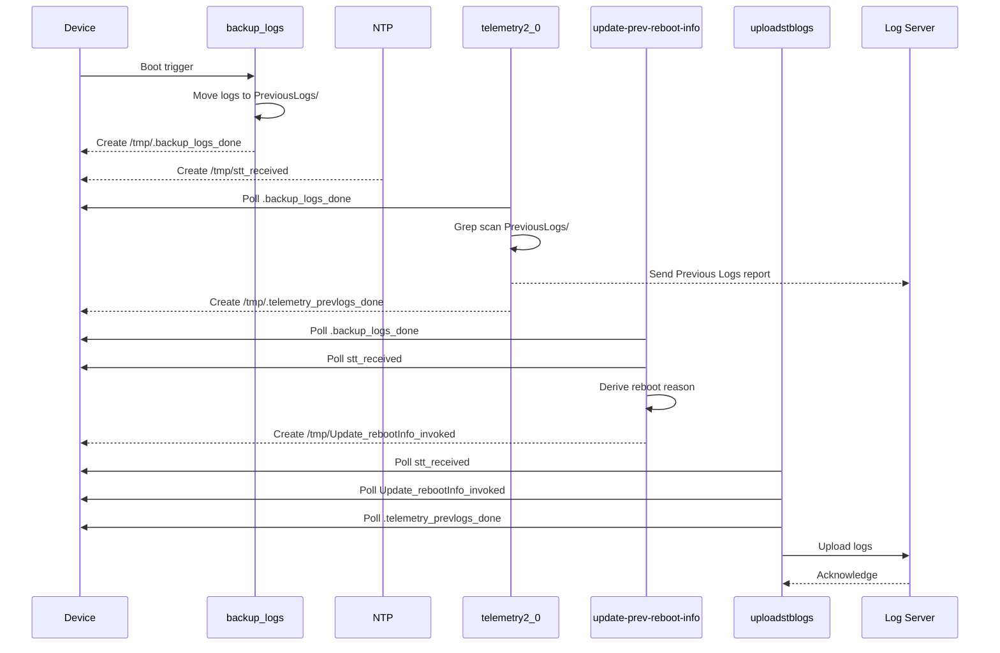
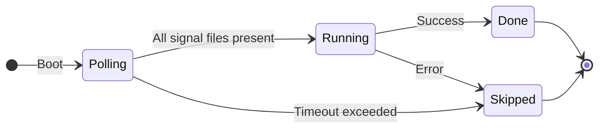
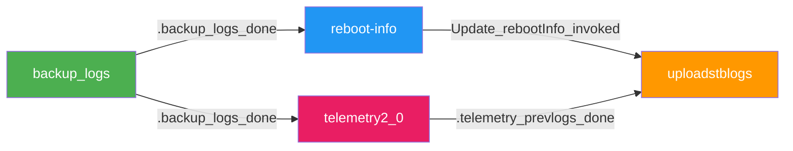

# Logupload Synchronization

### Boot-Time Coordination for `dcm-agent`

`backup_logs` · `reboot-info` · `telemetry2_0` · `uploadstblogs`

---

# The Problem

**Four** independent subsystems read `/opt/logs/PreviousLogs/` after reboot — with **no coordination**:

- **backup_logs** — moves logs to PreviousLogs/ directory
- **update-prev-reboot-info** — derives and persists reboot reason
- **uploadstblogs** — archives and uploads logs to a server
- **telemetry2_0** — grep-scans PreviousLogs/ for telemetry markers (one-shot)

### What goes wrong?

- Logs read before backup completion
- Reboot reasons derived from incomplete logs
- Uploads with incorrect timestamps or missing data
- **Telemetry markers permanently lost** — one-shot report, never retried

---

# Known Issues — Evidence from RDK Stack

These defects trace directly to the boot-time race conditions described above:

| Defect | Platform | Symptom | Root Cause |
|--------|----------|---------|------------|
| **XIONE-18338** | Alpaca IT / RDK 8.4 | `UploadOnReboot` flag set to `false` even when XConf offers `true` | Upload suppressed due to race between DCM config delivery and reboot upload trigger |
| **DELIA-70285** | LLAMA Gen1/Gen2, CELLO | After CDL-initiated or maintenance reboot, device records wrong reboot reason — `SOFTWARE_MASTER_RESET` | `update-prev-reboot-info` reads `PreviousLogs/` before `backup_logs` completes; derives stale reboot reason |
| **XIONE-18607** | XIONE ALPACA IT | Log upload file name wrong for days | `uploadstblogs` archives before NTP sync — timestamp in filename reflects pre-NTP epoch |

&nbsp;

> All three defects share a single root cause: **no ordering guarantee** between boot-time subsystems.
> The signal-file chain proposed here closes all three gaps simultaneously.

---
layout: two-cols
---

# Current State

- Four subsystems launch independently at boot
- No ordering guarantees
- Race conditions between log backup, reboot-info, upload, and telemetry
- Timestamps may be inaccurate (no NTP sync)
- Telemetry scans PreviousLogs/ before files are moved

::right::

# Target State

- **Signal-file chain** enforces strict order
- Each subsystem waits for prerequisites
- NTP synchronization required before upload
- Telemetry polls `.backup_logs_done` before grep scan
- Clean skip on timeout / failure

---

# File-Based Signaling Protocol

Signal files coordinate execution between stages.

---

# Execution Flow

1. **Device Reboots**
2. `backup_logs` starts → moves logs to `/opt/logs/PreviousLogs/`
3. On success → creates `/tmp/.backup_logs_done`
4. `update-prev-reboot-info` polls `.backup_logs_done` + `stt_received` (NTP)
5. Derives reboot reason → creates `/tmp/Update_rebootInfo_invoked`
6. `telemetry2_0` polls `.backup_logs_done` → grep-scans `PreviousLogs/` → creates `/tmp/.telemetry_prevlogs_done`
7. `uploadstblogs` polls **all three** before proceeding:
   - `/tmp/stt_received`
   - `/tmp/Update_rebootInfo_invoked`
   - `/tmp/.telemetry_prevlogs_done`
8. Proceeds with archive + upload

---

# Execution Sequence

---

# Key Components

| Component | Language | Role |
|-----------|----------|------|
| **backup_logs** | C | Move logs to backup directory |
| **Reboot Manager** | C | Derive and persist reboot reason |
| **uploadstblogs** | C | Archive & upload logs to server |
| **telemetry2_0** | C | Grep-scan PreviousLogs/ for markers |
| **Signal Files** | Filesystem | Inter-process synchronization |

---

# Error Handling

- Each subsystem polls with a **configurable timeout**
- If a signal file is not created in time:
  - Dependent subsystem logs an error
  - **Skips its operation cleanly**
- No cascading failures — each stage fails independently
- All failures are logged for diagnostics

| Component | Timeout | Action on timeout |
|-----------|---------|-------------------|
| update-prev-reboot-info | 60s | Exit `ERROR_GENERAL` |
| telemetry2_0 | 60s | Skip PreviousLogs report, use current logs |
| uploadstblogs | 120s | Skip reboot log upload entirely |

---

# Subsystem State Machine

Each subsystem follows this state machine independently.

---

# Design Principles

- **No dynamic memory allocation** — memory pools where needed
- **Platform-neutral** — portable across embedded targets
- **Thread-safe** — safe concurrent access
- **Fixed-point arithmetic** — no floating-point dependency
- **Secure coding** — input validation, no buffer overflows
- **Modular** — each subsystem independently testable

---

# Cross-Repo Interface Contract

The signal file `/tmp/.backup_logs_done` is a **3-repo interface**:

| Repo | Role | Action |
|------|------|--------|
| **dcm-agent** | Writer | `backup_logs` creates `.backup_logs_done` on success |
| **reboot-manager** | Consumer | Polls `.backup_logs_done` before reading PreviousLogs/ |
| **telemetry** | Consumer + Writer | Polls `.backup_logs_done`; writes `.telemetry_prevlogs_done` after grep scan |
| **dcm-agent** | Consumer | `uploadstblogs` polls `.telemetry_prevlogs_done` before archive |

- All path changes must be **coordinated across all three repos**
- Signal files reside in `/tmp/` — volatile, cleared on every reboot
- **Atomic 3-repo release** required — no backward compatibility window
- Telemetry changes tracked as **Group G** tasks in this change (TASK-G1 – TASK-G4)

---
layout: center
---

# The Telemetry Gap

**Discovery**: `telemetry2_0` reads PreviousLogs/ at boot — **outside the signal chain**

- `PERSIST_LOG_MON_REF` enabled on **all builds** — telemetry always scans PreviousLogs/
- PreviousLogs grep report is **fire-and-forget** — never retried
- If it reads while `add_timestamp_to_files()` is renaming, markers are **permanently lost**
- **Fix (now in scope — Group G)**:
  - Telemetry polls `.backup_logs_done` before grep scan (TASK-G1)
  - Telemetry writes `.telemetry_prevlogs_done` after scan (TASK-G2)
  - `uploadstblogs` polls `.telemetry_prevlogs_done` before calling `add_timestamp_to_files()` (TASK-D2)

---
layout: center
---

# Summary

Signal-file chain eliminates race conditions at boot

**backup_logs → { telemetry2_0, reboot-info } → uploadstblogs**

4 signal files: `.backup_logs_done` · `stt_received` · `Update_rebootInfo_invoked` · `.telemetry_prevlogs_done`

3-repo atomic release: dcm-agent · reboot-manager · telemetry

18 tasks across 7 groups — clean skip on any timeout

---
layout: center
---

# Thank You

[dcm-agent Repository](https://github.com/rdkcentral/dcm-agent)
