 
# Logupload Synchronization

### Boot-Time Coordination for `dcm-agent`
`backup_logs` · `reboot-info` · `telemetry2_0` · `uploadstblogs`

---

# The Problem

**Four** independent subsystems read `/opt/logs/PreviousLogs/` after reboot — with **no coordination**:

- **backup_logs** — moves logs to PreviousLogs/ directory
- **update-prev-reboot-info** — derives and persists reboot reason
- **uploadstblogs** — archives and uploads logs to a server
- **telemetry2_0** — grep-scans PreviousLogs/ for telemetry markers (one-shot)

### What goes wrong?

- Logs read before backup completion
- Reboot reasons derived from incomplete logs
- Uploads with incorrect timestamps or missing data
- **Telemetry markers permanently lost** — one-shot report, never retried

---

# Known Issues — Evidence from RDK Stack

These defects trace directly to the boot-time race conditions described above:

| Defect | Platform | Symptom | Root Cause |
|--------|----------|---------|------------|
| **XIONE-18338** | Alpaca IT / RDK 8.4 | `UploadOnReboot` flag set to `false` even when XConf offers `true` | Upload suppressed due to race between DCM config delivery and reboot upload trigger |
| **DELIA-70285** | LLAMA Gen1/Gen2, CELLO | After CDL-initiated or maintenance reboot, device records wrong reboot reason — `SOFTWARE_MASTER_RESET` | `update-prev-reboot-info` reads `PreviousLogs/` before `backup_logs` completes; derives stale reboot reason |
| **XIONE-18607** | XIONE ALPACA IT | Log upload file name wrong for days | `uploadstblogs` archives before NTP sync — timestamp in filename reflects pre-NTP epoch |

&nbsp;

> All three defects share a single root cause: **no ordering guarantee** between boot-time subsystems.
> The signal-file chain proposed here closes all three gaps simultaneously.

---
layout: two-cols
---
# Log Upload Callers and Triggers Across Modules

| Trigger Path | Caller Module | Interface / Path | Trigger Type | Gate / Blocking Condition |
|--------------|---------------|------------------|--------------|---------------------------|
| DCM Scheduler | dcm-agent (`dcmd`) | `dcmRunJobs()` -> `uploadstblogs_run()` | `TRIGGER_SCHEDULED` | Suppressed when `dcmSettingsGetMMFlag()` is true |
| Unsolicited Maintenance | rdkservices (`MaintenanceManager`) | `/lib/rdk/Start_uploadSTBLogs.sh` via maintenance workflow | `TRIGGER_SCHEDULED` | Bootup-triggered maintenance path |
| SystemServices API | rdkservices (`SystemServices`) | Thunder `org.rdk.SystemServices.uploadLogs` -> `/lib/rdk/uploadSTBLogs.sh` | `TRIGGER_ONDEMAND` | On-demand invocation path |
| UploadLogsNow | TR69hostif / operator / app path | `uploadstblogs uploadlogsnow` | `TRIGGER_ONDEMAND` | Immediate mode; does not rely on `UploadOnReboot=false` |
| Solicited Maintenance from AS | AS-triggered maintenance call | Maintenance invocation from AS | `TRIGGER_ONDEMAND` | Upload may be skipped when `/opt/logs/PreviousLogs/` is empty |

Shared behavior:
- All trigger paths serialize upload via `/tmp/.log-upload.lock` to prevent concurrent uploads.

---
# Log Upload Flow in RDK

## Reboot Reason — Sentinel Flow

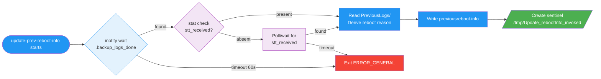

---

## Telemetry — Sentinel Flow

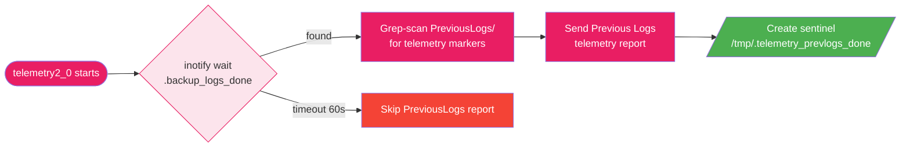

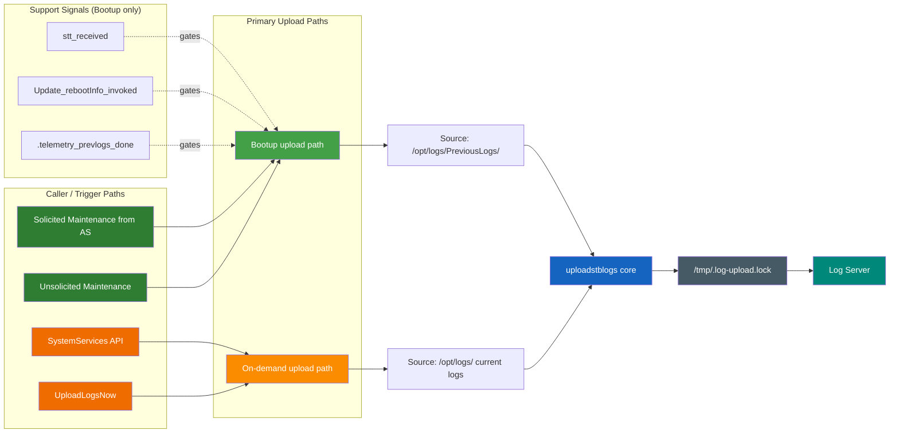
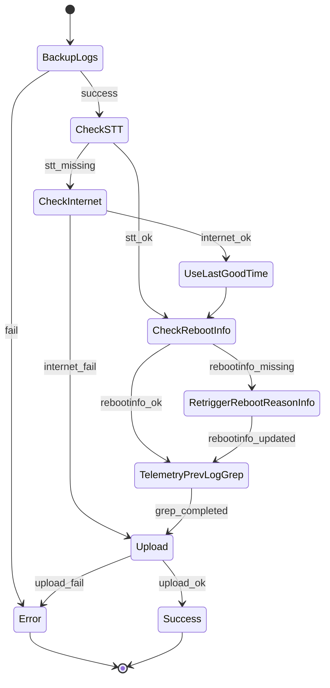
---
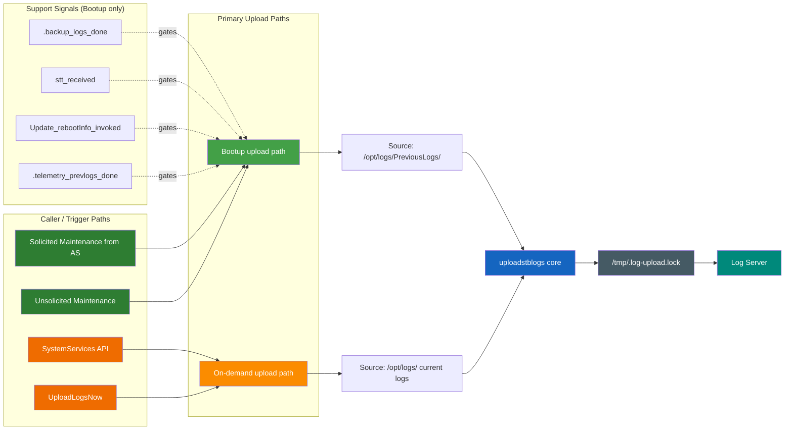
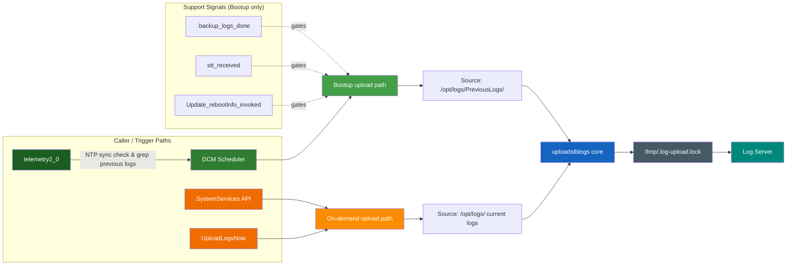

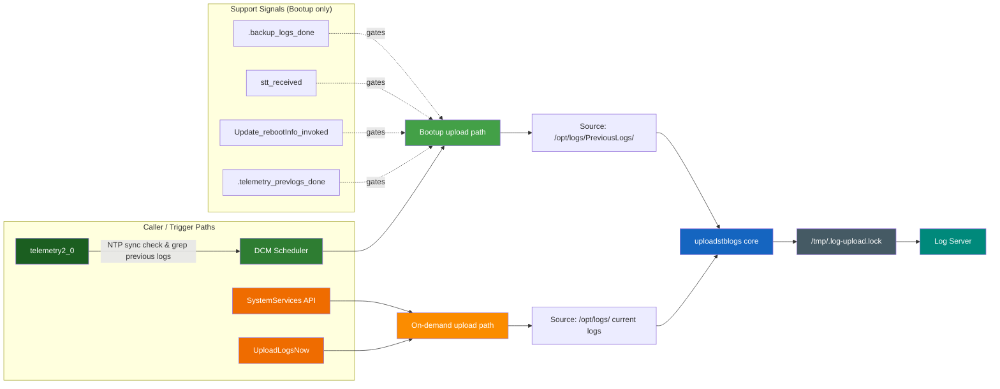

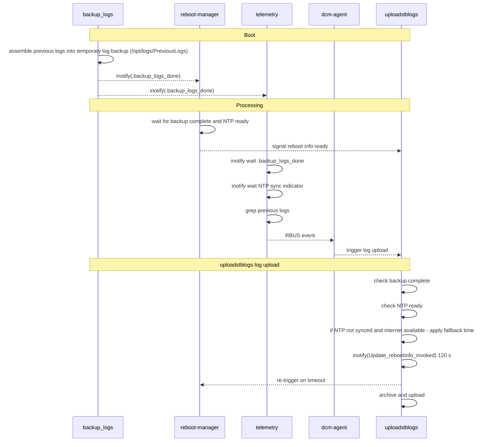

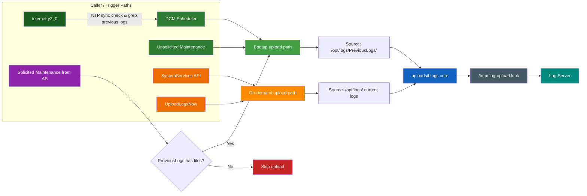

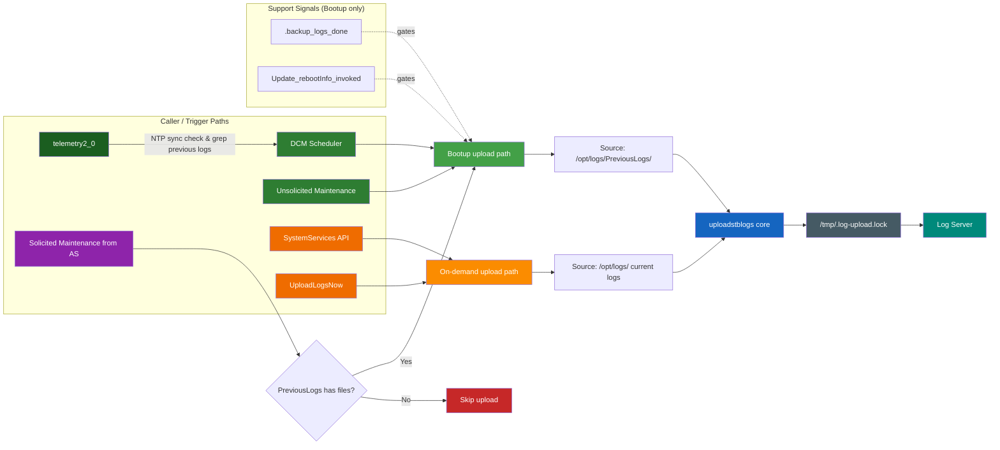

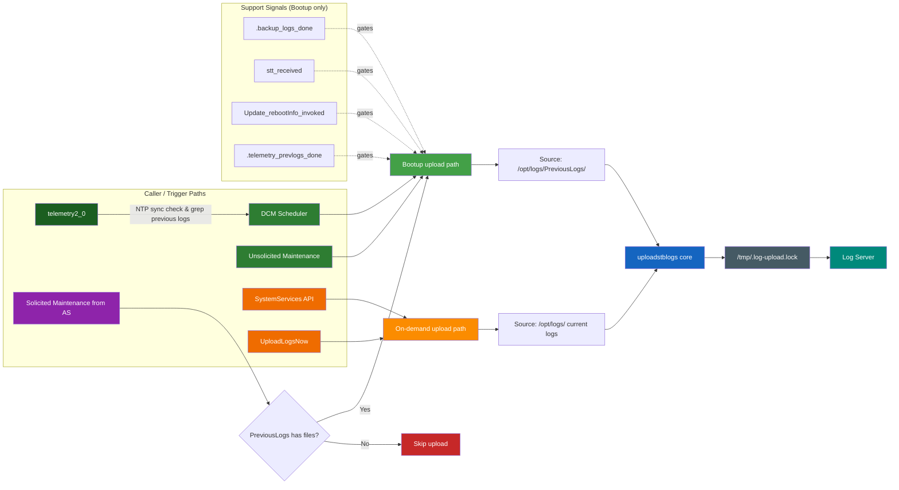

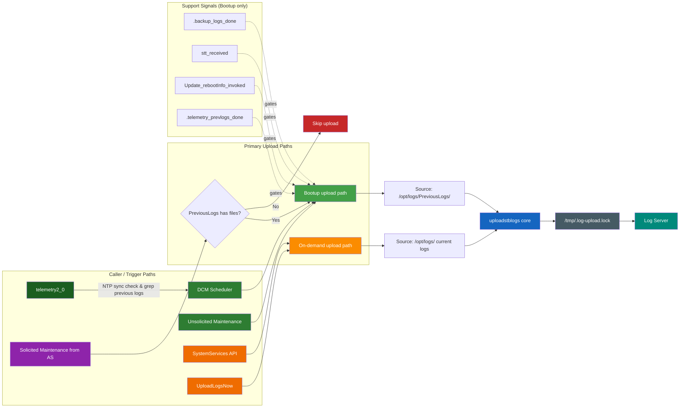

Note:
- On-demand uploads use current logs under `/opt/logs/` and do not require boot signal-chain gating.
- Solicited Maintenance from AS may skip upload when `/opt/logs/PreviousLogs/` is empty.

Legend:
- Green: bootup-triggered callers
- Orange: on-demand callers
- Purple: AS solicited maintenance decision
- Red: skip path
- Blue/Grey/Teal: upload pipeline

---

# Current State

- Four subsystems launch independently at boot
- No ordering guarantees
- Race conditions between log backup, reboot-info, upload, and telemetry
- Timestamps may be inaccurate (no NTP sync)
- Telemetry scans PreviousLogs/ before files are moved

::right::

# Target State

- **Signal-file chain** enforces strict order
- Each subsystem waits for prerequisites
- NTP synchronization required before upload
- Telemetry polls `.backup_logs_done` before grep scan
- Clean skip on timeout / failure

---
# Boot Signal Chain Detail (Scheduled / Bootup Paths)

Before Synchronization Fixes (Race-Prone):

graph LR
  subgraph C["Caller / Trigger Paths"]
    TEL["telemetry2_0"] --> DCM["dcm-agent"]
    UMM["Unsolicited Maintenance"]
    SS["SystemServices API"]
    ULN["UploadLogsNow"]
    AS["Solicited Maintenance from AS"]
  end

  subgraph P["Primary Upload Paths"]
    BUP["Bootup upload path"]
    ODP["On-demand upload path"]
    ASG{"PreviousLogs has files?"}
  end

  subgraph S["Support Signals (Bootup only)"]
    S1[".backup_logs_done"]
    S2["stt_received"]
    S3["Update_rebootInfo_invoked"]
    S4[".telemetry_prevlogs_done"]
  end

  DCM --> BUP
  UMM --> BUP
  SS --> ODP
  ULN --> ODP
  AS --> ASG
  ASG -->|No| SKIP["Skip upload"]
  ASG -->|Yes| BUP

  S1 -.gates.-> BUP
  S2 -.gates.-> BUP
  S3 -.gates.-> BUP
  S4 -.gates.-> BUP

  BUP --> PREV["Source: /opt/logs/PreviousLogs/"]
  ODP --> CURR["Source: /opt/logs/ current logs"]
  PREV --> CORE["uploadstblogs core"]
  CURR --> CORE
  CORE --> LOCK["/tmp/.log-upload.lock"]
  LOCK --> SERVER["Log Server"]

  style TEL fill:#1b5e20,color:#fff
  style GREP fill:#2e7d32,color:#fff
  style DCM fill:#2e7d32,color:#fff
  style UMM fill:#2e7d32,color:#fff
  style SS fill:#ef6c00,color:#fff
  style ULN fill:#ef6c00,color:#fff
  style AS fill:#8e24aa,color:#fff
  style BUP fill:#43a047,color:#fff
  style ODP fill:#fb8c00,color:#fff
  style SKIP fill:#c62828,color:#fff
  style CORE fill:#1565c0,color:#fff
  style LOCK fill:#455a64,color:#fff
  style SERVER fill:#00897b,color:#fff

After Synchronization Fixes (Sentinel-Gated):

Note:
- This boot signal-chain comparison applies to scheduled/bootup paths and is shown separately from on-demand caller paths for clarity.

---

# Execution Flow

- **Device Reboots**
  - `backup_logs` starts → moves logs to `/opt/logs/PreviousLogs/`
    - If fails, **abort**. If succeeds, continue.
  - On success → creates `/tmp/.backup_logs_done`
  - `update-prev-reboot-info` polls `.backup_logs_done` + `stt_received` (NTP)
    - If missing, trigger reboot reason update and wait. If still missing after timeout, proceed.
  - Derives reboot reason → creates `/tmp/Update_rebootInfo_invoked`
  - `telemetry2_0` polls `.backup_logs_done` → grep-scans `PreviousLogs/` → creates `/tmp/.telemetry_prevlogs_done`
    - If missing, trigger telemetry scan and wait. If still missing after timeout, proceed.
  - `uploadstblogs` polls all three before proceeding:
    - `/tmp/stt_received`
      - **CheckSTT:** If missing, do NOT trigger STT acquisition. Instead, check internet connectivity.
        - If internet is up but NTP is not synced, use last known good time from **systemtimemgr**.
        - If internet is down, upload proceeds with error annotation.
    - `/tmp/Update_rebootInfo_invoked`
    - `/tmp/.telemetry_prevlogs_done`
  - Proceeds with archive + upload
    - Always upload if backup succeeded, annotating any missing metadata.

---

# Execution Sequence

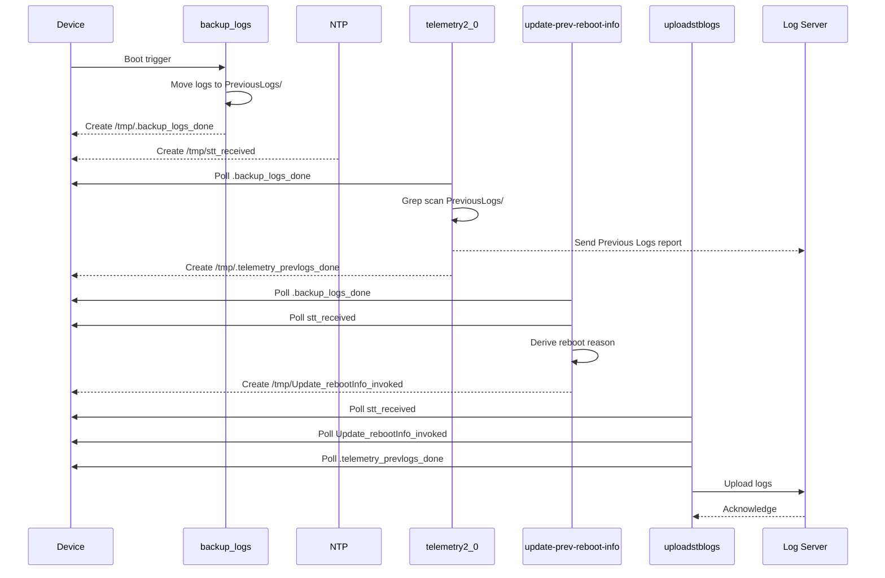

---

# Key Components

| Component | Language | Role |
|-----------|----------|------|
| **backup_logs** | C | Move logs to backup directory |
| **Reboot Manager** | C | Derive and persist reboot reason |
| **uploadstblogs** | C | Archive & upload logs to server |
| **telemetry2_0** | C | Grep-scan PreviousLogs/ for markers |
| **Signal Files** | Filesystem | Inter-process synchronization |
| **systemtimemgr** | C | Provides last known good time if NTP/internet is unavailable |
| **entservices-maintenancemanager** | C | Legacy timer integration; no longer used as a logupload trigger source |

---

# Log Upload Callers and Triggers Across Modules

| Trigger Path | Caller Module | Interface / Path | Trigger Type | Gate / Blocking Condition |
|--------------|---------------|------------------|--------------|---------------------------|
| DCM Scheduler | dcm-agent (`dcmd`) | `dcmRunJobs()` -> `uploadstblogs_run()` | `TRIGGER_SCHEDULED` | Suppressed when `dcmSettingsGetMMFlag()` is true |
| Unsolicited Maintenance | rdkservices (`MaintenanceManager`) | `/lib/rdk/Start_uploadSTBLogs.sh` via maintenance workflow | `TRIGGER_SCHEDULED` | Bootup-triggered maintenance path |
| SystemServices API | rdkservices (`SystemServices`) | Thunder `org.rdk.SystemServices.uploadLogs` -> `/lib/rdk/uploadSTBLogs.sh` | `TRIGGER_ONDEMAND` | On-demand invocation path |
| UploadLogsNow | TR69hostif / operator / app path | `uploadstblogs uploadlogsnow` | `TRIGGER_ONDEMAND` | Immediate mode; does not rely on `UploadOnReboot=false` |
| Solicited Maintenance from AS | AS-triggered maintenance call | Maintenance invocation from AS | `TRIGGER_ONDEMAND` | Upload may be skipped when `/opt/logs/PreviousLogs/` is empty |

Shared behavior:
- All trigger paths serialize upload via `/tmp/.log-upload.lock` to prevent concurrent uploads.

---

# Architectural Direction: Single Logupload Owner

With this US, logupload ownership is explicitly centralized:

- `dcm-agent` is the single authoritative entity for reboot logupload.
- On reboot, upload is triggered and executed by `dcm-agent` when `backup_logs` succeeds.
- Maintenance Manager logupload tasks are deprecated in both solicited and unsolicited cases.
- Valid on-demand trigger paths remain `SystemServices API` and `UploadLogsNow`.

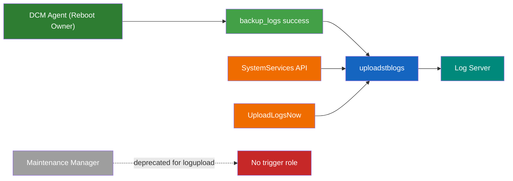

Note:
- This slide captures architectural direction for the US and does not change runtime behavior by itself.

---

# Log Upload Flow in RDK

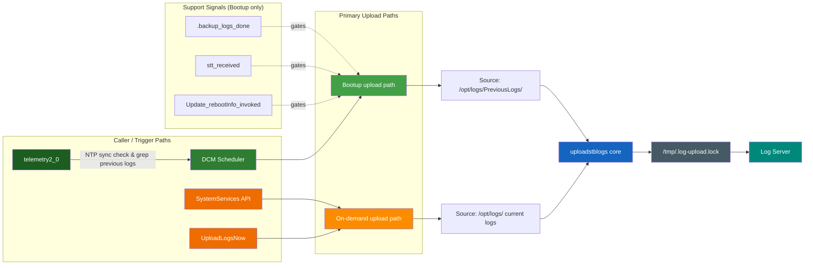

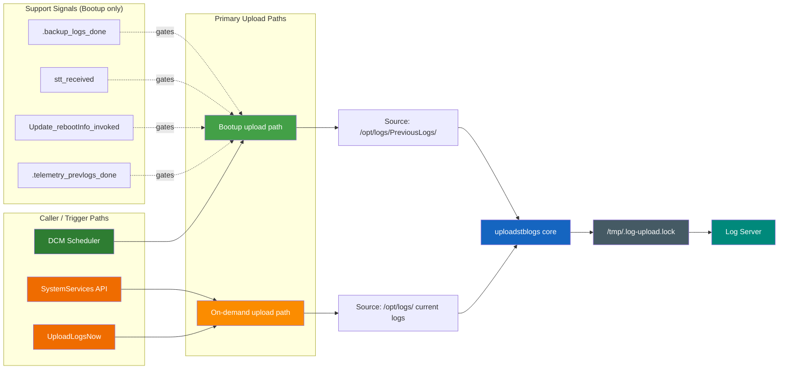

Note:
- Reboot uploads are owned by DCM Agent and proceed when `backup_logs` succeeds.
- On-demand uploads use current logs under `/opt/logs/` and do not require boot signal-chain gating.

Legend:
- Green: bootup-triggered callers
- Orange: on-demand callers
- Blue/Grey/Teal: upload pipeline

---

# Boot Signal Chain Detail (Scheduled / Bootup Paths)

Before Synchronization Fixes (Race-Prone):

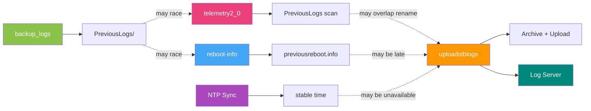

After Synchronization Fixes (Sentinel-Gated):

What changed with synchronization fixes:
- Replaced implicit timing/race behavior with explicit sentinel gating.
- uploadstblogs proceeds only after NTP, reboot-info, and telemetry completion signals are all present.
- Scheduled/bootup path ordering is deterministic and easier to debug.

Note:
- This boot signal-chain comparison applies to scheduled/bootup paths and is shown separately from on-demand caller paths for clarity.

---

# Error Handling

- Each subsystem polls with a **configurable timeout**
- If a signal file is not created in time:
  - Dependent subsystem logs an error
  - **Skips its operation cleanly**
- No cascading failures — each stage fails independently
- All failures are logged for diagnostics

| Component | Timeout | Action on timeout |
|-----------|---------|-------------------|
| update-prev-reboot-info | 60s | Exit `ERROR_GENERAL` |
| telemetry2_0 | 60s | Skip PreviousLogs report, use current logs |
| uploadstblogs | 120s | Skip reboot log upload entirely |

---

# Risks & Notes

- If both STT and internet are missing, upload proceeds but is heavily annotated as incomplete.
- Distributed state machine: Each module owns its state, but uploadstblogs orchestrates the checks and triggers.
- Timeouts must be coordinated to avoid indefinite waits.
- All fallback uploads must clearly annotate what metadata was missing or defaulted.

---

# Log Upload: State Machine & Fallbacks

> **Fallback Method:** Log upload must always happen except when log backup fails. All missing/failed steps are annotated in the upload for diagnostics.

- DCM Agent synchronizes backup, STT, reboot reason, telemetry, and upload.
- Each module owns its state; DCM Agent triggers and coordinates as needed.
- State machine ensures robust fallback and retry logic.

👉 **[Logupload State Machine & Fallbacks](./logupload-state-machine.md)**

Refer to the linked file for the scenario breakdowns and state diagram.

---

# Design Principles

- **No dynamic memory allocation** — memory pools where needed
- **Platform-neutral** — portable across embedded targets
- **Thread-safe** — safe concurrent access
- **Fixed-point arithmetic** — no floating-point dependency
- **Secure coding** — input validation, no buffer overflows
- **Modular** — each subsystem independently testable

---

# Cross-Repo Interface Contract

The signal file `/tmp/.backup_logs_done` is a **3-repo interface**:

| Repo | Role | Action |
|------|------|--------|
| **dcm-agent** | Writer | `backup_logs` creates `.backup_logs_done` on success |
| **reboot-manager** | Consumer | Polls `.backup_logs_done` before reading PreviousLogs/ |
| **telemetry** | Consumer + Writer | Polls `.backup_logs_done`; writes `.telemetry_prevlogs_done` after grep scan |
| **dcm-agent** | Consumer | `uploadstblogs` polls `.telemetry_prevlogs_done` before archive |

- All path changes must be **coordinated across all three repos**
- Signal files reside in `/tmp/` — volatile, cleared on every reboot
- **Atomic 3-repo release** required — no backward compatibility window
- Telemetry changes tracked as **Group G** tasks in this change (TASK-G1 – TASK-G4)

---
layout: center
---

# The Telemetry Gap

**Discovery**: `telemetry2_0` reads PreviousLogs/ at boot — **outside the signal chain**

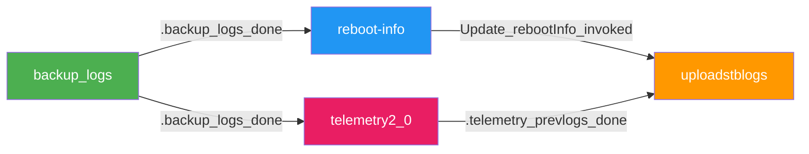

- `PERSIST_LOG_MON_REF` enabled on **all builds** — telemetry always scans PreviousLogs/
- PreviousLogs grep report is **fire-and-forget** — never retried
- If it reads while `add_timestamp_to_files()` is renaming, markers are **permanently lost**
- **Fix (now in scope — Group G)**:
  - Telemetry polls `.backup_logs_done` before grep scan (TASK-G1)
  - Telemetry writes `.telemetry_prevlogs_done` after scan (TASK-G2)
  - `uploadstblogs` polls `.telemetry_prevlogs_done` before calling `add_timestamp_to_files()` (TASK-D2)

---
layout: center
---

# Summary

Signal-file chain eliminates race conditions at boot

**backup_logs → { telemetry2_0, reboot-info } → uploadstblogs**

4 signal files: `.backup_logs_done` · `stt_received` · `Update_rebootInfo_invoked` · `.telemetry_prevlogs_done`

3-repo atomic release: dcm-agent · reboot-manager · telemetry

18 tasks across 7 groups — clean skip on any timeout

---
layout: center
---

## Summary Table

| Step           | Hard Dependency | Fallback Action                | Upload Allowed? |
|----------------|----------------|--------------------------------|-----------------|
| BackupLogs     | Yes            | None (abort if missing)        | No              |
| STT            | No             | Check internet, use last good time | Yes         |
| RebootInfo     | No             | Trigger update, wait, proceed  | Yes             |
| TelemetryFlag  | No             | Trigger scan, wait, proceed    | Yes             |

---

## Risks & Notes

- If both STT and internet are missing, upload proceeds but is heavily annotated as incomplete.
- Distributed state machine: Each module owns its state, but uploadstblogs orchestrates the checks and triggers.
- Timeouts must be coordinated to avoid indefinite waits.
- All fallback uploads must clearly annotate what metadata was missing or defaulted.

---

# Thank You

[dcm-agent Repository](https://github.com/rdkcentral/dcm-agent)
---
