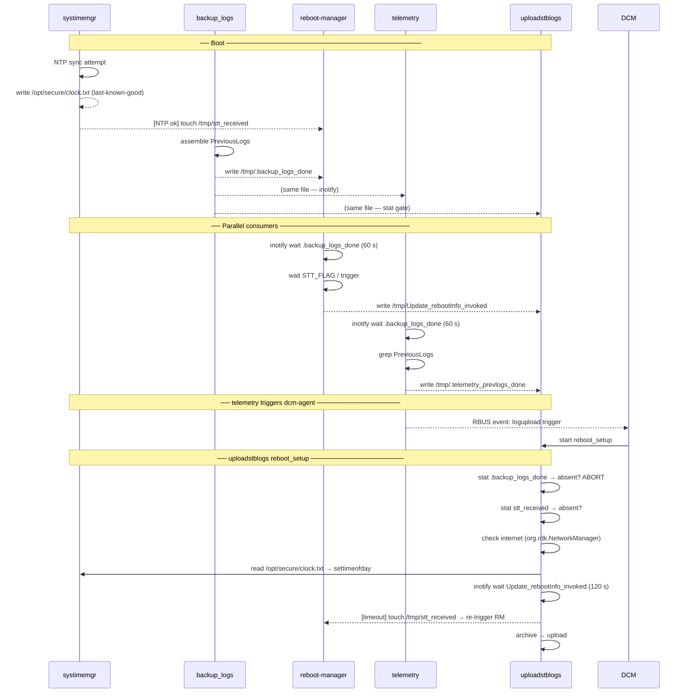
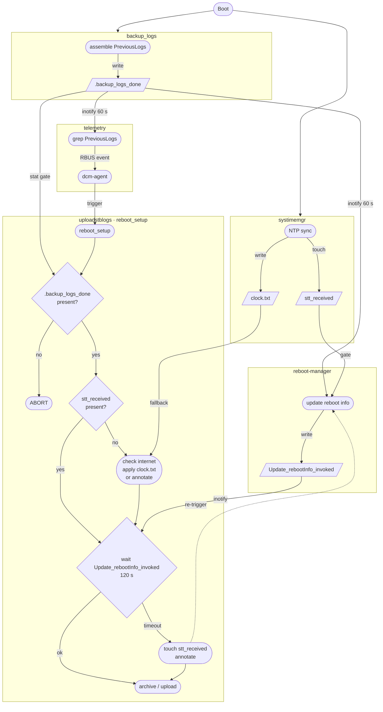

# Boot Synchronisation State Machine

Cross-repo sentinel flow for dcm-agent · reboot-manager · telemetry · systimemgr.

## High-Level Flow

---

## State Machine

## Sentinel Reference

| File | Written by | Consumed by | Mechanism |
|---|---|---|---|
| `/tmp/.backup_logs_done` | `backup_logs` (dcm-agent) | reboot-manager, telemetry, uploadstblogs | inotify wait / stat gate |
| `/tmp/stt_received` | `systimemgr` (on NTP sync) | reboot-manager (STT gate), uploadstblogs (NTP check); **touched by uploadstblogs** on reboot-reason timeout | stat / touch |
| `/tmp/Update_rebootInfo_invoked` | `reboot-manager` | uploadstblogs | inotify wait |
| `/opt/secure/clock.txt` | `systimemgr` (RdkDefaultTimeSync) | uploadstblogs (last-known-good time fallback) | fopen / fgets |
| `/tmp/.telemetry_prevlogs_done` | `telemetry` (dcautil.c) | uploadstblogs (stat — TASK-G2 pending) | stat |

## Annotation Codes (`SessionState.upload_annotations` bitmask)

| Bit | Constant | Meaning |
|---|---|---|
| 0 | `ANNOTATION_REBOOT_REASON_UNAVAILABLE` | `Update_rebootInfo_invoked` absent after 120 s; upload proceeds without confirmed reboot reason |
| 1 | `ANNOTATION_NTP_UNAVAILABLE` | NTP absent and internet unreachable; archive timestamps use raw system clock |
