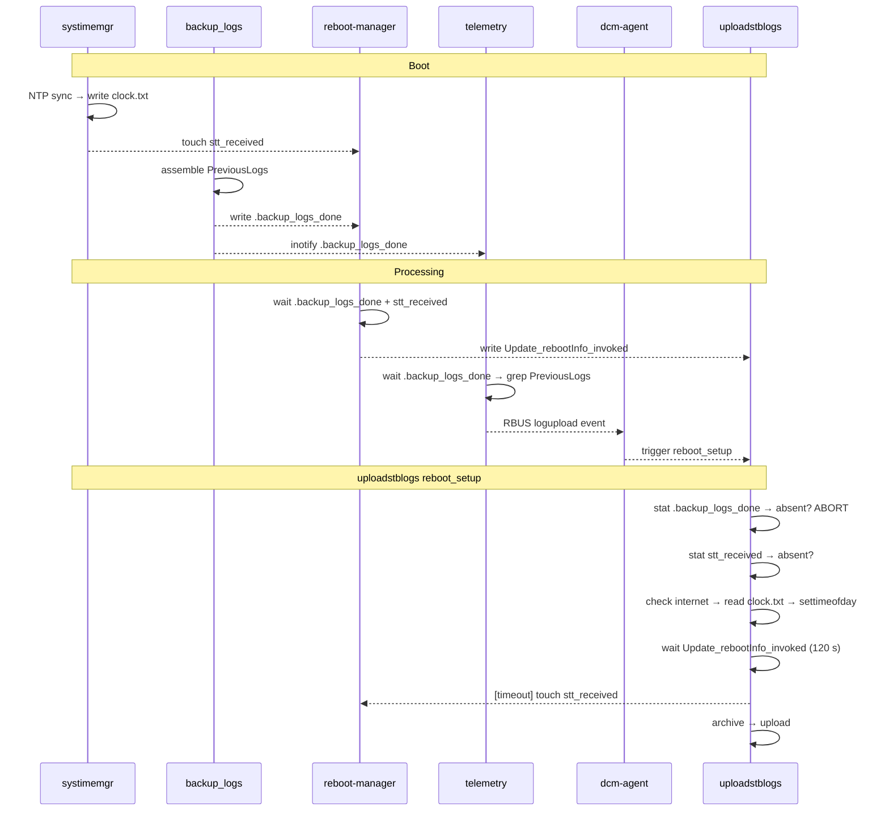

# Boot Synchronisation State Machine

Cross-repo sentinel flow for dcm-agent · reboot-manager · telemetry · systimemgr.

## High-Level Flow



---

## State Machine

```mermaid
flowchart LR
    BOOT([Boot])

    BOOT --> SYS & BL

    SYS["systimemgr\nNTP sync"]
    BL["backup_logs\nassemble PreviousLogs"]

    SYS -->|touch| STT[/stt_received/]
    SYS -->|write| CLK[/clock.txt/]
    BL  -->|write| BLD[/.backup_logs_done/]

    STT -->|gate|        RM["reboot-manager\nupdate reboot info"]
    BLD -->|inotify 60s| RM
    BLD -->|inotify 60s| TEL["telemetry\ngrep PreviousLogs"]

    RM  -->|write| RBI[/Update_rebootInfo_invoked/]
    TEL -->|RBUS event| DCM["dcm-agent"]

    RBI -->|inotify|         UL_WAIT
    DCM -->|trigger logupload| UL_START

    subgraph UL [uploadstblogs · reboot_setup]
        direction TB
        UL_START([start]) --> G1{".backup_logs_done\npresent?"}
        G1 -- absent  --> ABORT([ABORT])
        G1 -- present --> G2{"stt_received\npresent?"}
        G2 -- absent  --> NTP["check internet\nread clock.txt\nor annotate"]
        G2 -- present --> UL_WAIT{"wait Update_rebootInfo_invoked\n⏱ 120 s"}
        NTP --> UL_WAIT
        UL_WAIT -- ok      --> DONE([archive / upload])
        UL_WAIT -- timeout --> TRIG["touch stt_received\nannotate"]
        TRIG --> DONE
    end

    CLK -.->|fallback read| NTP
    TRIG -.->|re-trigger| RM
```

## Sentinel Reference

| File | Written by | Consumed by | Mechanism |
|---|---|---|---|
| `/tmp/.backup_logs_done` | `backup_logs` (dcm-agent) | reboot-manager, telemetry, uploadstblogs | inotify wait / stat gate |
| `/tmp/stt_received` | `systimemgr` (on NTP sync) | reboot-manager (STT gate), uploadstblogs (NTP check); **touched by uploadstblogs** on reboot-reason timeout | stat / touch |
| `/tmp/Update_rebootInfo_invoked` | `reboot-manager` | uploadstblogs | inotify wait |
| `/opt/secure/clock.txt` | `systimemgr` (RdkDefaultTimeSync) | uploadstblogs (last-known-good time fallback) | fopen / fgets |
| `/tmp/.telemetry_prevlogs_done` | `telemetry` (dcautil.c) | uploadstblogs (stat — TASK-G2 pending) | stat |

## Annotation Codes (`SessionState.upload_annotations` bitmask)

| Bit | Constant | Meaning |
|---|---|---|
| 0 | `ANNOTATION_REBOOT_REASON_UNAVAILABLE` | `Update_rebootInfo_invoked` absent after 120 s; upload proceeds without confirmed reboot reason |
| 1 | `ANNOTATION_NTP_UNAVAILABLE` | NTP absent and internet unreachable; archive timestamps use raw system clock |
