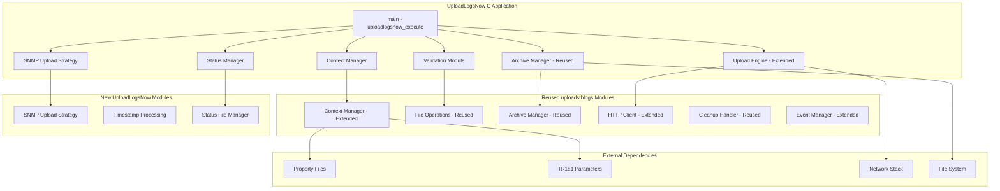
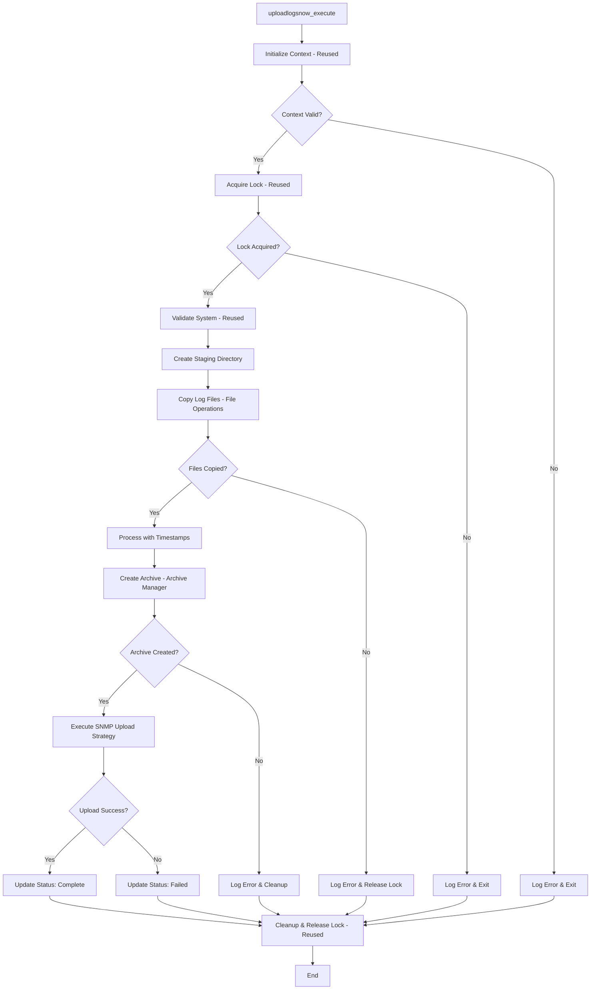
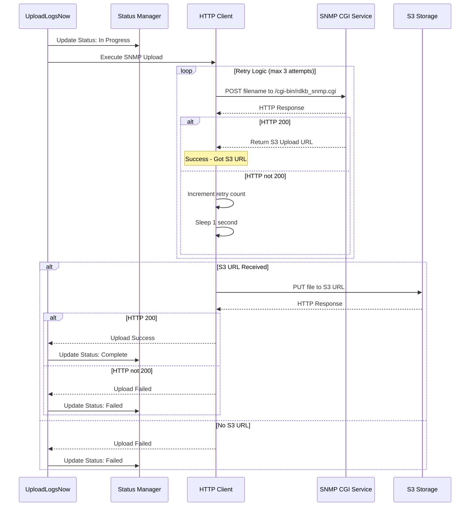

# High-Level Design: UploadLogsNow.sh Migration to C Code

## 1. Overview

### 1.1 Purpose
This document provides a High-Level Design (HLD) for migrating the UploadLogsNow.sh shell script to C code, leveraging the proven architecture patterns established in the existing uploadstblogs C implementation.

### 1.2 Scope
- Migration of UploadLogsNow.sh functionality to C implementation
- Reuse and extend uploadstblogs architectural patterns and modules
- Maintain compatibility with existing DCM agent system
- Optimize for embedded platform constraints (low memory, limited CPU)
- Ensure platform-neutral and portable code design

### 1.3 Goals
- **Performance**: Reduce memory footprint and CPU usage
- **Reliability**: Improved error handling and robustness
- **Maintainability**: Modular C code structure following uploadstblogs patterns
- **Compatibility**: Seamless integration with existing RDK components
- **Reusability**: Leverage existing uploadstblogs modules and interfaces

## 2. Current Script Analysis

### 2.1 Functional Overview
UploadLogsNow.sh is a lightweight log upload utility that provides immediate log upload functionality via SNMP/TR69 triggers. It performs the following core functions:

1. **Configuration Loading**: Sources environment and device properties
2. **Log Collection**: Copies logs from LOG_PATH to DCM_LOG_PATH staging area
3. **File Processing**: Adds timestamps to log files (excluding already timestamped files)
4. **Archive Creation**: Creates compressed tar.gz archive
5. **HTTP Upload**: Two-phase upload process (S3 URL request + file upload)
6. **Status Management**: Updates upload status file throughout the process
7. **Cleanup**: Removes temporary staging directory

### 2.2 Dependencies
- `/etc/include.properties` - System paths and configuration
- `/etc/device.properties` - Device-specific configuration
- `$RDK_PATH/utils.sh` - Utility functions (getMacAddressOnly)
- `$RDK_PATH/logfiles.sh` - Log file definitions
- `$RDK_PATH/interfaceCalls.sh` - Interface functions (non-mediaclient only)

### 2.3 Key Variables and Paths
```c
// Leveraging uploadstblogs types and constants
#define MAX_PATH_LENGTH      512    // From uploadstblogs_types.h
#define MAX_URL_LENGTH       1024   // From uploadstblogs_types.h
#define MAX_MAC_LENGTH       32     // From uploadstblogs_types.h
#define LOG_UPLOADSTB        "LOG.RDK.UPLOADSTB"  // Standard RDK logging

// UploadLogsNow specific constants
#define UPLOADLOGSNOW_DEFAULT_RETRIES    3
#define UPLOADLOGSNOW_TIMEOUT_CONNECT    10
#define UPLOADLOGSNOW_TIMEOUT_TRANSFER   120
#define UPLOADLOGSNOW_STATUS_FILE        "/opt/loguploadstatus.txt"
```

### 2.4 Input/Output Analysis
**Inputs:**
- Environment variables from property files
- Log files from LOG_PATH directory
- TR181 parameters (SSR URL configuration)
- OCSP configuration flags

**Outputs:**
- Compressed log archive (.tgz file)
- Upload status file (`/opt/loguploadstatus.txt`)
- Log entries to dcmscript.log
- HTTP requests to cloud endpoints

## 3. Architecture Design

### 3.1 High-Level Architecture - Leveraging uploadstblogs Foundation



### 3.2 Module Architecture Strategy

The UploadLogsNow migration will follow the **composition over inheritance** approach established in uploadstblogs:

1. **Reuse Existing Modules**: Context Manager, File Operations, Archive Manager, Cleanup Handler
2. **Extend Existing Modules**: Upload Engine (add SNMP strategy), Event Manager (add status events)
3. **New Specialized Modules**: SNMP Upload Strategy, Timestamp Processing, Status File Manager

### 3.3 Module Breakdown - Leveraging uploadstblogs Architecture

#### 3.3.1 Reused Modules (from uploadstblogs)

**Context Manager** (Extended from uploadstblogs)
```c
// Extend existing RuntimeContext with UploadLogsNow specifics
typedef struct {
    RuntimeContext base;        // Inherit from uploadstblogs
    char ssr_url[MAX_URL_LENGTH];
    bool ocsp_stapling_enabled;
    bool ocsp_enabled;
    char status_file_path[MAX_PATH_LENGTH];
} UploadLogsNowContext;

bool uploadlogsnow_init_context(UploadLogsNowContext* ctx);
bool load_snmp_configuration(UploadLogsNowContext* ctx);
```

**File Operations** (Direct Reuse from uploadstblogs)
```c
// Already available in uploadstblogs/include/file_operations.h
bool file_exists(const char* filepath);
bool create_directory(const char* dirpath);
bool copy_file(const char* src, const char* dest);
bool join_path(char* buffer, size_t buffer_size, const char* dir, const char* filename);
```

**Archive Manager** (Direct Reuse from uploadstblogs)
```c
// Already available in uploadstblogs/include/archive_manager.h
bool create_archive(const char* source_dir, const char* archive_path);
bool add_timestamp_to_files(const char* directory);
```

#### 3.3.2 Extended Modules

**Upload Engine** (Extended from uploadstblogs)
```c
// Add SNMP upload strategy to existing upload engine
typedef enum {
    UPLOAD_STRATEGY_MTLS,      // Existing from uploadstblogs
    UPLOAD_STRATEGY_OAUTH,     // Existing from uploadstblogs  
    UPLOAD_STRATEGY_SNMP       // New for UploadLogsNow
} UploadStrategy;

bool upload_via_snmp(const char* filename, UploadLogsNowContext* ctx);
```

**Event Manager** (Extended from uploadstblogs)
```c
// Extend existing event manager with UploadLogsNow events
typedef enum {
    EVENT_UPLOADLOGSNOW_START = 100,    // New event range
    EVENT_UPLOADLOGSNOW_COMPLETE,
    EVENT_UPLOADLOGSNOW_FAILED
} UploadLogsNowEvent;

void emit_uploadlogsnow_event(UploadLogsNowEvent event, const char* details);
```

#### 3.3.3 New Specialized Modules

**SNMP Upload Strategy**
```c
typedef struct {
    char cloud_url[MAX_URL_LENGTH];
    char upload_url[MAX_URL_LENGTH];
    int retry_count;
    int http_code;
    bool use_ocsp;
} SNMPUploadContext;

typedef enum {
    SNMP_UPLOAD_SUCCESS = 0,
    SNMP_UPLOAD_FAILED = 1,
    SNMP_UPLOAD_NETWORK_ERROR = 2,
    SNMP_UPLOAD_TIMEOUT = 3
} SNMPUploadResult;

SNMPUploadResult snmp_upload_execute(const char* filename, UploadLogsNowContext* ctx);
int request_s3_upload_url(const char* filename, char* upload_url, size_t url_size);
int upload_file_to_s3(const char* filepath, const char* upload_url);
```

**Timestamp Processing Module**
```c
typedef struct {
    char timestamp_prefix[MAX_TIMESTAMP_LENGTH];
    int processed_files;
    int skipped_files;
} TimestampContext;

bool is_already_timestamped(const char* filename);
bool add_timestamp_prefix(const char* source_dir, TimestampContext* ctx);
```

**Status File Manager**
```c
typedef enum {
    STATUS_TRIGGERED,
    STATUS_IN_PROGRESS, 
    STATUS_COMPLETE,
    STATUS_FAILED
} UploadLogsNowStatus;

bool update_status_file(UploadLogsNowStatus status);
bool write_status_message(const char* message);
```

## 4. Data Flow Design - Following uploadstblogs Patterns

### 4.1 Main Execution Flow (Following uploadstblogs Strategy Pattern)



### 4.2 SNMP Upload Strategy Flow (New Implementation)



## 5. Integration with uploadstblogs Architecture

### 5.1 Code Reuse Strategy

The UploadLogsNow migration will maximize code reuse from the existing uploadstblogs implementation:

| Module | Reuse Level | Approach |
|--------|-------------|----------|
| Context Manager | Extended | Add SNMP-specific configuration to existing RuntimeContext |
| File Operations | Direct Reuse | Use existing file_operations.h/c without changes |
| Archive Manager | Direct Reuse | Use existing archive_manager.h/c for compression |
| Upload Engine | Extended | Add SNMP strategy to existing upload strategies |
| Event Manager | Extended | Add UploadLogsNow events to existing event system |
| Cleanup Handler | Direct Reuse | Use existing cleanup_handler.h/c |
| Validation | Extended | Add UploadLogsNow-specific validations |

### 5.2 Shared Data Structures

```c
// Extend existing uploadstblogs types
#include "uploadstblogs_types.h"

// UploadLogsNow specific context extending RuntimeContext
typedef struct {
    RuntimeContext base;                    // Inherit all uploadstblogs context
    
    // SNMP upload specific fields
    char ssr_url[MAX_URL_LENGTH];
    char cloud_url[MAX_URL_LENGTH];
    bool ocsp_stapling_enabled;
    bool ocsp_enabled;
    char status_file_path[MAX_PATH_LENGTH];
    
    // Timestamp processing
    char timestamp_prefix[MAX_TIMESTAMP_LENGTH];
    
} UploadLogsNowContext;

// Strategy enumeration extension
typedef enum {
    // Existing uploadstblogs strategies
    STRAT_RRD = 0,
    STRAT_PRIVACY_ABORT,
    STRAT_NO_LOGS,
    STRAT_NON_DCM,
    STRAT_ONDEMAND,
    STRAT_REBOOT,
    STRAT_DCM,
    
    // New UploadLogsNow strategy
    STRAT_SNMP_UPLOAD = 100
} Strategy;
```

### 5.3 API Integration

The UploadLogsNow functionality will be accessible through both direct API calls and as a strategy within the uploadstblogs framework:

```c
// Direct API (similar to uploadstblogs_run)
int uploadlogsnow_execute(void);

// Integration with uploadstblogs strategy framework
typedef struct {
    bool snmp_trigger;               // Indicate SNMP/TR69 trigger
    char ssr_url_override[MAX_URL_LENGTH];  // Override SSR URL if needed
} SNMPUploadParams;

// Strategy handler for SNMP uploads within uploadstblogs
bool handle_snmp_strategy(RuntimeContext* ctx, SessionState* session, SNMPUploadParams* params);
```

### 5.4 Build Integration

The UploadLogsNow implementation will integrate with the existing uploadstblogs build system:

```makefile
# Extend existing uploadstblogs Makefile.am

# Conditional compilation for UploadLogsNow
if ENABLE_UPLOADLOGSNOW
libuploadstblogs_la_SOURCES += \
    snmp_upload_strategy.c \
    timestamp_processor.c \
    status_file_manager.c

bin_PROGRAMS += uploadlogsnow
uploadlogsnow_SOURCES = uploadlogsnow_main.c
uploadlogsnow_LDADD = libuploadstblogs.la
endif

# Shared headers
include_HEADERS += \
    snmp_upload_strategy.h \
    timestamp_processor.h \
    status_file_manager.h
```

## 6. Key Algorithms and Data Structures - Aligned with uploadstblogs

### 6.1 Timestamp Processing Algorithm (Extended from uploadstblogs patterns)

```c
// Leverage uploadstblogs pattern matching approach
typedef struct {
    const char* pattern_name;
    bool (*match_func)(const char* filename);
    bool should_skip;
} TimestampPattern;

static bool match_am_pattern(const char* filename) {
    // Match: .*-[0-9][0-9]AM-.*
    return strstr(filename, "AM-") != NULL;
}

static bool match_pm_pattern(const char* filename) {
    // Match: .*-[0-9][0-9]PM-.*
    return strstr(filename, "PM-") != NULL;
}

static bool match_reboot_log(const char* filename) {
    // Check against rebootLog pattern (from script variables)
    return strstr(filename, "reboot") != NULL;
}

static TimestampPattern timestamp_patterns[] = {
    {"AM_PATTERN", match_am_pattern, true},
    {"PM_PATTERN", match_pm_pattern, true},
    {"REBOOT_LOG", match_reboot_log, true},
    {NULL, NULL, false}
};

bool is_already_timestamped(const char* filename) {
    for (int i = 0; timestamp_patterns[i].pattern_name != NULL; i++) {
        if (timestamp_patterns[i].match_func(filename)) {
            return timestamp_patterns[i].should_skip;
        }
    }
    return false;
}
```

### 6.2 SNMP Upload Strategy Implementation

```c
// Following uploadstblogs strategy pattern
typedef struct {
    char cloud_url[MAX_URL_LENGTH];      // Built from SSR_URL + /cgi-bin/rdkb_snmp.cgi
    char s3_upload_url[MAX_URL_LENGTH];  // Received from SNMP response
    int retry_count;
    int http_code;
    bool use_ocsp_stapling;
    bool use_ocsp;
    char filename[MAX_FILENAME_LENGTH];
} SNMPUploadSession;

// Result enumeration following uploadstblogs pattern
typedef enum {
    SNMP_UPLOAD_SUCCESS = 0,
    SNMP_UPLOAD_FAILED = 1,
    SNMP_UPLOAD_NETWORK_ERROR = 2,
    SNMP_UPLOAD_TIMEOUT = 3,
    SNMP_UPLOAD_RETRY_NEEDED = 4
} SNMPUploadResult;

SNMPUploadResult execute_snmp_upload_strategy(UploadLogsNowContext* ctx, 
                                             const char* archive_path);
```

### 6.3 Error Handling Strategy - Aligned with uploadstblogs

```c
// Use uploadstblogs error handling patterns
#include "uploadstblogs_types.h"

// Extend existing UploadResult for UploadLogsNow
typedef enum {
    // Existing uploadstblogs results
    UPLOADSTB_SUCCESS = 0,
    UPLOADSTB_FAILED = 1,
    UPLOADSTB_ABORTED = 2,
    
    // UploadLogsNow specific results
    UPLOADLOGSNOW_SUCCESS = 100,
    UPLOADLOGSNOW_CONFIG_ERROR = 101,
    UPLOADLOGSNOW_NETWORK_ERROR = 102,
    UPLOADLOGSNOW_FILE_ERROR = 103,
    UPLOADLOGSNOW_TIMEOUT = 104
} UploadLogsNowResult;

// Leverage existing RDK logging from uploadstblogs
#define UPLOADLOGSNOW_LOG_ERROR(fmt, ...) \
    RDK_LOG(RDK_LOG_ERROR, LOG_UPLOADSTB, "[UPLOADLOGSNOW][%s:%d] " fmt, \
            __FUNCTION__, __LINE__, ##__VA_ARGS__)

#define UPLOADLOGSNOW_LOG_INFO(fmt, ...) \
    RDK_LOG(RDK_LOG_INFO, LOG_UPLOADSTB, "[UPLOADLOGSNOW][%s:%d] " fmt, \
            __FUNCTION__, __LINE__, ##__VA_ARGS__)
```

### 6.4 Context Data Structure - Extending uploadstblogs

```c
// Extend existing RuntimeContext from uploadstblogs
typedef struct {
    // Base context from uploadstblogs (all existing fields)
    RuntimeContext base;
    
    // UploadLogsNow specific extensions
    struct {
        char ssr_url[MAX_URL_LENGTH];
        char ssr_default[MAX_URL_LENGTH];
        char cloud_url[MAX_URL_LENGTH];
        bool ocsp_stapling_enabled;
        bool ocsp_enabled;
    } snmp_config;
    
    struct {
        char status_file_path[MAX_PATH_LENGTH];
        char current_status[128];
    } status_mgmt;
    
    struct {
        char timestamp_prefix[MAX_TIMESTAMP_LENGTH];
        int processed_count;
        int skipped_count;
    } timestamp_info;
    
} UploadLogsNowContext;
```

## 7. Integration Points - Leveraging uploadstblogs Infrastructure

### 7.1 DCM Agent Integration
- **Interface**: Extend existing uploadstblogs API with UploadLogsNow functionality
- **Logging**: Reuse existing RDK logging system (LOG_UPLOADSTB)
- **Configuration**: Leverage existing context management and TR-181 integration
- **Scheduler**: Integrate with DCM scheduler using uploadstblogs patterns

### 7.2 System Dependencies - Shared with uploadstblogs
- **libcurl**: HTTP client functionality (already integrated in uploadstblogs)
- **libz**: Compression functionality (already integrated in uploadstblogs)
- **RBUS**: TR-181 parameter access (already integrated in uploadstblogs)
- **RDK Logger**: Unified logging system (already integrated in uploadstblogs)

### 7.3 Property System Integration - Extended from uploadstblogs
```c
// Leverage existing uploadstblogs property integration
#include "context_manager.h"  // From uploadstblogs

// UploadLogsNow specific property extensions
bool load_snmp_properties(UploadLogsNowContext* ctx) {
    // Reuse base property loading from uploadstblogs
    if (!load_environment(&ctx->base)) {
        return false;
    }
    
    // Add SNMP-specific property loading
    if (!get_tr181_value("Device.DeviceInfo.X_RDKCENTRAL-COM_RFC.LogUpload.SsrUrl",
                        ctx->snmp_config.ssr_url, MAX_URL_LENGTH)) {
        strncpy(ctx->snmp_config.ssr_url, ctx->snmp_config.ssr_default, MAX_URL_LENGTH);
    }
    
    return true;
}
```

### 7.4 File Operations Integration - Direct Reuse
```c
// Direct reuse of uploadstblogs file operations
#include "file_operations.h"  // From uploadstblogs

// Example usage in UploadLogsNow context
bool copy_logs_for_snmp_upload(UploadLogsNowContext* ctx) {
    // Create staging directory using uploadstblogs functionality
    if (!create_directory(ctx->base.dcm_log_path)) {
        UPLOADLOGSNOW_LOG_ERROR("Failed to create staging directory: %s", 
                               ctx->base.dcm_log_path);
        return false;
    }
    
    // Use existing copy functionality
    return copy_all_files(&ctx->base);
}
```

## 8. Memory Management Strategy - Following uploadstblogs Patterns

### 8.1 Memory Allocation Policy
Following the established uploadstblogs memory management approach:

- **Static Allocation**: Use fixed-size buffers following uploadstblogs_types.h constants
- **Stack Allocation**: Prefer stack allocation for temporary variables
- **Context-Based**: All state managed through context structures (like RuntimeContext)
- **No Dynamic Allocation**: Avoid malloc/free to prevent memory leaks (established pattern)

### 8.2 Buffer Management - Aligned with uploadstblogs
```c
// Use existing uploadstblogs buffer sizes and patterns
#include "uploadstblogs_types.h"

// UploadLogsNowContext uses established buffer sizes
typedef struct {
    RuntimeContext base;                           // Reuse existing memory layout
    
    // Additional buffers following uploadstblogs sizing
    char ssr_url[MAX_URL_LENGTH];                 // 1024 bytes (from uploadstblogs_types.h)
    char cloud_url[MAX_URL_LENGTH];               // 1024 bytes
    char status_file_path[MAX_PATH_LENGTH];       // 512 bytes (from uploadstblogs_types.h)
    char timestamp_prefix[32];                    // Fixed size for timestamps
    char temp_buffer[256];                        // Temporary operations
    
} UploadLogsNowContext;

// Memory footprint estimation:
// - Base RuntimeContext: ~8KB (from uploadstblogs)  
// - UploadLogsNow extensions: ~3KB
// - Total: ~11KB (well within embedded constraints)
```

### 8.3 Resource Management - Extended from uploadstblogs
```c
// Follow uploadstblogs resource management patterns
bool uploadlogsnow_init_resources(UploadLogsNowContext* ctx) {
    // Initialize base resources using uploadstblogs patterns
    if (!init_context(&ctx->base)) {
        return false;
    }
    
    // Initialize UploadLogsNow specific resources
    memset(&ctx->snmp_config, 0, sizeof(ctx->snmp_config));
    memset(&ctx->status_mgmt, 0, sizeof(ctx->status_mgmt));
    memset(&ctx->timestamp_info, 0, sizeof(ctx->timestamp_info));
    
    return true;
}

void uploadlogsnow_cleanup_resources(UploadLogsNowContext* ctx) {
    // Cleanup using uploadstblogs patterns
    cleanup_context();  // From uploadstblogs context_manager
    
    // UploadLogsNow specific cleanup (no dynamic allocations to free)
}
```

## 9. Error Handling and Logging - Following uploadstblogs Standards

### 9.1 Error Categories - Aligned with uploadstblogs
Following the established error handling patterns in uploadstblogs:

1. **Configuration Errors**: Invalid property files, missing TR-181 parameters
2. **File System Errors**: Permission denied, disk full, file not found  
3. **Network Errors**: Connection timeout, DNS resolution failure, HTTP errors
4. **Archive Errors**: Compression failure, insufficient space (using uploadstblogs archive_manager)
5. **SNMP Specific Errors**: SSR URL invalid, S3 pre-sign failure, OCSP validation failure

### 9.2 Logging Strategy - Reuse uploadstblogs Infrastructure
```c
// Use existing uploadstblogs logging infrastructure
#include "uploadstblogs_types.h"  // Defines LOG_UPLOADSTB

// UploadLogsNow logging macros following uploadstblogs patterns
#define UPLOADLOGSNOW_LOG_ERROR(fmt, ...) \
    RDK_LOG(RDK_LOG_ERROR, LOG_UPLOADSTB, "[UPLOADLOGSNOW][%s:%d] " fmt, \
            __FUNCTION__, __LINE__, ##__VA_ARGS__)

#define UPLOADLOGSNOW_LOG_WARN(fmt, ...) \
    RDK_LOG(RDK_LOG_WARN, LOG_UPLOADSTB, "[UPLOADLOGSNOW][%s:%d] " fmt, \
            __FUNCTION__, __LINE__, ##__VA_ARGS__)

#define UPLOADLOGSNOW_LOG_INFO(fmt, ...) \
    RDK_LOG(RDK_LOG_INFO, LOG_UPLOADSTB, "[UPLOADLOGSNOW][%s:%d] " fmt, \
            __FUNCTION__, __LINE__, ##__VA_ARGS__)

// Status file logging (matches original script behavior)
#define UPDATE_STATUS_FILE(status) \
    write_status_message(status " " get_timestamp())
```

### 9.3 Error Propagation - Following uploadstblogs Patterns
```c
// Use uploadstblogs result enumeration pattern
typedef enum {
    UPLOADLOGSNOW_SUCCESS = 0,
    UPLOADLOGSNOW_ERROR_CONFIG = 1,
    UPLOADLOGSNOW_ERROR_NETWORK = 2,  
    UPLOADLOGSNOW_ERROR_FILE = 3,
    UPLOADLOGSNOW_ERROR_ARCHIVE = 4,
    UPLOADLOGSNOW_ERROR_SNMP = 5
} UploadLogsNowResult;

// Error handling following uploadstblogs function signature patterns
UploadLogsNowResult execute_snmp_upload(UploadLogsNowContext* ctx) {
    if (!validate_snmp_config(ctx)) {
        UPLOADLOGSNOW_LOG_ERROR("SNMP configuration validation failed");
        return UPLOADLOGSNOW_ERROR_CONFIG;
    }
    
    // Continue with upload logic...
    return UPLOADLOGSNOW_SUCCESS;
}
```

## 10. Performance Considerations - Leveraging uploadstblogs Optimizations

### 10.1 Optimization Targets - Aligned with uploadstblogs
Following the performance characteristics established in uploadstblogs:

- **Memory Usage**: ~11KB resident memory (uploadstblogs base ~8KB + UploadLogsNow ~3KB)
- **CPU Usage**: Minimal overhead leveraging existing uploadstblogs optimizations
- **Startup Time**: < 50ms initialization (reusing uploadstblogs context initialization)
- **Network Efficiency**: Leverage existing curl optimization in uploadstblogs

### 10.2 Performance Benefits from Code Reuse
By leveraging the uploadstblogs architecture:

1. **Reduced Code Path**: Reusing tested and optimized modules
2. **Shared Resources**: Single initialization of curl, RBUS, logging systems  
3. **Memory Efficiency**: Shared context structures and buffer management
4. **Network Optimization**: Reuse existing connection pooling and timeout strategies

### 10.3 Embedded Platform Optimizations - Inherited from uploadstblogs
```c
// Leverage existing uploadstblogs optimizations:

// 1. Efficient file operations (from file_operations.h)
bool copy_logs_efficiently(UploadLogsNowContext* ctx) {
    // Reuse optimized copy functions from uploadstblogs
    return copy_all_files(&ctx->base);  // Already optimized for embedded platforms
}

// 2. Network efficiency (from upload_engine.h)  
bool upload_with_optimization(UploadLogsNowContext* ctx, const char* archive) {
    // Leverage existing curl optimizations in uploadstblogs upload_engine
    return execute_snmp_upload_strategy(ctx, archive);
}

// 3. Memory management (from uploadstblogs patterns)
// - No dynamic allocation (established pattern in uploadstblogs)
// - Fixed-size buffers (using uploadstblogs_types.h constants)
// - Context-based state management (following RuntimeContext pattern)
```

### 10.4 SNMP Upload Specific Optimizations
```c
// Optimizations specific to SNMP upload strategy
typedef struct {
    // Connection reuse for two-phase upload
    void* curl_handle;              // Reuse connection between S3 URL request and upload
    char* response_buffer;          // Pre-allocated buffer for HTTP responses
    size_t response_buffer_size;
    bool keep_connection_alive;
} SNMPConnectionContext;

// Timeout optimization for SNMP uploads
#define SNMP_CONNECT_TIMEOUT    10  // Quick connect for URL request
#define SNMP_UPLOAD_TIMEOUT     120 // Longer timeout for file upload
#define SNMP_MAX_RETRIES        3   // Balanced retry count
```

## 11. Security Considerations - Extending uploadstblogs Security Model

### 11.1 Security Framework Reuse
Leverage the established security infrastructure from uploadstblogs:

- **Certificate Management**: Reuse existing TLS/mTLS certificate handling
- **OCSP Validation**: Extend existing OCSP support for SNMP uploads
- **Input Validation**: Apply uploadstblogs validation patterns to SNMP parameters
- **Path Sanitization**: Reuse existing path validation from file_operations.h

### 11.2 SNMP Upload Security Extensions
```c
// Extend uploadstblogs security for SNMP uploads
typedef struct {
    bool ocsp_stapling_required;     // From original script
    bool ocsp_validation_required;   // From original script  
    char cert_status_file[MAX_PATH_LENGTH];
    bool validate_ssr_url;          // Validate SSR URL format and domain
} SNMPSecurityContext;

bool validate_snmp_security(UploadLogsNowContext* ctx) {
    // Reuse uploadstblogs URL validation patterns
    if (!validate_url_format(ctx->snmp_config.ssr_url)) {
        UPLOADLOGSNOW_LOG_ERROR("Invalid SSR URL format");
        return false;
    }
    
    // Apply OCSP validation using uploadstblogs infrastructure
    if (ctx->snmp_config.ocsp_stapling_enabled || ctx->snmp_config.ocsp_enabled) {
        return validate_ocsp_configuration(ctx);
    }
    
    return true;
}
```

### 11.3 Input Validation - Following uploadstblogs Patterns
```c
// Apply uploadstblogs validation patterns to SNMP inputs
bool validate_snmp_inputs(UploadLogsNowContext* ctx) {
    // Validate SSR URL (extend uploadstblogs URL validation)
    if (!is_valid_https_url(ctx->snmp_config.ssr_url)) {
        UPLOADLOGSNOW_LOG_ERROR("SSR URL must be valid HTTPS URL");
        return false;
    }
    
    // Validate file paths using uploadstblogs path validation
    if (!validate_path_safety(ctx->base.log_path) || 
        !validate_path_safety(ctx->base.dcm_log_path)) {
        UPLOADLOGSNOW_LOG_ERROR("Invalid or unsafe file paths detected");
        return false;
    }
    
    return true;
}
```

### 11.4 Network Security - Extending uploadstblogs Network Layer
```c
// Extend existing uploadstblogs curl configuration for SNMP
bool configure_snmp_curl_security(CURL* curl, UploadLogsNowContext* ctx) {
    // Apply uploadstblogs SSL/TLS settings
    apply_uploadstblogs_ssl_config(curl);
    
    // Add SNMP-specific security settings
    if (ctx->snmp_config.ocsp_stapling_enabled) {
        curl_easy_setopt(curl, CURLOPT_SSL_OPTIONS, CURLSSLOPT_ALLOW_BEAST);
        curl_easy_setopt(curl, CURLOPT_SSL_ENABLE_CERT_STATUS_CHECK, 1L);
    }
    
    // Apply timeout settings for security (prevent hanging)
    curl_easy_setopt(curl, CURLOPT_CONNECTTIMEOUT, SNMP_CONNECT_TIMEOUT);
    curl_easy_setopt(curl, CURLOPT_TIMEOUT, SNMP_UPLOAD_TIMEOUT);
    
    return true;
}
```

## 12. Testing Strategy - Extending uploadstblogs Test Framework

### 12.1 Unit Testing - Reusing uploadstblogs Infrastructure
Leverage the existing uploadstblogs testing framework and patterns:

```cpp
// Extend existing uploadstblogs unit tests
#include "uploadstblogs_gtest.h"  // Existing test infrastructure

// UploadLogsNow specific unit tests
class UploadLogsNowTest : public ::testing::Test {
protected:
    void SetUp() override {
        // Reuse uploadstblogs test setup patterns
        init_test_context(&ctx.base);
        init_uploadlogsnow_context(&ctx);
    }
    
    void TearDown() override {
        cleanup_test_context(&ctx.base);
    }
    
    UploadLogsNowContext ctx;
};

TEST_F(UploadLogsNowTest, SNMPUploadStrategy_Success) {
    // Test SNMP upload strategy using existing mock patterns
    EXPECT_TRUE(execute_snmp_upload_strategy(&ctx, "/tmp/test.tgz"));
}

TEST_F(UploadLogsNowTest, TimestampProcessing_SkipExisting) {
    // Test timestamp processing logic
    EXPECT_TRUE(is_already_timestamped("test-01AM-file.log"));
    EXPECT_FALSE(is_already_timestamped("test.log"));
}
```

### 12.2 Integration Testing - Extend uploadstblogs Test Suite
```cpp
// Extend existing integration tests
class UploadLogsNowIntegrationTest : public UploadSTBLogsIntegrationTest {
    // Inherit from uploadstblogs integration test base
protected:
    void test_snmp_upload_end_to_end() {
        // Use existing test infrastructure with SNMP strategy
        setup_test_environment();
        create_test_log_files();
        
        // Execute UploadLogsNow functionality
        int result = uploadlogsnow_execute();
        EXPECT_EQ(0, result);
        
        verify_upload_success();
        cleanup_test_environment();
    }
};
```

### 12.3 Mock Integration - Reuse uploadstblogs Mocks
```cpp
// Extend existing mocks for SNMP functionality
#include "mocks/mock_curl.h"      // Existing uploadstblogs mock
#include "mocks/mock_rbus.h"      // Existing uploadstblogs mock

// Add SNMP-specific mock behaviors
class MockSNMPUpload : public MockCurl {
public:
    MOCK_METHOD(CURLcode, snmp_url_request, (const char* filename), ());
    MOCK_METHOD(CURLcode, s3_file_upload, (const char* filepath, const char* url), ());
};
```

### 12.4 Test Coverage Strategy
Following uploadstblogs test coverage standards:

- **Target Coverage**: >80% (matching uploadstblogs standard)  
- **Focus Areas**: 
  - SNMP upload strategy implementation
  - Timestamp processing logic
  - Status file management
  - Error handling paths
  - Configuration loading extensions

### 12.5 Platform Testing - Leverage uploadstblogs CI/CD
```yaml
# Extend existing uploadstblogs CI/CD pipeline
name: UploadLogsNow Test Suite
extends: .uploadstblogs_test_template

test_matrix:
  - platform: rpi4
    test_type: unit_integration
  - platform: xi6
    test_type: unit_integration  
  - platform: container
    test_type: functional

test_commands:
  - make check-uploadlogsnow
  - ./unittest/uploadlogsnow_gtest
  - valgrind --leak-check=full ./uploadlogsnow
```

## 13. Build and Deployment - Extending uploadstblogs Build System

### 13.1 Build System Integration - Extend uploadstblogs
Leverage the existing uploadstblogs autotools infrastructure:

```bash
# configure.ac extension
# Extend existing uploadstblogs configure.ac
AC_ARG_ENABLE([uploadlogsnow],
    AS_HELP_STRING([--enable-uploadlogsnow], [Enable UploadLogsNow functionality]),
    [enable_uploadlogsnow=$enableval],
    [enable_uploadlogsnow=yes])

AM_CONDITIONAL([ENABLE_UPLOADLOGSNOW], [test "x$enable_uploadlogsnow" = "xyes"])

if test "x$enable_uploadlogsnow" = "xyes"; then
    AC_DEFINE([UPLOADLOGSNOW_ENABLED], [1], [UploadLogsNow functionality enabled])
fi
```

### 13.2 Makefile Integration - Extend uploadstblogs Makefile.am
```makefile
# Extend existing uploadstblogs/src/Makefile.am

# Conditional compilation for UploadLogsNow
if ENABLE_UPLOADLOGSNOW

# Add UploadLogsNow source files to existing library
libuploadstblogs_la_SOURCES += \
    snmp_upload_strategy.c \
    timestamp_processor.c \
    status_file_manager.c

# Add UploadLogsNow headers
include_HEADERS += \
    snmp_upload_strategy.h \
    timestamp_processor.h \
    status_file_manager.h

# Create uploadlogsnow binary using existing library
bin_PROGRAMS += uploadlogsnow
uploadlogsnow_SOURCES = uploadlogsnow_main.c
uploadlogsnow_CFLAGS = $(AM_CFLAGS) -DUPLOADLOGSNOW_BUILD_BINARY
uploadlogsnow_LDADD = libuploadstblogs.la

endif # ENABLE_UPLOADLOGSNOW

# Reuse existing uploadstblogs flags and dependencies
AM_CFLAGS = $(EXISTING_UPLOADSTBLOGS_CFLAGS) \
           -I$(top_srcdir)/include \
           -DRDK_LOGGER_ENABLED

AM_LDFLAGS = $(EXISTING_UPLOADSTBLOGS_LDFLAGS)
```

### 13.3 Dependency Management - Reuse uploadstblogs Dependencies
```makefile
# Dependencies already handled by uploadstblogs
# - libcurl (HTTP client)
# - libz (compression)
# - rbus (TR-181 access)  
# - rdk_logger (logging)

# UploadLogsNow inherits all existing dependencies
uploadlogsnow_LDADD = libuploadstblogs.la  # All deps included in library
```

### 13.4 Cross-Compilation - Inherit uploadstblogs Configuration
```bash
# Leverage existing uploadstblogs cross-compilation setup
# No additional configuration needed - inherits from uploadstblogs

# Example build commands (same as uploadstblogs)
./configure --host=arm-linux-gnueabihf \
           --enable-uploadlogsnow \
           --with-rdk-logger \
           --with-rbus

make uploadlogsnow  # Creates both library and binary
```

## 14. Migration Timeline and Dependencies - Leveraging uploadstblogs Foundation

### 14.1 Implementation Phases - Accelerated with Code Reuse
Given the existing uploadstblogs infrastructure, the migration can be accelerated:

1. **Phase 1** (1-2 weeks): Extend uploadstblogs context and configuration
   - Extend UploadLogsNowContext from RuntimeContext
   - Add SNMP-specific configuration loading
   - Reuse existing property and TR-181 infrastructure

2. **Phase 2** (1 week): Implement SNMP upload strategy  
   - Add SNMPUploadStrategy to existing strategy framework
   - Implement two-phase HTTP upload (URL request + file upload)
   - Reuse existing curl and HTTP infrastructure

3. **Phase 3** (1 week): File processing and timestamp handling
   - Implement timestamp processing module
   - Reuse existing file_operations and archive_manager
   - Add status file management

4. **Phase 4** (1 week): Integration and testing
   - Extend existing unit test framework
   - Integration with DCM agent
   - Performance validation

5. **Phase 5** (1 week): Platform validation and deployment
   - Leverage existing CI/CD pipeline
   - Cross-platform testing using uploadstblogs infrastructure
   - Documentation and deployment

**Total Estimated Timeline**: 5-6 weeks (vs 12-16 weeks for ground-up implementation)

### 14.2 Risk Mitigation - Leveraging Proven Architecture
Reduced risks through uploadstblogs architecture reuse:

- **Code Quality**: Reusing tested and proven modules from uploadstblogs
- **Platform Compatibility**: Inherit uploadstblogs cross-platform support
- **Performance**: Leverage existing optimization work
- **Maintenance**: Shared infrastructure reduces long-term maintenance burden

### 14.3 Dependencies - Already Resolved by uploadstblogs
All major dependencies already handled:

| Dependency | Status | Source |
|------------|--------|--------|
| libcurl | ✓ Resolved | uploadstblogs build system |
| libz | ✓ Resolved | uploadstblogs build system |
| RBUS | ✓ Resolved | uploadstblogs TR-181 integration |
| RDK Logger | ✓ Resolved | uploadstblogs logging system |
| Cross-compilation | ✓ Resolved | uploadstblogs autotools setup |
| Testing framework | ✓ Resolved | uploadstblogs unit/integration tests |

## 15. Future Enhancements - Building on uploadstblogs Foundation

### 15.1 Potential Improvements - Leveraging uploadstblogs Extensibility
The modular uploadstblogs architecture enables future enhancements:

1. **Strategy Unification**: Merge UploadLogsNow SNMP strategy into main uploadstblogs as a standard strategy
2. **Configuration Consolidation**: Unified configuration management across all upload scenarios  
3. **Enhanced Retry Logic**: Apply uploadstblogs advanced retry patterns to SNMP uploads
4. **Telemetry Integration**: Extend uploadstblogs telemetry framework for SNMP upload metrics

### 15.2 Extensibility Design - Following uploadstblogs Patterns
```c
// Future extensibility following uploadstblogs architecture
typedef enum {
    // Existing uploadstblogs strategies
    STRAT_NON_DCM,
    STRAT_ONDEMAND, 
    STRAT_REBOOT,
    STRAT_DCM,
    
    // Current UploadLogsNow addition
    STRAT_SNMP_UPLOAD,
    
    // Future enhancements
    STRAT_SNMP_ADVANCED,     // Enhanced SNMP with metrics
    STRAT_UNIFIED_UPLOAD,    // Unified strategy selection
    STRAT_ASYNC_UPLOAD       // Asynchronous upload operations
} EnhancedStrategy;

// Plugin architecture extending uploadstblogs patterns
typedef struct {
    const char* strategy_name;
    bool (*init)(RuntimeContext* ctx);
    bool (*execute)(RuntimeContext* ctx, SessionState* session);
    void (*cleanup)(RuntimeContext* ctx);
} StrategyPlugin;
```


**Document Version**: 2.0  
**Date**: January 13, 2026  
**Author**: GitHub Copilot  
**Review Status**: Updated to leverage uploadstblogs architecture  
**Dependencies**: uploadstblogs C implementation  
