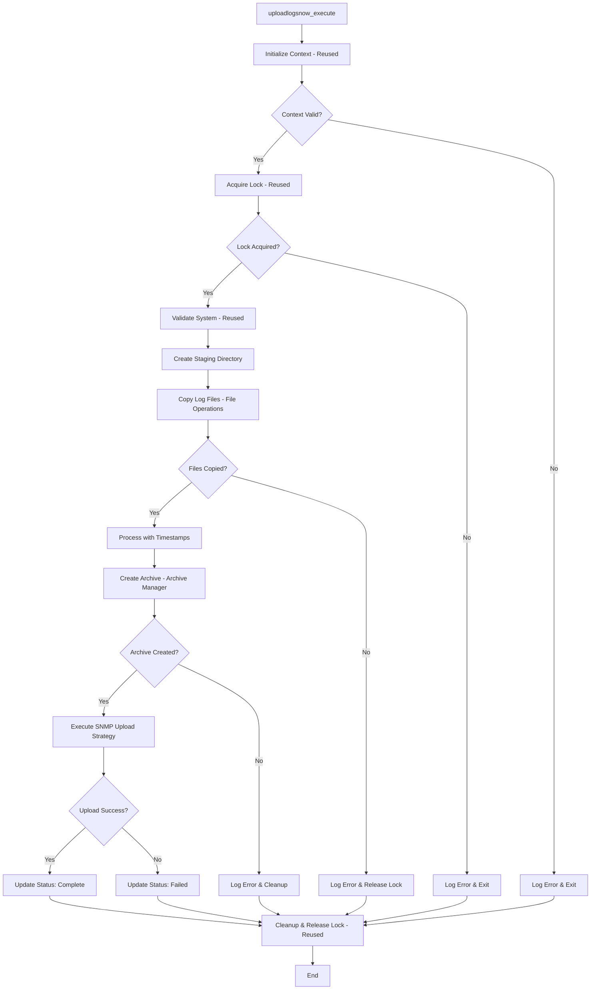

```mermaid
flowchart TD
    A[uploadlogsnow_execute] --> B[Initialize Context - Reused]
    B --> C{Context Valid?}
    C -->|No| D[Log Error & Exit]
    C -->|Yes| E[Acquire Lock - Reused]
    E --> F{Lock Acquired?}
    F -->|No| G[Log Error & Exit]
    F -->|Yes| H[Validate System - Reused]
    H --> I[Create Staging Directory]
    I --> J[Copy Log Files - File Operations]
    J --> K{Files Copied?}
    K -->|No| L[Log Error & Release Lock]
    K -->|Yes| M[Process with Timestamps]
    M --> N[Create Archive - Archive Manager]
    N --> O{Archive Created?}
    O -->|No| P[Log Error & Cleanup]
    O -->|Yes| Q[Execute SNMP Upload Strategy]
    Q --> R{Upload Success?}
    R -->|Yes| S[Update Status: Complete]
    R -->|No| T[Update Status: Failed]
    S --> U[Cleanup & Release Lock - Reused]
    T --> U
    P --> U
    L --> U
    G --> U
    D --> U
    U --> V[End]
```
