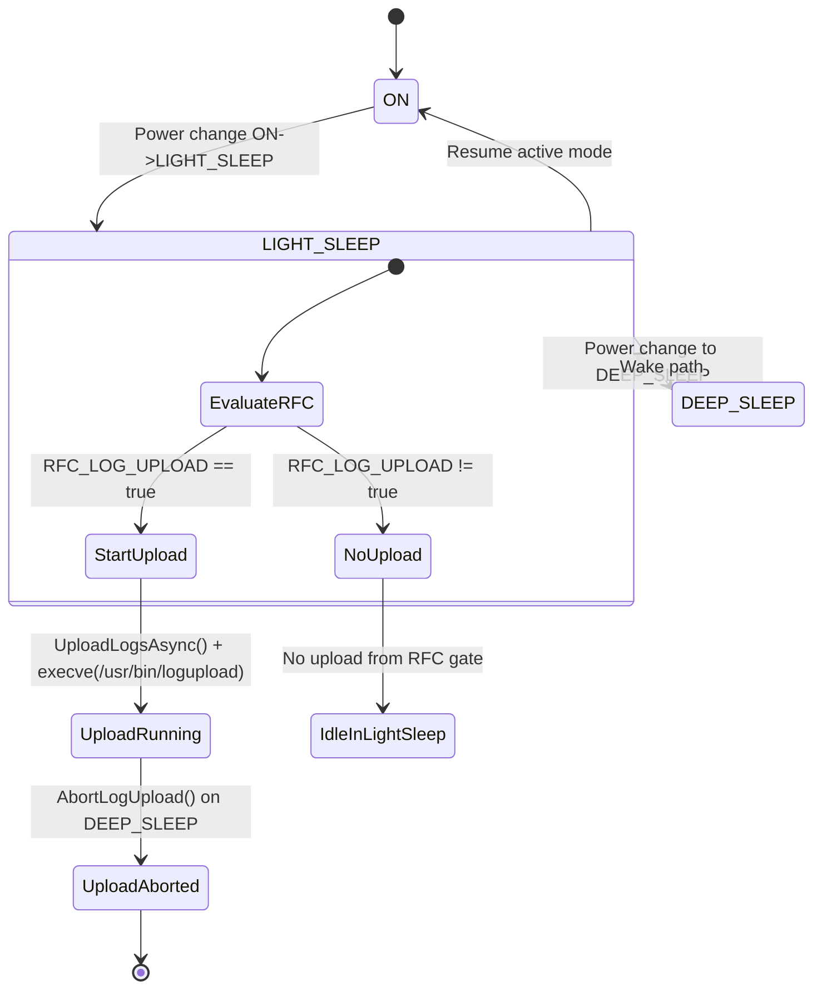
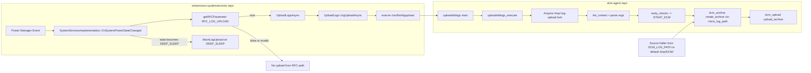
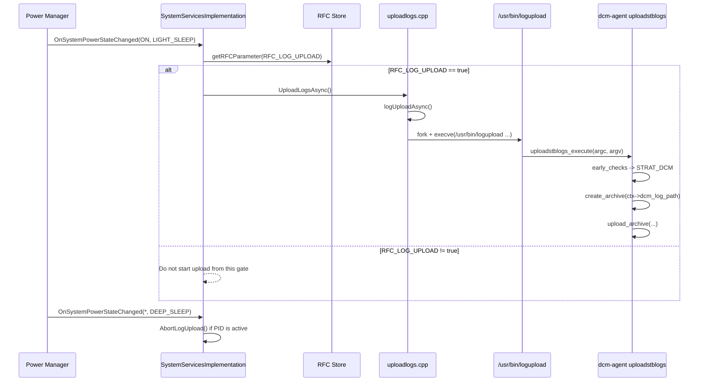

# DeepSleep RFC Logupload Workflow

## Scope

This document captures the exact runtime flow when the power state transitions from ON to LIGHT_SLEEP in `entservices-systemservices`, and how that invocation is handled by `dcm-agent/uploadstblogs`.

It includes both RFC cases for:

`Device.DeviceInfo.X_RDKCENTRAL-COM_RFC.Feature.LogUploadBeforeDeepSleep.Enable`

## Source Paths

- `rdkcentral/entservices-systemservices`:
  - `plugin/SystemServicesImplementation.cpp`
  - `plugin/uploadlogs.cpp`
- `rdkcentral/dcm-agent`:
  - `uploadstblogs/src/uploadstblogs.c`
  - `uploadstblogs/src/strategy_selector.c`
  - `uploadstblogs/src/strategies.c`
  - `uploadstblogs/src/context_manager.c`

## Trigger Point in SystemServices

When power mode changes, `SystemServicesImplementation::OnSystemPowerStateChanged(...)` checks:

- New state is `LIGHT_SLEEP` (or `STANDBY`)
- Previous state is `ON`

Then it reads RFC:

`RFC_LOG_UPLOAD = Device.DeviceInfo.X_RDKCENTRAL-COM_RFC.Feature.LogUploadBeforeDeepSleep.Enable`

Behavior:

- If RFC value is boolean `true` -> calls `UploadLogsAsync(result)`
- If RFC is missing, read fails, wrong type, or value is `false` -> no upload is started from this path

Also, on transition to `DEEP_SLEEP`, SystemServices aborts an active upload process if one is running.

## Exact UploadLogsAsync -> logupload Flow

`UploadLogsAsync()` in SystemServices:

1. Checks if another upload PID is tracked.
2. If running, calls `AbortLogUpload(...)`.
3. Starts a new upload via `UploadLogs::logUploadAsync()`.

`logUploadAsync()` (`plugin/uploadlogs.cpp`) builds and executes:

- Binary: `/usr/bin/logupload`
- Via `fork()` + `execve()`

Argument vector used:

1. `/usr/bin/logupload`
2. `<tftp_server>`
3. `0`        (FLAG)
4. `1`        (DCM_FLAG)
5. `false`    (UploadOnReboot)
6. `<upload_protocol>`
7. `<upload_httplink>`
8. `1`
9. `false`

## How dcm-agent Interprets This Invocation

`uploadstblogs` binary entry:

- `main()` -> `uploadstblogs_execute(argc, argv)`
- acquires `/tmp/.log-upload.lock`
- initializes context
- parses args
- chooses strategy via `early_checks(...)`

Important for this call:

- `FLAG = 0`
- `DCM_FLAG = 1`

In `strategy_selector.c`, this selects `STRAT_DCM`.

## Which Function Uploads and Which Folder Is Uploaded

### Upload function

For this path, actual upload is done by:

- `upload_archive(ctx, session, archive_path)`

called from:

- `dcm_upload(...)` in `uploadstblogs/src/strategies.c`

### Folder packaged into archive

For this path, archive input directory is:

- `ctx->dcm_log_path`

used in:

- `dcm_archive(...)` -> `create_archive(ctx, session, ctx->dcm_log_path)`

`ctx->dcm_log_path` resolution from `context_manager.c`:

- Reads `DCM_LOG_PATH` from `/etc/device.properties`
- If absent, defaults to:

`/tmp/DCM/`

Therefore, for the SystemServices deep-sleep RFC-triggered call, logs are uploaded from:

- configured `DCM_LOG_PATH`
- default fallback: `/tmp/DCM/`

## RFC True vs False: Exact Behavior

### Case A: RFC is true

Condition:

- Transition is `ON` -> `LIGHT_SLEEP`
- RFC read succeeds
- RFC boolean value is `true`

Result:

- `UploadLogsAsync()` is called
- `/usr/bin/logupload` is executed
- dcm-agent selects `STRAT_DCM`
- archive is created from `ctx->dcm_log_path` (default `/tmp/DCM/`)
- upload performed through `upload_archive(...)`

### Case B: RFC is false

Condition:

- Transition is `ON` -> `LIGHT_SLEEP`
- RFC value is `false` (or read/type validation does not satisfy true branch)

Result:

- `UploadLogsAsync()` is not called by this power-state RFC gate
- `/usr/bin/logupload` is not started from this specific path
- no DCM archive/upload is triggered from this RFC path

## Deep Sleep Transition Note

When state becomes `DEEP_SLEEP`, SystemServices checks active upload PID and aborts if running. This affects an in-flight upload started earlier, but does not change the true/false gate behavior at ON -> LIGHT_SLEEP.

## Mode State Diagram (Power + RFC Gate)

## Combined Workflow Diagram (rdkservices + dcm-agent)

## End-to-End Sequence

