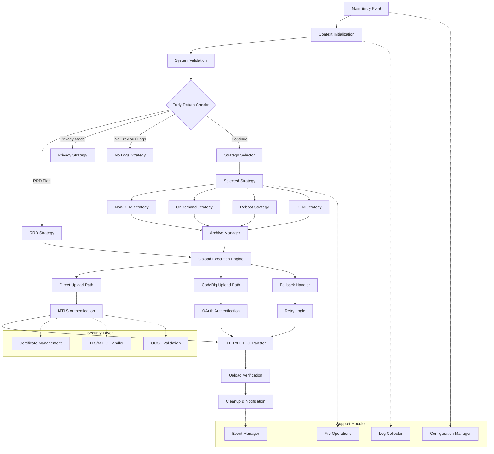
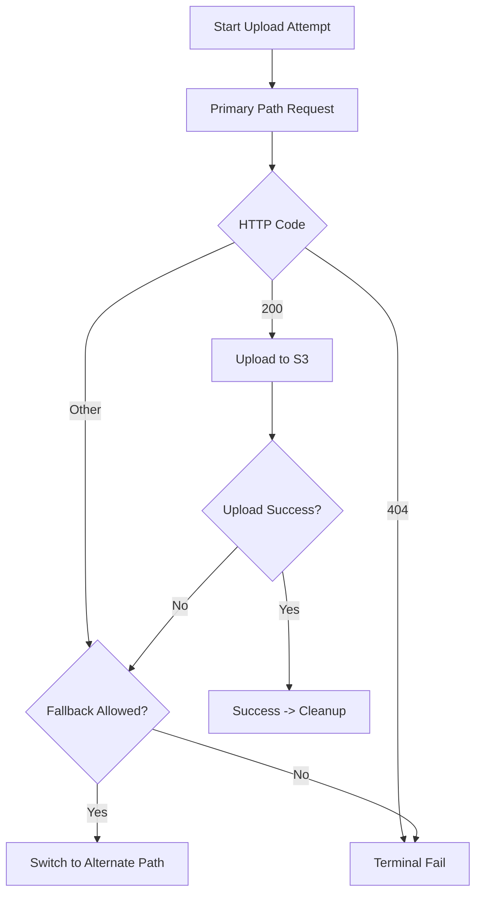
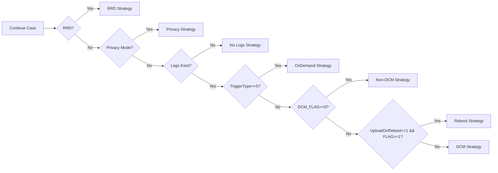

# Flowcharts – Strict Diagram Alignment

## 1. Core Flow (Original Diagram Reflected)

## 2. Text-Based Flow (Simplified)
1. Main → Initialize → Validate.
2. Early Return:
   - RRD → Upload Engine.
   - Privacy → Abort (no archive).
   - No Logs → Abort.
   - Continue → Strategy selector → Selected strategy → Archive Manager → Upload Engine.
3. Upload Engine:
   - Decide path (Direct/CodeBig).
   - Retry Logic engages fallback if needed.
   - Authentication (mTLS/OAuth).
   - Transfer.
   - Verification.
4. Cleanup & Notification.

## 3. Fallback Handling (Extracted Sub-flow)

## 4. Strategy Selection (Decision Only)

## 5. Upload Verification Terminal States
| Condition | Result |
|-----------|--------|
| HTTP 200 + curl success | Success |
| HTTP 404 | Terminal failure (no fallback) |
| Other HTTP + attempts left | Retry/fallback |
| Other HTTP + no attempts/fallback | Failure |
