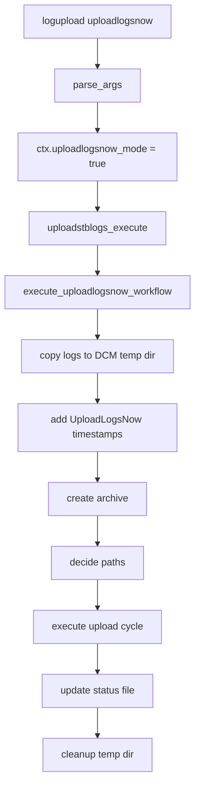
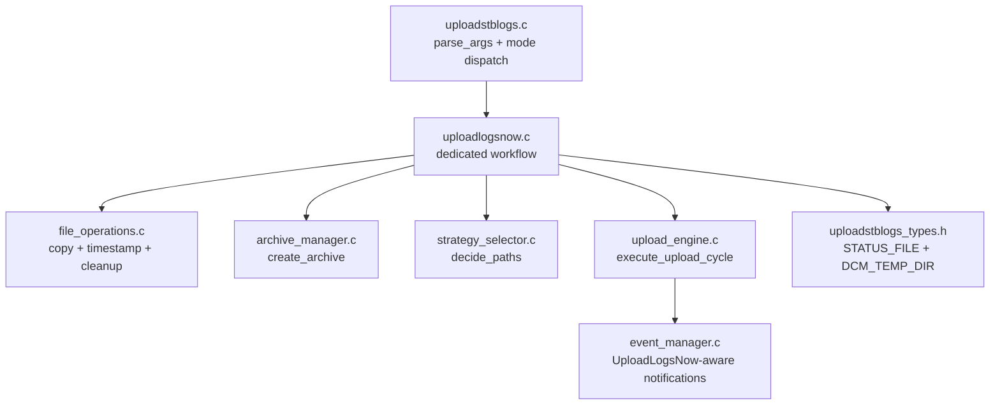
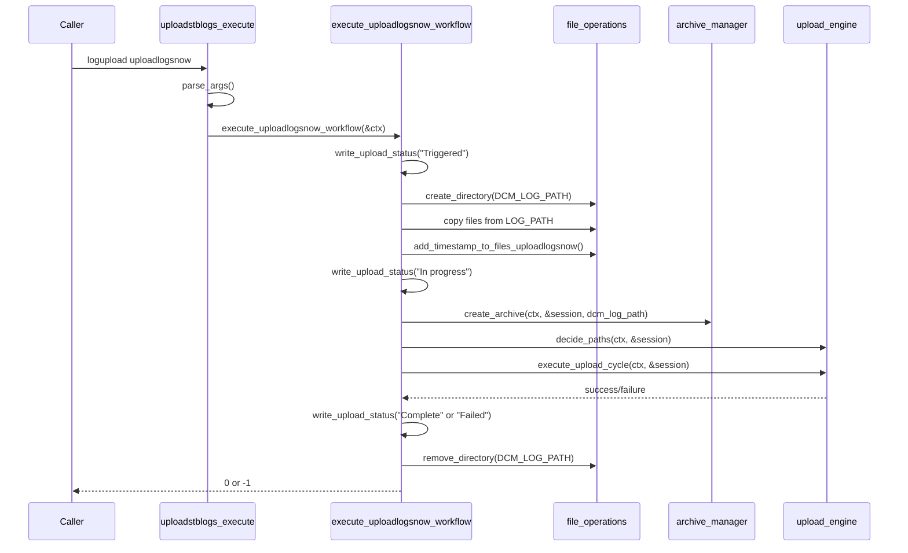
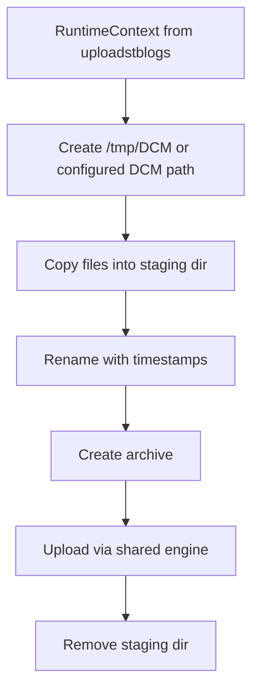

# UploadLogsNow Migration

## Overview

`UploadLogsNow.sh` has been migrated into the `uploadstblogs` C module as a dedicated execution path implemented in [uploadstblogs/src/uploadlogsnow.c](../src/uploadlogsnow.c) and exposed by [uploadstblogs/include/uploadlogsnow.h](../include/uploadlogsnow.h). Instead of shipping a separate shell script, the feature now runs as a special mode of the `logupload` binary and reuses the existing `uploadstblogs` archive and upload engine.

The entry trigger is:

```bash
logupload uploadlogsnow
```

When this argument is detected, `parse_args()` enables `uploadlogsnow_mode`, sets the trigger to `TRIGGER_ONDEMAND`, and dispatches execution to the dedicated UploadLogsNow workflow rather than the standard strategy pipeline.

## Purpose

The migrated UploadLogsNow flow preserves the intent of the legacy script:

- gather current log files immediately
- stage them in a dedicated DCM temporary area
- timestamp selected files using the legacy exclusion logic
- create an archive with the shared archive manager
- upload immediately using the existing on-demand upload path
- record human-readable status in a persistent status file
- clean up the temporary staging directory

## External Consumers

The original `UploadLogsNow.sh` flow was not only a local helper script; it was also used by external device-management components. After the migration, those consumers should be understood as depending on the `logupload uploadlogsnow` execution path and on the same observable status file semantics.

### Verified Consumer: tr69hostif

`tr69hostif` is a confirmed external consumer of the UploadLogsNow trigger path.

### Consumer Integration Points

| Consumer | Verified Integration | Details |
|----------|----------------------|---------|
| `rdkcentral/tr69hostif` | Yes | Uses TR-181 handlers to trigger `backgroundrun /usr/bin/logupload uploadlogsnow >> /opt/logs/dcmscript.log 2>&1` and reads `/opt/loguploadstatus.txt` for status |
| `rdk-e/lostandfound-cpc` | Not yet verified | Consumer relationship has been reported, but file-level integration details have not yet been verified |

### tr69hostif Trigger Path

The verified trigger path in `tr69hostif` is:

```text
backgroundrun /usr/bin/logupload uploadlogsnow >> /opt/logs/dcmscript.log 2>&1
```

This command is defined as `LOG_UPLOAD_SCR` in the `DeviceInfo` profile and is executed from the TR-181 setter for the Upload Logs Now parameter.

### Consumer-Side Files in tr69hostif

| File | Role |
|------|------|
| `src/hostif/profiles/DeviceInfo/Device_DeviceInfo.h` | Defines `LOG_UPLOAD_SCR`, `CURRENT_LOG_UPLOAD_STATUS`, and TR-181 parameter constants |
| `src/hostif/profiles/DeviceInfo/Device_DeviceInfo.cpp` | Implements `get/set_xOpsDMUploadLogsNow()` and `get_xOpsDMLogsUploadStatus()` |
| `src/hostif/handlers/src/hostIf_DeviceClient_ReqHandler.cpp` | Routes GET/SET requests for the UploadLogsNow parameter |

## Consumer Data Model Parameters

The UploadLogsNow migration does not introduce a new data model inside `dcm-agent`. The consumer-facing control surface is exposed externally through TR-181 parameters in `tr69hostif`.

### Verified TR-181 Parameters in tr69hostif

| Parameter | Direction | Purpose |
|-----------|-----------|---------|
| `Device.DeviceInfo.X_RDKCENTRAL-COM_xOpsDeviceMgmt.Logging.xOpsDMUploadLogsNow` | GET + SET | Trigger parameter used by external management systems to initiate UploadLogsNow |
| `Device.DeviceInfo.X_RDKCENTRAL-COM_xOpsDeviceMgmt.Logging.xOpsDMLogsUploadStatus` | GET | Readback status parameter backed by `/opt/loguploadstatus.txt` |

### Parameter Semantics

#### `xOpsDMUploadLogsNow`

- Type: boolean
- Consumer: `tr69hostif`
- Action on `true`: executes the migrated UploadLogsNow flow through `logupload uploadlogsnow`
- Getter behavior in `tr69hostif`: currently returns `false` by default and acts mainly as a control point rather than a persistent state indicator

#### `xOpsDMLogsUploadStatus`

- Type: string
- Consumer: `tr69hostif`
- Backing file: `/opt/loguploadstatus.txt`
- Purpose: exposes the last UploadLogsNow workflow status back to TR-181 clients

The `tr69hostif` header comments document these valid status values:

- `Not triggered`
- `Triggered`
- `In progress`
- `Failed`
- `Complete`

These values align directly with the status-file semantics implemented in `uploadlogsnow.c`.

### Data Model Relationship to dcm-agent

From the `dcm-agent` side, the migration preserves consumer compatibility through these stable interfaces:

| dcm-agent Surface | Consumer Dependency |
|-------------------|---------------------|
| `logupload uploadlogsnow` | external trigger command |
| `/opt/loguploadstatus.txt` | external status readback |
| UploadLogsNow-specific status strings | mapped to consumer data model status |

### Access Note for lostandfound-cpc

`lostandfound-cpc` was named as a consumer in the integration request, but its exact trigger file and any corresponding parameter or RPC surface have not yet been verified. This document therefore records it as a known external consumer while limiting detailed parameter documentation to the verified `tr69hostif` integration.

## Architecture

### Integration Point



### Component Diagram



## Runtime Behavior

### Activation

The mode is enabled in [uploadstblogs/src/uploadstblogs.c](c:/Users/nhanas001c/Downloads/agentic/dcm/dcm-agent/uploadstblogs/src/uploadstblogs.c) when the first argument is exactly `uploadlogsnow`.

The parser then applies these UploadLogsNow-specific runtime defaults:

| Field | Value |
|-------|-------|
| `flag` | `1` |
| `dcm_flag` | `1` |
| `upload_on_reboot` | `1` |
| `trigger_type` | `TRIGGER_ONDEMAND` |
| `rrd_flag` | `0` |
| `tls_enabled` | `false` by default |
| `uploadlogsnow_mode` | `true` |

### Workflow Steps

The implementation in `execute_uploadlogsnow_workflow()` performs these stages:

1. Validate the input `RuntimeContext`
2. Write initial status `Triggered` to the status file
3. Resolve `DCM_LOG_PATH` from `ctx->dcm_log_path`, or use `DCM_TEMP_DIR` (`/tmp/DCM`)
4. Create the DCM staging directory
5. Copy files from `LOG_PATH` to the DCM staging directory
6. If no files were copied, write `No files to upload` and exit successfully
7. Add timestamp prefixes using UploadLogsNow-specific exclusions
8. Write status `In progress`
9. Create an archive in the staging directory with `create_archive()`
10. Verify the archive exists
11. Replace `session.archive_file` with the full archive path
12. Select upload paths via `decide_paths()`
13. Execute upload with `execute_upload_cycle()`
14. Write final status `Complete` or `Failed`
15. Remove the temporary DCM staging directory

### Sequence Diagram



## Key Files and Constants

### Source Files

| File | Role |
|------|------|
| [uploadstblogs/src/uploadlogsnow.c](c:/Users/nhanas001c/Downloads/agentic/dcm/dcm-agent/uploadstblogs/src/uploadlogsnow.c) | Dedicated UploadLogsNow workflow implementation |
| [uploadstblogs/include/uploadlogsnow.h](c:/Users/nhanas001c/Downloads/agentic/dcm/dcm-agent/uploadstblogs/include/uploadlogsnow.h) | Public declaration for `execute_uploadlogsnow_workflow()` |
| [uploadstblogs/src/uploadstblogs.c](c:/Users/nhanas001c/Downloads/agentic/dcm/dcm-agent/uploadstblogs/src/uploadstblogs.c) | Mode detection and dispatch |
| [uploadstblogs/include/file_operations.h](c:/Users/nhanas001c/Downloads/agentic/dcm/dcm-agent/uploadstblogs/include/file_operations.h) | UploadLogsNow-specific timestamp helper declaration |

### Constants

| Constant | Value | Purpose |
|----------|-------|---------|
| `STATUS_FILE` | `/opt/loguploadstatus.txt` | User-visible workflow status file |
| `DCM_TEMP_DIR` | `/tmp/DCM` | Default staging directory when no DCM path is configured |
| `LOG_UPLOADSTB` | `LOG.RDK.UPLOADSTB` | RDK logging component |

## File Selection and Exclusions

### Copy Exclusions

The UploadLogsNow copy stage intentionally excludes these names from the source log directory:

| Excluded Name | Reason |
|---------------|--------|
| `dcm` | Avoid recursive or unrelated DCM area capture |
| `PreviousLogs_backup` | Skip rotated backup data |
| `PreviousLogs` | Skip historical backup content |

If a path is too long to fit inside `MAX_PATH_LENGTH`, that entry is skipped and a warning is logged instead of truncating the path.

### Timestamping Behavior

UploadLogsNow uses `add_timestamp_to_files_uploadlogsnow()` rather than the generic timestamp helper.

This special variant is documented in [uploadstblogs/include/file_operations.h](../include/file_operations.h) as skipping:

- files that already carry an `AM`/`PM` timestamp prefix
- reboot logs
- ABL reason logs

That preserves the shell-script behavior and avoids renaming files that should remain stable.

## API Reference

### `execute_uploadlogsnow_workflow()`

Executes the migrated UploadLogsNow workflow.

**Signature**

```c
int execute_uploadlogsnow_workflow(RuntimeContext* ctx);
```

**Parameters**

- `ctx` - initialized runtime context with `log_path`, optional `dcm_log_path`, and upload configuration

**Returns**

- `0` on success
- `-1` on failure

**Behavior Notes**

- returns `0` when the source log directory contains no files to upload
- writes status updates to `STATUS_FILE` across the run
- always attempts to remove the DCM staging directory before returning

### Internal Helper Behavior

`uploadlogsnow.c` contains two internal helpers that are central to the migrated script behavior:

| Helper | Responsibility |
|--------|----------------|
| `write_upload_status()` | writes status text with timestamp to `/opt/loguploadstatus.txt` |
| `copy_files_to_dcm_path()` | copies source logs into the staging directory with exclusion filtering |

## Status File Semantics

The workflow writes user-facing progress to `/opt/loguploadstatus.txt`.

### Status Values

| Status | When Written |
|--------|--------------|
| `Triggered` | immediately after workflow start |
| `In progress` | after staging and before archive/upload execution |
| `No files to upload` | when source log directory is empty |
| `Complete` | after successful upload |
| `Failed` | on a terminal error |

### File Format

Each status line is written as:

```text
<message> <ctime timestamp>
```

If `ctime_r()` is unavailable for some reason, only the message is written.

## Upload Path Behavior

After archive creation, UploadLogsNow intentionally reuses the normal `uploadstblogs` upload machinery instead of maintaining a separate transport implementation.

### Reused Functions

| Function | Purpose |
|----------|---------|
| `create_archive()` | package staged logs into an archive |
| `decide_paths()` | choose Direct vs CodeBig primary/fallback |
| `execute_upload_cycle()` | perform pre-sign, upload, retry, and fallback |

This keeps UploadLogsNow aligned with the rest of the module for:

- authentication behavior
- retry logic
- path blocking rules
- success/failure verification
- event and telemetry integration

## Error Handling

### Fatal Failures

| Failure | Result |
|---------|--------|
| null `RuntimeContext` | immediate `-1` return |
| staging directory creation failure | status `Failed`, return `-1` |
| file copy failure | status `Failed`, return `-1` |
| archive creation failure | status `Failed`, return `-1` |
| archive missing after creation | status `Failed`, return `-1` |
| upload execution failure | status `Failed`, return `-1` |

### Non-Fatal Behavior

| Condition | Behavior |
|-----------|----------|
| no files found in `LOG_PATH` | status `No files to upload`, return `0` |
| timestamp helper failure | warning logged, upload continues |
| cleanup directory removal failure | warning logged after main result is decided |

## Threading Model

UploadLogsNow is single-threaded and runs within the same process context as `logupload`.

| Aspect | Behavior |
|--------|----------|
| Worker threads | none |
| Concurrency control | inherited file lock from `uploadstblogs_execute()` |
| Shared state | one `RuntimeContext`, one local `SessionState` |

Because the lock is acquired before UploadLogsNow dispatch, the migrated script remains single-instance just like the broader upload flow.

## Memory Management

The migrated implementation uses fixed-size stack buffers and shared filesystem helpers.

### Main Local Buffers

| Buffer | Size Source | Purpose |
|--------|-------------|---------|
| `dcm_log_path` | `MAX_PATH_LENGTH` | resolved staging directory |
| `src_file` / `dest_file` | `MAX_PATH_LENGTH` | per-file copy path construction |
| `full_archive_path` | `MAX_PATH_LENGTH` | archive existence verification |
| `timebuf` | 26 bytes | status-file timestamp formatting |

### Allocation Pattern



No additional heap-owned module state is introduced by the UploadLogsNow migration.

## Testing

There is dedicated unit-test coverage for this migrated workflow in [uploadstblogs/unittest/uploadlogsnow_gtest.cpp](c:/Users/nhanas001c/Downloads/agentic/dcm/dcm-agent/uploadstblogs/unittest/uploadlogsnow_gtest.cpp).

### Covered Scenarios

| Test Area | Example Cases |
|-----------|---------------|
| parameter validation | null context |
| staging creation | create-directory failure |
| copy stage | copy failure |
| archive stage | archive creation failure, archive not found |
| upload stage | upload cycle success/failure |
| empty source directory | returns success with no files |

The tests mock:

- directory creation and removal
- file copy operations
- timestamp helper behavior
- archive creation
- upload cycle result

## Usage Example

### CLI Invocation

```bash
logupload uploadlogsnow
```

### Expected High-Level Behavior

1. create `/tmp/DCM` if no DCM path is preconfigured
2. copy eligible files from `LOG_PATH`
3. timestamp staged files
4. create an archive in the staging directory
5. upload immediately using on-demand semantics
6. update `/opt/loguploadstatus.txt`
7. remove the staging directory

## Platform Notes

- intended for RDK embedded Linux targets
- preserves shell-script semantics while removing shell dependency
- uses shared `uploadstblogs` transport and event behavior rather than duplicating upload code
- avoids dynamic memory-heavy workflows and shell glob expansion

## See Also

- [uploadstblogs.md](uploadstblogs.md)
- [hld/uploadSTBLogs_HLD.md](hld/uploadSTBLogs_HLD.md)
- [requirements/uploadSTBLogs_requirements.md](requirements/uploadSTBLogs_requirements.md)
- [../../README.md](../../README.md)
