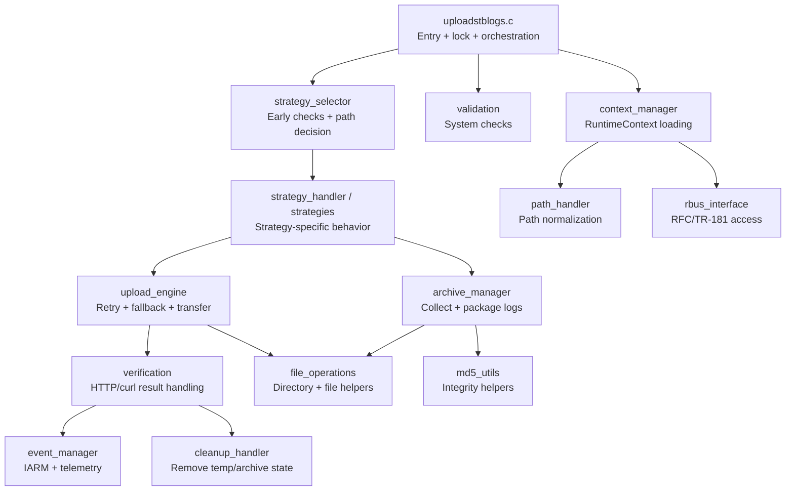
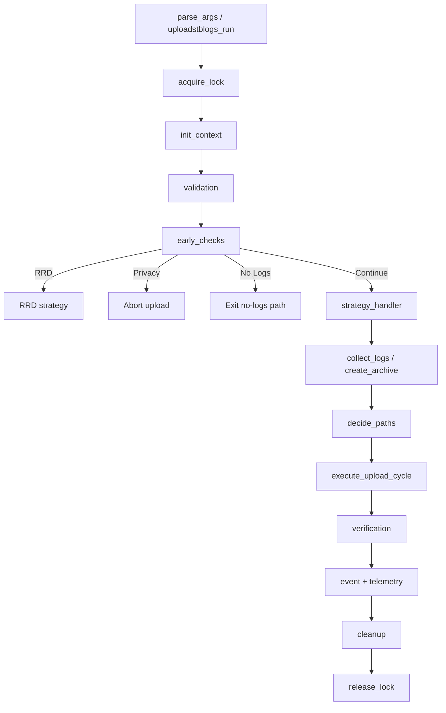
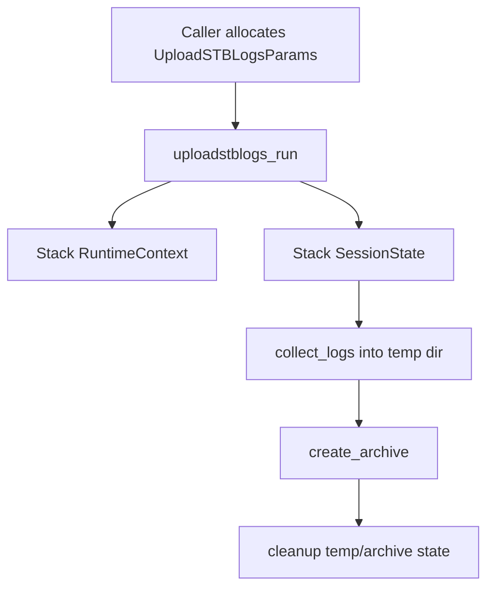

# uploadSTBLogs Module

## Overview

`uploadstblogs` is the primary log packaging and upload subsystem used by DCM Agent. It is implemented as both a shared library (`libuploadstblogs.la`) and a standalone binary (`logupload`). The module replaces the legacy `uploadSTBLogs.sh` flow with a structured C implementation that performs runtime context loading, strategy selection, archive creation, secure upload, retry and fallback handling, verification, cleanup, and event/telemetry notification.

The implementation is designed for embedded RDK targets with limited memory and CPU. It uses fixed-size buffers, a single-instance file lock, deterministic strategy selection, and explicit fallback rules between Direct and CodeBig upload paths.

## Table of Contents

- [Architecture](#architecture)
- [Core Modules](#core-modules)
- [Data Model](#data-model)
- [Execution Flow](#execution-flow)
- [Strategy Selection](#strategy-selection)
- [Upload Paths and Security](#upload-paths-and-security)
- [API Reference](#api-reference)
- [Usage Examples](#usage-examples)
- [Threading Model](#threading-model)
- [Memory Management](#memory-management)
- [Build Instructions](#build-instructions)
- [Testing](#testing)
- [Configuration and Runtime Inputs](#configuration-and-runtime-inputs)
- [Error Handling and Observability](#error-handling-and-observability)
- [Platform Notes](#platform-notes)
- [See Also](#see-also)

---

## Architecture

`uploadstblogs` follows a strict staged pipeline that mirrors the design diagrams in the module HLD:

1. Main entry and argument parsing
2. Runtime context initialization
3. System validation
4. Early-return checks and strategy selection
5. Archive creation and log collection
6. Upload execution with retry/fallback
7. Verification, cleanup, telemetry, and event emission

### Component Diagram



### Module Layout

| Source File | Responsibility |
|-------------|----------------|
| `src/uploadstblogs.c` | Main entry, CLI parsing, lock handling, library wrapper APIs |
| `src/context_manager.c` | Builds `RuntimeContext` from environment, properties, RFC/TR-181 |
| `src/validation.c` | Required directory, binary, and configuration checks |
| `src/strategy_selector.c` | Early-return decisions and upload path selection |
| `src/strategy_handler.c` | Drives selected strategy workflow |
| `src/strategies.c` | Concrete strategy implementations |
| `src/archive_manager.c` | Log collection, archive naming, tar.gz creation |
| `src/upload_engine.c` | Upload attempts, retry loops, fallback switching |
| `src/retry_logic.c` | Attempt counters and retry-delay logic |
| `src/verification.c` | HTTP/curl result interpretation |
| `src/file_operations.c` | Filesystem helpers used across the pipeline |
| `src/path_handler.c` | Path composition and normalization |
| `src/event_manager.c` | Event/IARM/telemetry integration |
| `src/cleanup_handler.c` | Cleanup of temporary and archive artifacts |
| `src/rbus_interface.c` | RBUS integration for runtime configuration |
| `src/md5_utils.c` | MD5 and integrity helper operations |
| `src/uploadlogsnow.c` | Specialized on-demand execution path |

---

## Core Modules

### Entry Layer

The public entry points are declared in `include/uploadstblogs.h` and expose both library and binary style invocation.

| API | Purpose |
|-----|---------|
| `uploadstblogs_run()` | Preferred structured API for external callers such as DCM |
| `uploadstblogs_execute()` | Internal argc/argv-compatible execution path |
| `parse_args()` | CLI-to-context mapping |
| `acquire_lock()` / `release_lock()` | Single-instance guard using file locking |

### Context and Validation Layer

The context manager populates a flat `RuntimeContext` structure with:

- upload flags
- privacy and OCSP settings
- log and temp paths
- endpoint URLs
- device identifiers
- certificate paths
- retry tuning

Validation is performed before any packaging or upload begins so the module can fail early on missing directories, missing binaries, or unsupported runtime conditions.

### Strategy Layer

`strategy_selector` determines which high-level behavior applies to the current invocation. `strategy_handler` and `strategies` then execute the selected branch while preserving the same observable behavior as the legacy shell workflow.

### Archive and Upload Layer

`archive_manager` collects candidate logs and produces a `.tgz` archive. `upload_engine` then:

- decides the primary path (`PATH_DIRECT` or `PATH_CODEBIG`)
- performs the pre-sign step
- attempts the upload
- evaluates retry policy
- optionally switches to the fallback path
- returns a final success/failure result for verification and cleanup

---

## Data Model

The principal types are defined in `include/uploadstblogs_types.h`.

### `UploadSTBLogsParams`

Structured external-call API used by DCM and other components.

```c
typedef struct {
    int flag;
    int dcm_flag;
    bool upload_on_reboot;
    const char* upload_protocol;
    const char* upload_http_link;
    TriggerType trigger_type;
    bool rrd_flag;
    const char* rrd_file;
} UploadSTBLogsParams;
```

### `RuntimeContext`

The full flattened runtime state for one execution.

```c
typedef struct {
    int rrd_flag;
    int dcm_flag;
    int flag;
    int upload_on_reboot;
    int trigger_type;
    bool privacy_do_not_share;
    bool ocsp_enabled;
    bool encryption_enable;
    bool direct_blocked;
    bool codebig_blocked;
    bool include_pcap;
    bool include_dri;
    bool tls_enabled;
    bool maintenance_enabled;
    bool uploadlogsnow_mode;
    char log_path[MAX_PATH_LENGTH];
    char prev_log_path[MAX_PATH_LENGTH];
    char archive_path[MAX_PATH_LENGTH];
    char rrd_file[MAX_PATH_LENGTH];
    char dri_log_path[MAX_PATH_LENGTH];
    char temp_dir[MAX_PATH_LENGTH];
    char telemetry_path[MAX_PATH_LENGTH];
    char dcm_log_file[MAX_PATH_LENGTH];
    char dcm_log_path[MAX_PATH_LENGTH];
    char iarm_event_binary[MAX_PATH_LENGTH];
    char endpoint_url[MAX_URL_LENGTH];
    char upload_http_link[MAX_URL_LENGTH];
    char presign_url[MAX_URL_LENGTH];
    char proxy_bucket[MAX_URL_LENGTH];
    char mac_address[MAX_MAC_LENGTH];
    char device_type[32];
    char build_type[32];
    char cert_path[MAX_CERT_PATH_LENGTH];
    char key_path[MAX_CERT_PATH_LENGTH];
    char ca_cert_path[MAX_CERT_PATH_LENGTH];
    int direct_max_attempts;
    int codebig_max_attempts;
    int direct_retry_delay;
    int codebig_retry_delay;
    int curl_timeout;
    int curl_tls_timeout;
} RuntimeContext;
```

### `SessionState`

Tracks one upload attempt sequence.

```c
typedef struct {
    Strategy strategy;
    UploadPath primary;
    UploadPath fallback;
    int direct_attempts;
    int codebig_attempts;
    int http_code;
    int curl_code;
    bool used_fallback;
    bool success;
    char archive_file[MAX_FILENAME_LENGTH];
} SessionState;
```

### Strategy and Result Enums

| Enum | Values |
|------|--------|
| `TriggerType` | `TRIGGER_SCHEDULED`, `TRIGGER_MANUAL`, `TRIGGER_REBOOT`, `TRIGGER_CRASH`, `TRIGGER_DEBUG`, `TRIGGER_ONDEMAND`, `TRIGGER_MEMCAPTURE` |
| `Strategy` | `STRAT_RRD`, `STRAT_PRIVACY_ABORT`, `STRAT_NO_LOGS`, `STRAT_NON_DCM`, `STRAT_ONDEMAND`, `STRAT_REBOOT`, `STRAT_DCM` |
| `UploadPath` | `PATH_DIRECT`, `PATH_CODEBIG`, `PATH_NONE` |
| `UploadResult` | `UPLOADSTB_SUCCESS`, `UPLOADSTB_FAILED`, `UPLOADSTB_ABORTED`, `UPLOADSTB_RETRY` |

---

## Execution Flow



Key decisions are deterministic and follow the documented branch order so that behavior remains consistent across releases and platforms.

---

## Strategy Selection

The early-check logic is declared in `include/strategy_selector.h`.

### Strategy Decision Table

| Condition | Selected Strategy |
|-----------|-------------------|
| `RRD_FLAG == 1` | `STRAT_RRD` |
| Privacy mode enabled | `STRAT_PRIVACY_ABORT` |
| Previous logs absent/empty | `STRAT_NO_LOGS` |
| `TriggerType == TRIGGER_ONDEMAND` | `STRAT_ONDEMAND` |
| `DCM_FLAG == 0` | `STRAT_NON_DCM` |
| `UploadOnReboot == 1 && FLAG == 1` | `STRAT_REBOOT` |
| Otherwise | `STRAT_DCM` |

### Path Selection Rules

| Rule | Outcome |
|------|---------|
| Direct not blocked | `PATH_DIRECT` becomes primary |
| Direct blocked, CodeBig open | `PATH_CODEBIG` becomes primary |
| Both blocked | Terminal failure |
| Non-terminal failure and alternate open | Single fallback switch allowed |
| HTTP 404 on pre-sign | Terminal, no retry/fallback loop |

---

## Upload Paths and Security

### Direct Path

- Uses mTLS with client certificate, key, and CA files
- Intended as the preferred fast path when not blocked
- Supports optional OCSP behavior based on runtime markers/configuration

### CodeBig Path

- Uses OAuth-based authorization flow
- Acts as the alternate route when Direct is blocked or exhausted
- Uses separate retry parameters and block-marker logic

### Security Controls

- privacy mode abort prevents log upload
- TLS minimum behavior is controlled by runtime flags
- signatures and sensitive upload artifacts should not be logged verbatim
- file lock prevents overlapping upload sessions

---

## API Reference

### `uploadstblogs_run()`

Preferred external interface.

**Signature**

```c
int uploadstblogs_run(const UploadSTBLogsParams* params);
```

**Parameters**

- `params`: caller-owned parameter block describing trigger, URL, protocol, and flags

**Returns**

- `0` on success
- `1` on failure

**Thread Safety**

Safe to call from different components because the implementation uses a single-instance lock to serialize active runs.

### `uploadstblogs_execute()`

argc/argv-compatible execution path used by the standalone binary and compatibility callers.

**Signature**

```c
int uploadstblogs_execute(int argc, char** argv);
```

### `parse_args()`

Maps CLI input into an already-initialized `RuntimeContext`.

**Signature**

```c
bool parse_args(int argc, char** argv, RuntimeContext* ctx);
```

### `init_context()`

Loads environment variables, device properties, TR-181 values, and runtime defaults.

**Signature**

```c
bool init_context(RuntimeContext* ctx);
```

### `early_checks()`

Performs early-return logic and selects the strategy.

**Signature**

```c
Strategy early_checks(const RuntimeContext* ctx);
```

### `execute_upload_cycle()`

Runs pre-sign, transfer, retry, and fallback orchestration.

**Signature**

```c
bool execute_upload_cycle(RuntimeContext* ctx, SessionState* session);
```

### `collect_logs()` and `create_archive()`

Handle file collection and archive generation.

**Signatures**

```c
int collect_logs(const RuntimeContext* ctx, const SessionState* session,
                 const char* dest_dir);
int create_archive(RuntimeContext* ctx, SessionState* session,
                   const char* source_dir);
```

---

## Usage Examples

### Library Call from DCM Agent

```c
#include "uploadstblogs.h"

int run_scheduled_upload(void)
{
    UploadSTBLogsParams params = {
        .flag = 0,
        .dcm_flag = 1,
        .upload_on_reboot = false,
        .upload_protocol = "HTTP",
        .upload_http_link = "https://example.com/upload",
        .trigger_type = TRIGGER_SCHEDULED,
        .rrd_flag = false,
        .rrd_file = NULL
    };

    return uploadstblogs_run(&params);
}
```

### Standalone Binary Invocation

```bash
logupload <TFTP_SERVER> <FLAG> <DCM_FLAG> <UploadOnReboot> \
          <UploadProtocol> <UploadHttpLink> <TriggerType> \
          <RRD_FLAG> <RRD_UPLOADLOG_FILE>
```

### UploadLogsNow Shortcut

```bash
logupload uploadlogsnow
```

This special mode is recognized in `parse_args()` and maps directly to an on-demand execution profile. The dedicated migration details are documented in [uploadlogsnow.md](uploadlogsnow.md).

---

## Threading Model

`uploadstblogs` is effectively single-threaded during normal execution.

| Aspect | Behavior |
|--------|----------|
| Worker threads | None created by this module |
| Concurrency control | File lock via `acquire_lock()` / `release_lock()` |
| Shared-state model | One `RuntimeContext` and one `SessionState` per run |
| Re-entrancy | Serialized at process/library entry by lock |

There are no internal mutexes or condition variables in the public interface. The concurrency guarantee is based on preventing overlapping runs rather than supporting parallel upload sessions.

---

## Memory Management

The module is designed for low-footprint embedded systems and uses fixed-size stack and in-struct buffers extensively.

### Allocation Pattern



### Ownership Rules

| Resource | Owner | Cleanup |
|----------|-------|---------|
| `UploadSTBLogsParams` | Caller | Caller |
| `RuntimeContext` | Current run | Automatic (stack) |
| `SessionState` | Current run | Automatic (stack) |
| Temporary files and archive | Module during run | `cleanup_handler` |
| RBUS/context side resources | Module | `cleanup_context()` |

### Buffering Strategy

- `MAX_PATH_LENGTH = 512`
- `MAX_URL_LENGTH = 1024`
- `MAX_FILENAME_LENGTH = 256`
- `MAX_CERT_PATH_LENGTH = 256`

This avoids frequent heap allocation and makes behavior predictable under constrained memory conditions.

---

## Build Instructions

### Outputs

| Output | Type |
|--------|------|
| `libuploadstblogs.la` | Shared library |
| `logupload` | Standalone binary |

### Build Dependencies

From `src/Makefile.am`, the module links against:

- `libcurl`
- `librdkloggers`
- `ldwnlutil`
- `lrbus`
- `lcjson`
- `lsecure_wrapper`
- `lfwutils`
- `lcrypto`
- `lrfcapi`
- `lz`
- `lIARMBus`
- `lt2utils`
- `ltelemetry_msgsender`
- `luploadutil`

### Common Build Steps

```bash
autoreconf -i
./configure
make
make install
```

### Key Compile Flags

| Flag | Purpose |
|------|---------|
| `-DEN_MAINTENANCE_MANAGER` | Maintenance manager integration |
| `-DIARM_ENABLED` | IARM event support |
| `-DT2_EVENT_ENABLED` | Telemetry event support |
| `-DUPLOADSTBLOGS_BUILD_BINARY` | Enables binary entry mode |

---

## Testing

Unit tests are under `uploadstblogs/unittest/` and cover nearly every module boundary.

| Test File | Coverage Area |
|-----------|---------------|
| `uploadstblogs_gtest.cpp` | top-level execution and API behavior |
| `context_manager_gtest.cpp` | runtime context loading |
| `validation_gtest.cpp` | validation branches |
| `strategy_selector_gtest.cpp` | early-check decision tree |
| `strategy_handler_gtest.cpp` | strategy dispatch |
| `strategies_gtest.cpp` | concrete strategies |
| `archive_manager_gtest.cpp` | archive creation and naming |
| `upload_engine_gtest.cpp` | retry/fallback/upload execution |
| `retry_logic_gtest.cpp` | retry policy behavior |
| `verification_gtest.cpp` | HTTP/curl result interpretation |
| `event_manager_gtest.cpp` | event and telemetry paths |
| `rbus_interface_gtest.cpp` | RBUS integration |
| `file_operations` / `path_handler` / `md5_utils` tests | helper modules |

Typical execution is performed through the repository test harness in the CI container.

---

## Configuration and Runtime Inputs

### Inputs

| Input Class | Examples |
|-------------|----------|
| CLI arguments | upload flags, DCM flags, protocol, URL, trigger, RRD file |
| Environment / properties | `/etc/include.properties`, `/etc/device.properties` |
| Runtime configuration | TR-181 parameters, RFC values, RBUS state |
| Filesystem state | previous logs, block markers, reboot reason, temp directories |
| Security assets | cert, key, CA cert paths |

### Outputs

| Output | Description |
|--------|-------------|
| `.tgz` archive | Packaged logs for upload |
| upload result | success, failure, abort, retry |
| telemetry | success/failure/fallback/error counters |
| events | system notification of result |
| cleanup effects | temp archive deletion, marker updates |

---

## Error Handling and Observability

Observability is based on RDK logging plus optional T2 telemetry notifications.

### Logging and Telemetry

| Facility | Purpose |
|----------|---------|
| `RDK_LOG(...)` | stage-by-stage diagnostic logging |
| `t2_count_notify()` | telemetry counters |
| `t2_val_notify()` | telemetry string values |
| event manager | upload result signaling |

### Expected Failure Modes

| Failure | Behavior |
|---------|----------|
| privacy mode | abort upload, no data transfer |
| no previous logs | early return |
| archive creation failure | emit failure path and cleanup |
| pre-sign HTTP 404 | terminal failure, no fallback loop |
| curl timeout / transient failure | retry or fallback if allowed |
| both paths blocked | immediate failure |
| cert or TLS error | log and count telemetry; may retry per policy |

---

## Platform Notes

- built for RDK embedded Linux targets
- portable across architectures supported by the Autotools build
- designed to avoid shell-heavy orchestration
- uses fixed-size buffers to reduce fragmentation risk
- assumes POSIX filesystem, locking, and networking primitives

---

## External Consumers

The migrated `uploadstblogs` implementation is consumed in several different ways across the RDK stack. Some components invoke the installed `/usr/bin/logupload` binary directly, some link against the `uploadstblogs_run()` API, and some still retain the legacy `uploadSTBLogs.sh` task name as part of maintenance orchestration while the actual execution path has moved to the C implementation.

| Consumer | Integration Mode | Verified Usage |
|----------|------------------|----------------|
| `sysint` | direct binary execution | `lib/rdk/Start_MaintenanceTasks.sh` invokes `/usr/bin/logupload` for regular and on-demand maintenance log upload flows. The same repository changelog records removal of the legacy logupload shell scripts after porting to C. |
| `remote_debugger` | direct library/API call | `rrd_upload.c` prepares `UploadSTBLogsParams` and calls `uploadstblogs_run(&params)` with `TRIGGER_ONDEMAND`, `rrd_flag=true`, and an explicit archive path for remote-debug-report uploads. |
| `entservices-systemservices` | direct binary execution behind JSON-RPC | `plugin/uploadlogs.cpp` forks and `execve()`s `/usr/bin/logupload`, while `SystemServices` exposes `uploadLogsAsync` and `abortLogUpload` as the external control surface. |
| `tr69hostif` | direct binary execution behind TR-181 | `Device_DeviceInfo` maps `xOpsDMUploadLogsNow` to `backgroundrun /usr/bin/logupload uploadlogsnow` and exposes upload status through `xOpsDMLogsUploadStatus`. |
| `entservices-maintenancemanager` | legacy task orchestration reference | maintenance task tables still include the `uploadSTBLogs.sh` task identity and `MAINT_LOGUPLOAD_*` state handling. This preserves scheduler/orchestrator compatibility while downstream execution moves to the binary path. |
| `entservices-softwareupdate` | legacy task orchestration reference | maintenance scheduling code also retains the `uploadSTBLogs.sh` task name and log-upload state tracking as part of the broader maintenance workflow. |
| `dcm-agent` | native provider | this repository builds the `uploadstblogs` library and the `logupload` binary that the above consumers depend on. |

### Consumers Not Directly Confirmed In This Verification Pass

| Repository | Current Assessment |
|------------|--------------------|
| `crashupload` | current code-backed search did not confirm a direct call to `logupload`, `uploadSTBLogs.sh`, or `uploadstblogs_run()`. Its upload path is centered on crash/minidump transport rather than STB log upload. |
| `performancetool` | could not be verified from the available repository index during this pass. Add it here only after a code-backed reference to `logupload` or `uploadstblogs_run()` is available. |

---

## Consumer Data Model and Configuration Parameters

The upload module does not expose a single universal control API. External components depend on a mix of TR-181 parameters, RFC values, JSON-RPC methods, and DCM-generated configuration files.

### TR-181 and RFC Parameters

| Parameter | Primary Consumer | Purpose |
|-----------|------------------|---------|
| `Device.DeviceInfo.X_RDKCENTRAL-COM_xOpsDeviceMgmt.Logging.xOpsDMUploadLogsNow` | `tr69hostif` | write-triggered on-demand upload. Setting this to `true` causes `tr69hostif` to launch `logupload uploadlogsnow`. |
| `Device.DeviceInfo.X_RDKCENTRAL-COM_xOpsDeviceMgmt.Logging.xOpsDMLogsUploadStatus` | `tr69hostif` | readback status parameter backed by `/opt/loguploadstatus.txt`. Used to expose current or last upload result. |
| `Device.DeviceInfo.X_RDKCENTRAL-COM_RFC.LogUpload.LogServerUrl` | `remote_debugger` | RFC source for log server selection when remote debugger prepares upload parameters. |
| `Device.DeviceInfo.X_RDKCENTRAL-COM_RFC.LogUpload.SsrUrl` | `remote_debugger` | RFC source for upload endpoint base URL; remote debugger appends `/cgi-bin/S3.cgi` when forming the final HTTP upload URL. |
| `Device.DeviceInfo.X_RDKCENTRAL-COM_RFC.Feature.LogUploadEndpoint.URL` | `sysint` | maintenance-wrapper override for the upload endpoint, used when bootstrap/DCM settings are not meant to be authoritative. |

### Configuration Files and Keys

| Configuration Source | Primary Consumer | Keys / Usage |
|----------------------|------------------|--------------|
| `/tmp/DCMSettings.conf` | `sysint`, `entservices-systemservices`, `remote_debugger` | parsed for `LogUploadSettings:UploadRepository:uploadProtocol`, `LogUploadSettings:UploadRepository:URL`, and `LogUploadSettings:UploadOnReboot`. |
| `/etc/dcm.properties` or `/opt/dcm.properties` | `sysint`, `entservices-systemservices`, `remote_debugger` | fallback source for `LOG_SERVER`, `HTTP_UPLOAD_LINK`, build-type specific overrides, and non-prod endpoint substitution. |
| `/etc/include.properties` | `remote_debugger` | provides base runtime properties such as `RDK_PATH` and `LOG_PATH` during upload orchestration. |
| `/etc/device.properties` | `entservices-systemservices`, `remote_debugger` | used for build-type and device capability checks such as `BUILD_TYPE` and `FORCE_MTLS`. |

### External Control Surfaces

| Control Surface | Consumer | Notes |
|-----------------|----------|-------|
| `uploadLogsAsync` / `abortLogUpload` | `entservices-systemservices` | Thunder/JSON-RPC methods that indirectly manage `/usr/bin/logupload`. |
| `MAINT_LOGUPLOAD_*` event/state handling | `entservices-maintenancemanager`, `entservices-softwareupdate`, `sysint` | maintenance workflow state model that still treats log upload as a first-class scheduled task. |
| `uploadstblogs_run(const UploadSTBLogsParams*)` | `remote_debugger` | preferred in-process integration for uploads that already have a prepared archive and do not want to shell out to the installed binary. |

## See Also

- [uploadlogsnow.md](uploadlogsnow.md)
- [uploadSTBLogs_HLD.md](hld/uploadSTBLogs_HLD.md)
- [uploadSTBLogs_requirements.md](requirements/uploadSTBLogs_requirements.md)
- [../../README.md](../../README.md)
