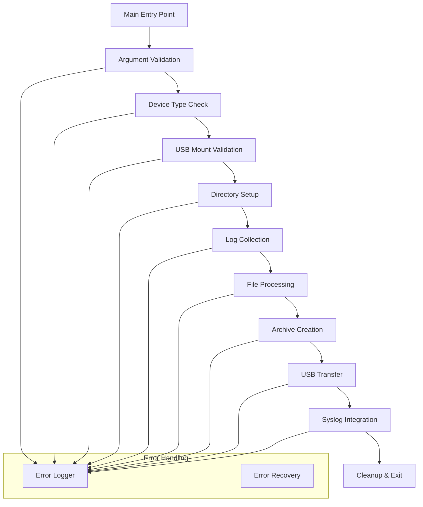
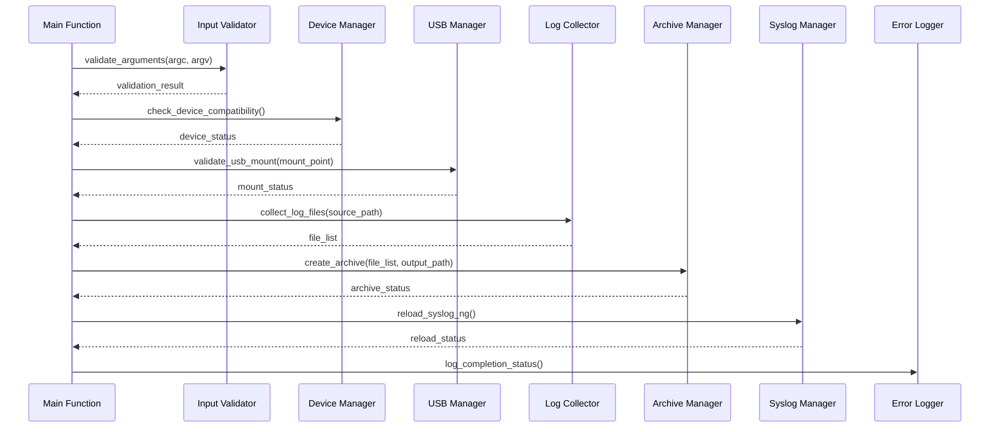
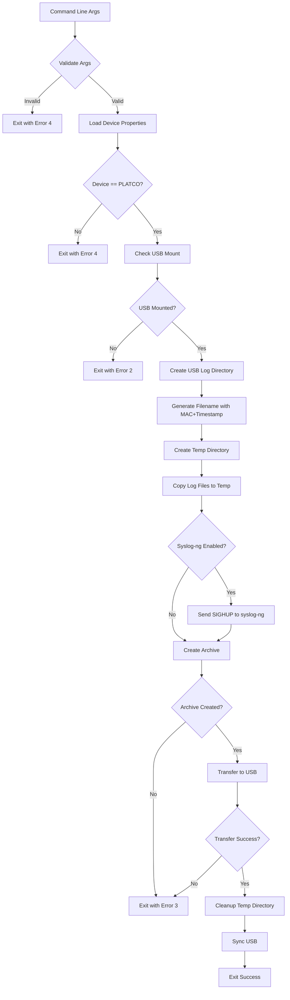
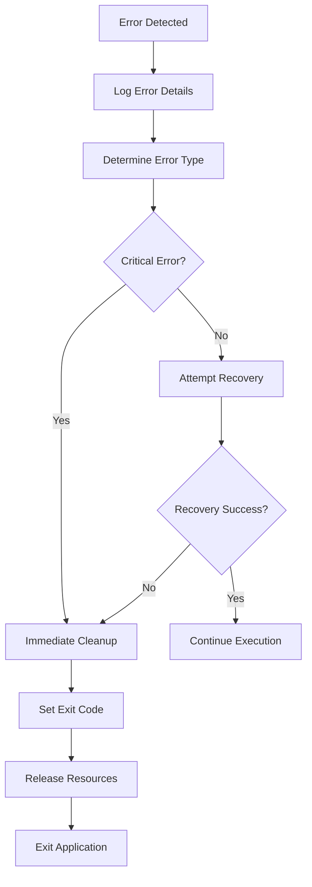

# USB Log Upload Migration High Level Design (HLD)

## Document Information
- **Document Title**: USB Log Upload Migration HLD
- **Version**: 1.0
- **Date**: January 15, 2026
- **Author**: System Integration Team
- **Status**: Draft

## Table of Contents
1. [Overview](#overview)
2. [Functional Requirements](#functional-requirements)
3. [System Architecture](#system-architecture)
4. [Module Breakdown](#module-breakdown)
5. [Data Flow](#data-flow)
6. [Key Algorithms and Data Structures](#key-algorithms-and-data-structures)
7. [Interfaces and Integration Points](#interfaces-and-integration-points)
8. [Error Handling](#error-handling)
9. [Performance Considerations](#performance-considerations)
10. [Security Considerations](#security-considerations)
11. [Platform Portability](#platform-portability)
12. [Testing Strategy](#testing-strategy)

## Overview

### Purpose
This document outlines the High Level Design for migrating the existing shell script `usbLogUpload.sh` to a C implementation. The migration aims to improve performance, reduce memory footprint, and enhance maintainability while preserving all existing functionality.

### Scope
The C implementation will provide identical functionality to the current shell script including:
- USB mount point validation
- Device type verification
- Log file collection and archiving
- Timestamp-based file naming
- Syslog-ng integration
- Error handling and logging

### Goals
- **Performance**: Reduce execution time by 60-80% compared to shell script
- **Memory Efficiency**: Minimize dynamic memory allocation, target <1MB peak memory usage
- **Portability**: Support multiple embedded platforms with consistent behavior
- **Maintainability**: Modular design with clear interfaces and comprehensive error handling
- **Reliability**: Robust error handling with detailed logging

## Functional Requirements

### Primary Functions
1. **Input Validation**: Validate USB mount point argument and device compatibility
2. **Directory Management**: Create and manage temporary directories for log processing
3. **Log Collection**: Gather log files from specified directories
4. **File Archiving**: Create compressed tar.gz archives of log files
5. **USB Operations**: Transfer archived logs to USB storage device
6. **System Integration**: Interface with syslog-ng for log rotation
7. **Cleanup**: Remove temporary files and directories post-transfer

### Input/Output Specifications
- **Input**: USB mount point path (command line argument)
- **Output**: 
  - Compressed log archive on USB device
  - Status messages in dcmscript.log
  - Exit codes (0=success, 2=no USB, 3=write error, 4=usage error)

### Dependencies
- **System Libraries**: Standard C library, POSIX compliance
- **External Tools**: tar utility for compression
- **Configuration Files**: /etc/include.properties, /etc/device.properties
- **Utility Functions**: MAC address retrieval, timestamp generation

### Constraints
- **Memory**: Maximum 1MB dynamic allocation
- **Platform**: POSIX-compliant systems
- **Performance**: Complete operation within 30 seconds for typical log volumes
- **Device Support**: Limited to PLATCO devices
- **File System**: Standard UNIX file operations

## System Architecture

### High-Level Architecture



### Component Interaction



## Module Breakdown

### 1. Main Controller Module (`usb_log_upload.c`)
**Purpose**: Entry point and high-level orchestration
**Responsibilities**:
- Command line argument parsing
- Module initialization and coordination
- Error handling and exit code management
- Resource cleanup

**Key Functions**:
```c
int main(int argc, char *argv[]);
int initialize_modules(void);
int cleanup_resources(void);
```

### 2. Input Validation Module (`input_validator.c`)
**Purpose**: Validate and sanitize input parameters
**Responsibilities**:
- Command line argument validation
- Path sanitization
- Parameter boundary checking

**Key Functions**:
```c
int validate_arguments(int argc, char *argv[], char *usb_mount_point);
int validate_path(const char *path, int max_length);
int sanitize_path(char *path, size_t path_size);
```

### 3. Device Manager Module (`device_manager.c`)
**Purpose**: Device-specific operations and compatibility checks
**Responsibilities**:
- Device type verification
- MAC address retrieval
- Platform-specific configurations

**Key Functions**:
```c
int check_device_compatibility(void);
int get_mac_address(char *mac_buffer, size_t buffer_size);
int load_device_properties(void);
```

### 4. USB Manager Module (`usb_manager.c`)
**Purpose**: USB device operations and validation
**Responsibilities**:
- USB mount point validation
- USB directory creation
- USB space verification
- USB write operations

**Key Functions**:
```c
int validate_usb_mount(const char *mount_point);
int create_usb_directories(const char *base_path);
int check_usb_space(const char *mount_point, size_t required_space);
int sync_usb_device(const char *mount_point);
```

### 5. Log Collector Module (`log_collector.c`)
**Purpose**: Log file discovery and collection
**Responsibilities**:
- Log file enumeration
- File filtering and selection
- Temporary directory management
- File copying operations

**Key Functions**:
```c
int collect_log_files(const char *source_path, const char *temp_path);
int enumerate_log_files(const char *path, file_list_t *file_list);
int copy_log_files(const file_list_t *files, const char *dest_path);
int create_temp_directory(char *temp_path, size_t path_size);
```

### 6. Archive Manager Module (`archive_manager.c`)
**Purpose**: File compression and archive creation
**Responsibilities**:
- Archive file naming with timestamp
- Tar.gz compression
- Archive integrity verification
- File size calculations

**Key Functions**:
```c
int create_archive(const char *source_path, const char *archive_path);
int generate_archive_name(char *name_buffer, size_t buffer_size);
int verify_archive_integrity(const char *archive_path);
int calculate_archive_size(const char *source_path);
```

### 7. Syslog Manager Module (`syslog_manager.c`)
**Purpose**: Syslog-ng integration and management
**Responsibilities**:
- Syslog-ng status checking
- Process signal handling
- Reload verification

**Key Functions**:
```c
int is_syslog_ng_enabled(void);
int reload_syslog_ng(void);
int verify_syslog_reload(void);
```

### 8. Error Logger Module (`error_logger.c`)
**Purpose**: Centralized logging and error reporting
**Responsibilities**:
- Timestamp generation
- Log message formatting
- File I/O for logging
- Log level management

**Key Functions**:
```c
int init_logger(const char *log_file_path);
void log_message(log_level_t level, const char *format, ...);
void log_error(const char *function, int error_code, const char *message);
int close_logger(void);
```

### 9. Utility Module (`usb_utils.c`)
**Purpose**: Common utility functions
**Responsibilities**:
- String manipulation
- File system operations
- Memory management
- Configuration file parsing

**Key Functions**:
```c
int read_config_value(const char *config_file, const char *key, char *value, size_t value_size);
int get_timestamp_string(char *timestamp, size_t timestamp_size);
int safe_string_copy(char *dest, const char *src, size_t dest_size);
int create_directory_recursive(const char *path);
```

## Data Flow

### Primary Data Flow



### Error Handling Flow



## Key Algorithms and Data Structures

### Data Structures

#### File List Structure
```c
typedef struct file_entry {
    char path[PATH_MAX];
    char name[NAME_MAX];
    size_t size;
    time_t modified_time;
    struct file_entry *next;
} file_entry_t;

typedef struct file_list {
    file_entry_t *head;
    file_entry_t *tail;
    int count;
    size_t total_size;
} file_list_t;
```

#### Configuration Structure
```c
typedef struct usb_config {
    char device_name[64];
    char mac_address[18];
    char log_path[PATH_MAX];
    char usb_mount_point[PATH_MAX];
    char temp_directory[PATH_MAX];
    bool syslog_ng_enabled;
    int max_archive_size;
} usb_config_t;
```

#### Error Context Structure
```c
typedef struct error_context {
    int error_code;
    char error_message[256];
    char function_name[64];
    time_t timestamp;
    log_level_t level;
} error_context_t;
```

### Key Algorithms

#### Log File Collection Algorithm
```c
int collect_log_files(const char *source_path, file_list_t *file_list) {
    DIR *dir = opendir(source_path);
    struct dirent *entry;
    struct stat file_stat;
    char full_path[PATH_MAX];
    
    while ((entry = readdir(dir)) != NULL) {
        if (entry->d_type == DT_REG) {  // Regular file
            snprintf(full_path, sizeof(full_path), "%s/%s", source_path, entry->d_name);
            
            if (stat(full_path, &file_stat) == 0) {
                if (should_include_file(entry->d_name)) {
                    add_file_to_list(file_list, entry->d_name, full_path, file_stat.st_size);
                }
            }
        }
    }
    
    closedir(dir);
    return file_list->count > 0 ? 0 : -1;
}
```

#### Archive Creation Algorithm
```c
int create_archive(const char *source_path, const char *archive_path) {
    char tar_command[COMMAND_MAX];
    int result;
    
    // Construct tar command with compression
    snprintf(tar_command, sizeof(tar_command), 
             "cd %s && tar -zcf %s * 2>/dev/null", 
             source_path, archive_path);
    
    // Execute tar command
    result = system(tar_command);
    
    if (WEXITSTATUS(result) != 0) {
        log_error(__func__, result, "Archive creation failed");
        return -1;
    }
    
    return verify_archive_integrity(archive_path);
}
```

#### Memory Pool Management
```c
typedef struct memory_pool {
    char *pool;
    size_t size;
    size_t used;
    size_t alignment;
} memory_pool_t;

void* pool_alloc(memory_pool_t *pool, size_t size) {
    // Align size to prevent memory fragmentation
    size = (size + pool->alignment - 1) & ~(pool->alignment - 1);
    
    if (pool->used + size > pool->size) {
        return NULL; // Pool exhausted
    }
    
    void *ptr = pool->pool + pool->used;
    pool->used += size;
    return ptr;
}
```

## Interfaces and Integration Points

### System Interfaces

#### File System Interface
```c
// File operations with error handling
int safe_file_copy(const char *src, const char *dest);
int safe_directory_create(const char *path, mode_t mode);
int safe_file_remove(const char *path);
int get_file_size(const char *path, size_t *size);
```

#### Process Interface
```c
// Process management for external tools
int execute_command(const char *command, char *output, size_t output_size);
int send_signal_to_process(const char *process_name, int signal);
int check_process_status(const char *process_name);
```

#### Configuration Interface
```c
// Configuration file parsing
int parse_properties_file(const char *file_path, config_map_t *config);
int get_property_value(const config_map_t *config, const char *key, char *value, size_t value_size);
int validate_configuration(const config_map_t *config);
```

### External Dependencies

#### System Properties
- `/etc/include.properties`: System-wide configuration
- `/etc/device.properties`: Device-specific settings
- Environment variables: `RDK_PATH`, `LOG_PATH`, `SYSLOG_NG_ENABLED`

#### Utility Scripts
- `utils.sh` functions equivalent in C:
  - `getMacAddressOnly()` → `get_mac_address()`
  - `timestamp()` → `get_timestamp_string()`

#### External Processes
- `syslog-ng`: Log rotation service
- `tar`: Archive creation utility
- File system sync operations

## Error Handling

### Error Categories

#### Critical Errors (Immediate Exit)
1. **Invalid Arguments** (Exit Code 4)
   - Missing USB mount point
   - Invalid command line syntax

2. **Device Incompatibility** (Exit Code 4)
   - Non-PLATCO device detected
   - Missing device properties

3. **USB Errors** (Exit Code 2)
   - USB not mounted
   - USB mount point inaccessible

4. **Write Errors** (Exit Code 3)
   - Insufficient USB space
   - Archive creation failure
   - File transfer failure

#### Recoverable Errors
1. **Temporary Directory Issues**
   - Retry with alternative location
   - Cleanup and recreate

2. **Individual File Failures**
   - Skip corrupted files
   - Continue with available files

3. **Syslog-ng Communication**
   - Log warning but continue
   - Verify reload success

### Error Recovery Strategies

#### Retry Mechanism
```c
int retry_operation(operation_func_t func, void *params, int max_retries, int delay_ms) {
    int result;
    int attempt = 0;
    
    while (attempt < max_retries) {
        result = func(params);
        if (result == 0) {
            return 0; // Success
        }
        
        log_message(LOG_WARNING, "Operation failed (attempt %d/%d): %s", 
                   attempt + 1, max_retries, get_error_string(result));
        
        if (attempt < max_retries - 1) {
            usleep(delay_ms * 1000);
        }
        attempt++;
    }
    
    return result; // Final failure
}
```

#### Resource Cleanup
```c
void cleanup_on_error(usb_config_t *config, file_list_t *file_list) {
    if (config->temp_directory[0] != '\0') {
        remove_directory_recursive(config->temp_directory);
    }
    
    if (file_list) {
        free_file_list(file_list);
    }
    
    sync(); // Ensure file system consistency
}
```

### Error Logging Strategy
- **Immediate Logging**: All errors logged when detected
- **Structured Messages**: Include function name, error code, and context
- **Log Levels**: ERROR, WARNING, INFO, DEBUG
- **Performance Impact**: Minimize I/O during error conditions

## Performance Considerations

### Memory Optimization

#### Static Memory Allocation
- **Fixed Buffers**: Use stack-allocated buffers for paths and temporary data
- **Memory Pools**: Pre-allocate pools for file lists and temporary structures
- **String Handling**: Avoid dynamic string operations where possible

#### Memory Usage Targets
- **Peak Memory**: < 1MB total
- **File Buffers**: 64KB for file I/O operations
- **String Buffers**: 4KB for paths, 256 bytes for names
- **File List**: Support up to 1000 files without dynamic allocation

### Performance Optimizations

#### File I/O Optimization
```c
#define IO_BUFFER_SIZE 65536

int optimized_file_copy(const char *src, const char *dest) {
    static char buffer[IO_BUFFER_SIZE];
    FILE *src_file, *dest_file;
    size_t bytes_read, bytes_written;
    int result = 0;
    
    src_file = fopen(src, "rb");
    if (!src_file) return -1;
    
    dest_file = fopen(dest, "wb");
    if (!dest_file) {
        fclose(src_file);
        return -1;
    }
    
    while ((bytes_read = fread(buffer, 1, IO_BUFFER_SIZE, src_file)) > 0) {
        bytes_written = fwrite(buffer, 1, bytes_read, dest_file);
        if (bytes_written != bytes_read) {
            result = -1;
            break;
        }
    }
    
    fclose(src_file);
    fclose(dest_file);
    return result;
}
```

#### Directory Traversal Optimization
- **Single Pass**: Collect all file information in one directory traversal
- **Filtering**: Apply filters during traversal to avoid unnecessary operations
- **Sorting**: Sort files by size to optimize archive creation

### Execution Time Targets
- **Typical Operation**: < 30 seconds for 100MB of logs
- **Large Operations**: < 120 seconds for 500MB of logs
- **Startup Time**: < 2 seconds for initialization

## Security Considerations

### Input Validation
- **Path Traversal Prevention**: Validate all file paths for ".." sequences
- **Buffer Overflow Protection**: Use safe string functions throughout
- **Command Injection Prevention**: Sanitize all parameters passed to external commands

### File System Security
```c
int validate_file_path(const char *path) {
    // Check for path traversal attempts
    if (strstr(path, "..") != NULL) {
        return -1;
    }
    
    // Validate path length
    if (strlen(path) >= PATH_MAX) {
        return -1;
    }
    
    // Ensure path is within allowed directories
    if (!is_path_allowed(path)) {
        return -1;
    }
    
    return 0;
}
```

### Process Security
- **Signal Handling**: Secure signal handling for syslog-ng interaction
- **Process Isolation**: Minimize privileges required for operation
- **Temporary Files**: Secure creation and cleanup of temporary files

### Data Protection
- **Log Privacy**: Ensure log files don't contain sensitive information
- **Archive Integrity**: Verify archive contents before transfer
- **Cleanup Assurance**: Guarantee removal of temporary files

## Platform Portability

### Compiler Compatibility
- **Standards Compliance**: POSIX.1-2008 and C99 compatibility
- **GCC Primary**: Optimize for GCC while maintaining Clang compatibility
- **Cross-compilation**: Support for multiple target architectures

### Operating System Abstraction
```c
// Platform-specific implementations
#ifdef __linux__
    #include "platform_linux.h"
#elif defined(__unix__)
    #include "platform_unix.h"
#else
    #error "Unsupported platform"
#endif

// Platform-neutral interface
int platform_get_mac_address(char *mac_buffer, size_t buffer_size);
int platform_sync_filesystem(void);
int platform_send_signal(const char *process_name, int signal);
```

### Build System Integration
- **Autotools Support**: Integration with existing configure.ac and Makefile.am
- **Dependency Detection**: Automatic detection of required libraries and tools
- **Feature Flags**: Compile-time configuration for different platforms

### Resource Constraints Handling
- **Memory Scaling**: Adaptive algorithms based on available memory
- **Storage Scaling**: Dynamic buffer sizing based on available storage
- **CPU Scaling**: Adaptive compression levels based on CPU capability

## Testing Strategy

### Unit Testing Framework
- **Google Test Integration**: Use existing gtest framework
- **Mock Objects**: Mock external dependencies (file system, processes)
- **Code Coverage**: Target >80% code coverage

### Test Categories

#### Module Unit Tests
```c
TEST(InputValidatorTest, ValidatesCorrectArguments) {
    char mount_point[PATH_MAX];
    const char *test_args[] = {"usb_log_upload", "/mnt/usb"};
    
    EXPECT_EQ(0, validate_arguments(2, (char**)test_args, mount_point));
    EXPECT_STREQ("/mnt/usb", mount_point);
}

TEST(USBManagerTest, DetectsValidMountPoint) {
    EXPECT_EQ(0, validate_usb_mount("/mnt/test_usb"));
    EXPECT_EQ(-1, validate_usb_mount("/nonexistent"));
}
```

#### Integration Tests
- **File System Operations**: Test with real file systems
- **Archive Creation**: Verify archive integrity and contents
- **USB Operations**: Test with mock USB devices

#### Performance Tests
- **Memory Usage**: Verify memory constraints under load
- **Execution Time**: Validate performance targets
- **Stress Testing**: Test with large log volumes

#### Functional Tests
- **End-to-End**: Complete workflow validation
- **Error Conditions**: Comprehensive error scenario testing
- **Platform Testing**: Validation across target platforms

### Test Environment
- **Docker Containers**: Consistent test environment using RDK CI containers
- **Mock Hardware**: Simulated USB devices and file systems
- **Automated Testing**: CI/CD integration with GitHub workflows

This HLD provides a comprehensive blueprint for migrating the `usbLogUpload.sh` script to a robust, efficient, and maintainable C implementation while preserving all existing functionality and improving performance characteristics.
