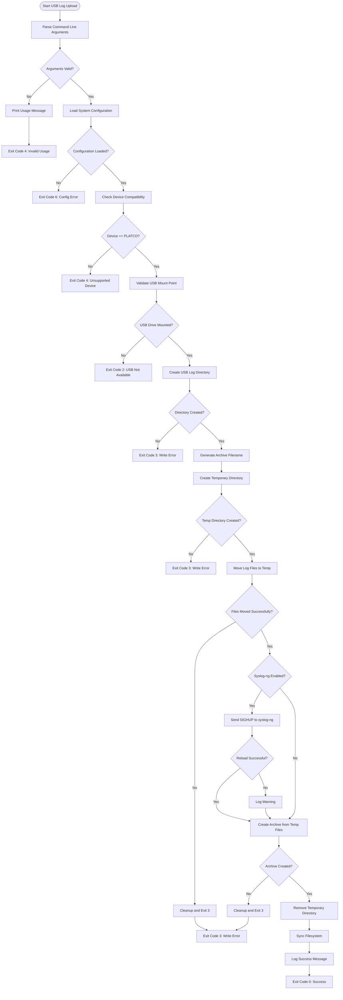
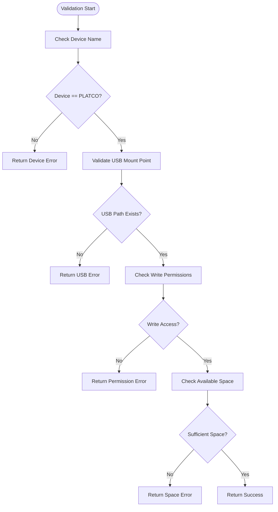
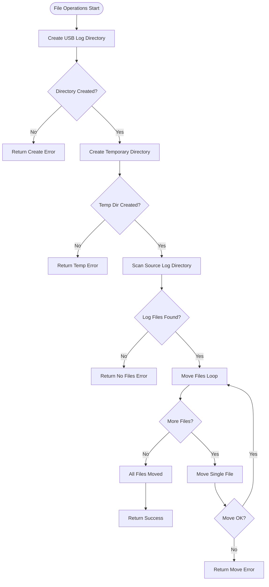
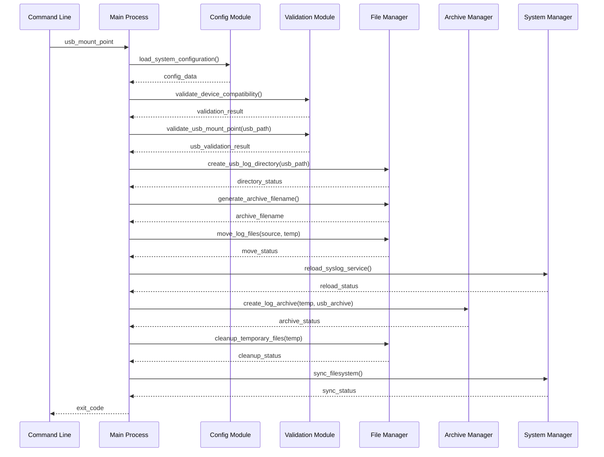
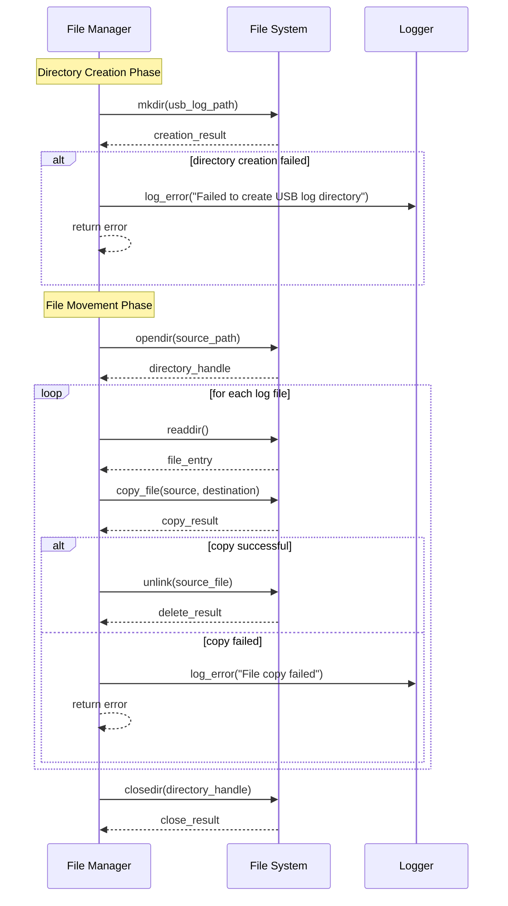
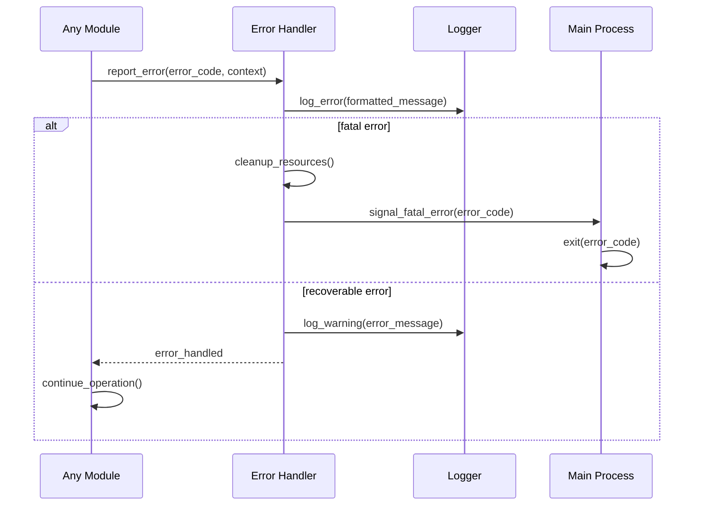
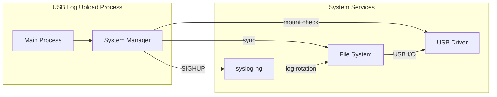
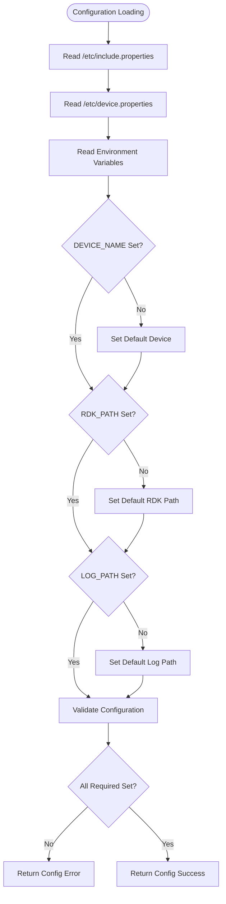
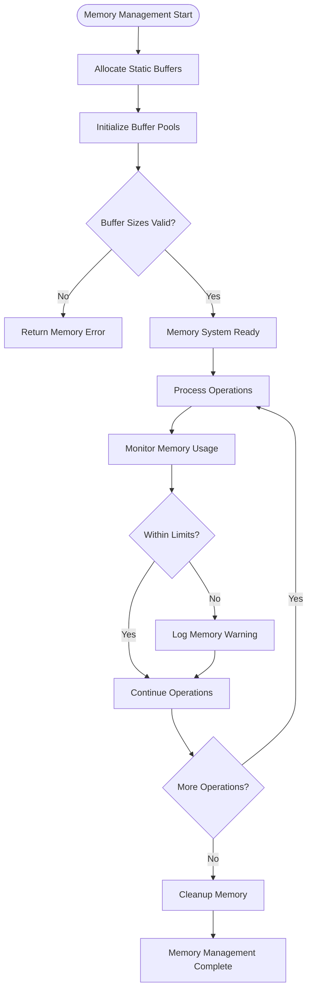
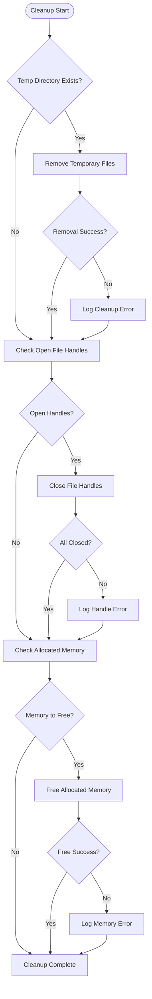

# USB Log Upload - Flowcharts and Diagrams

## Overview
This document contains detailed flowcharts and sequence diagrams for the USB Log Upload functionality migration from shell script to C code.

## 1. Main Processing Flowchart

### 1.1 Complete Process Flow (Mermaid)



### 1.2 Simplified Text-Based Flowchart

```
START
  ↓
Parse Arguments
  ↓
Valid? ──NO──→ Print Usage → EXIT(4)
  ↓ YES
Load Configuration  
  ↓
Config OK? ──NO──→ EXIT(6)
  ↓ YES
Check Device Type
  ↓
PLATCO Device? ──NO──→ EXIT(4)
  ↓ YES  
Validate USB Mount
  ↓
USB Mounted? ──NO──→ EXIT(2)
  ↓ YES
Create USB Log Directory
  ↓
Directory OK? ──NO──→ EXIT(3)
  ↓ YES
Generate Archive Name
  ↓
Create Temp Directory
  ↓
Temp Dir OK? ──NO──→ EXIT(3)
  ↓ YES
Move Log Files
  ↓
Files Moved? ──NO──→ Cleanup → EXIT(3)
  ↓ YES
Syslog Enabled? ──YES──→ Reload Syslog
  ↓ NO                    ↓
Create Archive ←─────────── 
  ↓
Archive OK? ──NO──→ Cleanup → EXIT(3)
  ↓ YES
Cleanup Temp Files
  ↓
Sync Filesystem
  ↓
EXIT(0)
```

## 2. Module Interaction Flowcharts

### 2.1 Validation Module Flow



### 2.2 File Operations Flow



## 3. Sequence Diagrams

### 3.1 Main Process Sequence



### 3.2 File Management Sequence



### 3.3 Error Handling Sequence



## 4. Component Interaction Diagrams

### 4.1 System Service Interaction



### 4.2 Configuration Flow Diagram



## 5. Text-Based Alternative Diagrams

### 5.1 Module Interaction (Text Format)

```
Main Process
    ├── Configuration Module
    │   ├── Reads: /etc/include.properties
    │   ├── Reads: /etc/device.properties
    │   └── Exports: system_config
    │
    ├── Validation Module
    │   ├── Uses: system_config
    │   ├── Checks: device compatibility
    │   └── Validates: USB mount point
    │
    ├── File Manager Module
    │   ├── Creates: USB directories
    │   ├── Moves: log files
    │   └── Manages: temporary storage
    │
    ├── Archive Manager Module
    │   ├── Generates: archive filenames
    │   ├── Compresses: log files
    │   └── Creates: .tgz archives
    │
    └── System Manager Module
        ├── Controls: syslog-ng service
        ├── Executes: system commands
        └── Manages: filesystem sync
```

### 5.2 Data Flow (Text Format)

```
Input: USB Mount Point
    ↓
[Validation] → Device Check → USB Check
    ↓
[File Operations] → Create Directories → Move Files
    ↓
[Service Management] → Reload syslog-ng
    ↓
[Archival] → Generate Name → Compress Files
    ↓
[Cleanup] → Remove Temp → Sync FS
    ↓
Output: Archive on USB + Exit Code
```

### 5.3 Error Propagation (Text Format)

```
Module Error → Error Handler → Log Error → Decision Point
                                              ├── Fatal: Exit Process
                                              └── Recoverable: Continue
```

## 6. Implementation Flow Diagrams

### 6.1 Memory Management Flow



### 6.2 Resource Cleanup Flow


