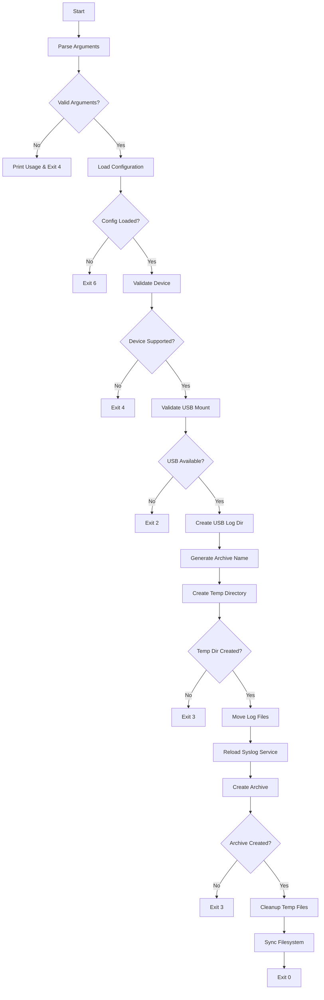
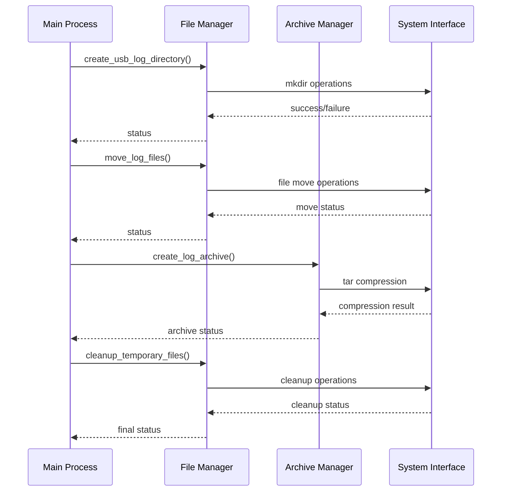

# USB Log Upload - High Level Design Document

## 1. Overview

### 1.1 Purpose
This document provides the high-level design for migrating the `usbLogUpload.sh` shell script to C code, ensuring efficient operation on embedded systems with limited resources.

### 1.2 Scope
The design covers the complete functionality of USB log transfer, including device validation, log archival, file management, and error handling, optimized for embedded platform constraints.

### 1.3 Design Goals
- **Resource Efficiency**: Minimize memory usage and CPU overhead
- **Portability**: Support multiple embedded architectures and compilers
- **Reliability**: Robust error handling and recovery mechanisms
- **Maintainability**: Modular design for easy maintenance and extension

## 2. Architecture Overview

### 2.1 System Context
```
┌─────────────────┐    ┌──────────────────┐    ┌─────────────────┐
│   Embedded      │    │   USB Log        │    │   USB Storage   │
│   System        │───▶│   Upload         │───▶│   Device        │
│   (Logs)        │    │   Module         │    │   (Archive)     │
└─────────────────┘    └──────────────────┘    └─────────────────┘
                                │
                                ▼
                       ┌──────────────────┐
                       │   System         │
                       │   Services       │
                       │   (syslog-ng)    │
                       └──────────────────┘
```

### 2.2 High-Level Architecture
The system follows a layered modular architecture:

```
┌─────────────────────────────────────────────────────────────┐
│                    Application Layer                        │
│                  (usb_log_upload_main)                     │
├─────────────────────────────────────────────────────────────┤
│                   Business Logic Layer                     │
├────────────────┬────────────────┬───────────────────────────┤
│   Validation   │   File         │     Archive              │
│   Module       │   Manager      │     Manager              │
├────────────────┼────────────────┼───────────────────────────┤
│                   System Interface Layer                   │
├────────────────┬────────────────┬───────────────────────────┤
│   File I/O     │   Process      │     Service              │
│   Operations   │   Management   │     Control              │
├────────────────┴────────────────┴───────────────────────────┤
│                    Utility Layer                           │
│            (Logging, Configuration, Error Handling)        │
└─────────────────────────────────────────────────────────────┘
```

## 3. Module Breakdown

### 3.1 Core Modules

#### 3.1.1 Main Control Module (`usb_log_main.c/.h`)
**Responsibilities:**
- Application entry point and argument parsing
- High-level workflow orchestration
- Exit code management

**Key Functions:**
- `int main(int argc, char *argv[])`
- `int usb_log_upload_execute(const char *usb_mount_point)`
- `void print_usage(const char *program_name)`

#### 3.1.2 Validation Module (`usb_log_validation.c/.h`)
**Responsibilities:**
- Device compatibility verification
- USB mount point validation
- Input parameter validation

**Key Functions:**
- `int validate_device_compatibility(void)`
- `int validate_usb_mount_point(const char *mount_point)`
- `int validate_system_prerequisites(void)`

#### 3.1.3 File Manager Module (`usb_log_file_manager.c/.h`)
**Responsibilities:**
- Log file discovery and management
- Directory operations
- File movement and copying

**Key Functions:**
- `int create_usb_log_directory(const char *usb_path)`
- `int move_log_files(const char *source_path, const char *dest_path)`
- `int cleanup_temporary_files(const char *temp_path)`

#### 3.1.4 Archive Manager Module (`usb_log_archive.c/.h`)
**Responsibilities:**
- Log file compression and archiving
- Archive naming convention implementation
- Compression error handling

**Key Functions:**
- `int create_log_archive(const char *source_dir, const char *archive_path)`
- `char *generate_archive_filename(void)`
- `int compress_logs_to_usb(const char *temp_dir, const char *usb_log_path)`

#### 3.1.5 System Interface Module (`usb_log_system.c/.h`)
**Responsibilities:**
- System command execution
- Service management (syslog-ng)
- Process control

**Key Functions:**
- `int execute_system_command(const char *command, char *output, size_t output_size)`
- `int reload_syslog_service(void)`
- `int sync_filesystem(void)`

### 3.2 Support Modules

#### 3.2.1 Configuration Module (`usb_log_config.c/.h`)
**Responsibilities:**
- Configuration file parsing
- Environment variable handling
- System property management

**Key Functions:**
- `int load_system_configuration(usb_log_config_t *config)`
- `char *get_property_value(const char *property_name)`
- `int initialize_configuration(void)`

#### 3.2.2 Utility Module (`usb_log_utils.c/.h`)
**Responsibilities:**
- MAC address retrieval
- Timestamp generation
- String manipulation utilities
- Path construction

**Key Functions:**
- `int get_mac_address(char *mac_buffer, size_t buffer_size)`
- `int get_formatted_timestamp(char *timestamp_buffer, size_t buffer_size)`
- `int construct_file_path(char *path_buffer, size_t buffer_size, const char *base, const char *filename)`

#### 3.2.3 Error Handling Module (`usb_log_error.c/.h`)
**Responsibilities:**
- Error code definitions
- Error message formatting
- Logging infrastructure

**Key Functions:**
- `void log_error(usb_log_error_t error_code, const char *message)`
- `void log_info(const char *message)`
- `const char *get_error_description(usb_log_error_t error_code)`

## 4. Data Structures

### 4.1 Core Data Types

```c
// Configuration structure
typedef struct {
    char device_name[MAX_DEVICE_NAME_LEN];
    char rdk_path[MAX_PATH_LEN];
    char log_path[MAX_PATH_LEN];
    int syslog_ng_enabled;
    char usb_mount_point[MAX_PATH_LEN];
} usb_log_config_t;

// File operation context
typedef struct {
    char source_path[MAX_PATH_LEN];
    char destination_path[MAX_PATH_LEN];
    char temp_directory[MAX_PATH_LEN];
    char archive_filename[MAX_FILENAME_LEN];
} usb_log_file_context_t;

// Error codes enumeration
typedef enum {
    USB_LOG_SUCCESS = 0,
    USB_LOG_ERROR_INVALID_ARGS = 1,
    USB_LOG_ERROR_USB_NOT_MOUNTED = 2,
    USB_LOG_ERROR_WRITE_FAILED = 3,
    USB_LOG_ERROR_UNSUPPORTED_DEVICE = 4,
    USB_LOG_ERROR_MEMORY_ALLOCATION = 5,
    USB_LOG_ERROR_CONFIG_LOAD = 6,
    USB_LOG_ERROR_SYSTEM_COMMAND = 7
} usb_log_error_t;
```

### 4.2 Constants and Limits

```c
#define MAX_PATH_LEN 512
#define MAX_FILENAME_LEN 256
#define MAX_DEVICE_NAME_LEN 32
#define MAX_MAC_ADDRESS_LEN 18
#define MAX_TIMESTAMP_LEN 32
#define MAX_COMMAND_LEN 1024
#define MAX_OUTPUT_BUFFER_SIZE 4096
#define TEMP_DIR_PREFIX "/opt/tmpusb/"
```

**Temporary directory requirements**

- `TEMP_DIR_PREFIX` defines the base directory used for staging temporary log files prior to archival.
- The implementation MUST, before first use:
  - Verify that the directory indicated by `TEMP_DIR_PREFIX` exists (e.g. using `stat(2)` or equivalent).
  - Verify that the directory is writable by the usb-log-upload process.
- If the directory does not exist, the implementation MUST attempt to create it (e.g. with `mkdir(2)`) using secure permissions (owner‑only access, such as mode `0700`, or a platform‑appropriate configurable mode).
- If directory creation fails, or if the directory is not writable, the implementation MUST:
  - Log an appropriate error message, and
  - Abort the current operation and return an error (e.g. `USB_LOG_ERROR_WRITE_FAILED`) instead of proceeding with log movement or archive creation.
- The deployment documentation MUST specify which user/service account runs the usb log upload binary and ensure that it has the necessary permissions on `TEMP_DIR_PREFIX`.
## 5. Data Flow

### 5.1 Main Processing Flow



### 5.2 File Processing Flow



## 6. Key Algorithms

### 6.1 Archive Name Generation Algorithm
```
ALGORITHM: generate_archive_filename()
INPUT: None (uses system resources)
OUTPUT: Formatted filename string

1. GET mac_address FROM system utility
2. GET current_timestamp WITH format "mm-dd-yy-HH-MMAM/PM"
3. CONSTRUCT filename = mac_address + "_Logs_" + timestamp + ".tgz"
4. RETURN filename
```

### 6.2 File Movement Algorithm
```
ALGORITHM: move_log_files(source_path, dest_path)
INPUT: source_path, dest_path
OUTPUT: Operation status

1. VALIDATE source_path exists
2. VALIDATE dest_path is writable
3. FOR each file in source_path:
   a. COPY file to dest_path
   b. VERIFY copy successful
   c. DELETE source file
4. RETURN success/failure status
```

### 6.3 Compression Algorithm
```
ALGORITHM: create_log_archive(source_dir, archive_path)
INPUT: source_directory, output_archive_path
OUTPUT: Compression status

1. VALIDATE source_directory contains files
2. CONSTRUCT tar command with compression flags
3. EXECUTE tar command via system interface
4. VERIFY archive created successfully
5. VALIDATE archive integrity
6. RETURN status
```

## 7. Interface Definitions

### 7.1 Public API Interface
```c
// Main interface functions
int usb_log_upload_execute(const char *usb_mount_point);
int usb_log_validate_prerequisites(void);
void usb_log_cleanup_resources(void);

// Configuration interface
int usb_log_load_config(usb_log_config_t *config);
int usb_log_get_property(const char *name, char *value, size_t value_size);

// File operation interface  
int usb_log_create_directory(const char *path, mode_t mode);
int usb_log_move_files(const char *source, const char *destination);
int usb_log_compress_directory(const char *source_dir, const char *archive_path);

// System interface
int usb_log_execute_command(const char *command, char *output, size_t output_size);
int usb_log_reload_service(const char *service_name);
```

### 7.2 Internal Module Interfaces
```c
// Validation module interface
typedef struct {
    int (*validate_device)(void);
    int (*validate_usb_mount)(const char *mount_point);
    int (*validate_permissions)(const char *path);
} usb_log_validation_interface_t;

// File manager interface
typedef struct {
    int (*create_directory)(const char *path);
    int (*move_files)(const char *source, const char *dest);
    int (*cleanup_files)(const char *path);
} usb_log_file_interface_t;
```

## 8. Error Handling Strategy

### 8.1 Error Classification
- **Fatal Errors**: System-level failures requiring immediate exit
- **Recoverable Errors**: Operation-specific failures with retry capability
- **Warning Conditions**: Non-critical issues logged but operation continues

### 8.2 Error Recovery Mechanisms
- **Graceful Degradation**: Continue with limited functionality when possible
- **Resource Cleanup**: Ensure all allocated resources are properly freed
- **State Restoration**: Revert system state changes on critical failures

### 8.3 Logging Strategy
- **Structured Logging**: Consistent log message format
- **Log Levels**: INFO, WARNING, ERROR, DEBUG
- **Contextual Information**: Include relevant system state in error messages

## 9. Memory Management Strategy

### 9.1 Static Allocation
- Use fixed-size buffers for predictable memory usage
- Pre-allocate commonly used data structures
- Avoid dynamic memory allocation where possible

### 9.2 Buffer Management
- Implement buffer overflow protection
- Use safe string handling functions
- Validate buffer boundaries in all operations

### 9.3 Resource Lifecycle
- Clear ownership of dynamically allocated resources
- Consistent cleanup patterns across modules
- Resource leak detection in debug builds

## 10. Integration Points

### 10.1 System Dependencies
- **File System**: POSIX file operations
- **Process Management**: Signal handling for service control
- **Shell Utilities**: Integration with existing system utilities

### 10.2 Configuration Integration
- **Property Files**: Parse existing configuration files
- **Environment Variables**: Respect existing environment setup
- **Service Dependencies**: Coordinate with system services

### 10.3 Logging Integration
- **System Logger**: Integration with existing log infrastructure
- **Log Rotation**: Coordinate with log management policies
- **Audit Trail**: Maintain operation audit logs
