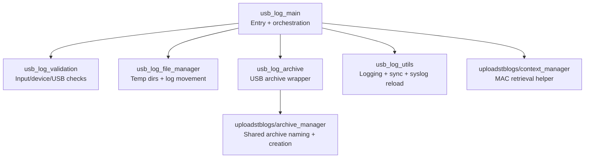
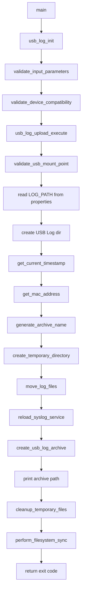
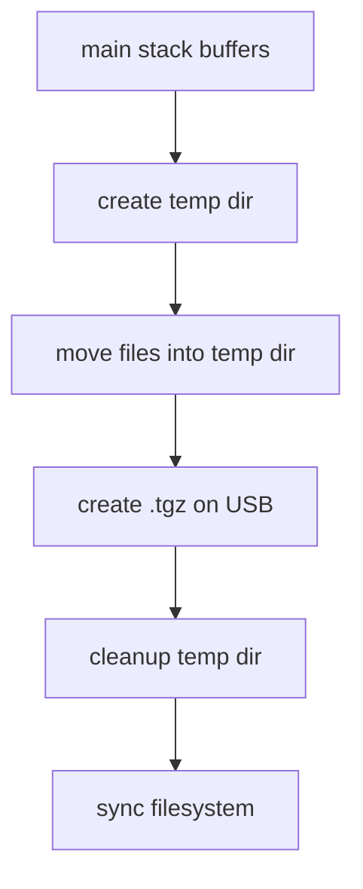

# usbLogUpload Module

## Overview

`usbLogUpload` is the USB export utility in DCM Agent that copies current device logs to an attached USB storage device as a compressed archive. It replaces the legacy `usbLogUpload.sh` script with a C implementation optimized for embedded systems and intentionally reuses shared helpers from `uploadstblogs` for archive naming, MAC address resolution, and archive creation.

The module is implemented as a standalone binary, `usblogupload`, with a simple single-argument interface:

```bash
usblogupload <USB_mount_point>
```

Its runtime model is deliberately simple: validate arguments and device type, validate USB availability, collect the current logs into a temporary directory, generate a `<MAC>_Logs_<timestamp>.tgz` archive on the USB device, reload `syslog-ng` when applicable, clean up temporary files, and sync the filesystem.

## Table of Contents

- [Architecture](#architecture)
- [Core Modules](#core-modules)
- [Execution Flow](#execution-flow)
- [API Reference](#api-reference)
- [Shared Code Reuse](#shared-code-reuse)
- [Usage Example](#usage-example)
- [Threading Model](#threading-model)
- [Memory Management](#memory-management)
- [Build Instructions](#build-instructions)
- [Testing](#testing)
- [Configuration and Inputs](#configuration-and-inputs)
- [Exit Codes and Error Handling](#exit-codes-and-error-handling)
- [Platform Notes](#platform-notes)
- [See Also](#see-also)

---

## Architecture

The module follows a narrow layered design with clear separation between validation, file movement, archive creation, and system utility functions.

### Component Diagram



### Source Layout

| Source File | Responsibility |
|-------------|----------------|
| `src/usb_log_main.c` | main entry, workflow orchestration, exit-code mapping |
| `src/usb_log_validation.c` | input validation, mount-point checks, supported-device checks |
| `src/usb_log_file_manager.c` | USB log directory creation, temp directory creation, log movement, cleanup |
| `src/usb_log_archive.c` | USB-specific wrapper around shared archive creation |
| `src/usb_log_utils.c` | logging initialization, timestamp retrieval, syslog reload, filesystem sync |

---

## Core Modules

### Main Control Module

Declared in `include/usb_log_main.h`, this layer owns argument parsing and the full end-to-end workflow.

| Function | Purpose |
|----------|---------|
| `main()` | standard binary entry point |
| `usb_log_upload_execute()` | full upload/export workflow for one USB path |

### Validation Module

Declared in `include/usb_log_validation.h`.

| Function | Purpose |
|----------|---------|
| `validate_input_parameters()` | ensures a USB mount point argument is present |
| `validate_device_compatibility()` | only supported devices are allowed |
| `validate_usb_mount_point()` | verifies mount point exists and is usable |

### File Manager Module

Declared in `include/usb_log_file_manager.h`.

| Function | Purpose |
|----------|---------|
| `create_usb_log_directory()` | ensures `$USB/Log` exists |
| `create_temporary_directory()` | creates working directory for staging files |
| `move_log_files()` | moves logs from `LOG_PATH` into staging area |
| `cleanup_temporary_files()` | removes staged files and temp directory |

### Archive Module

Declared in `include/usb_log_archive.h`.

| Function | Purpose |
|----------|---------|
| `create_usb_log_archive()` | packages staged files into `.tgz` on the USB device |

### Utility Module

Declared in `include/usb_log_utils.h`.

| Function | Purpose |
|----------|---------|
| `usb_log_init()` | initializes RDK logging |
| `reload_syslog_service()` | sends SIGHUP to `syslog-ng` when used |
| `perform_filesystem_sync()` | flushes data to storage |
| `get_current_timestamp()` | builds human-readable timestamp strings |
| `copy_file_and_delete()` | cross-device-safe move helper |

---

## Execution Flow

The actual orchestration is visible in `src/usb_log_main.c`.



### Runtime Directory Behavior

| Path | Use |
|------|-----|
| `LOG_PATH` | source log directory, default `/opt/logs` |
| `<USB_mount_point>/Log` | destination folder on USB |
| `/opt/tmpusb/<archive_base>` | temporary staging directory |

---

## API Reference

### `usb_log_upload_execute()`

Runs the complete USB log export workflow.

**Signature**

```c
int usb_log_upload_execute(const char *usb_mount_point);
```

**Parameters**

- `usb_mount_point`: mount path of the attached USB device

**Returns**

- `0` on success
- `2` if the USB is not mounted or invalid
- `3` on write/archive/temporary-directory failures
- `4` on invalid usage or unsupported device

### `validate_usb_mount_point()`

**Signature**

```c
int validate_usb_mount_point(const char *mount_point);
```

Ensures the caller-supplied path exists and is accessible.

### `create_usb_log_directory()`

**Signature**

```c
int create_usb_log_directory(const char *usb_path);
```

Creates the USB-side `Log` directory if it does not already exist.

### `create_usb_log_archive()`

**Signature**

```c
int create_usb_log_archive(const char *source_dir,
                           const char *archive_path,
                           const char *mac_address);
```

Packages staged logs into a compressed archive on USB storage.

---

## Shared Code Reuse

`usbLogUpload` intentionally depends on `uploadstblogs` instead of reimplementing archive and naming logic.

### Reused Interfaces

| Shared Module | Reused Functionality |
|---------------|----------------------|
| `uploadstblogs/archive_manager.h` | `generate_archive_name()`, `create_archive()`, `get_archive_size()` |
| `uploadstblogs/context_manager.h` | `get_mac_address()` |
| `uploadstblogs/file_operations.h` | directory/file helpers used by USB file manager |

This reduces duplicate code and keeps archive naming aligned across upload channels.

---

## Usage Example

### Command-Line Usage

```bash
usblogupload /mnt/usb
```

### Successful Output

On success the program prints the full path of the generated archive:

```text
/mnt/usb/Log/001122334455_Logs_04_03_26_09_14_33.tgz
```

### Example Archive Naming Rule

Archive names follow the shared format:

```text
<MAC>_Logs_<timestamp>.tgz
```

---

## Threading Model

`usbLogUpload` is single-threaded.

| Aspect | Behavior |
|--------|----------|
| Worker threads | None |
| Parallel operations | None |
| Synchronization primitives | None required |
| Concurrency assumptions | One invocation per process |

Any cross-process concurrency concerns are delegated to the filesystem and the caller environment rather than internal locks.

---

## Memory Management

The module is designed with fixed-size local buffers and minimal runtime allocation.

### Primary Runtime Buffers

From `usb_log_main.c`:

| Buffer | Approx Size | Purpose |
|--------|-------------|---------|
| `usb_log_dir` | 512 B | destination USB log folder |
| `mac_address` | 32 B | device MAC string |
| `file_name` | 256 B | archive basename without `.tgz` |
| `log_file` | 256 B | archive filename |
| `temp_dir` | 512 B | temp staging directory |
| `archive_path` | 1024 B | final archive path on USB |
| `log_path` | 256 B | source log directory |
| `timestamp_buf` | 32 B | human-readable logging timestamp |

### Allocation Pattern



There is no complex ownership model. The main function owns the stack buffers, and temporary filesystem artifacts are cleaned before exit.

---

## Build Instructions

### Output

| Binary | Installed Name |
|--------|----------------|
| USB log upload utility | `usblogupload` |

### Build Dependencies

From `usbLogUpload/Makefile.am`, the module links against:

- `libuploadstblogs.la`
- `librdkloggers`
- `ldwnlutil`
- `lfwutils`
- `lz`
- `lpthread`

### Common Build Steps

```bash
autoreconf -i
./configure
make
make install
```

### Compile Flags

| Flag | Purpose |
|------|---------|
| `-DRDK_LOGGER_EXT` | enables RDK logger integration |
| `-Wall -Wextra -std=c99` | baseline warning and C dialect enforcement |

---

## Testing

This module is part of the repository test and build flow. The primary behaviors to validate are:

- invalid argument handling
- unsupported-device rejection
- USB mount validation
- temp directory creation failure handling
- log movement failure handling
- archive creation failure handling
- cleanup and sync behavior on both success and failure

When run in CI, it also benefits from shared helper coverage provided by the `uploadstblogs` unit tests because archive naming and creation are reused from that module.

---

## Configuration and Inputs

### Inputs

| Source | Purpose |
|--------|---------|
| command line argument | USB mount point |
| `/etc/include.properties` | provides `LOG_PATH` |
| `/etc/device.properties` | provides device metadata |
| runtime environment | `DEVICE_NAME`, `RDK_PATH`, `SYSLOG_NG_ENABLED` |

### Defaults

| Setting | Default |
|---------|---------|
| `LOG_PATH` | `/opt/logs` |
| `RDK_PATH` | `/lib/rdk` |

### Outputs

| Output | Description |
|--------|-------------|
| USB archive | compressed log bundle under `<USB>/Log/` |
| standard output | full archive path |
| RDK logs | execution progress and failure details |

---

## Exit Codes and Error Handling

The public exit codes are defined in `include/usb_log_main.h`.

| Code | Symbol | Meaning |
|------|--------|---------|
| `0` | `USB_LOG_SUCCESS` | completed successfully |
| `1` | `USB_LOG_ERROR_GENERAL` | general internal failure |
| `2` | `USB_LOG_ERROR_USB_NOT_MOUNTED` | USB missing or not accessible |
| `3` | `USB_LOG_ERROR_WRITE_ERROR` | write, temp-dir, or archive failure |
| `4` | `USB_LOG_ERROR_INVALID_USAGE` | bad CLI usage or unsupported device |

### Failure Handling Rules

| Failure | Behavior |
|---------|----------|
| logging init fails | fatal at startup |
| bad CLI usage | immediate exit with code `4` |
| unsupported device | immediate exit with code `4` |
| invalid USB mount | immediate exit with code `2` |
| temp directory failure | exit with code `3` |
| move/archive failure | cleanup temp files and exit with code `3` |
| syslog reload failure | logged; workflow continues |

The module attempts to keep partial state minimal by cleaning the temporary directory before returning from write-path failures.

---

## Platform Notes

- supports embedded Linux targets built with Autotools
- currently validated for `PLATCO` device compatibility checks
- depends on POSIX filesystem semantics and standard utilities such as `sync`
- keeps the runtime simple to minimize CPU and memory pressure during USB export

## See Also

- [usb-log-upload-hld.md](usb-log-upload-hld.md)
- [usb-log-upload-requirements.md](usb-log-upload-requirements.md)
- [usb-log-upload-flowcharts.md](usb-log-upload-flowcharts.md)
- [../README.md](../README.md)
- [../../uploadstblogs/docs/README.md](../../uploadstblogs/docs/README.md)